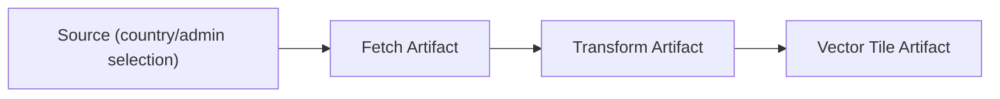

# ビルドセッション仕様（ドラフト）

## 目的と対象範囲
本書は、Shape のビルドセッションにおけるタスク生成・実行・再開のルールを、メタデータまたはタイムスタンプ比較に基づく厳密な仕様として定義する。対象は fetch/transform/vt の各ステージと、それに付随するメタデータ生成である。

## 用語定義
- ソースデータ（Source）
ビルド処理の入力となるデータ。`meta`（メタデータ署名）を持つ。`updatedAt` は任意。例: データソースの国×ADM選択、Fetch の元となる取得対象。
- 生成物（Artifact）
ステージ処理の出力。元データを辿れる参照キー（`sourceKey` や `originKey` など）と `meta` または `updatedAt` を持つ。
- タスク（Task）
ステージ内で生成物を作成/更新する処理単位。
- ステージ（Stage）
`fetch` → `transform` → `vt` の順序で進行する。
- ビルドセッション（Build Session）
複数ステージを順に実行する一連の処理。再開可能な状態を永続化する。

## データモデル要件（規範）
1. ソースデータは `meta` または `updatedAt` のいずれかを持つ。
2. 国×ADM など選択スナップショットがソースとなる場合、`meta` は必須で `updatedAt` は不要とする。
3. 生成物は `meta` または `updatedAt` を持ち、元データを辿れる参照キーを保持する。
4. 生成物は以下の向き付きグラフ構造で参照できる。

## ステージ別の入出力
- fetch
  - 入力: ソースデータ（国/ADM 選択、データソース）
  - 出力: Fetch Cache（`sourceKey`, `meta` または `updatedAt`）
- transform
  - 入力: Fetch Cache
  - 出力: Transform Cache（`sourceKey`, `meta` または `updatedAt`）
- vt
  - 入力: Transform Cache と Tile 関係
  - 出力: Vector Tile（`originKey`, `meta` または `updatedAt`）

## タスク生成規則（定式）
### 記号
- ステージ k のソース集合を `S_k`、生成物集合を `A_k` とする。
- `s.key` はソース識別子、`a.key` は生成物識別子、`a.sourceKey` はソース参照キー。
- `s.meta`, `a.meta` はメタデータ署名。`s.updatedAt`, `a.updatedAt` は更新時刻。

### ルール
1. 比較関数 `needsUpdate(s, a)` の定義
   - `s.meta` または `a.meta` のいずれかが存在する場合はメタデータ比較を採用する。
     - `s.meta` が未定義、または `a.meta` が未定義のときは更新対象とする。
     - `s.meta !== a.meta` のとき更新対象とする。
   - 両方の `meta` が未定義のときは `updatedAt` 比較を採用する。
     - `s.updatedAt` が未定義なら更新対象としない。
     - `a.updatedAt` が未定義なら更新対象とする。
     - それ以外は `a.updatedAt < s.updatedAt` のとき更新対象とする。
2. 新規/更新タスクの生成
   - 任意の `s ∈ S_k` に対し、対応する `a ∈ A_k` が存在しない、または `needsUpdate(s, a)` が真の場合、タスク `t(s)` を生成する。
3. 既存生成物の保持
   - `needsUpdate(s, a)` が偽のとき、対応タスクは不要とし、生成物は保持する。
4. ソース消失時の削除
   - `A_k` に存在するが対応する `s ∈ S_k` が存在しない生成物は削除する。
   - 当該生成物を入力とする下流ステージの生成物/タスクは連鎖削除する。

## ステージ進行規則
1. ステージは `fetch` → `transform` → `vt` の順で実行する。
2. 各ステージ開始時に「タスク生成規則」に従ってタスクを準備する。
3. 準備が完了したタスクを全て実行する。
4. すべてのタスクを完了したら次ステージへ移行する。
5. 最終ステージ完了でビルドセッションを終了する。

## 新規セッションの仕様
- 既存の生成物は無いものとして扱い、`S_k` に基づき全タスクを生成する。
- ソースが存在しない生成物は発生しないため、削除処理は不要。

## 再開セッションの仕様
- 既存タスクと生成物を読み込み、各ステージでタスク生成規則を再適用する。
- 失敗タスクは同一入力として再キューイングする。
- `sourceKey` が一致しない生成物は削除し、下流生成物も削除する。

## 仕様の十分性（新規/再開）
- 新規セッションでは、ソース集合が完全であればタスク生成規則のみで正しい処理順序が確定する。
- 再開セッションでは、メタデータ比較または `updatedAt` 比較とソース消失時の削除により、未処理・失敗・更新のいずれも再決定できるため、十分である。

## 現行実装との整合性（要点）
以下は現行コードに対する比較観点であり、仕様と実装の差異を示す。

- メタデータ/タイムスタンプ比較によるタスク更新
  - 仕様: `meta` 比較を優先し、無い場合に `updatedAt` 比較で更新判断。
  - 実装: `inputData` の署名比較（`buildStableSignature`）で `meta` を作成し、`reconcileByMetadata` で更新判定を行う。`updatedAt` も補助的に利用できる。
  - 参照: `/Users/hiroya/WebstormProjects/hierarchidb/packages/batch/src/session/buildSessionReconcile.ts`
  - 参照: `/Users/hiroya/WebstormProjects/hierarchidb/plugins/shape-plugin/src/services/vt/shapeStageReconcile.ts`

- ソース消失時の生成物削除
- 仕様: ソース消失→生成物と下流生成物を削除。
- 実装: 選択差分に基づく削除は行うが、生成物そのものの連鎖削除は一部処理に限定される。
  - 参照: `/Users/hiroya/WebstormProjects/hierarchidb/plugins/shape-plugin/src/worker/api.ts`（`applySelectionDiffCleanup`）

- ステージ順序とタスク生成のタイミング
- 仕様: 各ステージ開始時にタスク生成規則を適用。
- 実装: 各ステージでタスク生成は行い、`meta` 比較を利用する。fetch は選択スナップショット、transform は fetch タスク出力、vt は transform cache の関連情報に基づく。
  - 参照: `/Users/hiroya/WebstormProjects/hierarchidb/plugins/shape-plugin/src/services/vt/shapePipeline.ts`
  - 参照: `/Users/hiroya/WebstormProjects/hierarchidb/plugins/shape-plugin/src/services/vt/shapePipelineVtStage.ts`

- 生成物の参照グラフ
  - 仕様: 生成物メタデータから元データを辿れる構造を要求。
  - 実装: `sourceKey` や `originKey` により辿れるが、グラフ構造を用いた更新判定は未実装。
  - 参照: `/Users/hiroya/WebstormProjects/hierarchidb/packages/gis-sdk/src/ephemeral/EphemeralDBRecordTypes.ts`
  - 参照: `/Users/hiroya/WebstormProjects/hierarchidb/plugins/shape-plugin/src/services/vt/shapeStageMetadata.ts`

## 実装との差異まとめ
- タスク更新判定は `meta` 比較に寄せて整合しつつあるが、生成物の連鎖削除は選択差分に限定される。
- `updatedAt` を用いた更新判定は補助的であり、ソース側の時刻更新が必要なケースは未整理である。
