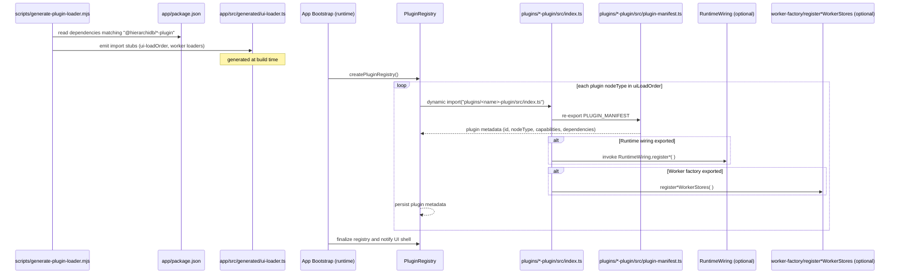

# Flow 1: Discovering, Registering, and Initializing Plugins During App Startup



**Key Notes**
- どのプラグインを対象とするかは `scripts/generate-plugin-loader.mjs` が `app/package.json` の依存（`@hierarchidb/*-plugin`）から収集し、`app/src/generated/ui-loader.ts` や `app/src/generated/worker-loader.ts` といったローダーファイルに書き出します。
- アプリ起動時はそのローダーとプラグインの `index.ts` / `plugin-manifest.ts` を import し、マニフェスト情報を `PluginRegistry` に登録します。
- プラグインが提供するランタイム初期化処理（`RuntimeWiring` 等）や Worker ストア登録（`register*WorkerStores`）は、この登録時に呼び出されます。
```
