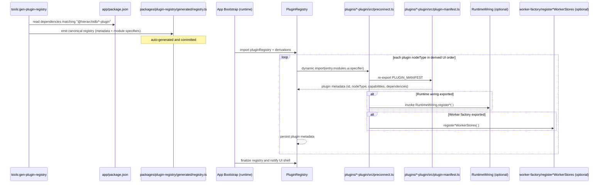

# Flow 1: Discovering, Registering, and Initializing Plugins During App Startup



**Key Notes**
- 対象プラグインは `pnpm run tools:gen-plugin-registry`（`scripts/generate-plugin-loader.mjs` 経由）で `app/package.json` の `@hierarchidb/*-plugin` 依存から収集し、結果を **単一の正典ファイル** `packages/plugin-registry/generated/registry.ts` に書き出します。旧 `app/src/generated/*` 系ファイルは廃止済みです。
- アプリ起動時は `@hierarchidb/plugin-registry` を import し、派生ユーティリティ（`derivePluginModuleSpecifiers` など）で UI / Worker 向けのモジュール解決マップを構築します。これにより Vite/Rollup は常に静的な module specifier を扱えます。
- プラグインが提供するランタイム初期化処理（`RuntimeWiring` 等）や Worker ストア登録（`register*WorkerStores`）は、この登録時に呼び出されます。
```
