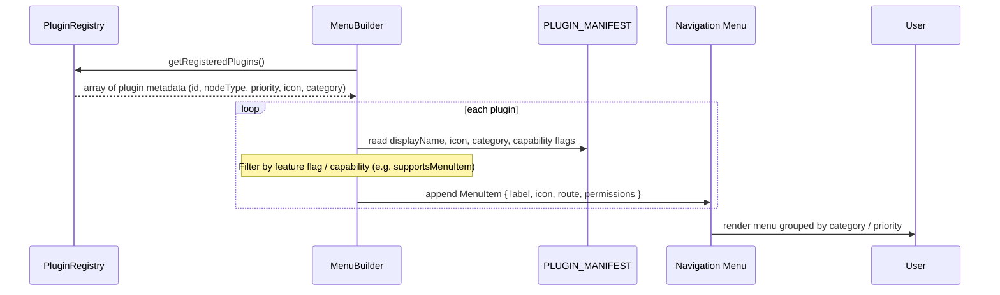

# Flow 2: Building the Plugin Menu



**Key Notes**
- Menu builder filters plugins based on capability flags (e.g., `canBeRoot`, `supportsBuildProcessing`).
- Sorting typically uses `priority` from the manifest so core plugins appear first.
- Additional conditions (feature flags, tenant configuration) can enable/disable menu entries dynamically.
```
