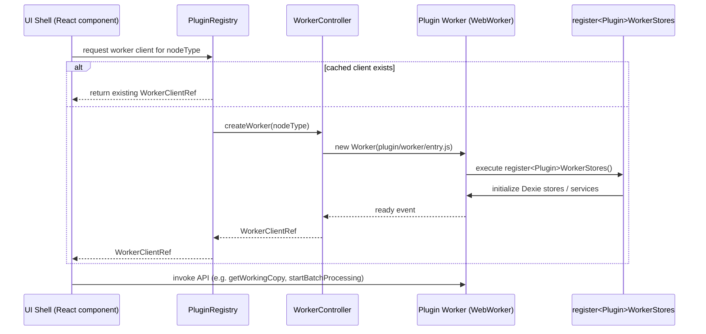

# Flow 3: Worker Initialization for a Specific Plugin



**Key Notes**
- Worker creation is typically lazy; the registry caches the resulting `WorkerClientRef` per `nodeType`.
- `register<Plugin>WorkerStores` is responsible for wiring Dexie stores, shared download services, etc.
- All subsequent API calls (batch control, entity CRUD) go through the worker proxy exposed by the client ref.
```
