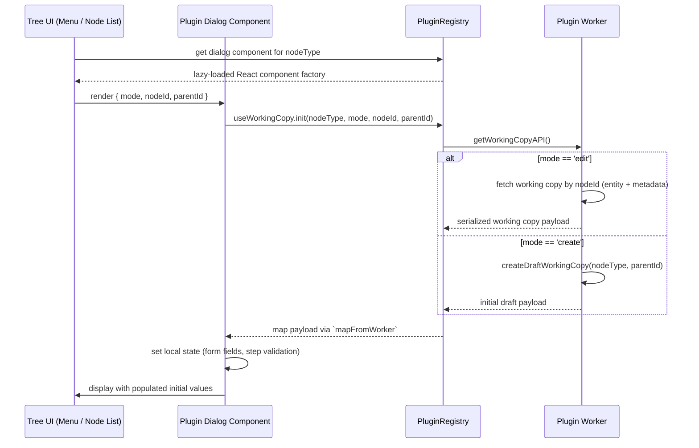

# Flow 4: Opening a Plugin Dialog with Working Copy Data



**Key Notes**
- `useWorkingCopy` encapsulates the worker call sequence; dialogs provide `mapFromWorker` to translate payloads into UI-friendly state.
- Modes `create`/`edit` are handled by the worker API (`createDraftWorkingCopy`, `getWorkingCopy`).
- After the dialog is closed with success, `useWorkingCopy.commit()` pushes updates back to the worker before the node list refreshes.
```
