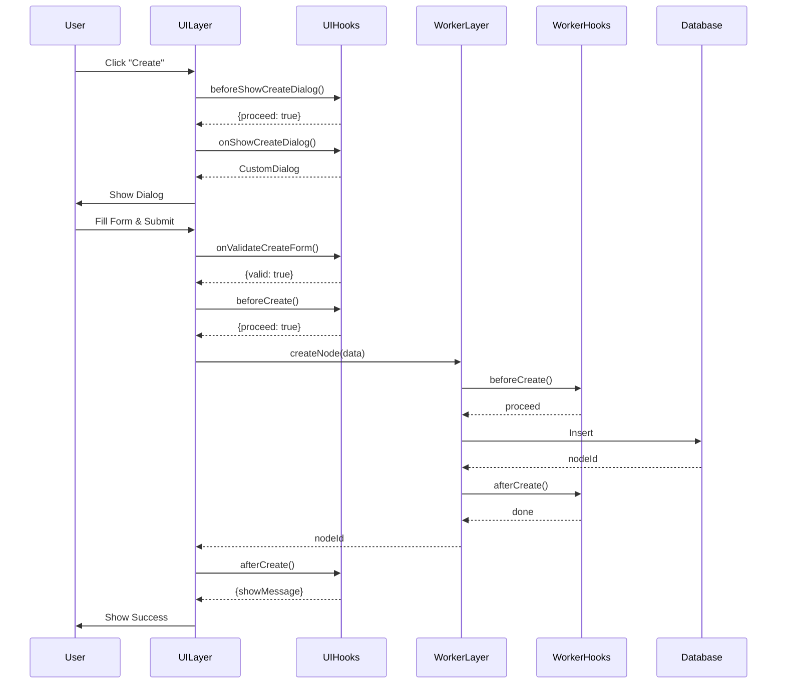

# UI層アクションフック設計

## 概要

Worker層がライフサイクルイベント（beforeCreate, afterCreate等）でフックするのに対し、UI層はユーザーアクション（Create, Read, Update, Delete）に対するフックで拡張する。この設計により、UIの振る舞いとユーザー体験を柔軟にカスタマイズできる。

## アーキテクチャ比較

### Worker層とUI層のフック責務分離

```
User Action → UI Hook → Worker Call → Worker Hook → Database
     ↑           ↓           ↑             ↓            ↓
     └───────────────────────┴─────────────────────────┘
              UI Response        Data Change Event
```

| 層 | フックタイプ | 責務 | 実行タイミング |
|---|------------|------|--------------|
| **Worker層** | ライフサイクルフック | データ整合性、ビジネスロジック | データ操作の前後 |
| **UI層** | アクションフック | UX、表示制御、ユーザーフィードバック | ユーザー操作時 |

## UI層アクションフック仕様

### 1. Create アクションフック

```typescript
export interface UICreateHooks {
  // Create アクション開始前
  beforeShowCreateDialog?: (params: {
    parentNodeId: TreeNodeId;
    nodeType: TreeNodeType;
    context: UIContext;
  }) => Promise<{
    proceed: boolean;
    modifiedParams?: any;
    message?: string;
  }>;

  // カスタムダイアログ表示
  onShowCreateDialog?: (params: {
    parentNodeId: TreeNodeId;
    nodeType: TreeNodeType;
    defaultValues?: any;
  }) => Promise<React.ComponentType<CreateDialogProps> | null>;

  // フォームバリデーション
  onValidateCreateForm?: (params: {
    formData: any;
    parentNodeId: TreeNodeId;
    nodeType: TreeNodeType;
  }) => Promise<{
    valid: boolean;
    errors?: Record<string, string>;
    warnings?: string[];
  }>;

  // 作成前の確認
  beforeCreate?: (params: {
    formData: any;
    parentNodeId: TreeNodeId;
    nodeType: TreeNodeType;
  }) => Promise<{
    proceed: boolean;
    modifiedData?: any;
    confirmMessage?: string;
  }>;

  // 作成処理（Worker呼び出し）のカスタマイズ
  onCreate?: (params: {
    formData: any;
    parentNodeId: TreeNodeId;
    nodeType: TreeNodeType;
  }) => Promise<TreeNodeId | null>;

  // 作成後の処理
  afterCreate?: (params: {
    nodeId: TreeNodeId;
    entity: any;
    parentNodeId: TreeNodeId;
  }) => Promise<{
    navigateTo?: TreeNodeId;
    showMessage?: string;
    refreshNodes?: TreeNodeId[];
  }>;

  // エラーハンドリング
  onCreateError?: (params: {
    error: Error;
    formData: any;
    parentNodeId: TreeNodeId;
  }) => Promise<{
    retry?: boolean;
    fallbackAction?: string;
    errorMessage?: string;
  }>;
}
```

### 2. Read アクションフック

```typescript
export interface UIReadHooks {
  // ノード表示前
  beforeDisplayNode?: (params: {
    nodeId: TreeNodeId;
    entity: any;
    viewType: 'table' | 'detail' | 'preview';
  }) => Promise<{
    proceed: boolean;
    transformedEntity?: any;
    additionalData?: any;
  }>;

  // カスタム表示コンポーネント
  onRenderNode?: (params: {
    nodeId: TreeNodeId;
    entity: any;
    viewType: 'table' | 'detail' | 'preview';
  }) => Promise<React.ComponentType<NodeRendererProps> | null>;

  // データ取得のカスタマイズ
  onFetchNodeData?: (params: {
    nodeId: TreeNodeId;
    includeChildren?: boolean;
    depth?: number;
  }) => Promise<any>;

  // 表示フォーマット
  onFormatNodeData?: (params: {
    entity: any;
    field: string;
    viewType: 'table' | 'detail' | 'preview';
  }) => Promise<string | React.ReactNode>;

  // 子ノードの取得
  onFetchChildren?: (params: {
    parentId: TreeNodeId;
    filters?: any;
    sort?: any;
  }) => Promise<TreeNode[]>;

  // プレビュー生成
  onGeneratePreview?: (params: {
    nodeId: TreeNodeId;
    entity: any;
  }) => Promise<React.ComponentType<PreviewProps>>;
}
```

### 3. Update アクションフック

```typescript
export interface UIUpdateHooks {
  // 編集開始前
  beforeStartEdit?: (params: {
    nodeId: TreeNodeId;
    entity: any;
    editMode: 'inline' | 'dialog' | 'panel';
  }) => Promise<{
    proceed: boolean;
    readOnlyFields?: string[];
    editableFields?: string[];
  }>;

  // カスタム編集UI
  onShowEditDialog?: (params: {
    nodeId: TreeNodeId;
    entity: any;
    editMode: 'inline' | 'dialog' | 'panel';
  }) => Promise<React.ComponentType<EditDialogProps> | null>;

  // 編集フォームバリデーション
  onValidateEditForm?: (params: {
    nodeId: TreeNodeId;
    originalData: any;
    modifiedData: any;
    changedFields: string[];
  }) => Promise<{
    valid: boolean;
    errors?: Record<string, string>;
    warnings?: string[];
  }>;

  // 更新前の確認
  beforeUpdate?: (params: {
    nodeId: TreeNodeId;
    originalData: any;
    modifiedData: any;
    changedFields: string[];
  }) => Promise<{
    proceed: boolean;
    finalData?: any;
    confirmMessage?: string;
  }>;

  // 更新処理のカスタマイズ
  onUpdate?: (params: {
    nodeId: TreeNodeId;
    changes: any;
  }) => Promise<boolean>;

  // 更新後の処理
  afterUpdate?: (params: {
    nodeId: TreeNodeId;
    entity: any;
    changedFields: string[];
  }) => Promise<{
    refreshNodes?: TreeNodeId[];
    showMessage?: string;
    nextAction?: string;
  }>;

  // 競合解決
  onConflictResolution?: (params: {
    nodeId: TreeNodeId;
    localChanges: any;
    remoteChanges: any;
  }) => Promise<{
    resolution: 'local' | 'remote' | 'merge';
    mergedData?: any;
  }>;
}
```

### 4. Delete アクションフック

```typescript
export interface UIDeleteHooks {
  // 削除前の確認
  beforeDelete?: (params: {
    nodeIds: TreeNodeId[];
    entities: any[];
    hasChildren: boolean;
  }) => Promise<{
    proceed: boolean;
    confirmMessage?: string;
    showChildrenWarning?: boolean;
  }>;

  // カスタム削除確認ダイアログ
  onShowDeleteConfirmation?: (params: {
    nodeIds: TreeNodeId[];
    entities: any[];
    childCount: number;
  }) => Promise<React.ComponentType<DeleteConfirmProps> | null>;

  // 削除処理のカスタマイズ
  onDelete?: (params: {
    nodeIds: TreeNodeId[];
    softDelete?: boolean;
  }) => Promise<boolean>;

  // 削除後の処理
  afterDelete?: (params: {
    deletedNodeIds: TreeNodeId[];
    parentId?: TreeNodeId;
  }) => Promise<{
    navigateTo?: TreeNodeId;
    showMessage?: string;
    refreshNodes?: TreeNodeId[];
  }>;

  // ゴミ箱への移動
  onMoveToTrash?: (params: {
    nodeIds: TreeNodeId[];
    entities: any[];
  }) => Promise<boolean>;

  // 復元処理
  onRestore?: (params: {
    nodeIds: TreeNodeId[];
    originalParentIds: TreeNodeId[];
  }) => Promise<boolean>;
}
```

### 5. その他のアクションフック

```typescript
export interface UIAdditionalHooks {
  // ドラッグ&ドロップ
  onDragStart?: (params: {
    nodeId: TreeNodeId;
    entity: any;
  }) => Promise<{
    proceed: boolean;
    dragImage?: HTMLElement;
    effectAllowed?: string;
  }>;

  onDrop?: (params: {
    draggedNodeId: TreeNodeId;
    targetNodeId: TreeNodeId;
    position: 'before' | 'after' | 'inside';
  }) => Promise<{
    proceed: boolean;
    confirmMessage?: string;
  }>;

  // コンテキストメニュー
  onContextMenu?: (params: {
    nodeId: TreeNodeId;
    entity: any;
    mousePosition: { x: number; y: number };
  }) => Promise<ContextMenuItem[]>;

  // 一括操作
  onBulkAction?: (params: {
    action: string;
    nodeIds: TreeNodeId[];
    entities: any[];
  }) => Promise<{
    proceed: boolean;
    confirmMessage?: string;
  }>;

  // エクスポート/インポート
  onExport?: (params: {
    nodeIds: TreeNodeId[];
    format: string;
  }) => Promise<Blob>;

  onImport?: (params: {
    parentId: TreeNodeId;
    file: File;
    format: string;
  }) => Promise<TreeNodeId[]>;
}
```

## UIプラグイン実装例

### BaseMapプラグインのUIフック実装

```typescript
// packages/plugins/basemap/src/ui/hooks.ts
export const BaseMapUIHooks: UIPluginHooks = {
  // Create フック
  beforeShowCreateDialog: async ({ parentNodeId, context }) => {
    // 地図作成には位置情報権限が必要
    const hasGeoPermission = await checkGeolocationPermission();
    if (!hasGeoPermission) {
      return {
        proceed: false,
        message: 'Geolocation permission is required to create maps'
      };
    }
    return { proceed: true };
  },

  onShowCreateDialog: async ({ parentNodeId, defaultValues }) => {
    // カスタムの地図作成ダイアログを返す
    return BaseMapCreateDialog;
  },

  onValidateCreateForm: async ({ formData }) => {
    const errors: Record<string, string> = {};
    
    // 座標の検証
    if (!isValidCoordinate(formData.center)) {
      errors.center = 'Invalid coordinates';
    }
    
    // ズームレベルの検証
    if (formData.zoom < 0 || formData.zoom > 22) {
      errors.zoom = 'Zoom must be between 0 and 22';
    }
    
    return {
      valid: Object.keys(errors).length === 0,
      errors
    };
  },

  afterCreate: async ({ nodeId, entity }) => {
    // 作成後、自動的に地図を開く
    return {
      navigateTo: nodeId,
      showMessage: `Map "${entity.name}" created successfully`
    };
  },

  // Read フック
  onRenderNode: async ({ entity, viewType }) => {
    if (viewType === 'preview') {
      // プレビュー用の地図コンポーネントを返す
      return MapPreviewComponent;
    }
    return null;
  },

  onGeneratePreview: async ({ entity }) => {
    // 地図のサムネイルを生成
    return MapThumbnailComponent;
  },

  // Update フック
  beforeStartEdit: async ({ entity, editMode }) => {
    // インライン編集では一部フィールドのみ編集可能
    if (editMode === 'inline') {
      return {
        proceed: true,
        editableFields: ['name', 'description'],
        readOnlyFields: ['center', 'zoom', 'style']
      };
    }
    return { proceed: true };
  },

  onShowEditDialog: async ({ entity }) => {
    // 地図編集用の専用ダイアログ
    return BaseMapEditDialog;
  },

  // Delete フック
  beforeDelete: async ({ entities, hasChildren }) => {
    // 共有されている地図は削除確認
    const hasSharedMaps = entities.some(e => e.isShared);
    if (hasSharedMaps) {
      return {
        proceed: true,
        confirmMessage: 'This map is shared with other users. Are you sure you want to delete it?'
      };
    }
    return { proceed: true };
  },

  // その他のフック
  onExport: async ({ nodeIds, format }) => {
    if (format === 'geojson') {
      // GeoJSON形式でエクスポート
      const data = await exportMapsAsGeoJSON(nodeIds);
      return new Blob([JSON.stringify(data)], { type: 'application/geo+json' });
    }
    throw new Error(`Unsupported export format: ${format}`);
  },

  onContextMenu: async ({ entity }) => {
    // 地図固有のコンテキストメニュー項目
    return [
      {
        label: 'Open in Map Editor',
        icon: 'edit_location',
        action: () => openMapEditor(entity.nodeId)
      },
      {
        label: 'Export as Image',
        icon: 'image',
        action: () => exportMapAsImage(entity.nodeId)
      },
      {
        label: 'Share Map',
        icon: 'share',
        action: () => shareMap(entity.nodeId)
      }
    ];
  }
};
```

## フック実行フロー

### Create アクションの実行フロー



## 必要な機能の充足性検証

### ✅ 充足している機能

1. **カスタムUI提供**
   - 各アクションに対してカスタムダイアログ/フォームを提供可能
   - プラグインごとの独自UIコンポーネントを表示可能

2. **バリデーション**
   - UI層でのリアルタイムバリデーション
   - Worker層でのビジネスロジックバリデーション
   - 両層で異なる観点からの検証が可能

3. **ユーザーフィードバック**
   - 確認メッセージ、警告、エラーメッセージのカスタマイズ
   - プログレス表示、ローディング状態の制御

4. **アクションの制御**
   - 各アクションの実行可否を動的に判断
   - 条件に応じたアクションの変更やキャンセル

5. **データ変換**
   - 表示用データの整形
   - フォームデータの変換
   - エクスポート/インポート形式の対応

### ⚠️ 追加検討が必要な機能

1. **非同期処理の管理**
   ```typescript
   export interface UIAsyncHooks {
     onLongRunningOperation?: (params: {
       operation: string;
       nodeId: TreeNodeId;
     }) => Promise<{
       showProgress?: boolean;
       cancelable?: boolean;
       backgroundExecution?: boolean;
     }>;
   }
   ```

2. **権限チェック**
   ```typescript
   export interface UIPermissionHooks {
     canPerformAction?: (params: {
       action: string;
       nodeId: TreeNodeId;
       userId: string;
     }) => Promise<boolean>;
   }
   ```

3. **履歴管理**
   ```typescript
   export interface UIHistoryHooks {
     onAddToHistory?: (params: {
       action: string;
       nodeId: TreeNodeId;
       data: any;
     }) => Promise<void>;
     
     onUndo?: (params: {
       action: string;
       nodeId: TreeNodeId;
     }) => Promise<boolean>;
   }
   ```

## Worker層との連携

### 責務の明確化

| アスペクト | UI層フック | Worker層フック |
|-----------|-----------|--------------|
| **タイミング** | ユーザー操作時 | データ操作時 |
| **関心事** | UX、表示、インタラクション | データ整合性、ビジネスロジック |
| **処理内容** | UIの更新、ユーザーへの通知 | データ検証、永続化、同期 |
| **エラー処理** | ユーザーへのフィードバック | データロールバック、整合性維持 |
| **パフォーマンス** | レスポンシブUI、最適な表示 | 効率的なデータ処理 |

### 連携パターン

```typescript
// UI層：ユーザーアクションを処理
const handleCreate = async (formData: any) => {
  // UI層フック：前処理
  const { proceed, modifiedData } = await uiHooks.beforeCreate({
    formData,
    parentNodeId
  });
  
  if (!proceed) return;
  
  try {
    // Worker層を呼び出し（Worker層フックが自動実行される）
    const nodeId = await workerAPI.createNode({
      parentId: parentNodeId,
      data: modifiedData || formData
    });
    
    // UI層フック：後処理
    const { showMessage, navigateTo } = await uiHooks.afterCreate({
      nodeId,
      entity: modifiedData || formData
    });
    
    if (showMessage) showNotification(showMessage);
    if (navigateTo) navigate(navigateTo);
    
  } catch (error) {
    // UI層フック：エラー処理
    const { errorMessage } = await uiHooks.onCreateError({
      error,
      formData
    });
    showError(errorMessage || error.message);
  }
};
```

## まとめ

UI層のCRUDアクションベースのフック設計は、必要な機能を十分に満たすことができる：

### ✅ 実現可能な機能
1. **カスタムUI/UXの提供** - プラグインごとの独自UI
2. **柔軟なバリデーション** - UI層での即座なフィードバック
3. **アクション制御** - 条件に応じた動的な振る舞い
4. **データ表示の最適化** - 表示形式のカスタマイズ
5. **ユーザーフィードバック** - 適切な通知とメッセージ

### 🔑 成功のポイント
1. **層の責務を明確に分離** - UI層はUXに、Worker層はデータに集中
2. **フックの粒度を適切に設計** - 細かすぎず、粗すぎない
3. **非同期処理を適切に管理** - プログレス表示とキャンセル機能
4. **エラー処理を両層で実装** - ユーザー向けとシステム向け

この設計により、プラグイン開発者は両層で適切なフックを実装することで、完全にカスタマイズされた機能を提供できる。