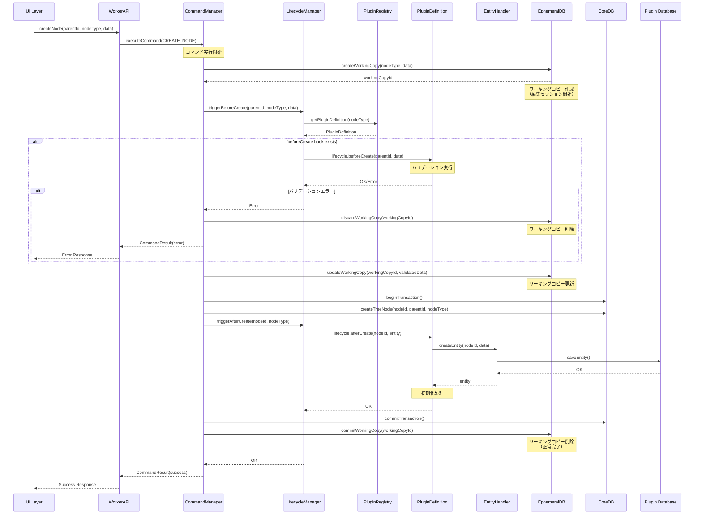
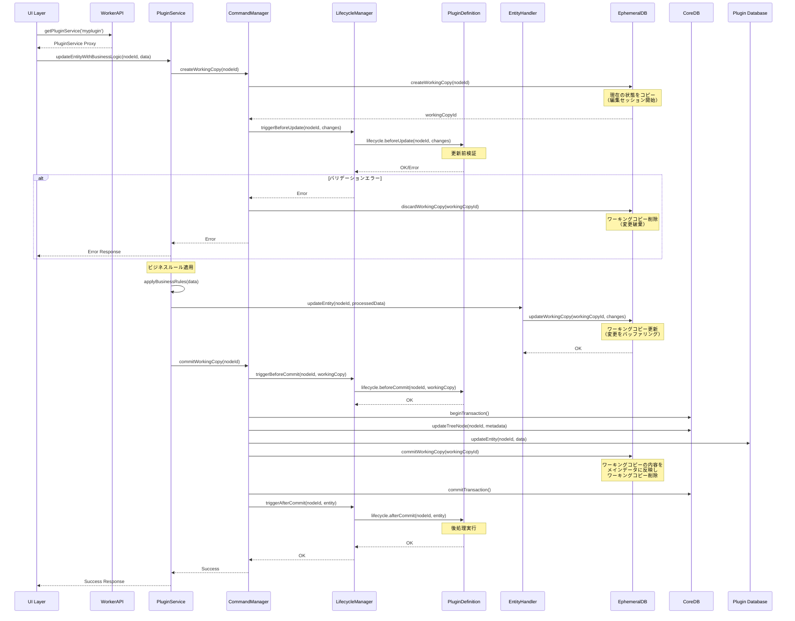
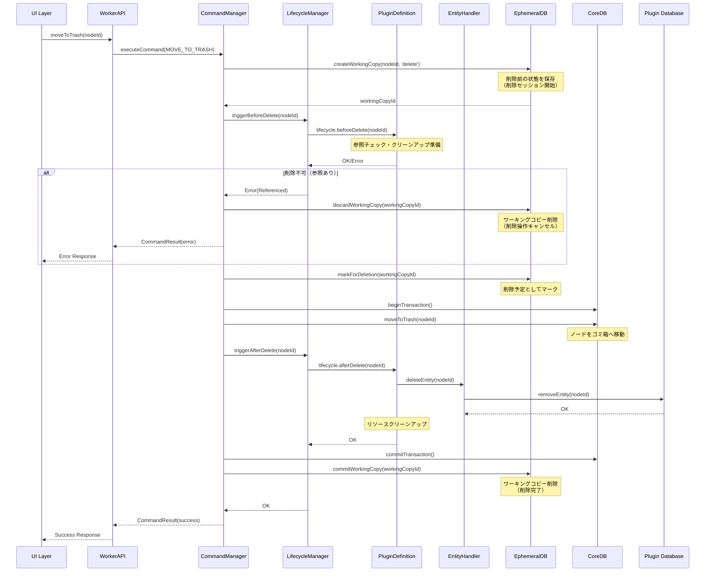

# HierarchiDB プラグイン開発ガイド

## 目次

1. [概要](#1-概要)
2. [アーキテクチャ](#2-アーキテクチャ)
3. [プラグイン構造](#3-プラグイン構造)
4. [実装手順](#4-実装手順)
5. [テストとデバッグ](#5-テストとデバッグ)
6. [ベストプラクティス](#6-ベストプラクティス)
7. [トラブルシューティング](#7-トラブルシューティング)

## 1. 概要

HierarchiDBのプラグインシステムは、新しいエンティティ型（ノードタイプ）を追加するための拡張メカニズムです。AOP（Aspect-Oriented Programming）アーキテクチャにより、コア機能に影響を与えることなく、新しい機能を追加できます。

### 1.1 プラグインで実現できること

- 新しいノードタイプの定義（例：basemap、stylemap、shape等）
- カスタムエンティティとその永続化
- ノードのライフサイクルフック（作成、更新、削除時の処理）
- 専用UIコンポーネント（表示、編集、インポート等）
- Worker API拡張
- ルーティング統合

### 1.2 対象ツリー

プラグインは以下のツリーに配置されます：

- **Resourcesツリー**: basemap、stylemap、shape等のリソース管理
- **Projectsツリー**: プロジェクト管理
- **共通**: folder（両ツリーで使用可能）

## 2. アーキテクチャ

### 2.1 4層アーキテクチャとの統合

```
UI Layer (React/MUI)
    ↕ Comlink RPC
Worker Layer (プラグインのライフサイクル処理)
    ↕
Database Layer (CoreDB/EphemeralDB)
```

### 2.2 ライフサイクルフックの実行フロー

#### ノード作成時のシーケンス



#### ノード更新時のシーケンス



#### ノード削除時のシーケンス



### 2.3 ライフサイクルマネージャーの役割

LifecycleManagerは以下の責務を持ちます：

1. **フック呼び出しの調整**: 適切なタイミングでプラグインのライフサイクルフックを呼び出す
2. **エラーハンドリング**: フック実行中のエラーを捕捉し、適切に処理
3. **トランザクション管理**: 複数のフックを一貫性を保って実行
4. **プラグイン解決**: NodeTypeからプラグイン定義を取得

```typescript
// packages/worker/src/lifecycle/LifecycleManager.ts（概念）
export class LifecycleManager {
  private registry: PluginRegistry;

  async triggerBeforeCreate(
    parentId: TreeNodeId,
    nodeType: TreeNodeType,
    data: unknown
  ): Promise<void> {
    const definition = this.registry.get(nodeType);
    if (!definition?.lifecycle?.beforeCreate) return;

    try {
      await definition.lifecycle.beforeCreate(parentId, data);
    } catch (error) {
      console.error(`beforeCreate hook failed for ${nodeType}:`, error);
      throw new Error(`Validation failed: ${error.message}`);
    }
  }

  async triggerAfterCreate(
    nodeId: TreeNodeId,
    nodeType: TreeNodeType
  ): Promise<void> {
    const definition = this.registry.get(nodeType);
    if (!definition?.lifecycle?.afterCreate) return;

    try {
      // エンティティを取得
      const entity = await definition.entityHandler.getEntity(nodeId);
      if (entity) {
        await definition.lifecycle.afterCreate(nodeId, entity);
      }
    } catch (error) {
      // afterCreateのエラーは警告のみ（ロールバックしない）
      console.warn(`afterCreate hook failed for ${nodeType}:`, error);
    }
  }

  // 他のトリガーメソッド...
}
```

### 2.4 主要コンポーネント

#### PluginRegistry
すべてのプラグイン定義を管理する中央レジストリ。プラグインの登録・検索・管理を担当。

#### PluginDefinition
プラグインの完全な定義を含むインターフェース。ライフサイクルフック、EntityHandler、ルーティング情報を統合。

#### EntityHandler
エンティティのCRUD操作を実装。プラグイン固有のデータ永続化ロジックを提供。

#### LifecycleManager
コマンド実行時にプラグインのライフサイクルフックを適切なタイミングで呼び出す。

#### CommandManager
ユーザー操作をコマンドとして実行し、LifecycleManagerと連携してフックを実行。

### 2.5 フック実行のタイミング

| 操作 | 実行されるフック | 実行順序 | エラー時の動作 |
|------|-----------------|----------|--------------|
| ノード作成 | beforeCreate → afterCreate | 1. バリデーション<br>2. ノード作成<br>3. エンティティ作成<br>4. 初期化処理 | beforeCreate失敗時は作成中止 |
| ノード更新 | beforeUpdate → beforeCommit → afterCommit | 1. 更新前検証<br>2. WorkingCopy作成<br>3. 変更適用<br>4. コミット前検証<br>5. コミット<br>6. 後処理 | beforeUpdate/beforeCommit失敗時は更新中止 |
| ノード削除 | beforeDelete → afterDelete | 1. 削除前チェック<br>2. ゴミ箱移動<br>3. エンティティ削除<br>4. クリーンアップ | beforeDelete失敗時は削除中止 |
| ノード移動 | beforeMove → afterMove | 1. 移動前検証<br>2. ツリー構造更新<br>3. 移動後処理 | beforeMove失敗時は移動中止 |

## 3. プラグイン構造

### 3.1 ディレクトリ構成

```
packages/plugins/[plugin-name]/
├── src/
│   ├── openstreetmap-type.ts                    # エクスポート定義
│   ├── types/
│   │   └── openstreetmap-type.ts                # 型定義
│   ├── definitions/
│   │   └── [PluginName]Definition.ts # PluginDefinition
│   ├── handlers/
│   │   └── [PluginName]Handler.ts   # EntityHandler実装
│   ├── database/
│   │   └── [PluginName]Database.ts  # Dexieスキーマ定義
│   └── ui/
│       ├── [PluginName]View.tsx     # 表示コンポーネント
│       ├── [PluginName]Editor.tsx   # 編集コンポーネント
│       └── [PluginName]Dialog.tsx   # ダイアログコンポーネント
├── package.json
├── tsconfig.json
└── README.md
```

### 3.2 package.json設定

```json
{
  "name": "@hierarchidb/plugin-[name]",
  "version": "0.1.0",
  "type": "module",
  "main": "dist/index.js",
  "module": "dist/index.mjs",
  "types": "dist/index.d.ts",
  "exports": {
    ".": {
      "types": "./dist/index.d.ts",
      "import": "./dist/index.mjs",
      "require": "./dist/index.js"
    }
  },
  "dependencies": {
    "@hierarchidb/core": "workspace:*",
    "@hierarchidb/worker": "workspace:*",
    "dexie": "^4.0.0",
    "react": "^18.0.0"
  },
  "scripts": {
    "build": "tsup",
    "dev": "tsup --watch",
    "typecheck": "tsc --noEmit"
  }
}
```

## 4. 実装手順

### 4.1 型定義

```typescript
// packages/plugins/[plugin-name]/src/types/openstreetmap-type.ts
import type { TreeNodeId } from '@hierarchidb/core';
import type { BaseEntity, BaseWorkingCopy } from '~/registry/unified-plugin';

// エンティティ定義
export interface MyPluginEntity extends BaseEntity {
  nodeId: TreeNodeId;
  // プラグイン固有のプロパティ
  customField1: string;
  customField2: number;
  createdAt: number;
  updatedAt: number;
  version: number;
}

// ワーキングコピー定義（編集用）
export interface MyPluginWorkingCopy extends BaseWorkingCopy {
  nodeId: TreeNodeId;
  workingCopyId: string;
  workingCopyOf: TreeNodeId;
  customField1: string;
  customField2: number;
  isDirty: boolean;
  copiedAt: number;
}
```

### 4.2 データベーススキーマ

**設計方針**: 各プラグインは独自のDexieインスタンスを持ち、プラグイン固有のデータを管理します。これにより、プラグイン間のデータ分離と独立したマイグレーション管理が可能になります。

```typescript
// packages/plugins/[plugin-name]/src/database/MyPluginDatabase.ts
import Dexie, { type Table } from 'dexie';
import type { MyPluginEntity, MyPluginWorkingCopy } from '../types';

/**
 * プラグイン専用データベース
 * - 独立したDB名でプラグイン間を分離
 * - プラグイン固有のスキーマとマイグレーション管理
 * - 将来のCoreDB統合に向けた拡張性を考慮
 */
export class MyPluginDatabase extends Dexie {
  entities!: Table<MyPluginEntity>;
  workingCopies!: Table<MyPluginWorkingCopy>;

  constructor() {
    // プラグイン固有のDB名を使用
    super('MyPluginDB');
    
    // バージョン1の定義
    this.version(1).stores({
      entities: 'nodeId, customField1, createdAt, updatedAt',
      workingCopies: 'workingCopyId, nodeId, workingCopyOf'
    });

    // 将来のマイグレーション例
    // this.version(2).stores({
    //   entities: 'nodeId, customField1, customField3, createdAt, updatedAt',
    //   workingCopies: 'workingCopyId, nodeId, workingCopyOf'
    // }).upgrade(tx => {
    //   return tx.table('entities').toCollection().modify(entity => {
    //     entity.customField3 = 'default_value';
    //   });
    // });
  }

  /**
   * プラグイン固有の複合クエリ
   */
  async getEntitiesByCustomField1(value: string): Promise<MyPluginEntity[]> {
    return await this.entities
      .where('customField1')
      .equals(value)
      .toArray();
  }

  /**
   * 統計情報の取得
   */
  async getEntityStats(): Promise<{ count: number; averageField2: number }> {
    const entities = await this.entities.toArray();
    const count = entities.length;
    const averageField2 = count > 0 
      ? entities.reduce((sum, e) => sum + e.customField2, 0) / count 
      : 0;
    
    return { count, averageField2 };
  }
}

// Dexieスキーマ定義（PluginDefinitionで使用）
export const myPluginSchema = 'nodeId, customField1, createdAt, updatedAt';

/**
 * シングルトンパターンでのDB管理（オプション）
 */
let dbInstance: MyPluginDatabase | null = null;

export function getMyPluginDatabase(): MyPluginDatabase {
  if (!dbInstance) {
    dbInstance = new MyPluginDatabase();
  }
  return dbInstance;
}
```

**重要な設計判断**:
- プラグインごとに独立したIndexedDBデータベースを作成
- CoreDB/EphemeralDBとの統合トランザクションは将来の開発課題
- プラグインの追加・削除時にデータ分離が保たれる

### 4.3 プラグインサービス実装

#### 4.3.1 EntityHandler実装

```typescript
// packages/plugins/[plugin-name]/src/handlers/MyPluginHandler.ts
import type { TreeNodeId } from '@hierarchidb/core';
import type { EntityHandler } from '~/registry/unified-plugin';
import type { MyPluginEntity, MyPluginWorkingCopy } from '../types';
import { MyPluginDatabase } from '../database/MyPluginDatabase';

export class MyPluginHandler implements EntityHandler<MyPluginEntity, never, MyPluginWorkingCopy> {
  private db: MyPluginDatabase;

  constructor() {
    this.db = new MyPluginDatabase();
  }

  async createEntity(nodeId: TreeNodeId, data?: Partial<MyPluginEntity>): Promise<MyPluginEntity> {
    const entity: MyPluginEntity = {
      nodeId,
      customField1: data?.customField1 || '',
      customField2: data?.customField2 || 0,
      createdAt: Date.now(),
      updatedAt: Date.now(),
      version: 1
    };

    await this.db.entities.add(entity);
    return entity;
  }

  async getEntity(nodeId: TreeNodeId): Promise<MyPluginEntity | undefined> {
    return await this.db.entities.get(nodeId);
  }

  async updateEntity(nodeId: TreeNodeId, data: Partial<MyPluginEntity>): Promise<void> {
    await this.db.entities.update(nodeId, {
      ...data,
      updatedAt: Date.now()
    });
  }

  async deleteEntity(nodeId: TreeNodeId): Promise<void> {
    await this.db.entities.delete(nodeId);
  }

  async createWorkingCopy(nodeId: TreeNodeId): Promise<MyPluginWorkingCopy> {
    const entity = await this.getEntity(nodeId);
    if (!entity) {
      throw new Error(`Entity not found: ${nodeId}`);
    }

    const workingCopy: MyPluginWorkingCopy = {
      ...entity,
      workingCopyId: crypto.randomUUID(),
      workingCopyOf: nodeId,
      isDirty: false,
      copiedAt: Date.now()
    };

    await this.db.workingCopies.add(workingCopy);
    return workingCopy;
  }

  async commitWorkingCopy(nodeId: TreeNodeId, workingCopy: MyPluginWorkingCopy): Promise<void> {
    const { workingCopyId, workingCopyOf, isDirty, copiedAt, ...entityData } = workingCopy;
    await this.updateEntity(nodeId, entityData);
    await this.db.workingCopies.delete(workingCopyId);
  }

  async discardWorkingCopy(nodeId: TreeNodeId): Promise<void> {
    const workingCopy = await this.db.workingCopies
      .where('workingCopyOf')
      .equals(nodeId)
      .first();
    
    if (workingCopy) {
      await this.db.workingCopies.delete(workingCopy.workingCopyId);
    }
  }
}
```

#### 4.3.2 プラグイン専用サービス実装

```typescript
// packages/plugins/[plugin-name]/src/services/MyPluginService.ts
import type { TreeNodeId } from '@hierarchidb/core';
import type { MyPluginEntity, MyPluginWorkingCopy } from '../types';
import { MyPluginHandler } from '../handlers/MyPluginHandler';

/**
 * プラグイン固有のビジネスロジックを実装するサービス
 * WorkerAPIファサードから動的に初期化・提供される
 */
export class MyPluginService {
  private handler: MyPluginHandler;

  constructor() {
    this.handler = new MyPluginHandler();
  }

  // プラグイン固有のビジネスメソッド
  async getEntityWithValidation(nodeId: TreeNodeId): Promise<MyPluginEntity> {
    const entity = await this.handler.getEntity(nodeId);
    if (!entity) {
      throw new Error(`MyPlugin entity not found: ${nodeId}`);
    }
    
    // プラグイン固有の検証ロジック
    this.validateEntity(entity);
    return entity;
  }

  async updateEntityWithBusinessLogic(
    nodeId: TreeNodeId, 
    data: Partial<MyPluginEntity>
  ): Promise<void> {
    // ビジネスルールの適用
    const processedData = this.applyBusinessRules(data);
    
    // エンティティの更新
    await this.handler.updateEntity(nodeId, processedData);
    
    // 後処理（通知、ログ、関連データの更新など）
    await this.postUpdateProcessing(nodeId, processedData);
  }

  async calculateDerivedData(nodeId: TreeNodeId): Promise<{ [key: string]: unknown }> {
    const entity = await this.handler.getEntity(nodeId);
    if (!entity) {
      throw new Error(`Entity not found: ${nodeId}`);
    }

    // プラグイン固有の計算処理
    return {
      derivedValue1: entity.customField1.length,
      derivedValue2: entity.customField2 * 2,
      lastModified: new Date(entity.updatedAt).toISOString()
    };
  }

  private validateEntity(entity: MyPluginEntity): void {
    if (entity.customField1.length === 0) {
      throw new Error('CustomField1 cannot be empty');
    }
    if (entity.customField2 < 0) {
      throw new Error('CustomField2 must be non-negative');
    }
  }

  private applyBusinessRules(data: Partial<MyPluginEntity>): Partial<MyPluginEntity> {
    const processed = { ...data };
    
    // ビジネスルールの適用例
    if (processed.customField1) {
      processed.customField1 = processed.customField1.trim().toLowerCase();
    }
    
    return processed;
  }

  private async postUpdateProcessing(
    nodeId: TreeNodeId, 
    data: Partial<MyPluginEntity>
  ): Promise<void> {
    // 更新後の処理（例：キャッシュクリア、通知送信など）
    console.log(`MyPlugin entity updated: ${nodeId}`, data);
  }
}
```

#### 4.3.3 WorkerAPIファサードでの動的サービス提供

```typescript
// packages/worker/src/WorkerAPIImpl.ts（拡張部分）
import * as Comlink from 'comlink';
import { PluginRegistry } from '~/registry';

export class WorkerAPIImpl {
  private pluginServices = new Map<string, unknown>();

  /**
   * プラグイン固有のサービスを初期化して返す
   * ファサードパターンによる動的サービス提供
   */
  async getPluginService<T = unknown>(pluginName: string): Promise<T> {
    // キャッシュされたサービスがあれば返す
    if (this.pluginServices.has(pluginName)) {
      return this.pluginServices.get(pluginName) as T;
    }

    // プラグイン定義を取得
    const registry = PluginRegistry.getInstance();
    const definition = registry.get(pluginName);
    
    if (!definition) {
      throw new Error(`Plugin not found: ${pluginName}`);
    }

    // プラグイン固有のサービスを動的にロード・初期化
    const serviceModule = await this.loadPluginService(pluginName);
    const serviceInstance = new serviceModule.default();

    // Comlinkプロキシとして返せるようにラップ
    const proxiedService = Comlink.proxy(serviceInstance);

    // キャッシュに保存
    this.pluginServices.set(pluginName, proxiedService);

    return proxiedService as T;
  }

  private async loadPluginService(pluginName: string): Promise<{ default: new () => unknown }> {
    // 動的インポートでプラグインサービスをロード
    // 実装方法はバンドル戦略に依存
    switch (pluginName) {
      case 'myplugin':
        return await import(`@hierarchidb/plugin-myplugin/services/MyPluginService`);
      case 'basemap':
        return await import(`@hierarchidb/plugin-basemap/services/BaseMapService`);
      case 'stylemap':
        return await import(`@hierarchidb/plugin-stylemap/services/StyleMapService`);
      default:
        throw new Error(`Unknown plugin service: ${pluginName}`);
    }
  }

  /**
   * プラグインサービスのキャッシュクリア
   */
  async clearPluginServiceCache(pluginName?: string): Promise<void> {
    if (pluginName) {
      this.pluginServices.delete(pluginName);
    } else {
      this.pluginServices.clear();
    }
  }
}
```

### 4.4 ライフサイクルフック

```typescript
// packages/plugins/[plugin-name]/src/definitions/MyPluginDefinition.ts（一部）
import type { NodeLifecycleHooks } from '~/registry/unified-plugin';
import type { MyPluginEntity, MyPluginWorkingCopy } from '../types';

const myPluginLifecycle: NodeLifecycleHooks<MyPluginEntity, MyPluginWorkingCopy> = {
  // ノード作成前の検証
  beforeCreate: async (parentId, nodeData) => {
    // カスタムバリデーション
    if (nodeData.customField1 && nodeData.customField1.length > 100) {
      throw new Error('customField1 must be 100 characters or less');
    }
  },

  // ノード作成後の初期化
  afterCreate: async (nodeId, entity) => {
    console.log(`MyPlugin node created: ${nodeId}`);
    // 必要に応じて外部リソースの初期化等
  },

  // ノード更新前の検証
  beforeUpdate: async (nodeId, changes) => {
    // 更新内容の検証
  },

  // ノード削除前のクリーンアップ
  beforeDelete: async (nodeId) => {
    // 関連リソースの削除、参照チェック等
  },

  // ワーキングコピーのコミット前処理
  beforeCommit: async (nodeId, workingCopy) => {
    // コミット前の最終検証
  },

  // ワーキングコピーのコミット後処理
  afterCommit: async (nodeId, entity) => {
    console.log(`Working copy committed for: ${nodeId}`);
  }
};
```


### 4.5 UIコンポーネント

#### 表示コンポーネント

```tsx
// packages/plugins/[plugin-name]/src/ui/MyPluginView.tsx
import { useEffect, useState } from 'react';
import { Box, Typography, Paper } from '@mui/material';
import { useLoaderData } from 'react-router-dom';
import type { MyPluginEntity } from '../types';

export function MyPluginView() {
  const data = useLoaderData() as any;
  const nodeId = data.targetNode?.treeNodeId;
  const [entity, setEntity] = useState<MyPluginEntity | null>(null);

  useEffect(() => {
    if (nodeId) {
      // Worker APIを通じてエンティティを取得
      // TODO: 実際のWorker API呼び出しに置き換え
      console.log('Loading entity for node:', nodeId);
    }
  }, [nodeId]);

  if (!entity) {
    return <Typography>Loading...</Typography>;
  }

  return (
    <Paper sx={{ p: 3 }}>
      <Typography variant="h5">{entity.customField1}</Typography>
      <Typography>Value: {entity.customField2}</Typography>
    </Paper>
  );
}
```

#### 編集コンポーネント

```tsx
// packages/plugins/[plugin-name]/src/ui/MyPluginEditor.tsx
import { useState } from 'react';
import { Box, TextField, Button } from '@mui/material';
import { useLoaderData } from 'react-router-dom';
import type { MyPluginEntity } from '../types';

export function MyPluginEditor() {
  const data = useLoaderData() as any;
  const nodeId = data.targetNode?.treeNodeId;
  const [formData, setFormData] = useState<Partial<MyPluginEntity>>({
    customField1: '',
    customField2: 0
  });

  const handleSave = async () => {
    // Worker APIを通じて保存
    console.log('Saving:', formData);
  };

  return (
    <Box sx={{ p: 3 }}>
      <TextField
        label="Custom Field 1"
        value={formData.customField1}
        onChange={(e) => setFormData({ ...formData, customField1: e.target.value })}
        fullWidth
        margin="normal"
      />
      <TextField
        label="Custom Field 2"
        type="number"
        value={formData.customField2}
        onChange={(e) => setFormData({ ...formData, customField2: Number(e.target.value) })}
        fullWidth
        margin="normal"
      />
      <Button variant="contained" onClick={handleSave} sx={{ mt: 2 }}>
        Save
      </Button>
    </Box>
  );
}
```

### 4.6 PluginDefinition

```typescript
// packages/plugins/[plugin-name]/src/definitions/MyPluginDefinition.ts
import type { PluginDefinition, IconDefinition } from '~/registry/unified-plugin';
import type { MyPluginEntity, MyPluginWorkingCopy } from '../types';
import { MyPluginHandler } from '../handlers/MyPluginHandler';
import { myPluginSchema } from '../database/MyPluginDatabase';

// アイコン定義（複数形式をサポート）
const myPluginIcon: IconDefinition = {
  // MUIアイコン名（優先度高）
  muiIconName: 'Extension',
  
  // Unicode絵文字（フォールバック）
  emoji: '🧩',
  
  // SVGデータ（カスタムアイコン）
  svg: `<svg viewBox="0 0 24 24" fill="currentColor">
    <path d="M12 2C6.48 2 2 6.48 2 12s4.48 10 10 10 10-4.48 10-10S17.52 2 12 2z"/>
  </svg>`,
  
  // アイコンの説明（アクセシビリティとUI表示用）
  description: 'カスタムプラグインアイコン - このプラグインは特別な機能を提供します',
  
  // テーマカラー
  color: '#4CAF50'
};

export const MyPluginDefinition: PluginDefinition<MyPluginEntity, never, MyPluginWorkingCopy> = {
  // 基本情報
  nodeType: 'myplugin',
  name: 'MyPlugin',
  displayName: 'My Plugin',
  description: 'プラグインの詳細な説明。このプラグインが提供する機能や使用方法についての説明文。',
  
  // アイコン設定
  icon: myPluginIcon,

  // データベース設定
  database: {
    dbName: 'MyPluginDB',
    tableName: 'myplugin_entities',
    schema: myPluginSchema,
    version: 1
  },

  // エンティティハンドラー
  entityHandler: new MyPluginHandler(),

  // ライフサイクルフック
  lifecycle: myPluginLifecycle,

  // ルーティング設定（Worker側ではcomponentPathを使用）
  routing: {
    actions: {
      view: {
        componentPath: '../ui/MyPluginView',
        // loader: async () => { /* データロード処理 */ }
      },
      edit: {
        componentPath: '../ui/MyPluginEditor',
        // action: async () => { /* 保存処理 */ }
      }
    },
    defaultAction: 'view'
  },

  // UI設定（パス指定）
  ui: {
    dialogComponentPath: '../ui/MyPluginDialog',
    panelComponentPath: '../ui/MyPluginPanel',
    formComponentPath: '../ui/MyPluginForm'
  },

  // バリデーション設定
  validation: {
    namePattern: /^[a-zA-Z0-9_-]+$/,
    maxChildren: 100,
    allowedChildTypes: ['folder', 'myplugin']
  },

  // メタデータ
  meta: {
    version: '1.0.0',
    description: 'Example plugin for HierarchiDB',
    author: 'Your Name',
    tags: ['example', 'resources']
  }
};
```

### 4.7 プラグインの登録

```typescript
// packages/app/src/plugins/register.ts
import { PluginRegistry } from '~/registry'; // Workerパッケージ内のregistry
import { MyPluginDefinition } from '@hierarchidb/plugin-myplugin';

// アプリケーション起動時に実行
export function registerPlugins() {
  const registry = PluginRegistry.getInstance();
  
  // プラグインを登録
  registry.register(MyPluginDefinition);
  
  // 他のプラグインも同様に登録
  // registry.register(AnotherPluginDefinition);
}
```

**注意**: PluginRegistryの実際の実装場所については、プロジェクトの構造に応じて調整が必要です。

## 5. テストとデバッグ

### 5.1 単体テスト

```typescript
// packages/plugins/[plugin-name]/src/handlers/__tests__/MyPluginHandler.test.ts
import { describe, it, expect, beforeEach } from 'vitest';
import { MyPluginHandler } from '../MyPluginHandler';
import 'fake-indexeddb/auto';

describe('MyPluginHandler', () => {
  let handler: MyPluginHandler;

  beforeEach(() => {
    handler = new MyPluginHandler();
  });

  it('should create entity', async () => {
    const nodeId = 'test-node-id';
    const entity = await handler.createEntity(nodeId, {
      customField1: 'test',
      customField2: 42
    });

    expect(entity.nodeId).toBe(nodeId);
    expect(entity.customField1).toBe('test');
    expect(entity.customField2).toBe(42);
  });

  it('should get entity', async () => {
    const nodeId = 'test-node-id';
    await handler.createEntity(nodeId);
    
    const entity = await handler.getEntity(nodeId);
    expect(entity).toBeDefined();
    expect(entity?.nodeId).toBe(nodeId);
  });
});
```

### 5.2 統合テスト

```typescript
// packages/plugins/[plugin-name]/src/__tests__/integration.test.ts
import { describe, it, expect } from 'vitest';
import { PluginRegistry } from '~/registry'; // 実際のレジストリの場所に応じて調整
import { MyPluginDefinition } from '../definitions/MyPluginDefinition';

describe('MyPlugin Integration', () => {
  it('should register with PluginRegistry', () => {
    const registry = PluginRegistry.getInstance();
    registry.register(MyPluginDefinition);
    
    const definition = registry.get('myplugin');
    expect(definition).toBeDefined();
    expect(definition?.name).toBe('MyPlugin');
  });
});
```

### 5.3 デバッグ

開発時のデバッグには以下のツールを使用：

```typescript
// Worker通信のデバッグ
if (process.env.NODE_ENV === 'development') {
  // Comlinkのデバッグモード有効化
  import * as Comlink from 'comlink';
  Comlink.transferHandlers.set('DEBUG', {
    canHandle: () => true,
    serialize: (obj) => {
      console.log('Serialize:', obj);
      return [obj, []];
    },
    deserialize: (obj) => {
      console.log('Deserialize:', obj);
      return obj;
    }
  });
}
```

## 6. ベストプラクティス

### 6.1 命名規則

- **NodeType**: 単数形の小文字（例: `basemap`、`stylemap`、`shape`）
- **パッケージ名**: `@hierarchidb/plugin-[name]`
- **クラス名**: PascalCase（例: `BaseMapHandler`、`StyleMapEntity`）
- **ファイル名**: PascalCaseまたはkebab-case

### 6.2 データベース設計

- **独立性**: 各プラグインは独自のDexieインスタンスを使用
- **分離**: プラグイン間のデータ干渉を防止
- **マイグレーション**: プラグインごとに独立したスキーマ進化
- **将来対応**: CoreDB統合は段階的に実装

### 6.3 型安全性

- すべての型を明示的に定義
- `any`型の使用を避ける
- `unknown`型と型ガードを使用

```typescript
// 良い例
function isMyPluginEntity(value: unknown): value is MyPluginEntity {
  return (
    typeof value === 'object' &&
    value !== null &&
    'nodeId' in value &&
    'customField1' in value
  );
}

// 悪い例
function processEntity(entity: any) {
  // any型は型安全性を損なう
}
```

### 6.3 WorkerAPIファサードパターン

- **サービス分離**: プラグインごとに専用サービスクラスを実装
- **動的ロード**: 必要時にプラグインサービスを初期化
- **プロキシ提供**: Comlinkを通じて型安全なAPIアクセス
- **キャッシュ管理**: サービスインスタンスの効率的な再利用

### 6.4 エラーハンドリング

```typescript
class MyPluginHandler {
  async getEntity(nodeId: TreeNodeId): Promise<MyPluginEntity | undefined> {
    try {
      return await this.db.entities.get(nodeId);
    } catch (error) {
      console.error(`Failed to get entity ${nodeId}:`, error);
      // エラーを上位に伝播させるか、適切にハンドリング
      throw new Error(`Failed to retrieve entity: ${error.message}`);
    }
  }
}
```

### 6.5 パフォーマンス

- 大量データの仮想スクロール使用
- React.memoによるメモ化
- useMemo/useCallbackの適切な使用

```ts
import { memo, useMemo } from 'react';

export const MyPluginList = memo(function MyPluginList({ items }) {
  const sortedItems = useMemo(
    () => items.sort((a, b) => a.name.localeCompare(b.name)),
    [items]
  );

  return (
    // 仮想スクロールの実装
  );
});
```

## 7. トラブルシューティング

### 7.1 プラグインが登録されない

**症状**: PluginRegistryにプラグインが見つからない

**解決策**:
1. `registerPlugins()`が呼ばれているか確認
2. プラグイン定義のエクスポートを確認
3. nodeTypeの重複がないか確認

### 7.2 データベースエラー

**症状**: Dexieエラーが発生

**解決策**:
1. スキーマ定義の構文を確認
2. インデックスフィールドが存在するか確認
3. バージョン番号が正しいか確認

### 7.3 UIコンポーネントが表示されない

**症状**: ルーティングは動作するがコンポーネントが表示されない

**解決策**:
1. lazy importのパスを確認
2. コンポーネントのエクスポートを確認
3. React Developer Toolsでエラーを確認

### 7.4 Worker通信エラー

**症状**: Worker APIの呼び出しが失敗

**解決策**:
1. Comlinkのプロキシ設定を確認
2. シリアライズ可能なデータか確認
3. Worker側のエラーログを確認

## 付録A: 型定義リファレンス

主要な型定義は`@hierarchidb/core`および`@hierarchidb/worker/registry`から提供されます。

```tsx
// @hierarchidb/core
export interface BaseEntity { /*...*/ }
export interface BaseWorkingCopy { /*...*/ }
export interface TreeNode { /*...*/ }
export type TreeNodeId = string;
export type TreeNodeType = string;
export type Timestamp = number;

// @hierarchidb/worker/registry
export interface PluginDefinition { /*...*/ }
export interface EntityHandler { /*...*/ }
export interface NodeLifecycleHooks { /*...*/ }
export class PluginRegistry { /*...*/ }
```

## 付録B: 既存プラグインの例

- **basemap**: MapLibre GL JSの基本地図管理
- **stylemap**: CSVベースのスタイル定義
- **shape**: GeoJSON形状データ管理
- **folder**: 汎用フォルダ機能

これらのプラグインのソースコードは`packages/plugins/`以下で参照できます。

---

本ガイドは継続的に更新されます。最新情報は[GitHub リポジトリ](https://github.com/hierarchidb/hierarchidb)を参照してください。