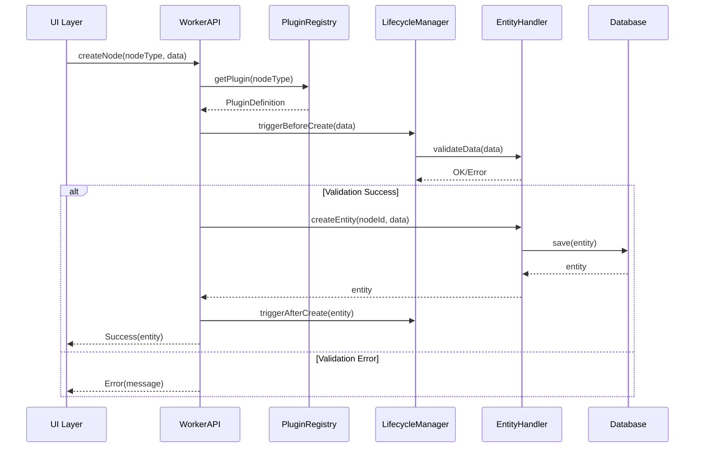

# HierarchiDB プラグイン開発ガイド

## 目次

1. [概要](#1-概要)
2. [アーキテクチャ](#2-アーキテクチャ)
3. [プラグイン構造](#3-プラグイン構造)
4. [実装ガイド](#4-実装ガイド)
5. [標準プラグイン](#5-標準プラグイン)
6. [テストとデバッグ](#6-テストとデバッグ)
7. [ベストプラクティス](#7-ベストプラクティス)
8. [トラブルシューティング](#8-トラブルシューティング)

## 1. 概要

HierarchiDBのプラグインシステムは、アスペクト指向プログラミング（AOP）の原則に基づき、ノードタイプごとに独立した機能を提供します。各プラグインは以下を提供：

- **データモデル**: エンティティとワーキングコピーの定義
- **ビジネスロジック**: EntityHandlerによるCRUD操作
- **ライフサイクル管理**: ノードの作成・更新・削除時のフック
- **UIコンポーネント**: 表示・編集・プレビュー用の画面
- **API拡張**: Worker/Client側での追加機能

## 2. アーキテクチャ

### 2.1 システム構成

```
┌─────────────────────────────────────────────────────┐
│                    UI Layer (React)                  │
│  ┌─────────────┐ ┌─────────────┐ ┌──────────────┐ │
│  │  Plugin UI  │ │ Plugin Form │ │Plugin Dialog │ │
│  └─────────────┘ └─────────────┘ └──────────────┘ │
└─────────────────────────┬───────────────────────────┘
                          │ Comlink RPC
┌─────────────────────────┴───────────────────────────┐
│                   Worker Layer                       │
│  ┌──────────────────────────────────────────────┐  │
│  │            Plugin Registry                    │  │
│  │  ┌────────┐ ┌────────┐ ┌────────┐          │  │
│  │  │BaseMap │ │StyleMap│ │ Shapes │ ...      │  │
│  │  └────────┘ └────────┘ └────────┘          │  │
│  └──────────────────────────────────────────────┘  │
│  ┌──────────────────────────────────────────────┐  │
│  │         Lifecycle Manager                     │  │
│  └──────────────────────────────────────────────┘  │
└─────────────────────────┬───────────────────────────┘
                          │
┌─────────────────────────┴───────────────────────────┐
│              Database Layer (Dexie)                  │
│  ┌──────────┐ ┌──────────┐ ┌──────────┐           │
│  │ CoreDB   │ │EphemeralDB│ │Plugin DBs│           │
│  └──────────┘ └──────────┘ └──────────┘           │
└─────────────────────────────────────────────────────┘
```

### 2.2 データフロー



## 3. プラグイン構造

### 3.1 ディレクトリ構成

```
packages/plugins/[plugin-name]/
├── src/
│   ├── openstreetmap-type.ts                    # エクスポート定義
│   ├── types/
│   │   └── openstreetmap-type.ts                # 型定義
│   ├── definitions/
│   │   └── [Name]Definition.ts     # PluginDefinition
│   ├── handlers/
│   │   └── [Name]Handler.ts        # EntityHandler実装
│   ├── database/
│   │   └── [Name]Database.ts       # Dexieスキーマ定義
│   ├── services/
│   │   └── [Name]Service.ts        # ビジネスロジック
│   ├── ui/
│   │   ├── components/
│   │   │   ├── [Name]View.tsx      # 表示コンポーネント
│   │   │   ├── [Name]Editor.tsx    # 編集コンポーネント
│   │   │   └── [Name]Dialog.tsx    # ダイアログ
│   │   └── hooks/
│   │       └── use[Name].ts        # カスタムフック
│   └── locales/
│       ├── en/
│       │   └── core.json           # 英語翻訳
│       └── ja/
│           └── core.json           # 日本語翻訳
├── package.json
├── tsconfig.json
├── tsup.config.ts
└── README.md
```

### 3.2 必須ファイル

#### 3.2.1 型定義 (types/openstreetmap-type.ts)

```typescript
import type { TreeNodeId } from '@hierarchidb/core';
import type { BaseEntity, BaseWorkingCopy } from '@hierarchidb/worker/registry';

export interface MyPluginEntity extends BaseEntity {
  nodeId: TreeNodeId;
  // プラグイン固有のフィールド
  customField1: string;
  customField2: number;
  createdAt: number;
  updatedAt: number;
  version: number;
}

export interface MyPluginWorkingCopy extends BaseWorkingCopy {
  nodeId: TreeNodeId;
  workingCopyId: string;
  workingCopyOf: TreeNodeId;
  // プラグイン固有のフィールド
  customField1: string;
  customField2: number;
  isDirty: boolean;
  copiedAt: number;
}
```

#### 3.2.2 プラグイン定義 (definitions/[Name]Definition.ts)

```typescript
import type { PluginDefinition, IconDefinition } from '@hierarchidb/worker/registry';

const myPluginIcon: IconDefinition = {
  muiIconName: 'Extension',
  emoji: '🧩',
  color: '#4CAF50',
  description: 'プラグインの詳細な説明'
};

export const MyPluginDefinition: PluginDefinition<MyPluginEntity, never, MyPluginWorkingCopy> = {
  // 基本情報
  nodeType: 'myplugin',
  name: 'MyPlugin',
  displayName: 'My Plugin',
  description: 'このプラグインが提供する機能の説明',
  
  // アイコン設定
  icon: myPluginIcon,
  
  // i18n設定
  i18n: {
    namespace: 'plugin-myplugin',
    defaultLocale: 'en',
    localesPath: '/plugins/myplugin/locales/{{lng}}/core.json',
  },
  
  // データベース設定
  database: {
    dbName: 'MyPluginDB',
    tableName: 'entities',
    schema: 'nodeId, customField1, createdAt, updatedAt',
    version: 1
  },
  
  // エンティティハンドラー
  entityHandler: new MyPluginHandler(),
  
  // ライフサイクルフック
  lifecycle: myPluginLifecycle,
  
  // UI設定
  ui: {
    dialogComponentPath: '../ui/containers/MyPluginDialog',
    panelComponentPath: '../ui/containers/MyPluginPanel',
    formComponentPath: '../ui/containers/MyPluginForm'
  },
  
  // バリデーション設定
  validation: {
    namePattern: /^[a-zA-Z0-9_-]+$/,
    maxChildren: 100,
    allowedChildTypes: ['folder', 'myplugin']
  },
  
  // メタデータ
  meta: {
    version: '1.0.0',
    author: 'Your Name',
    tags: ['example', 'plugin'],
    priority: 10
  }
};
```

## 4. 実装ガイド

### 4.1 EntityHandler実装

```typescript
export class MyPluginHandler implements EntityHandler<MyPluginEntity, never, MyPluginWorkingCopy> {
  private db: MyPluginDatabase;
  
  constructor() {
    this.db = new MyPluginDatabase();
  }
  
  async createEntity(nodeId: TreeNodeId, data?: Partial<MyPluginEntity>): Promise<MyPluginEntity> {
    const entity: MyPluginEntity = {
      nodeId,
      customField1: data?.customField1 || '',
      customField2: data?.customField2 || 0,
      createdAt: Date.now(),
      updatedAt: Date.now(),
      version: 1
    };
    
    await this.db.entities.add(entity);
    return entity;
  }
  
  async getEntity(nodeId: TreeNodeId): Promise<MyPluginEntity | undefined> {
    return await this.db.entities.get(nodeId);
  }
  
  async updateEntity(nodeId: TreeNodeId, data: Partial<MyPluginEntity>): Promise<void> {
    await this.db.entities.update(nodeId, {
      ...data,
      updatedAt: Date.now()
    });
  }
  
  async deleteEntity(nodeId: TreeNodeId): Promise<void> {
    await this.db.entities.delete(nodeId);
  }
  
  async createWorkingCopy(nodeId: TreeNodeId): Promise<MyPluginWorkingCopy> {
    const entity = await this.getEntity(nodeId);
    if (!entity) {
      throw new Error(`Entity not found: ${nodeId}`);
    }
    
    const workingCopy: MyPluginWorkingCopy = {
      ...entity,
      workingCopyId: crypto.randomUUID(),
      workingCopyOf: nodeId,
      isDirty: false,
      copiedAt: Date.now()
    };
    
    await this.db.workingCopies.add(workingCopy);
    return workingCopy;
  }
  
  async commitWorkingCopy(nodeId: TreeNodeId, workingCopy: MyPluginWorkingCopy): Promise<void> {
    const { workingCopyId, workingCopyOf, isDirty, copiedAt, ...entityData } = workingCopy;
    await this.updateEntity(nodeId, entityData);
    await this.db.workingCopies.delete(workingCopyId);
  }
  
  async discardWorkingCopy(nodeId: TreeNodeId): Promise<void> {
    const workingCopy = await this.db.workingCopies
      .where('workingCopyOf')
      .equals(nodeId)
      .first();
    
    if (workingCopy) {
      await this.db.workingCopies.delete(workingCopy.workingCopyId);
    }
  }
}
```

### 4.2 データベース実装

```typescript
import Dexie, { type Table } from 'dexie';

export class MyPluginDatabase extends Dexie {
  entities!: Table<MyPluginEntity>;
  workingCopies!: Table<MyPluginWorkingCopy>;
  
  constructor() {
    super('MyPluginDB');
    
    this.version(1).stores({
      entities: 'nodeId, customField1, createdAt, updatedAt',
      workingCopies: 'workingCopyId, nodeId, workingCopyOf'
    });
  }
}
```

### 4.3 UIコンポーネント

```tsx
// ui/containers/MyPluginView.tsx
import { useEffect, useState } from 'react';
import { Box, Typography, Paper } from '@mui/material';
import { usePluginI18n } from '@hierarchidb/ui-i18n/hooks';

export function MyPluginView({ nodeId }: { nodeId: string }) {
  const [entity, setEntity] = useState<MyPluginEntity | null>(null);
  const { t } = usePluginI18n('plugin-myplugin');
  
  useEffect(() => {
    // Load entity from Worker
    loadEntity(nodeId).then(setEntity);
  }, [nodeId]);
  
  if (!entity) {
    return <Typography>{t('loading')}</Typography>;
  }
  
  return (
    <Paper sx={{ p: 3 }}>
      <Typography variant="h5">{entity.customField1}</Typography>
      <Typography>{t('value')}: {entity.customField2}</Typography>
    </Paper>
  );
}
```

## 5. 標準プラグイン

### 5.1 BaseMap (基本地図)

**機能**: MapLibre GL JSで表示する基本地図を管理

```typescript
export interface BaseMapEntity extends BaseEntity {
  nodeId: TreeNodeId;
  name: string;
  description?: string;
  mapStyle: 'streets' | 'satellite' | 'hybrid' | 'terrain' | 'custom';
  styleUrl?: string;
  styleConfig?: any;
  center: [number, number]; // [lng, lat]
  zoom: number;
  bearing: number;
  pitch: number;
  bounds?: [[number, number], [number, number]];
  createdAt: number;
  updatedAt: number;
  version: number;
}
```

**特徴**:
- 複数の地図スタイルをサポート
- カスタムスタイルURL/JSON対応
- 表示位置の保存・復元
- プロジェクトからの参照に対応

### 5.2 StyleMap (スタイルマップ)

**機能**: CSVデータを基にした動的スタイリング

```typescript
export interface StyleMapEntity extends BaseEntity {
  nodeId: TreeNodeId;
  name: string;
  description?: string;
  filename?: string;
  keyColumn?: string;
  valueColumn?: string;
  tableMetadataId?: string;
  styleMapConfig?: StyleMapConfig;
  filterRules?: FilterRule[];
  cacheKey?: string;
  createdAt: number;
  updatedAt: number;
  version: number;
}
```

**特徴**:
- CSV/TSV/Excel形式サポート
- カラムベースのマッピング
- フィルタリング機能
- キャッシュによる高速化

### 5.3 Shapes (形状データ)

**機能**: GeoJSON形状データの管理

```typescript
export interface ShapesEntity extends BaseEntity {
  nodeId: TreeNodeId;
  name: string;
  description?: string;
  geojsonData?: string;
  layerConfig?: {
    visible: boolean;
    opacity: number;
    minZoom?: number;
    maxZoom?: number;
  };
  defaultStyle?: {
    fillColor?: string;
    fillOpacity?: number;
    strokeColor?: string;
    strokeWidth?: number;
    strokeOpacity?: number;
  };
  sourceUrl?: string;
  createdAt: number;
  updatedAt: number;
  version: number;
}
```

**特徴**:
- GeoJSON形式のサポート
- レイヤー設定管理
- スタイル定義
- 大規模データ対応

### 5.4 Folder (フォルダ)

**機能**: ノードの階層的な整理

```typescript
export interface FolderEntity extends BaseEntity {
  nodeId: TreeNodeId;
  name: string;
  description?: string;
  icon?: string;
  color?: string;
  sortOrder?: 'manual' | 'name' | 'created' | 'updated';
  createdAt: number;
  updatedAt: number;
  version: number;
}
```

**特徴**:
- 階層構造の管理
- カスタムアイコン・色
- ソート機能
- 複数の子ノードタイプをサポート

## 6. テストとデバッグ

### 6.1 単体テスト

```typescript
import { describe, it, expect, beforeEach } from 'vitest';
import { MyPluginHandler } from '../handlers/MyPluginHandler';
import 'fake-indexeddb/auto';

describe('MyPluginHandler', () => {
  let handler: MyPluginHandler;
  
  beforeEach(() => {
    handler = new MyPluginHandler();
  });
  
  it('should create entity', async () => {
    const nodeId = 'test-node-id';
    const entity = await handler.createEntity(nodeId, {
      customField1: 'test',
      customField2: 42
    });
    
    expect(entity.nodeId).toBe(nodeId);
    expect(entity.customField1).toBe('test');
    expect(entity.customField2).toBe(42);
  });
});
```

### 6.2 統合テスト

```typescript
import { describe, it, expect } from 'vitest';
import { PluginRegistry } from '@hierarchidb/worker/registry';
import { MyPluginDefinition } from '../definitions/MyPluginDefinition';

describe('MyPlugin Integration', () => {
  it('should register with PluginRegistry', () => {
    const registry = PluginRegistry.getInstance();
    registry.register(MyPluginDefinition);
    
    const definition = registry.get('myplugin');
    expect(definition).toBeDefined();
    expect(definition?.name).toBe('MyPlugin');
  });
});
```

### 6.3 デバッグツール

```typescript
// Worker通信のデバッグ
if (process.env.NODE_ENV === 'development') {
  import * as Comlink from 'comlink';
  
  Comlink.transferHandlers.set('DEBUG', {
    canHandle: () => true,
    serialize: (obj) => {
      console.log('Serialize:', obj);
      return [obj, []];
    },
    deserialize: (obj) => {
      console.log('Deserialize:', obj);
      return obj;
    }
  });
}
```

## 7. ベストプラクティス

### 7.1 命名規則

| 要素 | 規則 | 例 |
|------|------|-----|
| NodeType | 小文字、単数形 | `basemap`, `stylemap`, `shapes` |
| パッケージ名 | `@hierarchidb/plugin-[name]` | `@hierarchidb/plugin-basemap` |
| クラス名 | PascalCase | `BaseMapHandler`, `StyleMapEntity` |
| ファイル名 | PascalCase | `BaseMapDefinition.ts` |

### 7.2 データベース設計

- **独立性**: 各プラグインは独自のDexieインスタンスを使用
- **スキーマバージョニング**: マイグレーションを考慮した設計
- **インデックス**: 検索性能を考慮したインデックス設定
- **トランザクション**: 一貫性を保つための適切な境界設定

### 7.3 エラーハンドリング

```typescript
class MyPluginHandler {
  async getEntity(nodeId: TreeNodeId): Promise<MyPluginEntity | undefined> {
    try {
      return await this.db.entities.get(nodeId);
    } catch (error) {
      console.error(`Failed to get entity ${nodeId}:`, error);
      throw new Error(`Failed to retrieve entity: ${error.message}`);
    }
  }
}
```

### 7.4 パフォーマンス最適化

- 大量データには仮想スクロールを使用
- React.memoによるコンポーネントのメモ化
- useMemo/useCallbackの適切な使用
- データベースクエリの最適化

## 8. トラブルシューティング

### 8.1 プラグインが登録されない

**症状**: PluginRegistryにプラグインが見つからない

**解決策**:
1. `registerPlugins()`の呼び出しを確認
2. プラグイン定義のエクスポートを確認
3. nodeTypeの重複がないか確認

### 8.2 データベースエラー

**症状**: Dexieエラーが発生

**解決策**:
1. スキーマ定義の構文を確認
2. インデックスフィールドの存在を確認
3. バージョン番号が正しいか確認

### 8.3 UIコンポーネントが表示されない

**症状**: ルーティングは動作するがコンポーネントが表示されない

**解決策**:
1. lazy importのパスを確認
2. コンポーネントのエクスポートを確認
3. React Developer Toolsでエラーを確認

### 8.4 Worker通信エラー

**症状**: Worker APIの呼び出しが失敗

**解決策**:
1. Comlinkのプロキシ設定を確認
2. シリアライズ可能なデータか確認
3. Worker側のエラーログを確認

## 付録A: 型定義リファレンス

```typescript
// @hierarchidb/core
export interface BaseEntity { /* ... */ }
export interface BaseWorkingCopy { /* ... */ }
export type TreeNodeId = string;
export type TreeNodeType = string;
export type Timestamp = number;

// @hierarchidb/worker/registry
export interface PluginDefinition { /* ... */ }
export interface EntityHandler { /* ... */ }
export interface NodeLifecycleHooks { /* ... */ }
export class PluginRegistry { /* ... */ }
```

## 付録B: プラグイン作成チェックリスト

- [ ] 型定義 (Entity, WorkingCopy)
- [ ] データベーススキーマ
- [ ] EntityHandler実装
- [ ] ライフサイクルフック
- [ ] UIコンポーネント (View, Editor, Dialog)
- [ ] プラグイン定義 (PluginDefinition)
- [ ] i18n翻訳ファイル
- [ ] 単体テスト
- [ ] 統合テスト
- [ ] ドキュメント

---

本ガイドは継続的に更新されます。最新情報は[GitHub リポジトリ](https://github.com/hierarchidb/hierarchidb)を参照してください。