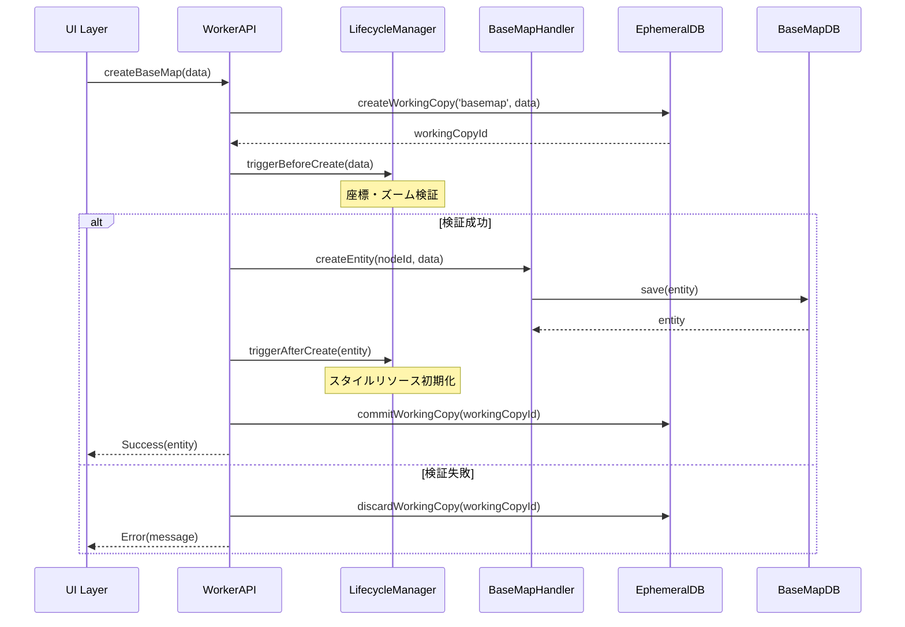

# BaseMap プラグイン仕様書

## 1. 概要

BaseMapプラグインは、MapLibre GL JSを使用した基本地図表示機能を提供します。複数の地図スタイル、カスタムスタイル、表示位置の保存・復元をサポートし、プロジェクトの基盤レイヤーとして機能します。

## 2. データモデル

### 2.1 BaseMapEntity

```typescript
export interface BaseMapEntity extends BaseEntity {
  nodeId: TreeNodeId;
  name: string;
  description?: string;
  
  // 地図スタイル設定
  mapStyle: 'streets' | 'satellite' | 'hybrid' | 'terrain' | 'custom';
  styleUrl?: string;        // カスタムスタイルURL
  styleConfig?: any;         // カスタムスタイルJSON
  
  // 表示位置設定
  center: [number, number];  // [経度, 緯度]
  zoom: number;              // ズームレベル (0-22)
  bearing: number;           // 方位角 (0-360)
  pitch: number;             // 傾斜角 (0-60)
  bounds?: [[number, number], [number, number]]; // 表示範囲
  
  // メタデータ
  createdAt: number;
  updatedAt: number;
  version: number;
}
```

### 2.2 BaseMapWorkingCopy

```typescript
export interface BaseMapWorkingCopy extends BaseWorkingCopy {
  nodeId: TreeNodeId;
  workingCopyId: string;
  workingCopyOf: TreeNodeId;
  
  // エンティティと同じフィールド
  name: string;
  description?: string;
  mapStyle: 'streets' | 'satellite' | 'hybrid' | 'terrain' | 'custom';
  styleUrl?: string;
  styleConfig?: any;
  center: [number, number];
  zoom: number;
  bearing: number;
  pitch: number;
  bounds?: [[number, number], [number, number]];
  
  // ワーキングコピー管理
  isDirty: boolean;
  copiedAt: number;
}
```

## 3. ライフサイクルフック

### 3.1 作成時のシーケンス



### 3.2 フック実装

```typescript
const baseMapLifecycle: NodeLifecycleHooks<BaseMapEntity, BaseMapWorkingCopy> = {
  // 作成前検証
  beforeCreate: async (_parentId: TreeNodeId, nodeData: Partial<BaseMapEntity>) => {
    // 座標検証
    if (nodeData.center) {
      const [lng, lat] = nodeData.center;
      if (lng < -180 || lng > 180 || lat < -90 || lat > 90) {
        throw new Error('Invalid coordinates');
      }
    }
    
    // ズームレベル検証
    if (nodeData.zoom !== undefined) {
      if (nodeData.zoom < 0 || nodeData.zoom > 22) {
        throw new Error('Invalid zoom level');
      }
    }
  },
  
  // 作成後初期化
  afterCreate: async (nodeId: TreeNodeId, entity: BaseMapEntity) => {
    console.log(`BaseMap created: ${nodeId}`);
    // 地図リソースの事前ロード等
  },
  
  // 削除前クリーンアップ
  beforeDelete: async (nodeId: TreeNodeId) => {
    // プロジェクトからの参照チェック
    const references = await checkReferences(nodeId);
    if (references.length > 0) {
      throw new Error(`Cannot delete: referenced by ${references.length} projects`);
    }
  },
  
  // 削除後処理
  afterDelete: async (nodeId: TreeNodeId) => {
    // キャッシュクリア等
    console.log(`BaseMap deleted: ${nodeId}`);
  }
};
```

## 4. UI コンポーネント

### 4.1 BaseMapView (表示用)

```tsx
import { useEffect, useRef } from 'react';
import maplibregl from 'maplibre-gl';
import { Box } from '@mui/material';

export function BaseMapView({ entity }: { entity: BaseMapEntity }) {
  const mapContainer = useRef<HTMLDivElement>(null);
  const map = useRef<maplibregl.Map | null>(null);
  
  useEffect(() => {
    if (!mapContainer.current) return;
    
    // 地図初期化
    map.current = new maplibregl.Map({
      container: mapContainer.current,
      style: getMapStyle(entity),
      center: entity.center,
      zoom: entity.zoom,
      bearing: entity.bearing,
      pitch: entity.pitch
    });
    
    return () => {
      map.current?.remove();
    };
  }, [entity]);
  
  return (
    <Box 
      ref={mapContainer} 
      sx={{ 
        width: '100%', 
        height: '100%',
        minHeight: 400 
      }} 
    />
  );
}

function getMapStyle(entity: BaseMapEntity): string | any {
  if (entity.mapStyle === 'custom') {
    return entity.styleUrl || entity.styleConfig;
  }
  
  // プリセットスタイルのURL
  const styleUrls = {
    streets: 'https://api.maptiler.com/maps/streets/style.json',
    satellite: 'https://api.maptiler.com/maps/satellite/style.json',
    hybrid: 'https://api.maptiler.com/maps/hybrid/style.json',
    terrain: 'https://api.maptiler.com/maps/terrain/style.json'
  };
  
  return styleUrls[entity.mapStyle];
}
```

### 4.2 BaseMapEditor (編集用)

```tsx
import { useState } from 'react';
import {
  Box,
  TextField,
  Select,
  MenuItem,
  FormControl,
  InputLabel,
  Button,
  Grid,
  Slider,
  Typography
} from '@mui/material';

export function BaseMapEditor({ 
  entity,
  onSave 
}: { 
  entity: BaseMapEntity;
  onSave: (data: Partial<BaseMapEntity>) => void;
}) {
  const [formData, setFormData] = useState({
    name: entity.name,
    description: entity.description || '',
    mapStyle: entity.mapStyle,
    center: entity.center,
    zoom: entity.zoom,
    bearing: entity.bearing,
    pitch: entity.pitch
  });
  
  const handleSubmit = () => {
    onSave(formData);
  };
  
  return (
    <Box sx={{ p: 3 }}>
      <Grid container spacing={3}>
        <Grid item xs={12}>
          <TextField
            fullWidth
            label="Name"
            value={formData.name}
            onChange={(e) => setFormData({ ...formData, name: e.target.value })}
          />
        </Grid>
        
        <Grid item xs={12}>
          <TextField
            fullWidth
            multiline
            rows={2}
            label="Description"
            value={formData.description}
            onChange={(e) => setFormData({ ...formData, description: e.target.value })}
          />
        </Grid>
        
        <Grid item xs={12} sm={6}>
          <FormControl fullWidth>
            <InputLabel>Map Style</InputLabel>
            <Select
              value={formData.mapStyle}
              onChange={(e) => setFormData({ ...formData, mapStyle: e.target.value as any })}
            >
              <MenuItem value="streets">Streets</MenuItem>
              <MenuItem value="satellite">Satellite</MenuItem>
              <MenuItem value="hybrid">Hybrid</MenuItem>
              <MenuItem value="terrain">Terrain</MenuItem>
              <MenuItem value="custom">Custom</MenuItem>
            </Select>
          </FormControl>
        </Grid>
        
        <Grid item xs={12} sm={6}>
          <Typography gutterBottom>Zoom Level: {formData.zoom}</Typography>
          <Slider
            value={formData.zoom}
            onChange={(_, value) => setFormData({ ...formData, zoom: value as number })}
            min={0}
            max={22}
            marks
          />
        </Grid>
        
        <Grid item xs={12} sm={6}>
          <TextField
            fullWidth
            label="Longitude"
            type="number"
            value={formData.center[0]}
            onChange={(e) => setFormData({
              ...formData,
              center: [parseFloat(e.target.value), formData.center[1]]
            })}
            inputProps={{ min: -180, max: 180, step: 0.001 }}
          />
        </Grid>
        
        <Grid item xs={12} sm={6}>
          <TextField
            fullWidth
            label="Latitude"
            type="number"
            value={formData.center[1]}
            onChange={(e) => setFormData({
              ...formData,
              center: [formData.center[0], parseFloat(e.target.value)]
            })}
            inputProps={{ min: -90, max: 90, step: 0.001 }}
          />
        </Grid>
        
        <Grid item xs={12}>
          <Button 
            variant="contained" 
            color="primary" 
            onClick={handleSubmit}
            fullWidth
          >
            Save Changes
          </Button>
        </Grid>
      </Grid>
    </Box>
  );
}
```

## 5. API 拡張

### 5.1 Worker API

```typescript
export const baseMapWorkerExtensions = {
  // マッププレビュー生成
  generateMapPreview: async (nodeId: TreeNodeId): Promise<string> => {
    const handler = new BaseMapHandler();
    const entity = await handler.getEntity(nodeId);
    if (!entity) throw new Error('Entity not found');
    
    // 静的マップAPIを使用してプレビュー生成
    const { center, zoom } = entity;
    return `https://api.mapbox.com/styles/v1/mapbox/streets-v11/static/${center[0]},${center[1]},${zoom}/300x200@2x`;
  },
  
  // スタイル検証
  validateMapStyle: async (style: string | any): Promise<boolean> => {
    if (typeof style === 'string') {
      // URLの検証
      return /^https?:\/\/.+\.json$/.test(style);
    }
    
    // JSONスタイルの検証
    return style && style.version && style.layers;
  },
  
  // 境界ボックス計算
  calculateBounds: async (center: [number, number], zoom: number): Promise<[[number, number], [number, number]]> => {
    // ズームレベルから表示範囲を計算
    const metersPerPixel = 156543.03392 * Math.cos(center[1] * Math.PI / 180) / Math.pow(2, zoom);
    const deltaLat = (metersPerPixel * 512) / 111111;
    const deltaLng = (metersPerPixel * 512) / (111111 * Math.cos(center[1] * Math.PI / 180));
    
    return [
      [center[0] - deltaLng, center[1] - deltaLat],
      [center[0] + deltaLng, center[1] + deltaLat]
    ];
  }
};
```

## 6. バリデーション

```typescript
export const baseMapValidation = {
  namePattern: /^[a-zA-Z0-9\s\-_]+$/,
  maxChildren: 0, // リーフノード
  
  customValidators: [
    {
      name: 'validCoordinates',
      validate: async (entity: BaseMapEntity) => {
        const [lng, lat] = entity.center;
        if (lng < -180 || lng > 180) {
          return 'Longitude must be between -180 and 180';
        }
        if (lat < -90 || lat > 90) {
          return 'Latitude must be between -90 and 90';
        }
        return true;
      }
    },
    {
      name: 'validZoom',
      validate: async (entity: BaseMapEntity) => {
        if (entity.zoom < 0 || entity.zoom > 22) {
          return 'Zoom level must be between 0 and 22';
        }
        return true;
      }
    },
    {
      name: 'validStyle',
      validate: async (entity: BaseMapEntity) => {
        const validStyles = ['streets', 'satellite', 'hybrid', 'terrain', 'custom'];
        if (!validStyles.includes(entity.mapStyle)) {
          return `Map style must be one of: ${validStyles.join(', ')}`;
        }
        
        if (entity.mapStyle === 'custom' && !entity.styleUrl && !entity.styleConfig) {
          return 'Custom style requires either styleUrl or styleConfig';
        }
        
        return true;
      }
    }
  ]
};
```

## 7. i18n 対応

### 7.1 翻訳ファイル構造

```json
// locales/en/core.json
{
  "menuItem": {
    "title": "Base Map",
    "tooltip": "Configure and manage map layers with various styles"
  },
  "dialog": {
    "title": "Create Base Map",
    "description": "Set up a new base map with your preferred style and location"
  },
  "panel": {
    "title": "Map Settings",
    "style": "Map Style",
    "center": "Center Position",
    "zoom": "Zoom Level",
    "bearing": "Bearing",
    "pitch": "Pitch"
  },
  "validation": {
    "invalidCoordinates": "Invalid coordinates",
    "invalidZoom": "Zoom level must be between 0 and 22",
    "invalidStyle": "Invalid map style"
  }
}
```

```json
// locales/ja/core.json
{
  "menuItem": {
    "title": "ベースマップ",
    "tooltip": "様々なスタイルで地図レイヤーを設定・管理"
  },
  "dialog": {
    "title": "ベースマップを作成",
    "description": "好みのスタイルと位置で新しいベースマップを設定"
  },
  "panel": {
    "title": "地図設定",
    "style": "地図スタイル",
    "center": "中心位置",
    "zoom": "ズームレベル",
    "bearing": "方位",
    "pitch": "傾斜"
  },
  "validation": {
    "invalidCoordinates": "無効な座標",
    "invalidZoom": "ズームレベルは0から22の間である必要があります",
    "invalidStyle": "無効な地図スタイル"
  }
}
```

## 8. テスト

### 8.1 単体テスト

```typescript
describe('BaseMapHandler', () => {
  let handler: BaseMapHandler;
  
  beforeEach(() => {
    handler = new BaseMapHandler();
  });
  
  it('should create entity with default values', async () => {
    const entity = await handler.createEntity('node-1');
    
    expect(entity.mapStyle).toBe('streets');
    expect(entity.center).toEqual([0, 0]);
    expect(entity.zoom).toBe(10);
  });
  
  it('should validate coordinates', async () => {
    const invalidData = {
      center: [200, 100] // Invalid longitude
    };
    
    await expect(
      handler.createEntity('node-1', invalidData)
    ).rejects.toThrow('Invalid coordinates');
  });
});
```

## 9. 使用例

```typescript
// プラグイン登録
import { PluginRegistry } from '@hierarchidb/worker/registry';
import { BaseMapDefinition } from '@hierarchidb/plugin-basemap';

const registry = PluginRegistry.getInstance();
registry.register(BaseMapDefinition);

// エンティティ作成
const workerAPI = await getWorkerAPI();
const entity = await workerAPI.createNode('basemap', {
  name: 'Tokyo Map',
  description: 'Map centered on Tokyo',
  mapStyle: 'streets',
  center: [139.6917, 35.6895],
  zoom: 11,
  bearing: 0,
  pitch: 0
});

// 地図表示
<BaseMapView entity={entity} />
```

## 10. トラブルシューティング

### 問題: 地図が表示されない
**解決策**: 
- MapLibre GL JSが正しくインポートされているか確認
- スタイルURLが有効か確認
- APIキーが必要な場合は設定されているか確認

### 問題: カスタムスタイルが適用されない
**解決策**:
- スタイルJSONの形式が正しいか検証
- CORSポリシーでブロックされていないか確認
- スタイルURLがHTTPSか確認

### 問題: パフォーマンスが低い
**解決策**:
- 不要なレイヤーを削除
- タイルキャッシュを有効化
- 適切なズームレベル範囲を設定