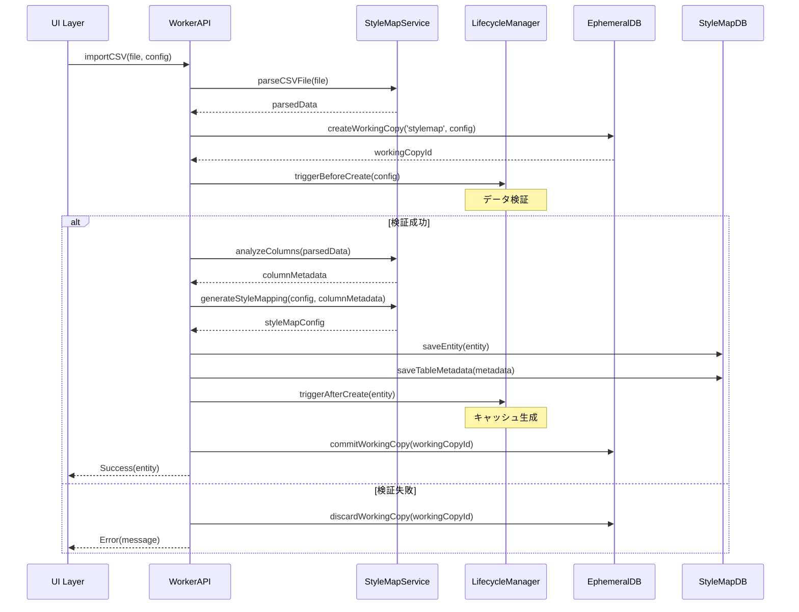

# StyleMap プラグイン仕様書

## 1. 概要

StyleMapプラグインは、CSVやTSVなどの表形式データを基に、地図上の要素に動的なスタイリングを適用する機能を提供します。データドリブンな可視化により、統計情報や属性に基づいた色分けやサイズ調整を実現します。

## 2. データモデル

### 2.1 StyleMapEntity

```typescript
export interface StyleMapEntity extends PeerEntity {
  nodeId: TreeNodeId;
  name: string;
  description?: string;
  
  // データソース設定
  filename?: string;                    // 元ファイル名
  tableMetadataId?: string;            // テーブルメタデータID
  keyColumn?: string;                   // マッピングキー列
  valueColumns?: string[];              // 値列（複数選択可能）
  
  // スタイル設定
  styleMapConfig?: StyleMapConfig;      // スタイルマッピング設定
  filterRules?: FilterRule[];           // フィルタルール
  keyValueMappings?: KeyValueMapping[]; // キー値変換マッピング
  
  // パフォーマンス
  cacheKey?: string;                    // キャッシュキー
  lastProcessed?: number;               // 最終処理時刻
  
  // メタデータ
  createdAt: number;
  updatedAt: number;
  version: number;
}

export interface StyleMapConfig {
  type: 'categorical' | 'numerical' | 'gradient';
  colorRules?: ColorRule[];            // 値ベースのカラールール
  defaultColors?: {                    // デフォルトカラー設定
    text?: string;
    background?: string;
    border?: string;
  };
  useGradient?: boolean;               // グラデーション使用
  showLegend?: boolean;                // 凡例表示
  opacity?: number;                     // 透明度
}

export interface FilterRule {
  id: string;
  column: string;
  operator: 'equals' | 'not_equals' | 'contains' | 'not_contains' | 'starts_with' | 'ends_with';
  value: string;
  enabled: boolean;
}

export interface KeyValueMapping {
  key: string;
  value: string;
  label?: string;
}

export interface ColorRule {
  id: string;
  value: string;
  color: string;
  backgroundColor?: string;
  borderColor?: string;
  enabled: boolean;
}
```

### 2.2 StyleMapWorkingCopy

```typescript
export interface StyleMapWorkingCopy extends BaseWorkingCopy {
  nodeId: TreeNodeId;
  workingCopyId: string;
  workingCopyOf: TreeNodeId;
  
  // エンティティと同じフィールド
  name: string;
  description?: string;
  filename?: string;
  tableMetadataId?: string;
  keyColumn?: string;
  valueColumns?: string[];
  styleMapConfig?: StyleMapConfig;
  filterRules?: FilterRule[];
  keyValueMappings?: KeyValueMapping[];
  
  // ワーキングコピー管理
  isDirty: boolean;
  copiedAt: number;
  
  // 編集中の一時データ
  previewData?: any[];
  validationErrors?: string[];
}
```

## 3. ライフサイクルフック

### 3.1 データインポート時のシーケンス



### 3.2 フック実装

```typescript
const styleMapLifecycle: NodeLifecycleHooks<StyleMapEntity, StyleMapWorkingCopy> = {
  // インポート前検証
  beforeCreate: async (_parentId: TreeNodeId, nodeData: Partial<StyleMapEntity>) => {
    // ファイル形式検証
    if (nodeData.filename) {
      const validExtensions = ['.csv', '.tsv', '.xlsx', '.xls'];
      const ext = nodeData.filename.toLowerCase().match(/\.[^.]+$/)?.[0];
      
      if (!ext || !validExtensions.includes(ext)) {
        throw new Error(`Unsupported file format: ${ext}`);
      }
    }
    
    // 列マッピング検証
    if (nodeData.keyColumn && nodeData.valueColumns?.includes(nodeData.keyColumn)) {
      throw new Error('Key column cannot be selected as value column');
    }
  },
  
  // インポート後処理
  afterCreate: async (nodeId: TreeNodeId, entity: StyleMapEntity) => {
    // スタイルキャッシュ生成
    if (entity.styleMapConfig) {
      await generateStyleCache(nodeId, entity.styleMapConfig);
    }
    
    console.log(`StyleMap created: ${nodeId} - ${entity.filename}`);
  },
  
  // 更新前検証
  beforeUpdate: async (nodeId: TreeNodeId, changes: Partial<StyleMapEntity>) => {
    // スタイル設定の整合性チェック
    if (changes.styleMapConfig) {
      const validation = validateStyleMapConfig(changes.styleMapConfig);
      if (!validation.isValid) {
        throw new Error(`Invalid style configuration: ${validation.errors.join(', ')}`);
      }
    }
  },
  
  // 更新後処理
  afterUpdate: async (nodeId: TreeNodeId, entity: StyleMapEntity) => {
    // キャッシュ無効化
    if (entity.cacheKey) {
      await invalidateCache(entity.cacheKey);
    }
    
    // 再生成
    await generateStyleCache(nodeId, entity.styleMapConfig);
  },
  
  // 削除前クリーンアップ
  beforeDelete: async (nodeId: TreeNodeId) => {
    // 関連データの削除準備
    const entity = await getEntity(nodeId);
    if (entity?.tableMetadataId) {
      await markTableMetadataForDeletion(entity.tableMetadataId);
    }
  },
  
  // コミット前検証
  beforeCommit: async (nodeId: TreeNodeId, workingCopy: StyleMapWorkingCopy) => {
    // 必須フィールドチェック
    if (!workingCopy.keyColumn) {
      throw new Error('Key column is required');
    }
    
    // スタイル設定の完全性チェック
    if (!workingCopy.styleMapConfig) {
      throw new Error('Style configuration is required');
    }
  }
};
```

## 4. UI コンポーネント - 6ステップ構成

### 4.1 StyleMapImporter (6ステップウィザード)

StyleMapImporterは、元の実装と同様の6ステップ構成で実装されています：

#### ステップ構成

1. **Step1NameDescription** - 名前と説明の入力
   - StyleMapの基本情報（名前、説明）を入力
   - 必須項目のバリデーション

2. **Step2FileUpload** - ファイルアップロードとデータ読み込み
   - CSV/TSVファイルのドラッグ&ドロップまたは選択
   - URLからのファイル読み込み対応
   - データプレビュー（最初の5行を表示）
   - ファイルエラーハンドリング

3. **Step3FilterSettings** - フィルタルールの設定
   - データフィルタリングルールの定義
   - 複数の条件演算子対応（equals, contains, starts_with等）
   - フィルタ結果のリアルタイム統計表示
   - ルールの有効/無効切り替え

4. **Step4ColumnSelection** - キー列と値列の選択、マッピング設定
   - キー列の選択（単一選択）
   - 値列の複数選択（チップUIで選択）
   - キー値マッピングの定義（元の値を別の値やラベルに変換）
   - マッピングテーブルでの編集

5. **Step5ColorSettings** - カラールール設定
   - デフォルトカラーの設定（テキスト、背景、ボーダー）
   - 値ベースのカラールール定義
   - カラーピッカーによる直感的な色選択
   - グラデーション、透明度、凡例表示などの高度な設定

6. **Step6Preview** - プレビューと最終確認
   - 設定のサマリー表示
   - フィルタ適用後のデータプレビュー（最初の10行）
   - スタイル適用結果の視覚的確認
   - データ統計情報の表示

```tsx
import { useState, useCallback } from 'react';
import {
  Box,
  Stepper,
  Step,
  StepLabel,
  Button,
  Paper
} from '@mui/material';

// 各ステップコンポーネントのインポート
import { Step1NameDescription } from './steps/Step1NameDescription';
import { Step2FileUpload } from './steps/Step2FileUpload';
import { Step3FilterSettings } from './steps/Step3FilterSettings';
import { Step4ColumnSelection } from './steps/Step4ColumnSelection';
import { Step5ColorSettings } from './steps/Step5ColorSettings';
import { Step6Preview } from './steps/Step6Preview';

export function StyleMapImporter({ onImport }: { onImport: (data: any) => void }) {
  const [activeStep, setActiveStep] = useState(0);
  
  // ステップごとのデータ管理
  const [formData, setFormData] = useState({
    // Step 1
    name: '',
    description: '',
    
    // Step 2
    filename: '',
    columns: [],
    tableRows: [],
    
    // Step 3
    filterRules: [],
    
    // Step 4
    selectedKeyColumn: '',
    selectedValueColumns: [],
    keyValueMappings: [],
    
    // Step 5
    styleMapConfig: {
      type: 'categorical',
      colorRules: [],
      defaultColors: {
        text: '#000000',
        background: '#ffffff',
        border: '#cccccc'
      }
    }
  });
  
  const steps = [
    'Name & Description',
    'Upload File',
    'Filter Settings',
    'Column Selection',
    'Color Settings',
    'PreviewStep & Confirm'
  ];
  
  const handleNext = () => {
    setActiveStep((prevStep) => prevStep + 1);
  };
  
  const handleBack = () => {
    setActiveStep((prevStep) => prevStep - 1);
  };
  
  const handleImport = () => {
    onImport(formData);
  };
  
  // ステップごとのバリデーション
  const isStepValid = useCallback(() => {
    switch (activeStep) {
      case 0:
        return formData.name.trim().length > 0;
      case 1:
        return formData.columns.length > 0 && formData.tableRows.length > 0;
      case 2:
        return true; // フィルタは任意
      case 3:
        return formData.selectedKeyColumn !== '';
      case 4:
        return true; // カラー設定は任意
      case 5:
        return true; // プレビューは常に有効
      default:
        return false;
    }
  }, [activeStep, formData]);
  
  const renderStepContent = () => {
    switch (activeStep) {
      case 0:
        return (
          <Step1NameDescription
            name={formData.name}
            description={formData.description}
            onNameChange={(name) => setFormData({ ...formData, name })}
            onDescriptionChange={(description) => setFormData({ ...formData, description })}
            onValidationChange={() => {}}
          />
        );
      
      case 1:
        return (
          <Step2FileUpload
            filename={formData.filename}
            columns={formData.columns}
            tableRows={formData.tableRows}
            onFileSelect={async (file) => {
              // ファイル解析処理
              const parsedData = await parseFile(file);
              setFormData({
                ...formData,
                filename: file.name,
                columns: parsedData.columns,
                tableRows: parsedData.rows
              });
            }}
          />
        );
      
      case 2:
        return (
          <Step3FilterSettings
            columns={formData.columns}
            filterRules={formData.filterRules}
            onFilterRulesChange={(rules) => setFormData({ ...formData, filterRules: rules })}
            tableRows={formData.tableRows}
          />
        );
      
      case 3:
        return (
          <Step4ColumnSelection
            columns={formData.columns}
            selectedKeyColumn={formData.selectedKeyColumn}
            selectedValueColumns={formData.selectedValueColumns}
            keyValueMappings={formData.keyValueMappings}
            onKeyColumnChange={(column) => setFormData({ ...formData, selectedKeyColumn: column })}
            onValueColumnsChange={(columns) => setFormData({ ...formData, selectedValueColumns: columns })}
            onKeyValueMappingsChange={(mappings) => setFormData({ ...formData, keyValueMappings: mappings })}
            tableRows={formData.tableRows}
          />
        );
      
      case 4:
        return (
          <Step5ColorSettings
            styleMapConfig={formData.styleMapConfig}
            onConfigChange={(config) => setFormData({ ...formData, styleMapConfig: config })}
            uniqueValues={getUniqueValues(formData.tableRows, formData.selectedKeyColumn)}
          />
        );
      
      case 5:
        return (
          <Step6Preview
            name={formData.name}
            description={formData.description}
            filename={formData.filename}
            columns={formData.columns}
            selectedKeyColumn={formData.selectedKeyColumn}
            selectedValueColumns={formData.selectedValueColumns}
            filterRules={formData.filterRules}
            styleMapConfig={formData.styleMapConfig}
            tableRows={formData.tableRows}
            keyValueMappings={formData.keyValueMappings}
          />
        );
      
      default:
        return null;
    }
  };
  
  return (
    <Box sx={{ width: '100%' }}>
      <Stepper activeStep={activeStep} sx={{ mb: 4 }}>
        {steps.map((label) => (
          <Step key={label}>
            <StepLabel>{label}</StepLabel>
          </Step>
        ))}
      </Stepper>
      
      <Paper sx={{ p: 3, minHeight: 400 }}>
        {renderStepContent()}
      </Paper>
      
      <Box sx={{ display: 'flex', justifyContent: 'space-between', mt: 3 }}>
        <Button
          disabled={activeStep === 0}
          onClick={handleBack}
        >
          Back
        </Button>
        
        <Button
          variant="contained"
          onClick={activeStep === steps.length - 1 ? handleImport : handleNext}
          disabled={!isStepValid()}
        >
          {activeStep === steps.length - 1 ? 'Import' : 'Next'}
        </Button>
      </Box>
    </Box>
  );
}
```

### 4.2 各ステップの詳細機能

#### Step1NameDescription
- 必須項目バリデーション
- リアルタイムエラー表示
- 説明フィールドは任意（複数行対応）

#### Step2FileUpload
- ドラッグ&ドロップ対応
- URL入力によるリモートファイル読み込み
- CSV/TSV自動判別
- データプレビューテーブル
- エラーハンドリング（ファイル形式、読み込みエラー）

#### Step3FilterSettings
- 複数フィルタルールの追加/削除
- 演算子選択（equals, not_equals, contains, not_contains, starts_with, ends_with）
- フィルタ有効/無効の切り替え
- フィルタ適用結果のリアルタイム表示（X件中Y件）

#### Step4ColumnSelection
- アコーディオンUIによる整理された表示
- キー列の単一選択
- 値列の複数選択（チップUI）
- キー値マッピングテーブル（元の値→新しい値→ラベル）
- ユニーク値の自動検出と表示

#### Step5ColorSettings
- デフォルトカラー設定パネル
- 値ベースカラールール（値ごとに色を設定）
- カラーピッカーとHEXコード入力の両対応
- 高度な設定（グラデーション、透明度、凡例表示）
- カラープレビュー表示

#### Step6Preview
- 設定サマリーの表示
- データ統計（総行数、フィルタ後行数）
- フィルタルールの一覧表示
- カラールール適用のプレビュー
- 最終データテーブル（スタイル適用済み）

## 5. API 拡張

### 5.1 Worker API

```typescript
export const styleMapWorkerExtensions = {
  // CSVファイル解析
  parseDataFile: async (file: File): Promise<ParsedData> => {
    const content = await file.text();
    const delimiter = file.name.endsWith('.tsv') ? '\t' : ',';
    
    return parseCSV(content, {
      delimiter,
      header: true,
      dynamicTyping: true,
      skipEmptyLines: true
    });
  },
  
  // カラム分析
  analyzeColumns: async (data: any[]): Promise<ColumnMetadata[]> => {
    const columns = Object.keys(data[0] || {});
    
    return columns.map(column => {
      const values = data.map(row => row[column]);
      const uniqueValues = new Set(values);
      
      return {
        name: column,
        type: detectColumnType(values),
        uniqueCount: uniqueValues.size,
        nullCount: values.filter(v => v == null).length,
        min: Math.min(...values.filter(v => typeof v === 'number')),
        max: Math.max(...values.filter(v => typeof v === 'number')),
        samples: Array.from(uniqueValues).slice(0, 10)
      };
    });
  },
  
  // フィルタ適用
  applyFilters: async (
    data: any[],
    rules: FilterRule[]
  ): Promise<FilterResult> => {
    let filtered = [...data];
    
    for (const rule of rules.filter(r => r.enabled)) {
      filtered = applyFilterRule(filtered, rule);
    }
    
    return {
      data: filtered,
      stats: {
        originalCount: data.length,
        filteredCount: filtered.length,
        matchRate: filtered.length / data.length
      }
    };
  },
  
  // スタイルキャッシュ生成
  generateStyleCache: async (
    nodeId: TreeNodeId,
    config: StyleMapConfig
  ): Promise<string> => {
    const cacheKey = `style_${nodeId}_${Date.now()}`;
    const cache = new Map();
    
    for (const rule of config.colorRules || []) {
      if (rule.enabled) {
        cache.set(rule.value, {
          color: rule.color,
          backgroundColor: rule.backgroundColor,
          borderColor: rule.borderColor
        });
      }
    }
    
    // IndexedDBに保存
    await saveCache(cacheKey, cache);
    
    return cacheKey;
  }
};
```

## 6. データベース最適化

```typescript
export class StyleMapDatabase extends Dexie {
  entities!: Table<StyleMapEntity>;
  workingCopies!: Table<StyleMapWorkingCopy>;
  tableMetadata!: Table<TableMetadata>;
  styleCache!: Table<StyleCache>;
  
  constructor() {
    super('StyleMapDB');
    
    this.version(3).stores({
      entities: 'nodeId, filename, keyColumn, cacheKey, updatedAt',
      workingCopies: 'workingCopyId, nodeId, workingCopyOf',
      tableMetadata: '&id, entityId, checksum',
      styleCache: '&key, entityId, createdAt'
    });
    
    // インデックス最適化
    this.entities.hook('creating', function(primKey, obj) {
      obj.createdAt = Date.now();
      obj.updatedAt = Date.now();
    });
    
    this.entities.hook('updating', function(modifications) {
      modifications.updatedAt = Date.now();
    });
  }
  
  // パフォーマンス最適化メソッド
  async getEntityWithCache(nodeId: TreeNodeId): Promise<StyleMapEntity | undefined> {
    const entity = await this.entities.get(nodeId);
    
    if (entity?.cacheKey) {
      // キャッシュをプリロード
      entity.cache = await this.styleCache.get(entity.cacheKey);
    }
    
    return entity;
  }
  
  async cleanupOldCache(daysToKeep: number = 7): Promise<number> {
    const cutoff = Date.now() - (daysToKeep * 24 * 60 * 60 * 1000);
    
    const oldCaches = await this.styleCache
      .where('createdAt')
      .below(cutoff)
      .toArray();
    
    await this.styleCache.bulkDelete(oldCaches.map(c => c.key));
    
    return oldCaches.length;
  }
}
```

## 7. バリデーション

```typescript
export const styleMapValidation = {
  namePattern: /^[a-zA-Z0-9\s\-_\.]+$/,
  maxChildren: 0,
  
  customValidators: [
    {
      name: 'validFileFormat',
      validate: async (entity: StyleMapEntity) => {
        if (!entity.filename) return true;
        
        const supportedFormats = /\.(csv|tsv|xlsx|xls)$/i;
        if (!supportedFormats.test(entity.filename)) {
          return 'File must be CSV, TSV, or Excel format';
        }
        return true;
      }
    },
    {
      name: 'validColumnMapping',
      validate: async (entity: StyleMapEntity) => {
        if (!entity.keyColumn) return true;
        
        if (entity.valueColumns?.includes(entity.keyColumn)) {
          return 'Key column cannot be selected as value column';
        }
        
        // テーブルメタデータから列の存在を確認
        if (entity.tableMetadataId) {
          const metadata = await getTableMetadata(entity.tableMetadataId);
          const columns = metadata?.columns || [];
          
          if (!columns.includes(entity.keyColumn)) {
            return `Key column "${entity.keyColumn}" not found`;
          }
          
          for (const valueCol of entity.valueColumns || []) {
            if (!columns.includes(valueCol)) {
              return `Value column "${valueCol}" not found`;
            }
          }
        }
        
        return true;
      }
    },
    {
      name: 'validStyleConfiguration',
      validate: async (entity: StyleMapEntity) => {
        if (!entity.styleMapConfig) return true;
        
        const { type, colorRules } = entity.styleMapConfig;
        
        if (!['categorical', 'numerical', 'gradient'].includes(type)) {
          return 'Invalid style type';
        }
        
        // カラールールのバリデーション
        if (colorRules) {
          for (const rule of colorRules) {
            if (rule.enabled && !rule.color) {
              return 'Each enabled color rule must have a color';
            }
          }
        }
        
        return true;
      }
    }
  ]
};
```

## 8. i18n 対応

```json
// locales/en/core.json
{
  "menuItem": {
    "title": "Style Map",
    "tooltip": "Define and manage CSV-based styling rules for map visualization"
  },
  "dialog": {
    "title": "Import Style Data",
    "description": "Upload CSV/TSV data to create dynamic map styles"
  },
  "steps": {
    "nameDescription": {
      "title": "StyleMap Information",
      "description": "Enter a name and description for your StyleMap configuration",
      "nameLabel": "Name",
      "descriptionLabel": "Description",
      "nameRequired": "Name is required"
    },
    "fileUpload": {
      "title": "Upload Data File",
      "description": "Upload a CSV or TSV file containing your style mapping data",
      "chooseFile": "Choose File",
      "orUrl": "Or enter file URL...",
      "loadUrl": "Load URL",
      "dataPreview": "Data PreviewStep"
    },
    "filterSettings": {
      "title": "Filter Settings",
      "description": "Configure filter rules to include or exclude specific data rows",
      "addRule": "Add Filter Rule",
      "activeFilters": "Active Filters",
      "noFilters": "No filter rules configured"
    },
    "columnSelection": {
      "title": "Column Selection & Mapping",
      "description": "Select key and value columns, and optionally define custom key-value mappings",
      "keyColumn": "Key Column",
      "valueColumns": "Value Columns",
      "keyValueMappings": "Key-Value Mappings",
      "addMapping": "Add Mapping"
    },
    "colorSettings": {
      "title": "Color Settings",
      "description": "Configure colors and styles for your data visualization",
      "defaultColors": "Default Colors",
      "valueBasedColors": "Value-based Colors",
      "advancedSettings": "Advanced Settings",
      "addColorRule": "Add Color Rule"
    },
    "preview": {
      "title": "PreviewStep & Summary",
      "description": "Review your StyleMap configuration before saving",
      "configSummary": "Configuration Summary",
      "dataConfig": "Data Configuration",
      "dataSummary": "Data Summary",
      "dataPreview": "Data PreviewStep (First 10 Rows)"
    }
  },
  "validation": {
    "unsupportedFormat": "Unsupported file format",
    "columnRequired": "Key column is required",
    "duplicateColumn": "Key column cannot be selected as value column",
    "styleRequired": "Style configuration is required"
  }
}
```

## 9. 使用例

```typescript
// CSVインポートとスタイルマップ作成（6ステップウィザード使用）
const workerAPI = await getWorkerAPI();

// Step 1: 基本情報
const basicInfo = {
  name: 'Population Style Map',
  description: 'Style map based on population density data'
};

// Step 2: ファイルアップロード
const file = new File(['id,population,density\n1,1000,50\n2,2000,100'], 'data.csv');
const parsedData = await workerAPI.parseDataFile(file);

// Step 3: フィルタ設定
const filterRules = [
  {
    id: '1',
    column: 'population',
    operator: 'greater_than',
    value: '500',
    enabled: true
  }
];

// Step 4: 列選択とマッピング
const columnConfig = {
  keyColumn: 'id',
  valueColumns: ['population', 'density'],
  keyValueMappings: [
    { key: '1', value: 'region_1', label: 'Region 1' },
    { key: '2', value: 'region_2', label: 'Region 2' }
  ]
};

// Step 5: カラー設定
const styleConfig = {
  type: 'categorical',
  colorRules: [
    {
      id: '1',
      value: 'region_1',
      color: '#000000',
      backgroundColor: '#ffeb3b',
      borderColor: '#f57c00',
      enabled: true
    },
    {
      id: '2',
      value: 'region_2',
      color: '#ffffff',
      backgroundColor: '#f44336',
      borderColor: '#c62828',
      enabled: true
    }
  ],
  defaultColors: {
    text: '#000000',
    background: '#e0e0e0',
    border: '#9e9e9e'
  },
  useGradient: false,
  showLegend: true,
  opacity: 0.8
};

// Step 6: プレビューと作成
const entity = await workerAPI.createNode('stylemap', {
  ...basicInfo,
  filename: 'data.csv',
  ...columnConfig,
  filterRules,
  styleMapConfig: styleConfig
});

// スタイル適用
const style = await workerAPI.getStyleForValue(entity.nodeId, 'region_1');
```

## 10. トラブルシューティング

### 問題: CSVインポートが失敗する
**解決策**:
- ファイルエンコーディングがUTF-8か確認
- 区切り文字が正しいか確認（CSV: カンマ、TSV: タブ）
- ヘッダー行が存在するか確認
- ファイルサイズが制限内か確認

### 問題: フィルタが期待通りに動作しない
**解決策**:
- フィルタルールが有効になっているか確認
- 演算子と値の組み合わせが正しいか確認
- 列名が正確に一致しているか確認
- 大文字小文字の区別を確認

### 問題: スタイルが適用されない
**解決策**:
- キー列の値が一致しているか確認
- カラールールが有効になっているか確認
- キー値マッピングが正しく設定されているか確認
- キャッシュをクリアして再生成

### 問題: パフォーマンスが低い
**解決策**:
- 大規模データの場合はフィルタを使用してデータ量を削減
- 不要な値列の選択を解除
- キャッシュの有効期限を調整
- インデックスを適切に設定