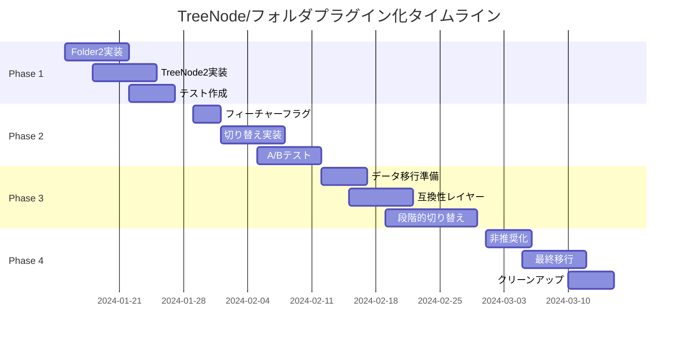

# TreeNodeとフォルダのプラグイン化移行計画

## 1. 背景と目的

### 1.1 現状の課題

現在のHierarchiDBシステムでは、TreeNodeとフォルダ機能がコアシステムに密結合されており、以下の課題があります：

- **拡張性の制限**: フォルダの挙動を変更するには、コアシステムの修正が必要
- **テストの複雑性**: フォルダ機能のテストがシステム全体のテストと分離困難
- **アイコンや説明の硬直性**: TreeNodeのアイコンや説明文がハードコードされている
- **ライフサイクル管理の不統一**: プラグインと異なるライフサイクル管理メカニズム

### 1.2 提案の目的

TreeNodeとフォルダ機能をプラグインアーキテクチャに移行することで：

1. **統一されたアーキテクチャ**: すべてのノードタイプが同じプラグインシステムで動作
2. **カスタマイズ性の向上**: フォルダのアイコン、説明、挙動を簡単にカスタマイズ可能
3. **保守性の向上**: フォルダ機能をコアから分離し、独立してテスト・更新可能
4. **拡張性の確保**: 異なるタイプのフォルダ（スマートフォルダ、仮想フォルダなど）を追加可能

## 2. 現状の実装分析

### 2.1 既存のTreeNode実装

```typescript
// 現在のTreeNodeEntityの構造（推定）
interface TreeNodeEntity {
  treeNodeId: TreeNodeId;
  treeId: TreeId;
  parentId: TreeNodeId | null;
  nodeType: TreeNodeType;
  name: string;
  order: number;
  createdAt: Timestamp;
  updatedAt: Timestamp;
  deletedAt?: Timestamp;
}
```

### 2.2 既存のフォルダ実装

現在、`packages/plugins/folder`にフォルダプラグインの基礎実装が存在：

- `FolderUIPlugin.tsx`: UIプラグインの定義
- `FolderCreateDialog.tsx`: フォルダ作成ダイアログ
- `FolderEditDialog.tsx`: フォルダ編集ダイアログ
- `FolderIcon.tsx`: フォルダアイコンコンポーネント

しかし、Worker層の実装（EntityHandler、ライフサイクルフック、データベース定義）が不足している可能性があります。

## 3. プラグイン化の設計

### 3.1 FolderPluginDefinition

```typescript
import type { 
  UnifiedPluginDefinition, 
  IconDefinition,
  NodeLifecycleHooks 
} from '@hierarchidb/worker/registry';

// フォルダアイコン定義
const folderIcon: IconDefinition = {
  muiIconName: 'Folder',
  emoji: '📁',
  svg: `<svg viewBox="0 0 24 24" fill="currentColor">
    <path d="M10 4H4c-1.11 0-2 .89-2 2v12c0 1.11.89 2 2 2h16c1.11 0 2-.89 2-2V8c0-1.11-.89-2-2-2h-8l-2-2z"/>
  </svg>`,
  description: 'フォルダ - 他のノードを整理・グループ化するためのコンテナ',
  color: '#ffa726'
};

// フォルダエンティティ定義
interface FolderEntity extends BaseEntity {
  nodeId: TreeNodeId;
  name: string;
  description?: string;
  icon?: IconDefinition;  // カスタムアイコン
  color?: string;         // フォルダの色
  metadata?: {
    isExpanded?: boolean;
    sortOrder?: 'name' | 'created' | 'modified' | 'custom';
    viewMode?: 'list' | 'grid' | 'tree';
  };
  createdAt: number;
  updatedAt: number;
}

// フォルダライフサイクルフック
const folderLifecycle: NodeLifecycleHooks<FolderEntity, FolderWorkingCopy> = {
  beforeCreate: async (parentId, nodeData) => {
    // フォルダ名の検証
    if (!nodeData.name || nodeData.name.trim().length === 0) {
      throw new Error('フォルダ名は必須です');
    }
    
    // 同じ親の下に同名フォルダがないか確認
    // （実装省略）
  },
  
  afterCreate: async (nodeId, entity) => {
    console.log(`フォルダ作成: ${entity.name}`);
  },
  
  beforeDelete: async (nodeId) => {
    // 子ノードの存在確認
    const hasChildren = await checkHasChildren(nodeId);
    if (hasChildren) {
      throw new Error('空でないフォルダは削除できません');
    }
  },
  
  // 他のライフサイクルフック...
};
```

### 3.2 TreeNode2プラグイン（実験的実装）

既存のTreeNode実装と並行して動作する実験的実装：

```typescript
// TreeNode2: プラグインベースの実装
export const TreeNode2Definition: UnifiedPluginDefinition<
  TreeNode2Entity,
  never,
  TreeNode2WorkingCopy
> = {
  nodeType: 'treenode2',
  name: 'TreeNode2',
  displayName: 'ツリーノード（v2）',
  icon: treeNodeIcon,
  
  database: {
    dbName: 'TreeNode2DB',
    tableName: 'nodes',
    schema: 'nodeId, parentId, name, nodeType, order, createdAt, updatedAt',
    version: 1
  },
  
  entityHandler: new TreeNode2Handler(),
  lifecycle: treeNode2Lifecycle,
  
  // TreeNode特有の機能
  capabilities: {
    isContainer: true,      // 他のノードを含むことができる
    isRoot: false,          // ルートノードになれる
    canHaveMultipleTypes: true,  // 複数の子ノードタイプを持てる
  },
  
  // 階層管理API
  api: {
    workerExtensions: {
      // 子ノード管理
      getChildren: async (nodeId: TreeNodeId): Promise<TreeNode2Entity[]> => {
        // 実装
      },
      
      // 親ノード取得
      getParent: async (nodeId: TreeNodeId): Promise<TreeNode2Entity | null> => {
        // 実装
      },
      
      // パス取得
      getPath: async (nodeId: TreeNodeId): Promise<TreeNode2Entity[]> => {
        // 実装
      },
      
      // ツリー移動
      moveNode: async (nodeId: TreeNodeId, newParentId: TreeNodeId): Promise<void> => {
        // 実装
      }
    }
  }
};
```

## 4. 段階的移行計画

### Phase 1: 並行実装（1-2週間）

1. **Folder2プラグインの実装**
   - 完全なプラグイン定義の作成
   - EntityHandlerの実装
   - データベーススキーマの定義
   - ライフサイクルフックの実装
   - UIコンポーネントの実装

2. **TreeNode2プラグインの実装**
   - コアTreeNode機能のプラグイン化
   - 階層管理機能の実装
   - 既存APIとの互換性レイヤー

3. **テスト環境での検証**
   - 単体テストの作成
   - 統合テストの実装
   - パフォーマンステスト

### Phase 2: 実験的導入（2-3週間）

1. **フィーチャーフラグの導入**
   ```typescript
   const FEATURE_FLAGS = {
     USE_PLUGIN_FOLDERS: process.env.USE_PLUGIN_FOLDERS === 'true',
     USE_PLUGIN_TREENODES: process.env.USE_PLUGIN_TREENODES === 'true'
   };
   ```

2. **切り替え可能な実装**
   ```typescript
   function getFolderHandler() {
     if (FEATURE_FLAGS.USE_PLUGIN_FOLDERS) {
       return new Folder2Handler();
     }
     return new LegacyFolderHandler();
   }
   ```

3. **A/Bテスト環境**
   - 開発環境で新実装を使用
   - 本番環境は既存実装を維持

### Phase 3: 段階的移行（3-4週間）

1. **データマイグレーション**
   ```typescript
   // マイグレーションスクリプト
   async function migrateFoldersToPlugin() {
     const legacyFolders = await getLegacyFolders();
     
     for (const folder of legacyFolders) {
       await createFolder2Entity({
         nodeId: folder.treeNodeId,
         name: folder.name,
         // マッピング...
       });
     }
   }
   ```

2. **互換性レイヤーの実装**
   - 既存APIのプロキシ実装
   - 後方互換性の確保

3. **段階的切り替え**
   - 新規作成はプラグイン版を使用
   - 既存データは段階的に移行

### Phase 4: 完全移行（2-3週間）

1. **既存実装の非推奨化**
   - deprecation警告の追加
   - ドキュメントの更新

2. **最終移行**
   - すべてのデータを新実装に移行
   - 既存実装の削除準備

3. **クリーンアップ**
   - 不要なコードの削除
   - ドキュメントの最終更新

## 5. 実装詳細

### 5.1 Folder2Handler実装

```typescript
import type { EntityHandler } from '@hierarchidb/worker/registry';
import { Folder2Database } from '../database/Folder2Database';

export class Folder2Handler implements EntityHandler<
  FolderEntity,
  never,
  FolderWorkingCopy
> {
  private db: Folder2Database;
  
  constructor() {
    this.db = new Folder2Database();
  }
  
  async createEntity(
    nodeId: TreeNodeId, 
    data?: Partial<FolderEntity>
  ): Promise<FolderEntity> {
    const entity: FolderEntity = {
      nodeId,
      name: data?.name || 'New Folder',
      description: data?.description,
      icon: data?.icon || getDefaultFolderIcon(),
      color: data?.color || '#ffa726',
      metadata: {
        isExpanded: false,
        sortOrder: 'name',
        viewMode: 'list',
        ...data?.metadata
      },
      createdAt: Date.now(),
      updatedAt: Date.now()
    };
    
    await this.db.entities.add(entity);
    return entity;
  }
  
  async getEntity(nodeId: TreeNodeId): Promise<FolderEntity | undefined> {
    return await this.db.entities.get(nodeId);
  }
  
  async updateEntity(
    nodeId: TreeNodeId, 
    data: Partial<FolderEntity>
  ): Promise<void> {
    await this.db.entities.update(nodeId, {
      ...data,
      updatedAt: Date.now()
    });
  }
  
  async deleteEntity(nodeId: TreeNodeId): Promise<void> {
    await this.db.entities.delete(nodeId);
  }
  
  // WorkingCopy関連のメソッド
  async createWorkingCopy(nodeId: TreeNodeId): Promise<FolderWorkingCopy> {
    const entity = await this.getEntity(nodeId);
    if (!entity) {
      throw new Error(`Folder not found: ${nodeId}`);
    }
    
    const workingCopy: FolderWorkingCopy = {
      ...entity,
      workingCopyId: crypto.randomUUID(),
      workingCopyOf: nodeId,
      isDirty: false,
      copiedAt: Date.now()
    };
    
    await this.db.workingCopies.add(workingCopy);
    return workingCopy;
  }
  
  // 他のメソッド...
}
```

### 5.2 UIコンポーネントの拡張

```typescript
// SpeedDialでのフォルダアイコン使用
import { SpeedDial, SpeedDialAction } from '@mui/material';
import { PluginIcon } from '@hierarchidb/ui-core';

export function TreeConsoleSpeedDialDeprecated({ plugins }) {
  return (
    <SpeedDial
      ariaLabel="Create new node"
      icon={<Add />}
    >
      {plugins.map(plugin => (
        <SpeedDialAction
          key={plugin.nodeType}
          icon={<PluginIcon definition={plugin.icon} />}
          tooltipTitle={`Create ${plugin.displayName}`}
          onClick={() => handleCreate(plugin.nodeType)}
        />
      ))}
    </SpeedDial>
  );
}

// メニューでのフォルダアイコン使用
import { Menu, MenuItem, ListItemIcon, ListItemText } from '@mui/material';

export function NodeTypeMenu({ plugins, anchorEl, onClose }) {
  return (
    <Menu anchorEl={anchorEl} open={Boolean(anchorEl)} onClose={onClose}>
      {plugins.map(plugin => (
        <MenuItem 
          key={plugin.nodeType}
          onClick={() => handleSelect(plugin.nodeType)}
        >
          <ListItemIcon>
            <PluginIcon definition={plugin.icon} size="small" />
          </ListItemIcon>
          <ListItemText 
            primary={plugin.displayName}
            secondary={plugin.icon.description}
          />
        </MenuItem>
      ))}
    </Menu>
  );
}
```

## 6. リスクと対策

### 6.1 リスク

1. **データ整合性**: 移行中のデータ不整合
2. **パフォーマンス**: プラグイン化によるオーバーヘッド
3. **互換性**: 既存コードとの互換性問題
4. **複雑性**: システムの複雑化

### 6.2 対策

1. **データ整合性**
   - トランザクション処理の実装
   - バックアップとロールバック機能
   - 詳細なログ記録

2. **パフォーマンス**
   - ベンチマークテストの実施
   - キャッシュ戦略の最適化
   - 遅延読み込みの活用

3. **互換性**
   - 包括的なテストスイート
   - 段階的な移行
   - 互換性レイヤーの提供

4. **複雑性**
   - 明確なドキュメント
   - コード例の提供
   - 開発者向けガイドライン

## 7. 成功指標

### 7.1 技術的指標

- **テストカバレッジ**: 90%以上
- **パフォーマンス**: 既存実装と同等以上
- **バグ発生率**: 移行後1ヶ月で重大バグ0件

### 7.2 開発者体験指標

- **コード行数**: 20%削減
- **新機能追加時間**: 50%短縮
- **デバッグ時間**: 30%短縮

### 7.3 ユーザー体験指標

- **応答時間**: 100ms以内
- **エラー率**: 0.1%以下
- **機能満足度**: 既存機能の100%カバー

## 8. タイムライン



## 9. まとめ

TreeNodeとフォルダのプラグイン化は、HierarchiDBのアーキテクチャを統一し、拡張性と保守性を大幅に向上させる重要な取り組みです。段階的な移行アプローチにより、リスクを最小限に抑えながら、システムの進化を実現できます。

### 次のステップ

1. **プロトタイプ実装**: Folder2プラグインの基本実装
2. **技術検証**: パフォーマンスと互換性の確認
3. **計画の詳細化**: フィードバックに基づく計画の調整
4. **実装開始**: Phase 1の開始

このドキュメントは、実装の進捗に応じて継続的に更新されます。