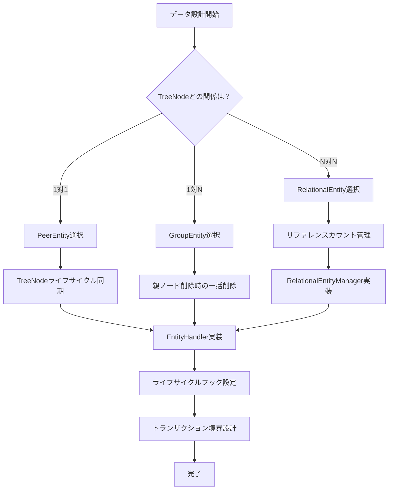

# プラグインエンティティライフサイクル管理ガイド

## 1. エンティティ関係の概念

### 1.1 エンティティタイプの分類

HierarchiDBのプラグインシステムでは、ツリーノードとの紐付けの構造とライフサイクルに基づいて2×3の分類でエンティティを定義します。

#### 1.1.1 PeerEntity（1対1関係）
- **関係性**: TreeNodeと **1対1** で対応
- **ライフサイクル**: TreeNodeと完全に同期
- **特徴**: 各TreeNodeに対して必ず1つのPeerEntityが存在
- **例**: StyleMapEntity, BaseMapEntity, ShapesEntity

```typescript
interface StyleMapEntity extends PeerEntity {
  id: UUID;
  referencingNodeId: TreeNodeId;        // TreeNodeとの1対1関係
  name: string;
  styleMapConfig: StyleMapConfig;
  // TreeNodeが削除されると自動的に削除される
}
```

#### 1.1.2 GroupEntity（1対N関係）
- **関係性**: TreeNodeと **1対N** で対応
- **ライフサイクル**: 個別に管理される
- **特徴**: 1つのTreeNodeに対して複数のGroupEntityが存在可能
- **例**: FeatureSubEntity（GeoJSONの個別フィーチャー）

```typescript
interface FeatureSubEntity extends GroupEntity {
  id: UUID;
  referencingNodeId: TreeNodeId;   // TreeNodeへの参照
  type: 'point' | 'line' | 'polygon';
  geometry: GeoJSONGeometry;
  // 親TreeNodeが削除されると全て削除される
}
```

#### 1.1.3 RelationalEntity（N対N関係）
- **関係性**: 複数のTreeNodeと **N対N** で対応
- **ライフサイクル**: **リファレンスカウント**による自動管理
- **特徴**: 最後の参照が削除されたときに自動削除
- **例**: TableMetadataEntity（複数のStyleMapで共有される表データ）

```typescript
interface TableMetadataEntity extends RelationalEntity {
  id: UUID;
  referencingNodeIds: TreeNodeId[];  // 参照元ノード一覧
  referenceCount: number;     // 参照カウント
  filename: string;
  tableRows: Array<Array<string | number>>;
  // 参照カウントが0になると自動削除
}
```

### 1.2 ライフサイクルによる分類

#### 1.2.1 Persistent（永続的）
- **保存先**: CoreDB
- **ライフサイクル**: ツリーノードの作成から削除まで
- **用途**: 最終成果物、長期保存が必要なデータ

#### 1.2.2 Ephemeral（一時的）
- **保存先**: EphemeralDB
- **ライフサイクル**: 編集ダイアログのセッション内でのみ生存
- **用途**: 中間処理データ、ワーキングコピー

## 2. ワーキングコピーとエンティティ管理

### 2.1 ワーキングコピーの仕組み

オブジェクトの編集が開始されると、オブジェクトの「ワーキングコピー」が作成されます：

- **保存場所**: EphemeralDB（CoreDBとは別のデータベース）
- **ID管理**: オリジナルのツリーノードと同じIDを使用
- **数の制約**: オリジナルに対して0個または1個のワーキングコピー
- **エンティティ管理**: コピーオンライト方式で必要に応じて作成

### 2.2 ドラフト状態

編集作業を中断する際に、未完成な状態を「ドラフト状態」として保存できる場合があります：

- **定義**: ツリーノードのisDraftプロパティがtrue
- **制限**: 通常のオブジェクトとしての利用に制限
- **UI表示**: Discard確認ダイアログで「Save as Draft」ボタン表示

## 3. 設計手順とベストプラクティス

### 3.1 エンティティ設計の決定フロー



### 3.2 StyleMap実装における設計決定

StyleMapプラグインでは以下の設計決定を行いました：

#### 2.2.1 StyleMapEntity（PeerEntity）
- **理由**: 各StyleMapは特定のTreeNodeに1対1で対応
- **特徴**: TreeNodeが削除されるとStyleMapEntityも削除
- **実装**: 標準的なEntityHandler実装

#### 2.2.2 TableMetadataEntity（RelationalEntity）
- **理由**: 同じCSVファイルを複数のStyleMapで共有する可能性
- **特徴**: 重複データの排除、メモリ効率の向上
- **実装**: RelationalEntityManagerによるリファレンスカウント管理

## 4. 実装パターンと注意点

### 4.1 PeerEntity実装パターン

```typescript
// 1. 型定義
interface MyPeerEntity extends PeerEntity {
  data: string;
}

// 2. EntityHandler実装
class MyEntityHandler implements EntityHandler<MyPeerEntity, GroupEntity, MyWorkingCopy> {
  async createEntity(nodeId: TreeNodeId, data?: Partial<MyPeerEntity>): Promise<MyPeerEntity> {
    const entity: MyPeerEntity = {
      refencingNodeId: nodeId,
      data: data?.data || '',
      createdAt: Date.now(),
      updatedAt: Date.now(),
      version: 1,
    };
    
    await this.db.table('myEntities').add(entity);
    return entity;
  }
  
  async deleteEntity(nodeId: TreeNodeId): Promise<void> {
    await this.db.table('myEntities').delete(nodeId);
    // TreeNode削除時の自動削除はフレームワークが管理
  }
}
```

### 4.2 RelationalEntity実装パターン

```typescript
// 1. RelationalEntityManager実装
class MyRelationalEntityManager implements RelationalEntityManager<MyRelationalEntity> {
  async addReference(entityId: string, nodeId: TreeNodeId): Promise<void> {
    await this.db.transaction('rw', this.tableName, async () => {
      const entity = await this.getEntity(entityId);
      if (entity && !entity.referencingNodeIds.includes(nodeId)) {
        entity.referenceCount += 1;
        entity.referencingNodeIds.push(nodeId);
        await this.db.table(this.tableName).put(entity);
      }
    });
  }
  
  async removeReference(entityId: string, nodeId: TreeNodeId): Promise<void> {
    await this.db.transaction('rw', this.tableName, async () => {
      const entity = await this.getEntity(entityId);
      if (entity) {
        entity.referenceCount -= 1;
        entity.referencingNodeIds = entity.referencingNodeIds.filter(id => id !== nodeId);
        
        if (entity.referenceCount <= 0) {
          await this.db.table(this.tableName).delete(entityId);
        } else {
          await this.db.table(this.tableName).put(entity);
        }
      }
    });
  }
}

// 2. EntityHandlerでの統合
class MyEntityHandler {
  constructor(private relationalManager: MyRelationalEntityManager) {}
  
  async updateEntity(nodeId: TreeNodeId, data: Partial<MyPeerEntity>): Promise<void> {
    await this.db.transaction('rw', ['myEntities', 'myRelationalEntities'], async () => {
      // 古い参照を削除
      if (oldRelationalId) {
        await this.relationalManager.removeReference(oldRelationalId, nodeId);
      }
      
      // 新しい参照を追加
      if (newRelationalId) {
        await this.relationalManager.addReference(newRelationalId, nodeId);
      }
      
      // PeerEntity更新
      await this.db.table('myEntities').put(updatedEntity);
    });
  }
}
```

## 5. 実装時の重要な注意点

### 5.1 トランザクション境界の設計

#### ✅ 良い例: 関連エンティティを同一トランザクションで操作
```typescript
async updateEntity(nodeId: TreeNodeId, data: Partial<StyleMapEntity>): Promise<void> {
  await this.db.transaction('rw', ['styleMapEntities', 'tableMetadata'], async () => {
    // PeerEntityとRelationalEntityを一括操作
    await this.updatePeerEntity(nodeId, data);
    await this.updateRelationalReferences(nodeId, data.tableMetadataId);
  });
}
```

#### ❌ 悪い例: 分離されたトランザクション
```typescript
async updateEntity(nodeId: TreeNodeId, data: Partial<StyleMapEntity>): Promise<void> {
  await this.updatePeerEntity(nodeId, data);      // トランザクション1
  await this.updateRelationalReferences(nodeId, data.tableMetadataId);  // トランザクション2
  // データ不整合のリスクあり
}
```

### 5.2 リファレンスカウントの整合性

#### ✅ 重複参照のチェック
```typescript
async addReference(entityId: string, nodeId: TreeNodeId): Promise<void> {
  const entity = await this.getEntity(entityId);
  if (entity && !entity.referencingNodeIds.includes(nodeId)) {
    // 重複チェック済みで安全に追加
    entity.referenceCount += 1;
    entity.referencingNodeIds.push(nodeId);
  }
}
```

#### ❌ 重複参照を許可
```typescript
async addReference(entityId: string, nodeId: TreeNodeId): Promise<void> {
  const entity = await this.getEntity(entityId);
  entity.referenceCount += 1;  // 重複でカウントが不正になる
  entity.referencingNodeIds.push(nodeId);
}
```

### 5.3 エラーハンドリング

#### ✅ 部分失敗への対応
```typescript
async deleteEntity(nodeId: TreeNodeId): Promise<void> {
  try {
    await this.db.transaction('rw', ['styleMapEntities', 'tableMetadata'], async () => {
      const entity = await this.getEntity(nodeId);
      
      if (entity?.tableMetadataId) {
        await this.tableMetadataManager.removeReference(entity.tableMetadataId, nodeId);
      }
      
      await this.db.table('styleMapEntities').delete(nodeId);
    });
  } catch (error) {
    console.error(`Failed to delete StyleMapEntity ${nodeId}:`, error);
    throw new Error(`Entity deletion failed: ${error.message}`);
  }
}
```

### 5.4 パフォーマンス最適化

#### ✅ バッチ操作の活用
```typescript
async cleanupOrphanedEntities(): Promise<number> {
  const orphanedEntities = await this.db.table(this.tableName)
    .where('referenceCount')
    .belowOrEqual(0)
    .toArray();

  if (orphanedEntities.length > 0) {
    const orphanedIds = orphanedEntities.map(e => e.id);
    await this.db.table(this.tableName).bulkDelete(orphanedIds);  // バッチ削除
  }

  return orphanedEntities.length;
}
```

#### ❌ 非効率な個別操作
```typescript
async cleanupOrphanedEntities(): Promise<number> {
  const orphanedEntities = await this.getAllOrphanedEntities();
  
  for (const entity of orphanedEntities) {
    await this.db.table(this.tableName).delete(entity.id);  // 個別削除は非効率
  }
  
  return orphanedEntities.length;
}
```

## 6. テストパターン

### 6.1 PeerEntityのテスト

```typescript
describe('StyleMapEntity (PeerEntity)', () => {
  it('should create entity with TreeNode lifecycle sync', async () => {
    const nodeId = 'test-node-1';
    const entity = await handler.createEntity(nodeId, { name: 'Test StyleMap' });
    
    expect(entity.nodeId).toBe(nodeId);
    expect(entity.name).toBe('Test StyleMap');
    
    // TreeNode削除時の自動削除をテスト
    await handler.deleteEntity(nodeId);
    const deletedEntity = await handler.getEntity(nodeId);
    expect(deletedEntity).toBeUndefined();
  });
});
```

### 6.2 RelationalEntityのテスト

```typescript
describe('TableMetadataEntity (RelationalEntity)', () => {
  it('should manage reference count correctly', async () => {
    const tableId = await manager.createEntity('node1', { filename: 'test.csv' });
    
    // 参照追加
    await manager.addReference(tableId, 'node2');
    let entity = await manager.getEntity(tableId);
    expect(entity?.referenceCount).toBe(2);
    expect(entity?.referencingNodeIds).toEqual(['node1', 'node2']);
    
    // 参照削除
    await manager.removeReference(tableId, 'node1');
    entity = await manager.getEntity(tableId);
    expect(entity?.referenceCount).toBe(1);
    
    // 最後の参照削除で自動削除
    await manager.removeReference(tableId, 'node2');
    entity = await manager.getEntity(tableId);
    expect(entity).toBeUndefined();
  });
});
```

## 7. 運用・保守

### 7.1 定期メンテナンス

```typescript
// 定期的なクリーンアップジョブ
export class EntityMaintenanceService {
  async runDailyMaintenance(): Promise<void> {
    console.log('Starting daily entity maintenance...');
    
    // 1. 孤立RelationalEntityのクリーンアップ
    const cleanedCount = await this.tableMetadataManager.cleanupOrphanedEntities();
    console.log(`Cleaned up ${cleanedCount} orphaned TableMetadataEntity(ies)`);
    
    // 2. 使用統計の記録
    const stats = await this.tableMetadataManager.getUsageStats();
    console.log('TableMetadata usage stats:', stats);
    
    // 3. 古いWorkingCopyの削除（24時間以上経過）
    await this.cleanupOldWorkingCopies();
  }
}
```

### 7.2 監視・アラート

```typescript
// エンティティヘルスチェック
export class EntityHealthChecker {
  async checkEntityIntegrity(): Promise<{
    healthy: boolean;
    issues: string[];
  }> {
    const issues: string[] = [];
    
    // PeerEntityの整合性チェック
    const orphanedPeerEntities = await this.findOrphanedPeerEntities();
    if (orphanedPeerEntities.length > 0) {
      issues.push(`Found ${orphanedPeerEntities.length} orphaned PeerEntities`);
    }
    
    // RelationalEntityの参照整合性チェック
    const invalidReferences = await this.findInvalidRelationalReferences();
    if (invalidReferences.length > 0) {
      issues.push(`Found ${invalidReferences.length} invalid RelationalEntity references`);
    }
    
    return {
      healthy: issues.length === 0,
      issues,
    };
  }
}
```

## 7. まとめ

### 7.1 設計の利点

1. **明確な責任分離**: 各エンティティタイプの役割が明確
2. **ライフサイクル管理の自動化**: リファレンスカウントによる自動削除
3. **データ重複の排除**: RelationalEntityによる効率的な共有
4. **型安全性**: TypeScriptによる強い型付け

### 7.2 実装成功のカギ

1. **適切なエンティティタイプ選択**: データの関係性を正しく理解する
2. **トランザクション設計**: 関連エンティティの一貫性を保つ
3. **エラーハンドリング**: 部分失敗に対する適切な対応
4. **テスト充実**: ライフサイクル管理の複雑性に対するテスト
5. **監視・保守**: 運用時のデータ整合性チェック

この設計パターンにより、拡張性と保守性を両立したプラグインシステムを構築できます。