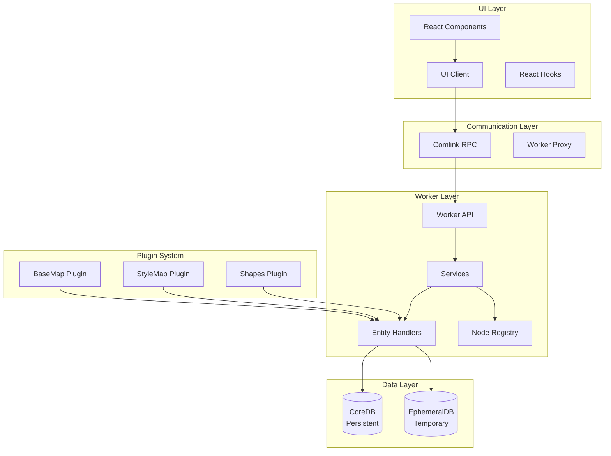
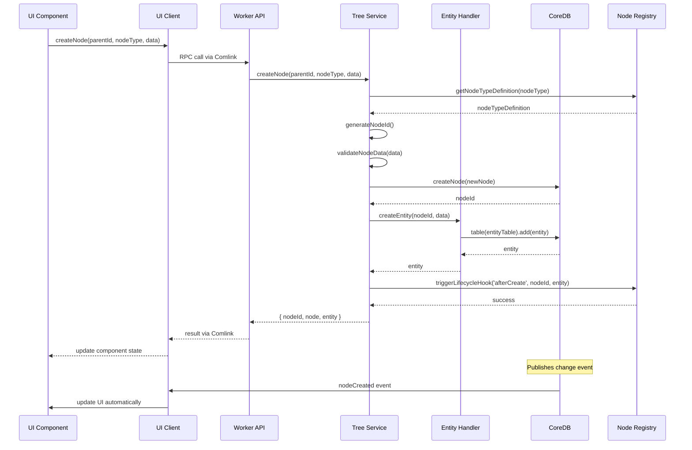
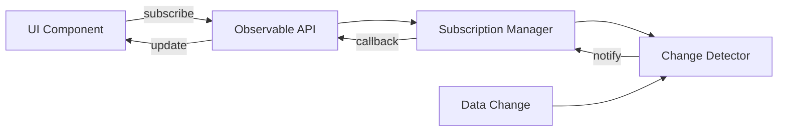

# アーキテクチャ概要

# 全体アーキテクチャ

## この章について

この章では、HierarchiDBの技術アーキテクチャと設計思想について詳しく説明します。

**読むべき人**: 技術者、システム設計者、パフォーマンスチューニングが必要な管理者
**前提知識**: JavaScript、Web Worker、データベースの基本概念
**読むタイミング**: 
- システムの技術的理解を深めたい時
- パフォーマンス問題の原因調査時
- カスタム開発や拡張を検討している時
- プラグイン開発を始める前の事前学習

この章では、4層アーキテクチャ、Web Worker活用による並列処理、プラグインシステム（BaseMap、StyleMap、Shape、Spreadsheet、Project）の技術基盤を理解できます。特に、大容量spreadsheetデータ処理やリアルタイム地図表示の仕組みについても解説します。具体的な開発手順は、REPORT配下の技術文書で詳しく説明されています。

## はじめに

HierarchiDBは、大規模な階層データをブラウザ上で効率的に管理するために設計されたフレームワークです。本章では、システムの全体像と、その設計思想について解説します。

従来のWebアプリケーションでは、UIスレッドでデータ処理を行うため、大量のデータを扱う際にパフォーマンスの問題が発生しがちでした。HierarchiDBは、この問題を解決するために、UI層とデータ処理層を完全に分離し、Web Workerを活用した並列処理アーキテクチャを採用しています。

## システムアーキテクチャ

### 4層アーキテクチャの採用理由

HierarchiDBが4層アーキテクチャを採用した背景には、以下の要求事項があります：

1. **スケーラビリティ**: 数万ノードを超える大規模ツリー構造の処理
2. **レスポンシブ性**: データ処理中でも滑らかなUI操作の維持
3. **データ整合性**: 複雑なトランザクション処理の安全な実行
4. **拡張性**: プラグインによる機能追加の容易さ

これらの要求を満たすため、責任を明確に分離した4層構造を設計しました。

### アーキテクチャ構成図



### レイヤーごとの責務

| レイヤー | 責務 | 主要コンポーネント | 技術スタック |
|---------|------|-------------------|-------------|
| **UI Layer** | ユーザーインターフェース、イベント処理、状態管理 | React Components, Hooks, Context | React 19, MUI 5, React Router v7 |
| **Communication** | UI-Worker間の型安全な通信、自動プロキシ生成 | Comlink RPC, Worker Proxy | Comlink 4.4 |
| **Worker Layer** | ビジネスロジック、コマンド処理、データ操作 | Services, Entity Handlers, Registry | TypeScript, Web Worker API |
| **Data Layer** | データ永続化、トランザクション管理、インデックス | Dexie Wrappers | Dexie.js 4.0, IndexedDB |
| **Plugin System** | 機能拡張、カスタムノードタイプ | Plugin Handlers, Definitions | プラグインアーキテクチャ |

## アーキテクチャの特徴

### 1. 関心の分離（Separation of Concerns）

HierarchiDBの最も重要な設計原則は、各層が明確に定義された単一の責任を持つことです。

**UI層の責任範囲：**
UI層は純粋に表示とユーザーインタラクションに専念します。データの取得や変更は、すべてWorker層へのRPC呼び出しを通じて行われます。これにより：

- コンポーネントのテストが容易になる（モックが簡単）
- UIフレームワークの変更が他の層に影響しない
- デザインシステムの変更が独立して行える

**Worker層の責任範囲：**
Worker層はすべてのビジネスロジックとデータ処理を担当します。UI層から完全に独立しているため：

- 重い処理でもUIがフリーズしない
- バックグラウンドでの継続的な処理が可能
- 複雑なトランザクション処理を安全に実行できる

**責任分担の具体例：**
例えば、ノードの削除操作を考えてみましょう。UI層は削除ボタンのクリックを検知し、削除確認ダイアログを表示します。実際の削除処理（子ノードの再帰的削除、関連エンティティのクリーンアップ、ゴミ箱への移動など）はすべてWorker層で実行されます。

### 2. スケーラビリティ

大規模データを扱うアプリケーションにとって、スケーラビリティは生命線です。

**非同期処理の徹底：**
すべてのデータ操作は非同期で実行されます。これは単にPromiseを使うということではなく、UIスレッドとWorkerスレッドの完全な分離を意味します。ユーザーが10万ノードのツリーを展開しても、スクロールやクリックといった基本的な操作は影響を受けません。

**並列処理の活用：**
Web Workerを使用することで、CPUを最大限活用します。例えば、大量のノードをインポートする際、パース処理とバリデーション処理を並列で実行し、処理時間を大幅に短縮します。

**効率的なデータ管理：**
IndexedDBの特性を最大限活用した設計により：

- 数GB規模のデータも扱える（ブラウザの制限内で）
- インデックスによる高速検索（O(log n)の性能）
- トランザクションによるデータ整合性の保証

### 3. 保守性と品質

長期的なメンテナンスを考慮した設計により、コードの品質と保守性を高めています。

**型安全性の徹底：**
TypeScriptの厳格モード（strict: true）を使用し、any型を禁止しています。さらに、ブランド型（Branded Types）を導入することで、IDの誤用を防いでいます：

```typescript
// NodeIdとTreeIdは区別される
type NodeId = string & { readonly __brand: 'NodeId' };
type TreeId = string & { readonly __brand: 'TreeId' };

// コンパイル時にエラーを検出
const nodeId: NodeId = 'node-1' as NodeId;
const treeId: TreeId = nodeId; // エラー：型が一致しない
```

**テスタビリティの確保：**
各層が独立しているため、単体テストが書きやすくなっています。Worker層のロジックはUIに依存せず、UI層のコンポーネントはWorker層の実装に依存しません。

**プラグインによる拡張性：**
コア機能を変更することなく、新しいノードタイプやエンティティを追加できます。プラグインは定義されたインターフェースに従うだけで、システムに統合されます。

## APIアーキテクチャ

### API設計の哲学

HierarchiDBのAPIは、「単一責任の原則」と「インターフェース分離の原則」に基づいて設計されています。一つの巨大なAPIではなく、機能別に整理された7つの専門的なAPIに分割することで、以下の利点を実現しています：

1. **学習曲線の緩和**: 必要な機能だけを学べばよい
2. **型安全性の向上**: 各操作に特化した厳密な型定義
3. **テストの容易さ**: 機能単位でのモック作成が簡単
4. **段階的な採用**: 必要なAPIだけを使用可能

### WorkerAPI（メインエントリーポイント）

WorkerAPIは、他のすべてのAPIへのゲートウェイとして機能します。これは「ファサードパターン」の実装であり、クライアントコードは単一のエントリーポイントから必要なAPIにアクセスできます。
```typescript
interface WorkerAPI {
  getQueryAPI(): Remote<TreeQueryAPI>;        // 読み取り操作
  getMutationAPI(): Remote<TreeMutationAPI>;  // 変更操作
  getObservableAPI(): Remote<TreeObservableAPI>; // 監視・購読
  getPluginRegistryAPI(): Remote<PluginRegistryAPI>; // プラグイン管理
  getWorkingCopyAPI(): Remote<WorkingCopyAPI>; // ワーキングコピー
  initialize(): Promise<void>;                // システム初期化
  shutdown(): Promise<void>;                  // システム終了
  getSystemHealth(): Promise<SystemHealth>;   // ヘルスチェック
}
```

### API分離がもたらすメリット

**1. 関心の分離による明確な責任範囲**

各APIは特定の機能領域に特化しています。例えば、`TreeQueryAPI`は読み取り専用であることが保証されているため、このAPIを使用する限り、誤ってデータを変更してしまう心配がありません。

**2. 厳密な型安全性**

TypeScriptの型システムを最大限活用し、各APIメソッドは具体的な型を返します。ジェネリックな`any`や`unknown`型は使用せず、開発時にIDEの補完機能を十分に活用できます。

**3. 優れたテスタビリティ**

機能が分離されているため、テスト時のモック作成が簡単です。例えば、読み取り機能のテストでは`TreeQueryAPI`だけをモックすればよく、他のAPIの実装を気にする必要がありません。

**4. 段階的な機能拡張**

新しい機能を追加する際、既存のAPIを変更する必要がありません。新しいAPIを追加するか、PluginAPIを通じて拡張できます。

### 各APIの詳細な役割

| API | 責務 | 典型的なユースケース | 利用者 |
|-----|------|-------------------|--------|
| **TreeQueryAPI** | 読み取り専用のデータアクセス | • ツリービューの表示<br>• ノード情報の取得<br>• 検索機能の実装 | UIコンポーネント、表示ロジック |
| **TreeMutationAPI** | データの作成・更新・削除 | • 新規ノード作成<br>• ノード名の変更<br>• ノードの削除・移動 | 編集機能、コマンド実行 |
| **TreeObservableAPI** | リアルタイム変更監視 | • 自動更新UI<br>• 他ユーザーの変更検知<br>• 同期状態の管理 | リアクティブコンポーネント |
| **WorkingCopyAPI** | 一時的な編集状態の管理 | • ダイアログでの編集<br>• ドラフト保存<br>• 編集のキャンセル | ダイアログ、フォーム |
| **PluginRegistryAPI** | プラグインシステムの管理 | • プラグイン登録<br>• 機能の動的追加<br>• メタデータ取得 | プラグインローダー、管理画面 |
| **PluginAPI** | プラグイン固有機能の提供 | • カスタムインポート<br>• 専用エクスポート<br>• 特殊な処理 | プラグイン開発者 |

### 実際の使用例で理解するAPI連携

ユーザーが新しいフォルダを作成する場合の、API連携の流れを見てみましょう：

```typescript
// 1. ユーザーが「新規フォルダ」ボタンをクリック
const handleCreateFolder = async () => {
  // 2. WorkingCopyAPIでドラフトを作成
  const workingCopyAPI = await workerAPI.getWorkingCopyAPI();
  const draft = await workingCopyAPI.createDraftWorkingCopy(
    'folder',
    currentParentId
  );
  
  // 3. ダイアログでユーザーが名前を入力
  const result = await showDialog({
    title: 'New Folder',
    draft: draft
  });
  
  if (result.confirmed) {
    // 4. WorkingCopyAPIで変更を確定
    await workingCopyAPI.commitWorkingCopy(draft.nodeId);
    
    // 5. TreeObservableAPIが自動的に変更を通知
    // （事前に設定済みのサブスクリプションが反応）
  } else {
    // キャンセルの場合は破棄
    await workingCopyAPI.discardWorkingCopy(draft.nodeId);
  }
};
```

この例では、3つのAPIが協調して動作しています。それぞれが明確な役割を持ちながら、シームレスに連携することで、複雑な機能を実現しています。

## データフロー

HierarchiDBでは、すべてのデータ操作が明確に定義されたフローに従って処理されます。以下では、代表的な操作のフローを詳細に解説します。

### ノード作成のシーケンス

新規ノードの作成は、複数の層を通過して処理されます。各層が明確な責任を持ち、エラーハンドリングやバリデーションを適切に行います。



### 読み取り操作のフロー

読み取り操作は、キャッシュを活用して高速化されています：

```
UI Component
    ↓ (request data)
UI Client (check cache)
    ↓ (cache miss)
Comlink RPC
    ↓
Worker API
    ↓
Query Service
    ↓
Dexie.js (with index)
    ↓
IndexedDB
    ↓ (return data)
[reverse flow with caching]
```

### リアルタイム更新のフロー

サブスクリプションによる自動更新の仕組み：



## コンポーネント構成

モノレポ構成で詳細に分割された以下のパッケージ群を管理:

### コア層
- **@hierarchidb/core**: 型定義・インターフェース（ランタイムコードなし）
- **@hierarchidb/api**: UI-Worker間のComlink APIコントラクト
  - `WorkerAPI`: メインAPIエントリーポイント
  - `TreeQueryAPI`: 読み取り専用データアクセス
  - `TreeMutationAPI`: データ変更操作
  - `TreeObservableAPI`: リアルタイム監視・サブスクリプション
  - `WorkingCopyAPI`: ドラフト・編集操作
  - `PluginRegistryAPI`: プラグインシステム管理
  - `PluginAPI`: プラグイン固有API拡張
- **@hierarchidb/worker**: Workerスレッド実装（DB操作・コマンド処理）

### UI層（機能別分割）
- **@hierarchidb/ui-core**: 基本UIコンポーネント（MUI、テーマ、通知）
- **@hierarchidb/ui-auth**: 認証関連（OAuth2/OIDC）
- **@hierarchidb/ui-routing**: React Routerナビゲーション
- **@hierarchidb/ui-i18n**: 国際化（i18next）
- **@hierarchidb/ui-client**: Worker接続管理、React hooks
- **@hierarchidb/ui-dialog**: ダイアログ基盤
- **@hierarchidb/ui-file**: ファイル操作
- **@hierarchidb/ui-treeconsole系**: ツリーコンソール各種コンポーネント
  - ui-treeconsole-base: 基盤
  - ui-treeconsole-treetable: テーブル表示
  - ui-treeconsole-toolbar: ツールバー
  - ui-treeconsole-breadcrumb: パンくずリスト
  - ui-treeconsole-footer: フッター
  - ui-treeconsole-speeddial: スピードダイアル
  - ui-treeconsole-trashbin: ゴミ箱

### プラグイン層
- **@hierarchidb/plugin-folder**: フォルダノード
- **@hierarchidb/plugin-basemap**: ベースマップ
- **@hierarchidb/plugin-stylemap**: スタイルマップ
- **@hierarchidb/plugin-shape**: シェイプデータ

### バックエンド層
- **@hierarchidb/bff**: Backend for Frontend（認証処理）
- **@hierarchidb/cors-proxy**: CORSプロキシ

### アプリケーション
- **@hierarchidb/app**: メインアプリケーション（React Router v7）

この詳細な分割により：
- 各パッケージの責務が明確化
- 依存関係の可視化と管理が容易
- 段階的な機能開発と独立したテストが可能
- バンドルサイズの最適化（必要な機能のみ利用）

### Worker層の内部構成
```
packages/worker/
├── handlers/           # エンティティハンドラー
│   ├── EntityHandler   # 基底クラス
│   ├── PeerHandler     # 1対1エンティティ
│   └── GroupHandler    # 1対Nエンティティ
├── managers/           # マネージャー
│   ├── TreeManager     # ツリー管理
│   ├── CommandManager  # コマンド処理
│   └── LifecycleManager # ライフサイクル
└── services/           # サービス
    ├── DatabaseService # DB操作
    └── CacheService    # キャッシュ
```

## セキュリティアーキテクチャ

### 認証・認可
```
User → OAuth Provider → BFF (Cloudflare Worker) → JWT
                                                ↓
                                          Application
```

### データ保護
- クライアントサイド暗号化（オプション）
- IndexedDBのブラウザサンドボックス
- CORS制限

## パフォーマンス最適化

### レンダリング最適化
- React.memo による再レンダリング防止
- useMemo/useCallback の適切な使用
- 仮想スクロール（TanStack Virtual）

### データ最適化
- インデックスによる高速検索
- バッチ処理
- 遅延読み込み

### ネットワーク最適化
- データ圧縮
- キャッシュ戦略
- CDN活用

## エラーハンドリング

### エラーの種類と対処
1. **UI層エラー**: Error Boundary でキャッチ
2. **Worker層エラー**: Try-catch とエラーイベント
3. **データベースエラー**: トランザクションロールバック
4. **ネットワークエラー**: リトライとフォールバック

### エラー通知
```
Error → Logger → Console/Monitoring
             ↓
          User Notification (Toast/Dialog)
```

## 拡張ポイント

### プラグインフック
- ライフサイクルフック
- コマンドインターセプター
- UIコンポーネント登録

### カスタマイズ可能な要素
- ノードタイプ
- エンティティハンドラー
- UI テーマ
- バリデーションルール

## 次のステップ

- [4層アーキテクチャ詳細](./02-architecture-layers.md)
- [データモデル](./02-architecture-data-model.md)
- [プラグインアーキテクチャ](./02-architecture-plugin.md)