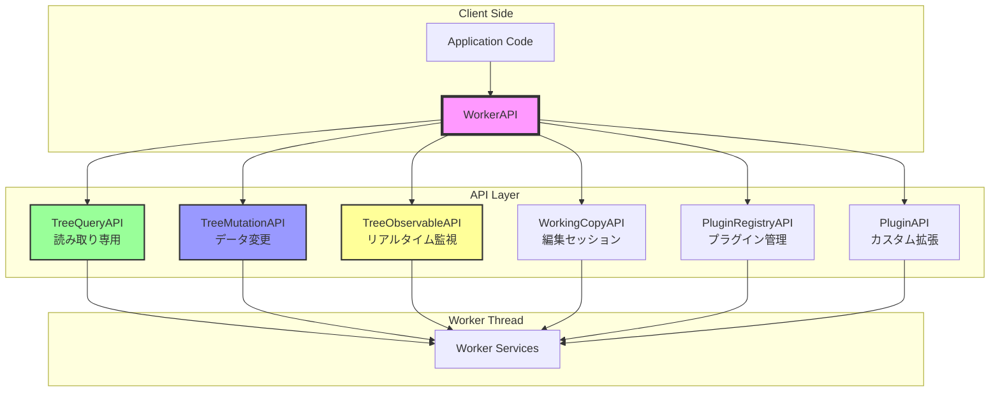

# APIリファレンス

## はじめに

この章では、HierarchiDBの各APIの詳細な仕様と実践的な使用方法について説明します。本章は以下のような方を対象としています：

**読むべき人**: HierarchiDBを使用してアプリケーションを開発する開発者、UIコンポーネント実装者、API統合作業を行う方、フロントエンド・バックエンド連携を設計する方

**前提知識**: TypeScript、Promise/async-await、Comlink（Web Worker通信）、Observer パターン、Webアプリケーション開発の基本概念

**読むタイミング**: 具体的な実装作業を開始する前に、使用したいAPI（QueryAPI、MutationAPI等）の該当セクションを参照してください。BaseMap、StyleMap、Shape、Spreadsheet、Projectプラグインのような具体的なプラグイン実装時にも、対応するAPIの使い方を確認できます。エラーハンドリングやパフォーマンス考慮事項は、品質の高いアプリケーション構築のために重要です。

本APIリファレンスは実際のコード例と具体的なエラーハンドリング方法を含んでおり、迅速な開発開始と問題解決に役立ちます。

## 概要

HierarchiDBのAPIは、大規模な階層データを効率的に操作するために設計された、型安全で直感的なインターフェースです。本リファレンスでは、各APIの詳細な仕様と、実践的な使用例を提供します。

### なぜ複数のAPIに分かれているのか？

多くのフレームワークは単一の巨大なAPIを提供しますが、HierarchiDBは意図的に機能別にAPIを分離しています。これには以下の理由があります：

1. **学習の容易さ** - 必要な機能だけを学習すればよく、全体を理解する必要がない
2. **型安全性の向上** - 各APIが特定の操作に特化した型を提供
3. **テストの簡便性** - 機能単位でモックを作成できる
4. **パフォーマンス** - 使用しないAPIはバンドルに含まれない

### APIアーキテクチャ図



### 基本的な使用方法

```typescript
// 1. Workerの初期化
import { WorkerAPI } from '@hierarchidb/api';
import * as Comlink from 'comlink';

const worker = new Worker('./worker.js');
const workerAPI = Comlink.wrap<WorkerAPI>(worker);

// 2. 初期化
await workerAPI.initialize();

// 3. 各APIの取得
const queryAPI = await workerAPI.getQueryAPI();
const mutationAPI = await workerAPI.getMutationAPI();
const observableAPI = await workerAPI.getObservableAPI();

// 4. APIの使用
const tree = await queryAPI.getTree(treeId);
const result = await mutationAPI.createNode({...});
```

## WorkerAPI

メインエントリーポイントとなるAPI。他のすべてのAPIへのアクセスを提供します。

### メソッド

#### `initialize(): Promise<void>`
Worker システムを初期化します。データベース、サービス、プラグインレジストリをセットアップします。

```typescript
const worker = new Worker('./worker.js');
const workerAPI = Comlink.wrap<WorkerAPI>(worker);
await workerAPI.initialize();
```

#### `getQueryAPI(): Remote<TreeQueryAPI>`
読み取り専用操作のためのQueryAPIプロキシを取得します。

#### `getMutationAPI(): Remote<TreeMutationAPI>`
データ変更操作のためのMutationAPIプロキシを取得します。

#### `getObservableAPI(): Remote<TreeObservableAPI>`
リアルタイム監視のためのObservableAPIプロキシを取得します。

#### `getPluginRegistryAPI(): Remote<PluginRegistryAPI>`
プラグインシステム管理のためのPluginRegistryAPIプロキシを取得します。

#### `getWorkingCopyAPI(): Remote<WorkingCopyAPI>`
ドラフトと編集操作のためのWorkingCopyAPIプロキシを取得します。

#### `getSystemHealth(): Promise<SystemHealth>`
システム全体のヘルス状態を取得します。

```typescript
const health = await workerAPI.getSystemHealth();
console.log('Database status:', health.databases);
console.log('Services status:', health.services);
console.log('Memory usage:', health.memory);
```

#### `shutdown(): Promise<void>`
Workerシステムをシャットダウンし、リソースをクリーンアップします。

## TreeQueryAPI

### 概要

TreeQueryAPIは、データの読み取り専用操作を提供します。このAPIを使用する限り、誤ってデータを変更する心配がありません。すべてのメソッドは非破壊的で、Promiseベースの非同期操作です。

### 主な用途

- ツリー構造の表示
- ノード情報の取得
- 検索機能の実装
- データのエクスポート準備

### パフォーマンス特性

TreeQueryAPIは、IndexedDBのインデックスを活用して高速な検索を実現しています：

| 操作 | 計算量 | 典型的な応答時間 |
|-----|--------|----------------|
| 単一ノード取得 | O(1) | < 10ms |
| 子ノード一覧 | O(n) | < 50ms (100ノード) |
| 全文検索 | O(n log n) | < 200ms (10,000ノード) |
| 階層取得 | O(n) | < 100ms (深さ5) |

### メソッド

#### `getTree(treeId: TreeId): Promise<Tree | undefined>`

指定されたツリーIDのツリー情報を取得します。

**パラメータ:**
- `treeId: TreeId` - 取得するツリーのID（ブランド型）

**戻り値:**
- `Promise<Tree | undefined>` - ツリー情報。存在しない場合は`undefined`

**使用例:**
```typescript
const treeId = 'tree-001' as TreeId;
const tree = await queryAPI.getTree(treeId);

if (tree) {
  console.log(`Tree: ${tree.name}`);
  console.log(`Root Node: ${tree.rootNodeId}`);
  console.log(`Created: ${new Date(tree.createdAt).toLocaleDateString()}`);
} else {
  console.error('Tree not found');
}
```

**エラーハンドリング:**
```typescript
try {
  const tree = await queryAPI.getTree(treeId);
  // 処理...
} catch (error) {
  if (error.code === 'DATABASE_ERROR') {
    // データベースエラーの処理
  }
}
```

**関連メソッド:**
- `listTrees()` - すべてのツリーを取得
- `getNode()` - ツリー内のノードを取得

#### `listTrees(): Promise<Tree[]>`
すべてのツリー一覧を取得します。

#### `getNode(nodeId: NodeId): Promise<TreeNode | undefined>`
指定されたノードIDのノード情報を取得します。

#### `listChildren(parentId: NodeId): Promise<TreeNode[]>`
指定されたノードの直接の子ノード一覧を取得します。

#### `listDescendants(nodeId: NodeId, maxDepth?: number): Promise<TreeNode[]>`
指定されたノードの子孫ノード一覧を再帰的に取得します。

#### `listAncestors(nodeId: NodeId): Promise<TreeNode[]>`
指定されたノードの祖先ノード一覧を取得します（ルートから順）。

#### `searchNodes(options: SearchOptions): Promise<TreeNode[]>`
ノードを検索します。

```typescript
interface SearchOptions {
  rootNodeId: NodeId;        // 検索開始ノード
  query: string;              // 検索クエリ
  mode?: 'exact' | 'prefix' | 'suffix' | 'partial'; // マッチモード
  maxDepth?: number;          // 最大検索深度
  maxResults?: number;        // 最大結果数
  caseSensitive?: boolean;    // 大文字小文字の区別
  searchInDescription?: boolean; // 説明文も検索対象とするか
}
```

## TreeMutationAPI

データ変更操作のためのAPI。

### メソッド

#### `createNode(params: CreateNodeParams): Promise<CreateNodeResult>`
新しいノードを作成します。

```typescript
interface CreateNodeParams {
  nodeType: TreeNodeType;
  treeId: TreeId;
  parentNodeId: NodeId;
  name: string;
  description?: string;
}

type CreateNodeResult = 
  | { success: true; nodeId: NodeId }
  | { success: false; error: string };
```

#### `updateNode(params: UpdateNodeParams): Promise<UpdateResult>`
既存ノードの情報を更新します。

```typescript
interface UpdateNodeParams {
  nodeId: NodeId;
  name?: string;
  description?: string;
}

type UpdateResult = 
  | { success: true }
  | { success: false; error: string };
```

#### `moveNodes(params: MoveNodesParams): Promise<MoveResult>`
ノードを別の親に移動します。

```typescript
interface MoveNodesParams {
  nodeIds: NodeId[];
  toParentId: NodeId;
  onNameConflict?: 'error' | 'auto-rename';
}
```

#### `duplicateNodes(params: DuplicateParams): Promise<DuplicateResult>`
ノードを複製します。

```typescript
interface DuplicateParams {
  nodeIds: NodeId[];
  toParentId?: NodeId; // 省略時は元の親に複製
}
```

#### `removeNodes(nodeIds: NodeId[]): Promise<RemoveResult>`
ノードを完全削除します（ハード削除）。

#### `moveNodesToTrash(nodeIds: NodeId[]): Promise<TrashResult>`
ノードをゴミ箱に移動します（ソフト削除）。

#### `recoverNodesFromTrash(params: RecoverParams): Promise<RecoverResult>`
ノードをゴミ箱から復元します。

```typescript
interface RecoverParams {
  nodeIds: NodeId[];
  toParentId?: NodeId; // 省略時は元の親へ復元
}
```

## TreeObservableAPI

リアルタイム監視とイベント購読のためのAPI。

### メソッド

#### `subscribeNode(nodeId: NodeId, callback: Callback): Promise<SubscriptionId>`
単一ノードの変更を監視します。

#### `subscribeChildren(parentId: NodeId, callback: Callback): Promise<SubscriptionId>`
子ノード一覧の変更を監視します。

#### `subscribeSubtree(rootId: NodeId, callback: Callback, options?: SubtreeOptions): Promise<SubscriptionId>`
サブツリー全体の変更を監視します。

```typescript
interface SubtreeOptions {
  maxDepth?: number;        // 監視する最大深度
  includeRoot?: boolean;    // ルートノード自体も含むか
}
```

#### `subscribeWithFilter(nodeId: NodeId, callback: Callback, filter: EventFilter): Promise<SubscriptionId>`
フィルタ条件付きで変更を監視します。

```typescript
interface EventFilter {
  eventTypes?: EventType[];    // 監視するイベントタイプ
  excludeTypes?: EventType[];  // 除外するイベントタイプ
  nodeTypes?: TreeNodeType[];  // 監視するノードタイプ
}
```

#### `unsubscribe(subscriptionId: SubscriptionId): Promise<void>`
特定の購読を解除します。

#### `unsubscribeAll(): Promise<void>`
すべての購読を解除します。

#### `getActiveSubscriptions(): Promise<SubscriptionInfo[]>`
アクティブな購読の一覧を取得します。

## WorkingCopyAPI

ワーキングコピー（編集セッション）管理のためのAPI。

### メソッド

#### `createDraftWorkingCopy(nodeType: TreeNodeType, parentNodeId: NodeId): Promise<WorkingCopy>`
新規ドラフトのワーキングコピーを作成します。

#### `createWorkingCopyFromNode(nodeId: NodeId): Promise<WorkingCopy>`
既存ノードからワーキングコピーを作成します。

#### `updateWorkingCopy(nodeId: NodeId, updates: Partial<WorkingCopy>): Promise<void>`
ワーキングコピーを更新します。

#### `commitWorkingCopy(nodeId: NodeId): Promise<CommitResult>`
ワーキングコピーの変更を確定し、CoreDBに保存します。

#### `discardWorkingCopy(nodeId: NodeId): Promise<void>`
ワーキングコピーを破棄し、変更をキャンセルします。

#### `getWorkingCopy(nodeId: NodeId): Promise<WorkingCopy | undefined>`
特定のワーキングコピーを取得します。

#### `listWorkingCopies(): Promise<WorkingCopy[]>`
すべてのアクティブなワーキングコピーを取得します。

#### `hasWorkingCopy(nodeId: NodeId): Promise<boolean>`
指定ノードのワーキングコピーが存在するか確認します。

#### `validateWorkingCopy(nodeId: NodeId): Promise<ValidationResult>`
ワーキングコピーのバリデーションを実行します。

## PluginRegistryAPI

プラグインシステム管理のためのAPI。

### メソッド

#### `registerNodeType(definition: NodeTypeDefinition): Promise<void>`
新しいノードタイプを登録します。

```typescript
interface NodeTypeDefinition {
  nodeType: TreeNodeType;
  displayName: string;
  description?: string;
  icon?: string;
  database?: DatabaseConfig;
  entityHandler?: EntityHandler;
  lifecycle?: LifecycleHooks;
  ui?: UIComponents;
  validators?: Validators;
  capabilities?: Capabilities;
}
```

#### `unregisterNodeType(nodeType: TreeNodeType): Promise<void>`
ノードタイプの登録を解除します。

#### `getNodeTypeDefinition(nodeType: TreeNodeType): Promise<NodeTypeDefinition | undefined>`
特定のノードタイプ定義を取得します。

#### `listSupportedNodeTypes(): Promise<TreeNodeType[]>`
登録されているすべてのノードタイプを取得します。

#### `isNodeTypeSupported(nodeType: TreeNodeType): Promise<boolean>`
指定のノードタイプがサポートされているか確認します。

#### `getNodeTypeMetadata(nodeType: TreeNodeType): Promise<NodeTypeMetadata>`
ノードタイプのメタデータを取得します。

#### `getNodeTypeCapabilities(nodeType: TreeNodeType): Promise<Capabilities>`
ノードタイプの機能（作成、編集、削除の可否など）を取得します。

#### `invokeLifecycleHook(hookName: string, nodeType: TreeNodeType, context: any): Promise<void>`
ライフサイクルフックを実行します。

#### `getUIComponent(nodeType: TreeNodeType, componentType: string): Promise<ComponentInfo>`
UIコンポーネント情報を取得します。

## PluginAPI

プラグイン固有のAPI拡張システム。

### 概要
プラグインは独自のAPIメソッドを定義し、WorkerAPIを通じて公開できます。

### 使用例

```typescript
// プラグイン側での定義
interface MyPluginMethods {
  customOperation(params: CustomParams): Promise<CustomResult>;
  specialQuery(id: string): Promise<SpecialData>;
}

const myPluginAPI: PluginAPI<MyPluginMethods> = {
  nodeType: 'myNodeType',
  methods: {
    customOperation: async (params) => {
      // カスタム処理の実装
      return result;
    },
    specialQuery: async (id) => {
      // 特殊なクエリの実装
      return data;
    }
  }
};

// クライアント側での使用
const pluginRegistry = await workerAPI.getPluginRegistryAPI();
const hasMethod = await pluginRegistry.hasPluginMethod('myNodeType', 'customOperation');

if (hasMethod) {
  const result = await pluginRegistry.invokePluginMethod(
    'myNodeType',
    'customOperation',
    params
  );
}
```

## エラーハンドリング

すべてのAPIメソッドは、エラー時に適切なエラー情報を返すか、Promiseをrejectします。

### エラーの種類

| エラータイプ | 説明 | 対処法 |
|------------|------|--------|
| ValidationError | 入力値が不正 | パラメータを確認 |
| NotFoundError | リソースが存在しない | IDを確認 |
| PermissionError | 権限不足 | 権限設定を確認 |
| ConflictError | データ競合 | リトライまたは競合解決 |
| DatabaseError | DB操作エラー | ログ確認、リトライ |

### エラーハンドリング例

```typescript
try {
  const result = await mutationAPI.createNode(params);
  if (result.success) {
    console.log('Node created:', result.nodeId);
  } else {
    console.error('Creation failed:', result.error);
    // ユーザーへの通知
  }
} catch (error) {
  console.error('API call failed:', error);
  // エラーリカバリー処理
}
```

## パフォーマンス考慮事項

### バッチ処理
複数の操作を行う場合は、可能な限りバッチ処理APIを使用します。

```typescript
// 非効率な例
for (const id of nodeIds) {
  await mutationAPI.removeNodes([id]);
}

// 効率的な例
await mutationAPI.removeNodes(nodeIds);
```

### 購読の管理
不要になった購読は必ず解除します。

```typescript
const subscriptionId = await observableAPI.subscribeNode(nodeId, callback);

// コンポーネントのクリーンアップ時
useEffect(() => {
  return () => {
    observableAPI.unsubscribe(subscriptionId);
  };
}, [subscriptionId]);
```

### キャッシュの活用
頻繁にアクセスするデータは、適切にキャッシュを活用します。

## 関連ドキュメント

- [アーキテクチャ概要](./02-architecture-overview.md)
- [コア操作機能](./03-core-operations.md)
- [プラグイン開発](./04-plugin-lifecycle.md)
- [ワーキングコピー管理](./migration/working-copy-migration-plan.md)