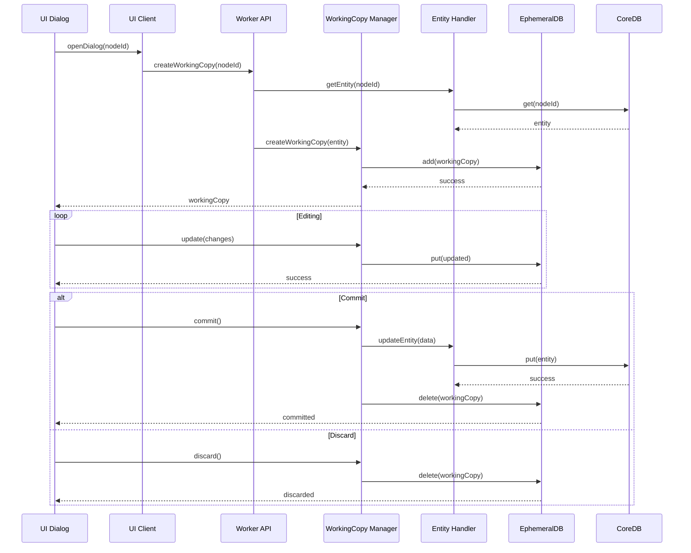

# コア操作機能

# コア機能・操作

## この章について

この章では、HierarchiDBの中核となる操作機能について、実際の使用方法とベストプラクティスを説明します。

**読むべき人**: HierarchiDBの日常的な操作を行うユーザー、操作手順を習得したい方
**前提知識**: [01-concepts.md](./01-concepts.md)で説明されている基本概念の理解
**読むタイミング**: 
- HierarchiDBの基本操作を学習する時
- 特定の操作（Undo/Redo、Copy/Paste等）で困った時
- 効率的な操作手順を確認したい時
- spreadsheetデータやgeo情報の操作方法を知りたい時

この章をマスターすることで、ツリー構造の編集、各種プラグイン（BaseMap、StyleMap、Shape、Spreadsheet、Project）のデータ操作、Working Copy機能による安全な編集が可能になります。また、大容量データの効率的な処理方法についても学べます。

## 概要

HierarchiDBのコア操作機能は、階層データ構造に対する包括的な操作セットを提供します。本章では、基本的なCRUD操作から、高度な機能であるUndo/Redo、Copy/Paste、ゴミ箱機能まで、実装の詳細と使用例を交えて解説します。

これらの操作はすべて、Worker層で処理され、UIスレッドをブロックすることなく実行されます。また、各操作はトランザクション内で実行され、データの整合性が保証されています。

## 基本CRUD操作

CRUD（Create, Read, Update, Delete）は、あらゆるデータ管理システムの基礎となる操作です。HierarchiDBでは、これらの操作に加えて、階層構造特有の要件（親子関係の管理、カスケード削除など）を考慮した実装を提供しています。

### Create（作成）

新規ノードの作成は、HierarchiDBにおける最も基本的な操作の一つです。単純に見える作成操作も、実際には複数のステップとバリデーションを経て実行されます。

#### 作成処理の詳細フロー

**1. ワーキングコピーの作成**
まず、編集用の一時的なデータ（ワーキングコピー）をEphemeralDBに作成します。これにより、ユーザーが編集をキャンセルしても、実際のデータには影響しません。

**2. ダイアログでの編集**
ユーザーはダイアログ上でノードの属性（名前、説明、ノードタイプ固有のプロパティ）を編集します。この間、データはワーキングコピーとして保持され、リアルタイムでバリデーションが実行されます。

**3. バリデーション**
- 必須フィールドの確認
- データ型の検証
- ビジネスルールの適用（名前の重複チェックなど）
- ノードタイプ固有の制約確認

**4. CoreDBへの保存**
すべてのバリデーションをパスすると、データはCoreDBに永続化されます。同時に、関連するエンティティも作成され、ライフサイクルフックが実行されます。

**APIを使用した実装例:**
```typescript
// TreeMutationAPIを使用した新規ノード作成
const mutationAPI = await workerAPI.getMutationAPI();
const result = await mutationAPI.createNode({
  nodeType: 'folder',
  treeId: currentTreeId,
  parentNodeId: parentId,
  name: 'New Folder',
  description: 'This is a new folder'
});

if (result.success) {
  console.log('Created node:', result.nodeId);
}

// WorkingCopyAPIを使用したドラフト作成と編集
const workingCopyAPI = await workerAPI.getWorkingCopyAPI();
const draft = await workingCopyAPI.createDraftWorkingCopy(
  'document',
  parentNodeId
);

// 編集処理...
await workingCopyAPI.updateWorkingCopy(draft.nodeId, {
  name: 'My Document',
  description: 'Important document'
});

// 保存
await workingCopyAPI.commitWorkingCopy(draft.nodeId);
```

### Read（読み取り）
TreeNodeとエンティティの取得。

**アクセスパターン:**
- 単一ノード取得
- 子ノード一覧取得
- 再帰的ツリー取得
- エンティティ結合取得

**APIを使用した実装例:**
```typescript
// TreeQueryAPIを使用した読み取り操作
const queryAPI = await workerAPI.getQueryAPI();

// 単一ノード取得
const node = await queryAPI.getNode(nodeId);

// 子ノード一覧取得
const children = await queryAPI.listChildren(parentId);

// 子孫ノード取得（最大深度3）
const descendants = await queryAPI.listDescendants(nodeId, 3);

// 祖先ノード取得
const ancestors = await queryAPI.listAncestors(nodeId);

// ノード検索
const searchResults = await queryAPI.searchNodes({
  rootNodeId: treeRootId,
  query: 'important',
  mode: 'partial',
  maxDepth: 5,
  caseSensitive: false,
  searchInDescription: true
});
```

### Update（更新）
既存データの編集。

**処理フロー:**
1. オリジナルからワーキングコピー作成
2. ダイアログでの編集
3. 変更検知とバリデーション
4. オリジナルへの反映

**ワーキングコピーの詳細なシーケンス:**



**APIを使用した実装例:**
```typescript
// TreeMutationAPIを使用した直接更新
const mutationAPI = await workerAPI.getMutationAPI();
await mutationAPI.updateNode({
  nodeId: targetNodeId,
  name: 'Updated Name',
  description: 'Updated description'
});

// WorkingCopyAPIを使用した編集セッション
const workingCopyAPI = await workerAPI.getWorkingCopyAPI();

// 既存ノードからワーキングコピー作成
await workingCopyAPI.createWorkingCopyFromNode(targetNodeId);

// 編集
await workingCopyAPI.updateWorkingCopy(targetNodeId, {
  name: 'Edited Name',
  description: 'Edited via working copy'
});

// 変更を確定
await workingCopyAPI.commitWorkingCopy(targetNodeId);

// または変更を破棄
// await workingCopyAPI.discardWorkingCopy(targetNodeId);
```

### Delete（削除）
TreeNodeとエンティティの削除。

**削除パターン:**
- 単一削除
- カスケード削除（子ノード含む）
- ゴミ箱への移動（ソフト削除）
- 完全削除（ハード削除）

**APIを使用した実装例:**
```typescript
const mutationAPI = await workerAPI.getMutationAPI();

// ゴミ箱へ移動（ソフト削除）
await mutationAPI.moveNodesToTrash([nodeId1, nodeId2]);

// ゴミ箱から復元
await mutationAPI.recoverNodesFromTrash({
  nodeIds: [nodeId1],
  toParentId: originalParentId // 省略時は元の親へ復元
});

// 完全削除（ハード削除）
await mutationAPI.removeNodes([nodeId1, nodeId2]);
```

## Undo/Redo機能

### 設計思想

Undo/Redo機能は、ユーザーの操作ミスを簡単に取り消せるようにする重要な機能です。HierarchiDBでは、コマンドパターンを採用し、すべての変更操作を取り消し可能な形で実装しています。

### コマンドパターンの実装

各操作は`Command`インターフェースを実装したオブジェクトとして表現されます：

```typescript
interface Command {
  id: string;                    // 一意な識別子
  type: CommandType;              // 操作の種類
  timestamp: number;              // 実行時刻
  description: string;            // ユーザー向けの説明
  execute(): Promise<void>;       // 操作の実行
  undo(): Promise<void>;          // 操作の取り消し
  redo(): Promise<void>;          // 操作の再実行
  canUndo(): boolean;            // Undo可能かの判定
  canRedo(): boolean;            // Redo可能かの判定
}
```

**実装例：ノード作成コマンド**

```typescript
class CreateNodeCommand implements Command {
  constructor(
    private nodeData: NodeCreationData,
    private createdNodeId?: NodeId
  ) {}

  async execute() {
    // ノードを作成し、IDを保存
    const result = await mutationAPI.createNode(this.nodeData);
    this.createdNodeId = result.nodeId;
  }

  async undo() {
    // 作成したノードを削除
    if (this.createdNodeId) {
      await mutationAPI.removeNodes([this.createdNodeId]);
    }
  }

  async redo() {
    // 同じデータで再作成
    await this.execute();
  }
}
```

### リングバッファによるメモリ管理

Undo/Redo履歴は無限に保持すると、メモリを圧迫します。HierarchiDBでは、リングバッファを使用して効率的に管理しています：

```typescript
class CommandHistory {
  private buffer: Command[] = [];
  private currentIndex: number = -1;
  private maxSize: number = 100;

  push(command: Command) {
    // 現在位置より後の履歴を削除
    this.buffer = this.buffer.slice(0, this.currentIndex + 1);
    
    // 新しいコマンドを追加
    this.buffer.push(command);
    
    // バッファサイズを制限
    if (this.buffer.length > this.maxSize) {
      this.buffer.shift(); // 最古の要素を削除
    } else {
      this.currentIndex++;
    }
  }

  async undo() {
    if (this.canUndo()) {
      const command = this.buffer[this.currentIndex];
      await command.undo();
      this.currentIndex--;
    }
  }

  async redo() {
    if (this.canRedo()) {
      this.currentIndex++;
      const command = this.buffer[this.currentIndex];
      await command.redo();
    }
  }
}
```

### 操作のグループ化

複数の操作を一つのUndo/Redo単位として扱うことができます：

```typescript
class CompositeCommand implements Command {
  constructor(private commands: Command[]) {}

  async execute() {
    for (const cmd of this.commands) {
      await cmd.execute();
    }
  }

  async undo() {
    // 逆順で取り消し
    for (let i = this.commands.length - 1; i >= 0; i--) {
      await this.commands[i].undo();
    }
  }
}
```

### 対応している操作

| 操作カテゴリ | 対応操作 | グループ化 | 備考 |
|------------|---------|-----------|------|
| ノード作成 | 単一作成、一括作成、インポート | ✓ | エンティティも含めて復元 |
| ノード削除 | ソフト削除、ハード削除、一括削除 | ✓ | ゴミ箱経由の場合は復元可能 |
| ノード更新 | 名前変更、プロパティ変更 | ✓ | 変更前の値を保持 |
| ノード移動 | ドラッグ&ドロップ、カット&ペースト | ✓ | 元の位置を記憶 |
| 構造操作 | 展開/折りたたみ、並び替え | × | UI状態のため対象外 |

## Copy/Paste機能

### コピー操作
**処理内容:**
1. ノードIDをクリップボードに保存
2. エンティティ参照の記録
3. メタデータの保持

### ペースト操作
**処理内容:**
1. 新規UUID生成
2. ノードとエンティティの複製
3. 参照の再構築
4. 位置の調整

### 制約事項
- 循環参照の防止
- 親子関係の整合性チェック
- エンティティの複製ルール適用

## ゴミ箱機能

### ソフト削除
**実装方法:**
```typescript
interface TrashableNode extends TreeNode {
  deletedAt?: number;
  deletedBy?: string;
  originalParentId?: string;
}
```

### ゴミ箱操作
- **移動**: 通常ノード → ゴミ箱
- **復元**: ゴミ箱 → 元の位置
- **完全削除**: ゴミ箱から削除
- **自動削除**: 30日経過後

### データ管理
- ゴミ箱専用の仮想フォルダ
- 元の階層構造を保持
- エンティティの保護

## 移動操作

### ドラッグ＆ドロップ
**処理フロー:**
1. 移動可能性チェック
2. 循環参照チェック
3. parentId更新
4. 位置（order）調整

### 制約チェック
- 自分自身への移動禁止
- 子孫への移動禁止
- ノードタイプ互換性チェック

## バッチ操作

### 一括選択
- Shift+クリック: 範囲選択
- Ctrl/Cmd+クリック: 個別選択
- 全選択/全解除

### 一括処理
- 一括削除
- 一括移動
- 一括エクスポート
- 一括プロパティ変更

### トランザクション管理
```typescript
await db.transaction('rw', db.treeNodes, db.entities, async () => {
  // バッチ処理
  for (const node of selectedNodes) {
    await processNode(node);
  }
});
```

## リアルタイム監視

### サブスクリプション管理
TreeObservableAPIを使用してノードやツリーの変更をリアルタイムで監視。

**APIを使用した実装例:**
```typescript
const observableAPI = await workerAPI.getObservableAPI();

// 単一ノードの監視
const nodeSubscriptionId = await observableAPI.subscribeNode(
  nodeId,
  (event) => {
    console.log('Node changed:', event);
    // UIの更新処理
  }
);

// 子ノード一覧の監視
const childrenSubscriptionId = await observableAPI.subscribeChildren(
  parentNodeId,
  (event) => {
    console.log('Children changed:', event);
    // 子ノードリストの更新
  }
);

// サブツリー全体の監視
const subtreeSubscriptionId = await observableAPI.subscribeSubtree(
  rootNodeId,
  (event) => {
    console.log('Subtree changed:', event);
    // ツリー全体の更新
  },
  { maxDepth: 3 } // オプション：最大深度を指定
);

// 購読解除
await observableAPI.unsubscribe(nodeSubscriptionId);

// すべての購読を解除
await observableAPI.unsubscribeAll();
```

### イベントフィルタリング
```typescript
// 特定のイベントタイプのみ監視
await observableAPI.subscribeWithFilter(
  nodeId,
  (event) => {
    // 作成・更新イベントのみ処理
  },
  {
    eventTypes: ['created', 'updated'],
    excludeTypes: ['deleted']
  }
);
```

## 検索とフィルタリング

### 検索機能
- 名前検索
- 説明文検索
- ノードタイプフィルタ
- 日付範囲フィルタ

### インデックス活用
```typescript
// Dexieインデックス定義
treeNodes: '++id, parentId, treeNodeType, name, createdAt'
```

## インポート/エクスポート

### エクスポート形式
- JSON（完全データ）
- CSV（表形式データ）
- GeoJSON（地理データ）

### インポート処理
1. フォーマット検証
2. データマッピング
3. 競合解決
4. バッチ挿入

## エラーハンドリング

### 操作エラー
- バリデーションエラー
- 権限エラー
- 競合エラー
- ストレージエラー

### リカバリー戦略
- 自動リトライ
- ロールバック
- 部分的成功の処理
- ユーザー通知

## パフォーマンス最適化

### 遅延読み込み
- 子ノードの遅延展開
- エンティティの遅延取得
- 仮想スクロール

### キャッシュ戦略
- メモリキャッシュ
- 変更検知
- 無効化タイミング

## 次のステップ

- [ワーキングコピー管理](./03-core-workingcopy.md)
- [ダイアログシステム](./03-core-dialog.md)
- [プラグイン開発](./04-plugin-overview.md)