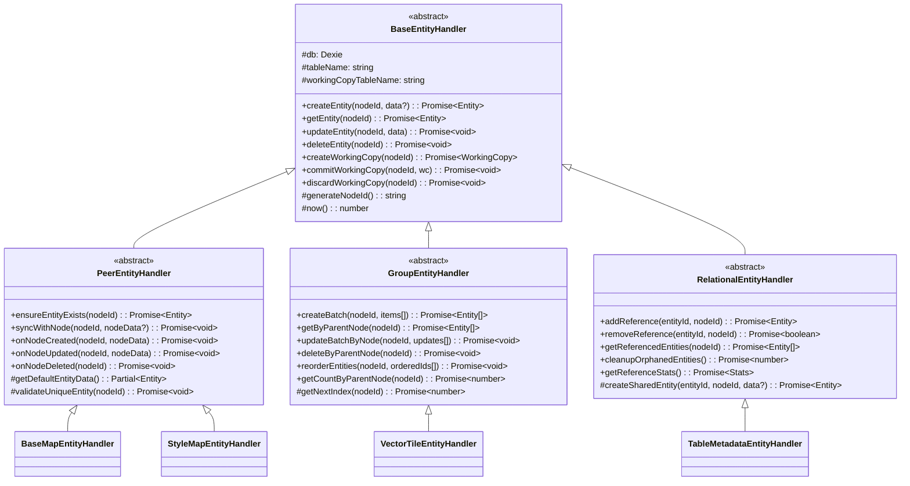

# エンティティ分類システム

## はじめに

この章では、HierarchiDBのエンティティ分類システムの詳細な設計思想と実装方法について説明します。本章は以下のような方を対象としています：

**読むべき人**: プラグイン開発者、データベース設計者、エンティティハンドラー実装者、データライフサイクル管理を理解したい開発者、システムアーキテクト

**前提知識**: データベース設計の基本概念、リレーショナルデータベースの制約、ライフサイクル管理、参照整合性、カスケード削除の概念

**読むタイミング**: プラグイン開発でエンティティ設計を行う前の必読事項として、または既存エンティティの関係性を理解・拡張する際に参照してください。BaseMap、StyleMap、Shape、Spreadsheet、Projectプラグインのような複雑なデータ関係を持つプラグインを実装する場合、適切なエンティティ分類の選択により自動ライフサイクル管理とパフォーマンス最適化の恩恵を受けることができます。

エンティティ分類システムは、データの永続性・関係性・ライフサイクルを明確に分類することで、適切な設計判断とデータベース最適化を支援します。

## 2×3 エンティティ分類

HierarchiDBのエンティティシステムは、ツリーノードとの紐付け構造（3種類）とライフサイクル（2種類）の組み合わせによる6分類で構成されます。

## 基本3分類（紐付け構造）

### 1. Peer（1対1関係）

**定義**: TreeNodeと1対1で対応するエンティティ

**特徴:**
- 各TreeNodeに対して必ず1つのPeerエンティティが存在
- TreeNodeのライフサイクルと完全に同期
- TreeNode削除時に自動削除

**例:**
```typescript
interface BaseMapEntity extends BaseEntity {
  nodeId: NodeId;  // 1対1の関係
  center: [number, number];
  zoom: number;
  style: string;
}
```

### 2. Group（1対N関係）

**定義**: 1つのTreeNodeに対して複数存在可能なエンティティ

**特徴:**
- 同一TreeNodeに複数のGroupエンティティが紐付け可能
- 個別にライフサイクル管理
- 親TreeNode削除時に全て削除

**例:**
```typescript
interface VectorTileEntity extends BaseEntity {
  nodeId: NodeId;  // 1対Nの関係
  tileIndex: number;
  zoom: number;
  x: number;
  y: number;
  data: ArrayBuffer;
}
```

### 3. Relation（N対N関係）

**定義**: 複数のTreeNodeで共有されるエンティティ

**特徴:**
- リファレンスカウントによる管理
- 最後の参照が削除されたときに自動削除
- データの重複を防ぐ

**例:**
```typescript
interface TableMetadataEntity extends BaseEntity {
  nodeIds: NodeId[];  // N対Nの関係
  referenceCount: number;
  filename: string;
  tableData: any[][];
}
```

## ライフサイクル2分類

### 1. Persistent（永続的）

**定義**: 長期保存が必要なデータ

**特徴:**
- CoreDBに保存
- ブラウザを閉じても保持
- 明示的な削除まで存続

**用途:**
- 最終成果物
- ユーザー設定
- 共有リソース

### 2. Ephemeral（一時的）

**定義**: セッション限定のデータ

**特徴:**
- EphemeralDBに保存
- ダイアログ閉鎖時に削除
- ワーキングコピーと連動

**用途:**
- 編集中データ
- 中間処理結果
- UI状態

## プラグインレジストリAPI

### PluginRegistryAPIの役割

プラグインシステムの中核となるAPIで、ノードタイプの登録・管理・実行を担当します。

**主要機能:**
```typescript
const pluginRegistry = await workerAPI.getPluginRegistryAPI();

// ノードタイプの登録
await pluginRegistry.registerNodeType({
  nodeType: 'myNodeType',
  displayName: 'My Custom Node',
  description: 'Custom node implementation',
  icon: 'folder',
  database: { /* Dexie設定 */ },
  entityHandler: new MyEntityHandler(),
  lifecycle: { /* ライフサイクルフック */ },
  ui: { /* UIコンポーネント */ }
});

// 登録済みノードタイプの確認
const isSupported = await pluginRegistry.isNodeTypeSupported('myNodeType');
const nodeTypes = await pluginRegistry.listSupportedNodeTypes();

// メタデータとCapabilityの取得
const metadata = await pluginRegistry.getNodeTypeMetadata('myNodeType');
const capabilities = await pluginRegistry.getNodeTypeCapabilities('myNodeType');

// ライフサイクルフックの実行
await pluginRegistry.invokeLifecycleHook('afterCreate', 'myNodeType', context);
```

### プラグインAPI拡張

プラグインは独自のAPIメソッドを定義可能：

```typescript
// プラグイン固有のAPI定義
const myPluginAPI: PluginAPI<MyMethods> = {
  nodeType: 'myNodeType',
  methods: {
    customImport: async (file: File) => { /* 実装 */ },
    customExport: async (nodeId: NodeId) => { /* 実装 */ },
    analyze: async (params: AnalyzeParams) => { /* 実装 */ }
  }
};

// クライアントからの呼び出し
const hasMethod = await pluginRegistry.hasPluginMethod('myNodeType', 'customImport');
if (hasMethod) {
  const result = await pluginRegistry.invokePluginMethod(
    'myNodeType',
    'customImport',
    file
  );
}
```

## エンティティハンドラーの階層構造

エンティティハンドラーは、エンティティの種類に応じた専門的な処理を提供する、オブジェクト指向の階層構造を形成しています。

### クラス階層図



### 各ハンドラーの責務

**BaseEntityHandler（基底クラス）**
すべてのエンティティハンドラーの共通機能を提供します。CRUD操作、ワーキングコピー管理、タイムスタンプ処理など、基本的な機能が実装されています。

**PeerEntityHandler（1対1関係）**
TreeNodeと1対1で対応するエンティティを管理します。ノードのライフサイクルと完全に同期し、ノードが作成されると自動的にエンティティも作成されます。

**GroupEntityHandler（1対N関係）**
一つのTreeNodeに複数のエンティティが紐付く場合の処理を担当します。バッチ操作、並び替え、ページネーションなど、コレクション操作に特化した機能を提供します。

**RelationalEntityHandler（N対N関係）**
複数のTreeNodeで共有されるエンティティを管理します。参照カウントによる自動削除、孤立エンティティのクリーンアップなど、複雑な関係性を適切に処理します。

## 6分類マトリックス

| | Peer (1:1) | Group (1:N) | Relation (N:N) |
|---|---|---|---|
| **Persistent** | 設定データ | 成果物データ | 共有リソース |
| (CoreDB) | • BaseMapEntity | • VectorTileEntity | • TableMetadataEntity |
| | • StyleMapEntity | • ProcessedFeature | • SharedStyleRule |
| | • ShapesEntity | • BatchResult | • CacheIndex |
| **Ephemeral** | UI状態 | 中間データ | セッション管理 |
| (EphemeralDB) | • ViewState | • ProcessBuffer | • BatchSession |
| | • EditState | • FeatureIndex | • TempReference |
| | • FormData | • TileBuffer | • SharedLock |

## エンティティ管理

### 自動ライフサイクル管理

```typescript
// エンティティマネージャー階層
class EntityManager {
  // Peer×Persistent
  peerPersistentManager: PeerPersistentManager;
  // Peer×Ephemeral
  peerEphemeralManager: PeerEphemeralManager;
  // Group×Persistent
  groupPersistentManager: GroupPersistentManager;
  // Group×Ephemeral
  groupEphemeralManager: GroupEphemeralManager;
  // Relation×Persistent
  relationPersistentManager: RelationPersistentManager;
  // Relation×Ephemeral
  relationEphemeralManager: RelationEphemeralManager;
}
```

### Peerエンティティ管理

```typescript
class PeerManager<T extends BaseEntity> {
  async create(nodeId: NodeId, data: Partial<T>): Promise<T> {
    // TreeNodeと1対1で作成
    const entity = {
      ...data,
      id: nodeId,  // 同じIDを使用
      nodeId: nodeId,
      createdAt: Date.now(),
      updatedAt: Date.now()
    };
    return await this.db.entities.add(entity);
  }

  async delete(nodeId: NodeId): Promise<void> {
    // TreeNode削除時に自動削除
    await this.db.entities.delete(nodeId);
  }
}
```

### Groupエンティティ管理

```typescript
class GroupManager<T extends BaseEntity> {
  async createBatch(nodeId: NodeId, items: Partial<T>[]): Promise<T[]> {
    // 複数エンティティを一括作成
    const entities = items.map((item, index) => ({
      ...item,
      id: generateUUID(),
      nodeId: nodeId,
      index,
      createdAt: Date.now()
    }));
    return await this.db.entities.bulkAdd(entities);
  }

  async deleteByNode(nodeId: NodeId): Promise<void> {
    // ノードに紐づく全エンティティを削除
    await this.db.entities
      .where('nodeId')
      .equals(nodeId)
      .delete();
  }
}
```

### Relationエンティティ管理

```typescript
class RelationManager<T extends BaseEntity> {
  async addReference(entityId: string, nodeId: NodeId): Promise<void> {
    const entity = await this.db.entities.get(entityId);
    if (!entity) {
      // 新規作成
      await this.create(entityId, nodeId);
    } else {
      // 参照追加
      entity.nodeIds.push(nodeId);
      entity.referenceCount++;
      await this.db.entities.update(entityId, entity);
    }
  }

  async removeReference(entityId: string, nodeId: NodeId): Promise<void> {
    const entity = await this.db.entities.get(entityId);
    if (entity) {
      entity.nodeIds = entity.nodeIds
        .filter(id => id !== nodeId);
      entity.referenceCount--;
      
      if (entity.referenceCount === 0) {
        // 最後の参照が削除されたら自動削除
        await this.db.entities.delete(entityId);
      } else {
        await this.db.entities.update(entityId, entity);
      }
    }
  }
}
```

## プラグインでの利用

### エンティティ定義

```typescript
// プラグイン定義でエンティティタイプを指定
const BaseMapPlugin: PluginDefinition = {
  nodeType: 'basemap',
  entities: {
    main: {
      type: 'peer',
      lifecycle: 'persistent',
      storeName: 'baseMapEntities'
    }
  }
};

const ShapesPlugin: PluginDefinition = {
  nodeType: 'shapes',
  entities: {
    config: {
      type: 'peer',
      lifecycle: 'persistent',
      storeName: 'shapesEntities'
    },
    tiles: {
      type: 'group',
      lifecycle: 'persistent',
      storeName: 'vectorTileEntities'
    },
    processBuffer: {
      type: 'group',
      lifecycle: 'ephemeral',
      storeName: 'processBuffers'
    },
    sourceData: {
      type: 'relation',
      lifecycle: 'persistent',
      storeName: 'sourceDataEntities'
    }
  }
};
```

### ライフサイクルフック

```typescript
const ShapesLifecycle = {
  afterCreate: async (node: TreeNode, context: Context) => {
    // Peerエンティティ自動作成
    await context.entities.peer.create(node.id, {
      defaultConfig: getDefaultConfig()
    });
  },

  beforeDelete: async (node: TreeNode, context: Context) => {
    // Groupエンティティ削除
    await context.entities.group.deleteByNode(node.id);
    // Relation参照削除
    await context.entities.relation.removeAllReferences(node.id);
  },

  onWorkingCopyDiscard: async (workingCopyId: string, context: Context) => {
    // Ephemeralエンティティ自動削除
    await context.entities.ephemeral.deleteByWorkingCopy(workingCopyId);
  }
};
```

## ベストプラクティス

### エンティティタイプの選択

**Peerを選ぶ場合:**
- TreeNodeと1対1の設定データ
- ノードの基本属性
- UI設定

**Groupを選ぶ場合:**
- 複数の関連データ
- バッチ処理結果
- 子要素のコレクション

**Relationを選ぶ場合:**
- 複数ノードで共有するデータ
- キャッシュデータ
- 参照データ

### ライフサイクルの選択

**Persistentを選ぶ場合:**
- ユーザーが作成した成果物
- 設定値
- 長期保存が必要なデータ

**Ephemeralを選ぶ場合:**
- 編集中の一時データ
- 処理中間結果
- セッション情報

## 次のステップ

- [エンティティライフサイクル管理](./04-plugin-lifecycle.md)
- [プラグイン開発](./04-plugin-overview.md)
- [標準プラグイン](./04-plugin-catalog.md)