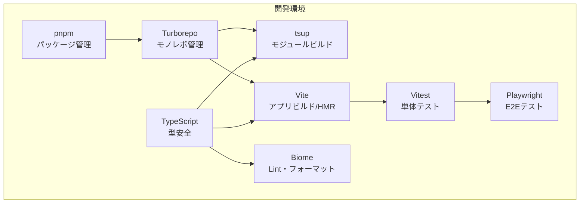

# 2. ツールセット

# 開発環境のセットアップ

## この章について

この章では、HierarchiDBの開発環境構築手順と推奨設定について説明します。

**読むべき人**: 開発者、システム管理者、HierarchiDBの環境構築を担当する方
**前提知識**: Node.js、npm/pnpm、TypeScript、Git の基本操作
**読むタイミング**: 
- 初回開発環境構築時
- 開発環境で問題が発生した時
- チームメンバーの環境統一時
- CI/CD設定時

この章では、モノレポ構成、TypeScript設定、各種プラグイン（BaseMap、StyleMap、Shape、Spreadsheet、Project）の開発環境、テスト環境の構築方法を学べます。また、大容量spreadsheetデータのローカル開発時の注意点も含まれています。適切な環境構築により、効率的な開発とデバッグが可能になります。

## 2.1 開発環境の全体方針

本プロジェクトは、**モノレポ構成**とし、複数のモジュール（core, api, worker, ui, bff, cors-proxy, app、および拡張モジュール群）を一元的に管理します。  
依存関係の整合性を保ち、ビルド・テスト・デプロイの効率化を目的として、パッケージマネージャには **pnpm** を採用し、ビルドオーケストレーションには **Turborepo** を利用します。

全モジュール共通で **TypeScript** による型安全な実装を行い、コード品質維持のための Lint / Format / Test / E2E 環境を統一します。

### バージョン標準化
- **React 19**: 全UIパッケージで React 19.1.1 を使用（peerDependencies は >=18.0.0 で互換性維持）
- **TypeScript ES2022**: 全パッケージでコンパイルターゲットを ES2022 に統一
- **設定の最小化**: 各パッケージのtsconfig.jsonは差分のみ記述し、共通設定は tsconfig.base.json から継承

## 2.2 ツールセット一覧

| ツール | 用途 | 補足 |
|--------|------|------|
| **pnpm** | パッケージ管理 | 高速インストール・依存の重複排除 |
| **Turborepo** | モノレポ管理 | ビルド/テストのキャッシュ・並列化・依存解決 |
| **TypeScript** | 型安全な実装 | ES2022ターゲット、any禁止、strictモード必須 |
| **tsup** | モジュールビルド | 高速TypeScriptビルド、ESM/CJS対応 |
| **tsc-alias** | パスエイリアス解決 | TypeScriptエイリアスの実行時解決 |
| **Biome** | Lint・フォーマット | 高速な統合開発ツール |
| **React 19** | UIフレームワーク | 最新の並行レンダリング機能 |
| **Vite** | フロントエンドビルド | 高速HMR、React 19/TypeScript対応 |
| **Vitest** | 単体テスト | Jest互換API、Vite統合 |
| **Playwright** | E2Eテスト | UI操作の自動化・クロスブラウザ検証 |

## 2.3 各ツールの役割と設定方針

### 2.3.1 pnpm
- モノレポルートに `pnpm-workspace.yaml` を配置
- 全モジュールの依存は極力ルートで一元管理し、モジュール固有依存はモジュール直下の `package.json` に記載
- `pnpm install` は常に `--frozen-lockfile` を推奨（CI/CD 一貫性確保）

### 2.3.2 Turborepo
- 各モジュールは `packages/` または `apps/` ディレクトリ配下に配置
- `turbo.json` にてビルドパイプラインを定義
    - 例：`build` → `test` → `lint`
- キャッシュを活用し、未変更モジュールの再ビルドをスキップ

### 2.3.3 TypeScript
- 全モジュールで `tsconfig.json` を共通化（ルートに `tsconfig.base.json`）
- **コンパイルターゲット**: ES2022（全パッケージで統一）
- `strict: true`、`noImplicitAny: true`、`exactOptionalPropertyTypes: true` を必須
- 型定義は `core` モジュールに集約し、他モジュールから参照

#### TypeScript Project References ポリシー

モノレポ全体で一貫したTypeScript設定を維持するため、以下のポリシーを適用します：

**1. 基盤・実装ライブラリ** (`composite: true`, `incremental: true`)
```json
{
  "extends": "../../tsconfig.base.json",
  "compilerOptions": {
    "composite": true,
    "incremental": true,
    "noEmit": false,
    "outDir": "./dist",
    "rootDir": "./src"
  }
}
```
- 対象：`packages/core`, `packages/api`, `packages/worker`, `packages/ui/client`, `packages/ui/core`
- 他パッケージから参照される基盤パッケージ
- Project References での依存関係管理が必須

**2. UI機能ライブラリ** (`composite: true`, `incremental: true`)
```json
{
  "extends": "../../../tsconfig.base.json", 
  "compilerOptions": {
    "composite": true,
    "incremental": true,
    "outDir": "./dist",
    "rootDir": "./src",
    "allowImportingTsExtensions": false,
    "jsx": "react-jsx"
  }
}
```
- 対象：すべての `packages/ui/*` パッケージ、`packages/ui-*` パッケージ
- Reactコンポーネントを含むUIライブラリ
- `allowImportingTsExtensions: false` を必須（composite制約のため）

**3. プラグイン** (`composite: true`, `incremental: true`)
```json
{
  "extends": "../../../tsconfig.base.json",
  "compilerOptions": {
    "composite": true,
    "incremental": true,
    "outDir": "./dist",
    "rootDir": "./src",
    "jsx": "react-jsx"
  }
}
```
- 対象：`packages/plugins/*` パッケージ
- 独立性を保ちつつ他パッケージから参照可能

**4. アプリケーション・バックエンド** (`composite: false`, `incremental: true`)
```json
{
  "extends": "../../tsconfig.base.json",
  "compilerOptions": {
    "composite": false,
    "incremental": true,
    "outDir": "./dist",
    "baseUrl": "."
  }
}
```
- 対象：`packages/app`, `packages/backend/*`
- 最終成果物のため他から参照されない
- ビルド高速化のためincremental有効

**設定変更時の注意点：**
- `composite: true` を設定した場合、必ず `incremental: true` も併設する
- `allowImportingTsExtensions: true` はcompositeプロジェクトでは使用不可
- `moduleResolution: "bundler"` はcompositeプロジェクトでは `"node"` を使用する
- Project References (`references` フィールド) で依存関係を明示する
- 新規パッケージ作成時は上記ポリシーに従って設定する

**tsup との組み合わせ時の設定：**
compositeプロジェクトでtsupを使用する場合、tsupの型定義生成でcomposite設定を無効化する必要があります：

```typescript
// tsup.config.ts
export default defineConfig({
  entry: ['src/openstreetmap-type.ts'],
  format: ['esm', 'cjs'],
  dts: {
    compilerOptions: {
      composite: false,
      incremental: false,
    },
  },
  // その他の設定...
});
```

これにより、tsconfig.jsonではProjectReferences用のcomposite設定を維持しながら、tsupでの型定義生成時のみcomposite制約を回避できます。

### 2.3.4 Biome
- 高速なLint・フォーマット統合ツール（ESLint/Prettier代替）
- 主なルール設定：
  - `noExplicitAny: warn` - any使用を警告
  - `noUnusedVariables: warn` - 未使用変数を警告
  - `noUnusedImports: warn` - 未使用インポートを警告
  - `useConst: warn` - const使用を推奨
  - `useImportType: warn` - 型インポートの適切な使用
- フォーマット設定：
  - インデント: スペース2文字
  - 行幅: 100文字
  - 改行コード: LF
  - セミコロン: 必須
  - シングルクォート使用
- CIで `pnpm lint` (`biome check`) を実行

### 2.3.5 tsup
- 各UIパッケージのビルドツールとして採用（ui-theme含む）
- TypeScriptコンパイラよりも高速
- ESM/CJS両対応、自動型定義生成
- 内蔵エイリアス処理により`~/*`パスを自動解決
- 設定例：
```typescript
export default defineConfig({
  entry: ['src/openstreetmap-type.ts'],
  format: ['esm', 'cjs'],
  dts: true,
  clean: true,
  sourcemap: true
});
```

### 2.3.6 tsc-alias
- TypeScriptコンパイラでは解決されないパスエイリアスの実行時処理
- 主に`~/*`エイリアスを実際のファイルパスに変換
- tsup採用により使用頻度は減少

### 2.3.7 Vite
- アプリケーション（packages/app）のビルド・開発サーバー
- HMRを有効化し、開発効率を向上
- TypeScript + React + MUI の構成に最適化
- パッケージエイリアス解決：開発時は`src`、本番時は`dist`を自動選択
- 本番ビルドではコードスプリッティングを利用

### 2.3.8 Vitest
- 単体テストはUI層・Worker層・coreモジュールを対象
- モジュール直下に `__tests__` ディレクトリを配置
- 100%カバレッジは必須ではないが、重要モジュールは80%以上を推奨

### 2.3.9 Playwright
- E2Eテストでアプリ全体の動作確認を行う
- シナリオ例：
    - ツリーノードの作成・編集・削除
    - Undo/Redo動作確認
    - データ購読と差分反映
- CI/CDでクロスブラウザ（Chromium, Firefox, WebKit）検証

## 2.4 CI/CD連携方針
- GitHub Actions を利用
- プルリクエスト時に以下を実行：
    1. `pnpm install --frozen-lockfile`
    2. `pnpm lint` （Biomeによるlint・format チェック）
    3. `pnpm build`
    4. `pnpm test`
    5. `pnpm e2e`（E2Eテスト）

---

## 2.5 ツールセット構成図



## 2.6 ビルドシステムの統一

### 2.6.1 パッケージ別ビルドツール
- **アプリケーション**: Vite（packages/app）
- **UIパッケージ**: tsup（packages/ui-*）
- **コアライブラリ**: tsup（packages/core, api, worker）
- **プラグイン**: tsup（packages/plugins/*）

### 2.6.2 パスエイリアス戦略
- **プロジェクト間**: `@hierarchidb/package-name`で絶対参照
- **パッケージ内**: 相対パス（`./components/Button`）を推奨
- **`~/*`エイリアス**: 使用を避ける（Vite開発環境でのモジュール解決問題のため）

### 2.6.3 開発時のモジュール参照
Viteアプリケーション設定により、開発効率を最適化：
- **開発時**: 各パッケージの`src`を直接参照（HMR対応）
- **本番時**: ビルドされた`dist`を参照
- **例外**: プラグインは安定性のため常に`dist`を参照

## 2.7 Turborepo を使った開発運用（HMR と再ビルドの使い分け）

本モノレポでは、UI 系（Vite）とライブラリ/ワーカー系（tsup）を Turborepo で横断制御します。変更内容に応じて次のどちらかのフローを選びます。

- 変更が即時反映される（ホットリロード/HMRが効く）ケース
- 変更ごとに個別パッケージのビルド（またはウォッチ）・再起動が必要なケース

### 2.7.1 即時反映（HMR）される主なケース
- **アプリケーション**: `@hierarchidb/app` 直下の画面・ルート・コンポーネントの変更
- **UIパッケージ**: 開発時`src`参照により、UIコンポーネントの変更も即座にHMR反映
- **スタイル変更**: MUIテーマ、CSS、Emotionスタイルの変更

推奨手順:
1) アプリだけ起動して開発する
   - ルートから（Turborepo経由）
     - `pnpm dev --filter @hierarchidb/app`
     - または `turbo run dev --filter=@hierarchidb/app`
   - Vite の HMR により、`packages/app` 内の変更が即時反映されます。

補足:
- モノレポで多数の `dev` が存在するため、全パッケージを一斉に起動したくない場合は、上記のように `--filter` を必ず付けて対象を絞ってください。
- UIパッケージの変更は開発時`src`参照により自動でHMR反映されます。

### 2.7.2 個別パッケージのビルド・インストールが必要な主なケース
- ライブラリ（`@hierarchidb/core`, `@hierarchidb/api`, `@hierarchidb/worker` など）のビルド成果物（dist）を他パッケージが参照している場合
- 型の公開面（exported types）を変更して依存側で型エラーが起きる場合（依存側の再ビルド/再起動が必要）
- Node/Workers ベースのサービス（例：`@hierarchidb/bff`, `@hierarchidb/cors-proxy`）が稼働しており、依存変更を取り込む再起動が必要な場合
- 依存関係（package.json）の追加・更新・削除を行った場合（`pnpm install` が必要）

典型手順:
- あるライブラリだけビルドする
  - `pnpm --filter @hierarchidb/core build`
  - `pnpm --filter @hierarchidb/api build`
  - `pnpm --filter @hierarchidb/worker build`
- 変更を監視しながらライブラリをビルドする（推奨）
  - `pnpm --filter @hierarchidb/core dev`（= `tsup --watch`）
  - `pnpm --filter @hierarchidb/api dev`
  - `pnpm --filter @hierarchidb/worker dev`
  - 複数を並列で:
    - `turbo run dev --filter=@hierarchidb/core --filter=@hierarchidb/api --filter=@hierarchidb/worker --parallel`
- アプリ側に反映させる
  - 上記ウォッチにより dist が更新されると、`@hierarchidb/app` の Vite が差分を取り込み、必要に応じて HMR またはリロードが走ります。
  - うまく反映されない場合は、アプリを再起動（`Ctrl+C` → 再度 `pnpm dev --filter @hierarchidb/app`）。
- 依存を変更した場合
  - ルートで `pnpm install`（CI と同様に一貫性を担保したい場合は `pnpm install --frozen-lockfile`）。
  - その後、関係する `dev`/`build` プロセスを再起動。

### 2.7.3 Turborepo とフィルタの実践例
- モノレポ全体をビルド（依存順に）
  - `pnpm build`（= `turbo run build`）
- 特定パッケージだけビルド
  - `turbo run build --filter=@hierarchidb/app`
- 特定パッケージ群の開発サーバやウォッチを並列起動
  - `turbo run dev --filter=@hierarchidb/app --filter=@hierarchidb/core --parallel`
- キャッシュを無効化して都度実行（デバッグ用）
  - `TURBO_FORCE=true turbo run build --filter=@hierarchidb/core`

ベストプラクティス:
- 日常開発では「アプリ（Vite HMR）+ 変更中ライブラリ（tsup --watch）」の併用が最も快適です。
- UIパッケージは開発時`src`参照により、別途ビルドプロセス不要でHMR対応します。
- 多数パッケージの並列起動はマシン負荷が高いため、`--filter` で最小限に絞る運用を徹底してください。
- 依存の追加/削除時は必ず `pnpm install` を実施し、必要に応じて dev プロセスの再起動を行ってください。

## 2.8 非推奨型・メソッド・プロパティの検出

### 2.8.1 ESLint8 併用による非推奨要素の検出

本プロジェクトでは主要Lint/フォーマットツールとしてBiomeを使用していますが、TypeScriptの `@deprecated` JSDocコメントによる非推奨要素の検出には **ESLint8** を併用しています。

### 2.8.2 設定と運用

**設定ファイル**: `.eslintrc.deprecated.cjs`
```javascript
module.exports = {
  root: true,
  parser: '@typescript-eslint/parser',
  plugins: ['deprecation', '@typescript-eslint'],
  parserOptions: {
    ecmaVersion: 2022,
    sourceType: 'module',
    project: [
      './tsconfig.json',
      './packages/*/tsconfig.json'
    ],
    tsconfigRootDir: __dirname,
  },
  rules: {
    'deprecation/deprecation': 'error'
  },
  ignorePatterns: [
    'node_modules/',
    'dist/',
    'build/',
    '.turbo/',
    'coverage/',
    '**/*.config.js',
    '**/*.config.ts',
    '**/*.d.ts',
    '**/*.test.ts',
    '**/*.test.tsx',
    '**/*.spec.ts',
    '**/*.spec.tsx'
  ]
};
```

**実行コマンド**: 
```bash
pnpm lint:deprecated
```

**運用方針**:
- **ビルドプロセス組み込み**: CI/CDパイプラインで `pnpm lint:deprecated` を実行し、非推奨要素の使用を検出した場合は **ビルド失敗** させる
- **型移行時の安全装置**: パッケージ間の型移行（例：`NodeTypeDefinition` → `NodeDefinition`）時に、一時的な型エイリアスに `@deprecated` を付与し、移行完了後の除去を確実に行う
- **外部ライブラリの非推奨API検出**: RxJSのsubscribeメソッドやJavaScriptのsubstrメソッドなど、外部ライブラリの非推奨APIも検出対象

### 2.8.3 検出される非推奨要素の例

```typescript
// 型移行時の一時的エイリアス
/** @deprecated Use NodeDefinition instead. This alias will be removed after plugin migration is complete */
export type NodeTypeDefinition = NodeDefinition;

// 外部ライブラリの非推奨API
observable.subscribe(next, error); // ← ESLintで検出される
str.substr(0, 5); // ← ESLintで検出される
```

### 2.8.4 技術的背景

- **TypeScript コンパイラの制約**: TypeScript自体は `@deprecated` JSDocを型チェック時に警告として出力しない（IDEの表示機能のみ）
- **ESLint deprecation プラグインの活用**: TypeScriptのASTを解析し、`@deprecated` マークされた要素の使用を実際に検出・エラー化
- **ESLint8 での互換性確保**: `eslint-plugin-deprecation` は ESLint 9.x では互換性に問題があるため、ESLint 8.57.1 を使用

この仕組みにより、アーキテクチャルな制約（プラグインはworkerパッケージを直接参照禁止など）を技術的に強制し、コードベースの健全性を保持します。
