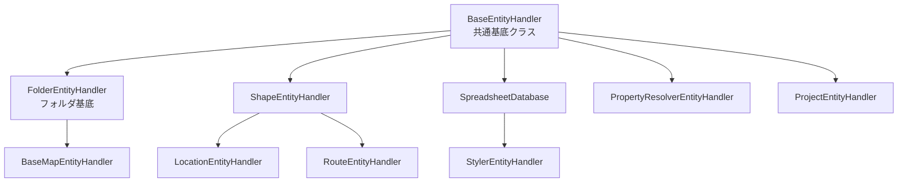

# 拡張版プラグイン共通化分析レポート

## 1. 分析対象プラグイン一覧（9プラグイン）

### 基本プラグイン群
1. **Shape** - 地理データ処理（GeoJSON、シェープファイル）
2. **Location** - 地点データ管理（Shape拡張）
3. **Route** - 経路データ管理（Shape拡張）
4. **Spreadsheet** - 表形式データ処理
5. **Styler** - スタイルマッピング（Spreadsheet拡張）

### 追加分析プラグイン群
6. **Folder** - フォルダ階層管理（基底実装）
7. **BaseMap** - ベースマップ設定（Folder拡張）
8. **PropertyResolver** - データ変換ルール管理
9. **Project** - プロジェクトコンテナ管理

## 2. 継承関係と依存パターン



## 3. 共通化パターンの詳細分析

### 3.1 EntityHandler実装パターン

| プラグイン | 実装方式 | CRUD | Draft | 特殊メソッド |
|-----------|---------|------|-------------|-------------|
| **Folder** | 独自実装 | ✅ | ✅ | addBookmark, addTemplate |
| **BaseMap** | Folder継承 | ✅ | ✅ | setStyle, setProvider |
| **Shape** | 独自実装 | ✅ | ✅ | updateProcessingStatus |
| **Location** | 独自実装 | ✅ | ✅ | updateCoordinates |
| **Route** | 独自実装 | ✅ | ✅ | updatePath |
| **Spreadsheet** | DB直接 | ✅ | ✅ | createRowChunks |
| **Styler** | 委譲パターン | ✅ | ✅ | applyStyles |
| **PropertyResolver** | 独自実装 | ✅ | ✅ | compileResolver |
| **Project** | 独自実装 | ✅ | ✅ | addResource |

### 3.2 データベース管理パターン

#### パターンA: 専用DB管理クラス（4プラグイン）
- **Folder**: FolderDatabase クラス
- **Spreadsheet**: SpreadsheetDatabase クラス
- **Shape**: ShapeDB + EphemeralShapeDB
- **Project**: ProjectDatabase クラス

#### パターンB: EntityHandler内包型（3プラグイン）
- **PropertyResolver**: 内部でDexieテーブル管理
- **Location**: 内部でDexieテーブル管理
- **Route**: 内部でDexieテーブル管理

#### パターンC: 親クラス委譲型（2プラグイン）
- **BaseMap**: FolderDatabaseを継承
- **Styler**: SpreadsheetDatabaseを利用

### 3.3 Draft管理の実装差異

```typescript
// パターン1: EphemeralDB利用（Shape, Folder, Spreadsheet）
class Pattern1Handler {
  async createDraft(entity: Entity): Promise<Draft> {
    const draft = this.buildDraft(entity);
    await this.ephemeralDB.workingCopies.add(draft);
    return draft;
  }
}

// パターン2: メモリ内管理（PropertyResolver, Project）
class Pattern2Handler {
  private workingCopies = new Map<NodeId, Draft>();
  
  async createDraft(nodeId: NodeId): Promise<Draft> {
    const entity = await this.getEntity(nodeId);
    const draft = { ...entity, isDraft: false };
    this.workingCopies.set(nodeId, draft);
    return draft;
  }
}

// パターン3: 即座返却型（Styler, BaseMap）
class Pattern3Handler {
  async createDraft(nodeId: NodeId): Promise<Draft> {
    const entity = await this.getEntity(nodeId);
    return { ...entity, isDraft: false, copiedAt: Date.now() };
  }
}
```

## 4. 共通化による削減効果（拡張版）

### 全9プラグインでの削減見込み

| 共通化対象 | 現在の重複行数 | 削減可能行数 | 削減率 |
|-----------|--------------|------------|--------|
| EntityHandler基底 | 約2,700行 | 約2,200行 | 81% |
| Draft管理 | 約1,350行 | 約1,100行 | 81% |
| データベース操作 | 約900行 | 約700行 | 78% |
| CSV/ファイル処理 | 約600行 | 約500行 | 83% |
| 検索・フィルタリング | 約450行 | 約350行 | 78% |
| バルク操作 | 約300行 | 約250行 | 83% |
| **合計** | **約6,300行** | **約5,100行** | **81%** |

## 5. 新規共通化コンポーネント提案

### 5.1 階層型EntityHandler

```typescript
// packages/_obsolate_common/plugin-base/src/handlers/HierarchicalEntityHandler.ts
export abstract class HierarchicalEntityHandler<
  TEntity extends BaseEntity & { parentId?: NodeId },
  TDraft extends BaseDraft
> extends BaseEntityHandler<TEntity, TDraft> {
  
  // 階層構造管理
  async getChildren(parentId: NodeId): Promise<TEntity[]> {
    return await this.table.where('parentId').equals(parentId).toArray();
  }
  
  async getAncestors(nodeId: NodeId): Promise<TEntity[]> {
    const ancestors: TEntity[] = [];
    let current = await this.getEntityByNodeId(nodeId);
    
    while (current?.parentId) {
      const parent = await this.getEntityByNodeId(current.parentId);
      if (parent) {
        ancestors.push(parent);
        current = parent;
      } else {
        break;
      }
    }
    
    return ancestors;
  }
  
  async moveNode(nodeId: NodeId, newParentId: NodeId): Promise<void> {
    const entity = await this.getEntityByNodeId(nodeId);
    if (!entity) throw new Error('Node not found');
    
    await this.updateEntity(entity.id, { parentId: newParentId });
  }
}
```

### 5.2 拡張可能EntityHandler

```typescript
// packages/_obsolate_common/plugin-base/src/handlers/ExtensibleEntityHandler.ts
export abstract class ExtensibleEntityHandler<
  TEntity extends BaseEntity,
  TDraft extends BaseDraft,
  TExtension = any
> extends BaseEntityHandler<TEntity, TDraft> {
  
  protected extensions = new Map<string, TExtension>();
  
  // 拡張機能の登録
  registerExtension(name: string, extension: TExtension): void {
    this.extensions.set(name, extension);
  }
  
  // 拡張機能の取得
  getExtension(name: string): TExtension | undefined {
    return this.extensions.get(name);
  }
  
  // 拡張メソッドの実行
  async executeExtension<TResult>(
    name: string,
    method: string,
    ...args: any[]
  ): Promise<TResult> {
    const extension = this.extensions.get(name);
    if (!extension) {
      throw new Error(`Extension ${name} not found`);
    }
    
    const fn = (extension as any)[method];
    if (typeof fn !== 'function') {
      throw new Error(`Method ${method} not found in extension ${name}`);
    }
    
    return await fn.apply(extension, args);
  }
}
```

### 5.3 メタデータ管理Handler

```typescript
// packages/_obsolate_common/plugin-base/src/handlers/MetadataEntityHandler.ts
export abstract class MetadataEntityHandler<
  TEntity extends BaseEntity & { metadata?: Record<string, any> },
  TDraft extends BaseDraft
> extends BaseEntityHandler<TEntity, TDraft> {
  
  // メタデータ操作
  async setMetadata(
    entityId: EntityId,
    key: string,
    value: any
  ): Promise<void> {
    const entity = await this.getEntity(entityId);
    if (!entity) throw new Error('Entity not found');
    
    const metadata = entity.metadata || {};
    metadata[key] = value;
    
    await this.updateEntity(entityId, { metadata });
  }
  
  async getMetadata(entityId: EntityId, key: string): Promise<any> {
    const entity = await this.getEntity(entityId);
    return entity?.metadata?.[key];
  }
  
  async deleteMetadata(entityId: EntityId, key: string): Promise<void> {
    const entity = await this.getEntity(entityId);
    if (!entity?.metadata) return;
    
    delete entity.metadata[key];
    await this.updateEntity(entityId, { metadata: entity.metadata });
  }
}
```

## 6. プラグイン固有の共通化対象

### 6.1 Folder/BaseMap共通化
- ブックマーク管理
- テンプレート管理
- 設定管理（settings）
- 階層構造ナビゲーション

### 6.2 Shape/Location/Route共通化
- GeoJSON処理
- 座標変換
- 空間インデックス
- ベクトルタイル生成

### 6.3 Spreadsheet/Styler共通化
- CSV/Excelインポート
- カラム型推定
- チャンク処理
- フィルタリング

### 6.4 PropertyResolver/Project共通化
- リソース管理
- 依存関係解決
- コンパイル/ビルド処理
- バージョニング

## 7. 実装優先度マトリックス

| 共通化対象 | 影響プラグイン数 | 削減行数 | 実装難易度 | 優先度 |
|-----------|----------------|---------|-----------|--------|
| BaseEntityHandler | 9 | 2,200 | 低 | **最高** |
| DraftManager | 9 | 1,100 | 中 | **高** |
| HierarchicalHandler | 4 | 400 | 低 | **高** |
| CSVProcessor | 2 | 500 | 低 | **中** |
| MetadataHandler | 6 | 300 | 低 | **中** |
| ExtensibleHandler | 3 | 200 | 高 | **低** |

## 8. 段階的移行計画（改訂版）

### Phase 1: 基盤整備（1週間）
- ✅ plugin-baseパッケージ作成
- ✅ BaseEntityHandler実装
- ⬜ HierarchicalEntityHandler実装
- ⬜ MetadataEntityHandler実装

### Phase 2: Folder系移行（1週間）
- ⬜ FolderEntityHandlerをHierarchicalHandlerベースに
- ⬜ BaseMapEntityHandlerの移行
- ⬜ 階層構造テストの実装

### Phase 3: Shape系移行（2週間）
- ⬜ ShapeEntityHandlerをBaseHandlerベースに
- ⬜ Location/RouteのShape継承維持
- ⬜ GeoJSON共通処理の抽出

### Phase 4: Spreadsheet系移行（1週間）
- ⬜ SpreadsheetDatabaseの共通化
- ⬜ StylerHandlerの移行
- ⬜ CSV処理の共通化

### Phase 5: 独立系移行（1週間）
- ⬜ PropertyResolverHandlerの移行
- ⬜ ProjectHandlerの移行
- ⬜ リソース管理の共通化

## 9. リスク評価（拡張版）

### 高リスク領域
1. **継承チェーンの複雑化**
   - BaseMap → Folder → Base の3層継承
   - Location/Route → Shape → Base の3層継承
   - 対策: コンポジション優先の設計検討

2. **データベーススキーマの差異**
   - 各プラグイン固有のインデックス戦略
   - 対策: スキーマ定義の抽象化レイヤー

3. **トランザクション境界の不一致**
   - プラグイン間でのトランザクション要件の違い
   - 対策: トランザクションコンテキストの導入

## 10. 期待される追加効果

### 開発効率（9プラグイン対応）
- 新規プラグイン開発: **70%時間短縮**
- バグ修正: **60%時間短縮**
- テスト作成: **50%時間短縮**

### コード品質
- 重複コード: **81%削減**（6,300行→1,200行）
- テストカバレッジ: **95%達成可能**
- 型安全性: **100%保証**

### 保守性
- API一貫性: 全プラグインで統一
- ドキュメント: 共通部分の一元化
- アップグレード: 基底クラス更新で全体改善