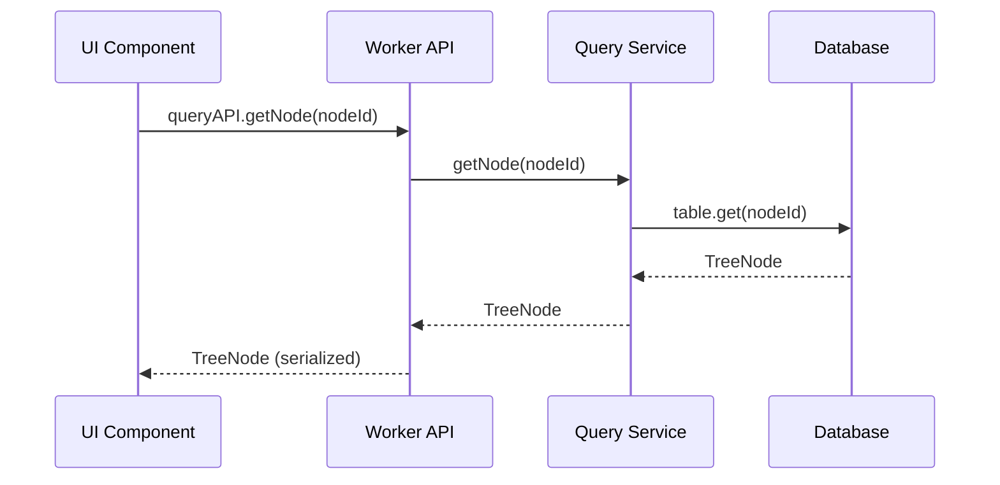
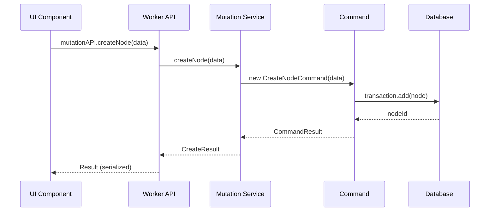

# 2.1 システムアーキテクチャ

## アーキテクチャ概要

### 4層アーキテクチャ
```
┌─────────────────────────────────────────────────────────┐
│                   Presentation Layer                    │
│                   (React Components)                    │
├─────────────────────────────────────────────────────────┤
│                  Communication Layer                    │
│                    (Comlink RPC)                       │
├─────────────────────────────────────────────────────────┤
│                   Business Layer                       │
│                  (Worker Services)                     │
├─────────────────────────────────────────────────────────┤
│                    Data Layer                          │
│              (CoreDB / EphemeralDB)                    │
└─────────────────────────────────────────────────────────┘
```

## レイヤー詳細

### 1. Presentation Layer（UI層）

#### 責務
- ユーザーインターフェースの表示
- ユーザー入力の受付
- 表示状態の管理

#### 主要コンポーネント
```typescript
// React Component構造
interface UIComponents {
  // ツリー表示
  TreeConsole: React.FC<TreeConsoleProps>;
  TreeToolbar: React.FC<ToolbarProps>;
  
  // ダイアログ
  NodeDialog: React.FC<DialogProps>;
  ConfirmDialog: React.FC<ConfirmProps>;
  
  // プラグインUI
  PluginPanel: React.FC<PluginPanelProps>;
}
```

#### 設計原則
- **Presentational/Container分離**: ロジックとビューの分離
- **Hooks活用**: カスタムフックによる再利用性
- **Lazy Loading**: 動的インポートによる初期ロード最適化

### 2. Communication Layer（通信層）

#### Comlink RPC実装
```typescript
// Worker初期化とAPI取得
export class WorkerBridge {
  private worker: Worker;
  private api: Remote<WorkerAPI>;
  
  async initialize(): Promise<void> {
    this.worker = new Worker('./worker.js');
    this.api = Comlink.wrap<WorkerAPI>(this.worker);
    await this.api.initialize();
  }
  
  getAPI(): Remote<WorkerAPI> {
    return this.api;
  }
}
```

#### 通信パターン
1. **Request/Response**: 同期的API呼び出し
2. **Subscription**: Observable によるリアルタイム更新
3. **Streaming**: 大量データの段階的転送

#### シリアライゼーション
```typescript
// 転送可能オブジェクトの定義
interface TransferableData {
  nodeId: NodeId;  // Branded type
  data: ArrayBuffer;  // Binary data
  metadata: Record<string, any>;
}
```

### 3. Business Layer（ビジネス層）

#### サービス構成
```typescript
// Core Services
interface CoreServices {
  queryService: TreeQueryService;
  mutationService: TreeMutationService;
  observableService: TreeObservableService;
  workingCopyService: WorkingCopyService;
  pluginRegistry: PluginRegistryService;
}
```

#### コマンドパターン実装
```typescript
abstract class Command<T = any> {
  abstract execute(): Promise<T>;
  abstract undo(): Promise<void>;
  abstract redo(): Promise<void>;
}

class CreateNodeCommand extends Command<NodeId> {
  async execute(): Promise<NodeId> {
    // ノード作成ロジック
    return nodeId;
  }
  
  async undo(): Promise<void> {
    // ノード削除
  }
  
  async redo(): Promise<void> {
    // 再作成
  }
}
```

#### トランザクション管理
```typescript
class TransactionManager {
  async executeInTransaction<T>(
    callback: () => Promise<T>
  ): Promise<T> {
    const tx = await this.beginTransaction();
    try {
      const result = await callback();
      await tx.commit();
      return result;
    } catch (error) {
      await tx.rollback();
      throw error;
    }
  }
}
```

### 4. Data Layer（データ層）

#### データベース戦略
```typescript
// 永続データベース（CoreDB）
class CoreDB extends Dexie {
  trees!: Table<Tree, TreeId>;
  nodes!: Table<TreeNode, NodeId>;
  rootStates!: Table<TreeRootState, [TreeId, TreeRootNodeType]>;
  
  constructor() {
    super('HierarchiDB_Core');
    this.version(1).stores({
      trees: '&id, rootNodeId, trashRootNodeId',
      nodes: '&id, parentNodeId, &[parentNodeId+name], removedAt',
      rootStates: '&[id+treeRootNodeType]'
    });
  }
}

// 一時データベース（EphemeralDB）
class EphemeralDB extends Dexie {
  workingCopies!: Table<WorkingCopy, UUID>;
  sessions!: Table<SessionData, UUID>;
  
  constructor() {
    super('HierarchiDB_Ephemeral');
    this.setupAutoCleanup();
  }
  
  private setupAutoCleanup(): void {
    // 24時間経過データの自動削除
    setInterval(() => this.cleanupExpired(), 3600000);
  }
}
```

## データフロー

### 読み取り操作


### 書き込み操作


## 非同期処理

### Observable パターン
```typescript
// リアルタイム更新の実装
class NodeObserver {
  private subscriptions = new Map<string, Subscription>();
  
  subscribe(nodeId: NodeId, callback: Callback): SubscriptionId {
    const subscription = this.db.nodes
      .where('id').equals(nodeId)
      .subscribe(callback);
    
    const id = generateSubscriptionId();
    this.subscriptions.set(id, subscription);
    return id;
  }
  
  unsubscribe(id: SubscriptionId): void {
    this.subscriptions.get(id)?.unsubscribe();
    this.subscriptions.delete(id);
  }
}
```

### エラーハンドリング
```typescript
// グローバルエラーハンドラー
class ErrorBoundary {
  static async handle<T>(
    operation: () => Promise<T>
  ): Promise<Result<T>> {
    try {
      const data = await operation();
      return { success: true, data };
    } catch (error) {
      console.error('Operation failed:', error);
      return { 
        success: false, 
        error: this.normalizeError(error) 
      };
    }
  }
  
  private static normalizeError(error: unknown): ErrorInfo {
    if (error instanceof Error) {
      return {
        message: error.message,
        stack: error.stack,
        code: 'UNKNOWN_ERROR'
      };
    }
    return { 
      message: String(error),
      code: 'UNKNOWN_ERROR'
    };
  }
}
```

## スケーラビリティ

### パフォーマンス最適化
1. **インデックス戦略**: 適切なデータベースインデックス
2. **遅延ロード**: 必要時のみデータ取得
3. **キャッシング**: 頻繁アクセスデータのメモリキャッシュ
4. **バッチ処理**: 複数操作の一括実行

### メモリ管理
```typescript
class MemoryManager {
  private readonly MAX_CACHE_SIZE = 100_000;
  private cache = new LRUCache<NodeId, TreeNode>(this.MAX_CACHE_SIZE);
  
  async getNode(nodeId: NodeId): Promise<TreeNode> {
    // キャッシュ確認
    if (this.cache.has(nodeId)) {
      return this.cache.get(nodeId)!;
    }
    
    // DBから取得
    const node = await this.db.nodes.get(nodeId);
    if (node) {
      this.cache.set(nodeId, node);
    }
    return node;
  }
}
```

## セキュリティ考慮

### データ検証
```typescript
// 入力検証
class ValidationService {
  validateNodeData(data: unknown): ValidatedNodeData {
    // Zodによるスキーマ検証
    return NodeSchema.parse(data);
  }
}
```

### アクセス制御
```typescript
// 権限チェック
class AccessControl {
  canEdit(userId: UserId, nodeId: NodeId): boolean {
    // 編集権限の確認
    return this.checkPermission(userId, nodeId, 'edit');
  }
}
```