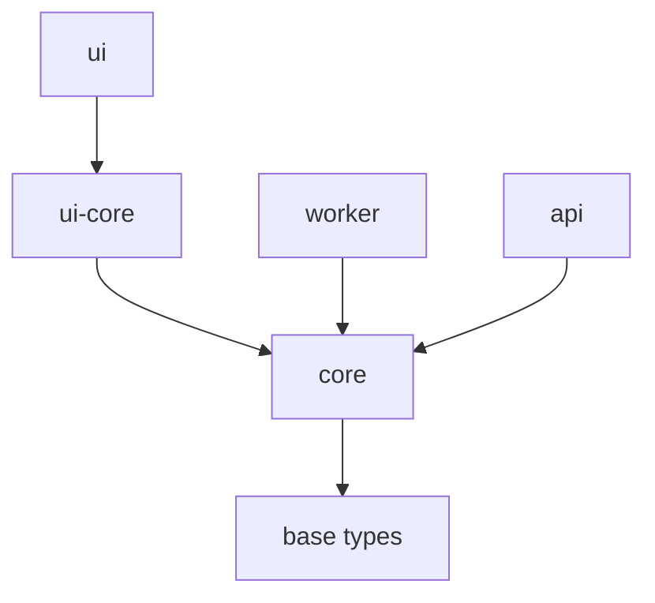

# NodeTypeDefinition アーキテクチャ改善

## 🏗️ 概要

NodeTypeDefinitionの責務分離により、core層とUI層の依存関係を整理しました。

## 📋 変更内容

### **Before（問題のあった構造）**

```
@hierarchidb/core
├── types/nodeDefinition.ts  ⚠️ Reactに依存
└── registry/NodeTypeRegistry.ts ⚠️ UI関連型を含む
```

### **After（クリーンな構造）**

```
@hierarchidb/core
├── types/nodeDefinition.ts     ✅ NodeTypeDefinition（UI非依存）
└── registry/NodeTypeRegistry.ts ✅ Core専用レジストリ

@hierarchidb/ui-core
└── types/nodeDefinition.ts     ✅ UINodeTypeDefinition（React依存）
```

## 📝 API変更

### **Core層（@hierarchidb/core）**

```typescript
// Core専用型（UI非依存）
export interface NodeTypeDefinition<
  TEntity extends BaseEntity = BaseEntity,
  TSubEntity extends BaseSubEntity = BaseSubEntity,
  TWorkingCopy extends BaseWorkingCopy = BaseWorkingCopy,
> {
  readonly nodeType: TreeNodeType;
  readonly name: string;
  readonly displayName: string;
  readonly database: DatabaseSchema;
  readonly entityHandler: EntityHandler<TEntity, TSubEntity, TWorkingCopy>;
  readonly lifecycle: NodeLifecycleHooks<TEntity>;
  // UI設定は含まない
}

// NodeTypeRegistry
class NodeTypeRegistry {
  register(definition: NodeTypeDefinition): void;
  getDefinition(nodeType: TreeNodeType): NodeTypeDefinition | undefined;
}
```

### **UI層（@hierarchidb/ui-core）**

```typescript
// UI拡張型
export interface UINodeTypeDefinition<...> extends CoreNodeTypeDefinition<...> {
  readonly ui?: {
    dialogComponent?: React.ComponentType<NodeDialogProps<TEntity>>;
    panelComponent?: React.ComponentType<NodePanelProps>;
    formComponent?: React.ComponentType<NodeFormProps<TEntity>>;
    iconComponent?: React.ComponentType<{ size?: number; color?: string }>;
  };
}

// UINodeTypeRegistry
class UINodeTypeRegistry {
  registerUI(definition: UINodeTypeDefinition): void;
  getUIDefinition(nodeType: TreeNodeType): UINodeTypeDefinition | undefined;
}
```

## 🔄 マイグレーション手順

### **1. Core層のマイグレーション**

```typescript
// 変更なし - 既存のNodeTypeDefinitionがクリーンになっただけ
import { NodeTypeDefinition } from '@hierarchidb/core';

const definition: NodeTypeDefinition = {
  nodeType: 'document',
  name: 'Document',
  displayName: 'Document Node',
  // ui: { ... } は削除済み
  database: { ... },
  entityHandler: { ... },
  lifecycle: { ... },
  api: { ... },
  validation: { ... }
};
```

### **2. UI層のマイグレーション**

```typescript
// UI拡張定義
import { UINodeTypeDefinition, createUINodeTypeDefinition } from '@hierarchidb/ui-core';
import { coreDefinition } from './coreDefinition';
import { DocumentDialog, DocumentPanel } from './containers';

const uiDefinition: UINodeTypeDefinition = createUINodeTypeDefinition(
  coreDefinition,
  {
    dialogComponent: DocumentDialog,
    panelComponent: DocumentPanel,
    formComponent: DocumentForm,
    iconComponent: DocumentIcon
  }
);

// 登録
import { UINodeTypeRegistry } from '@hierarchidb/ui-core';
UINodeTypeRegistry.getInstance().registerUI(uiDefinition);
```

### **3. Registry使用パターン**

```typescript
// Core層での使用
import { NodeTypeRegistry } from '@hierarchidb/core';
const coreRegistry = NodeTypeRegistry.getInstance();
const coreDefinition = coreRegistry.getDefinition('document');

// UI層での使用
import { UINodeTypeRegistry } from '@hierarchidb/ui-core';
const uiRegistry = UINodeTypeRegistry.getInstance();
const uiDefinition = uiRegistry.getUIDefinition('document');

// UI componentsの取得
const DialogComponent = uiDefinition?.ui?.dialogComponent;
```

## ✅ 利点

### **1. 依存関係の明確化**
- Core層：React非依存、純粋なビジネスロジック
- UI層：React依存、UIコンポーネント関連

### **2. モジュール分離**
- Core層はサーバーサイド、Node.jsでも使用可能
- UI層はブラウザー専用

### **3. クリーンな実装**
- `NodeTypeDefinition`はCore層専用にクリーン化
- 後方互換性を考慮した`@deprecated`コードは削除済み

### **4. 型安全性の向上**
- UI関連型はUI層でのみ扱う
- Core層の型純粋性を保持

## 🧪 テスト戦略

### **Core層テスト**
```typescript
// @hierarchidb/core/tests
describe('NodeTypeDefinition', () => {
  it('should register core definition without UI dependencies', () => {
    const definition: NodeTypeDefinition = { ... };
    expect(() => registry.register(definition)).not.toThrow();
  });
});
```

### **UI層テスト**
```typescript
// @hierarchidb/ui-core/tests  
describe('UINodeTypeDefinition', () => {
  it('should extend core definition with UI containers', () => {
    const uiDefinition: UINodeTypeDefinition = { ... };
    expect(uiDefinition.ui?.dialogComponent).toBeDefined();
  });
});
```

## 📦 パッケージ依存関係



## 🚀 次のステップ

1. **UI Registry統合**: UI層でのRegistry統合とコンポーネント登録
2. **実装例の追加**: 具体的なNodeTypeDefinition実装サンプル
3. **API仕様書更新**: 新しいアーキテクチャに基づく仕様書
4. **型テスト追加**: Core層とUI層の型安全性テスト

## ✅ 完了事項

- ✅ Core層からUI依存を完全削除
- ✅ `@deprecated`コードの削除とクリーン化
- ✅ 新しいUI層Registry実装
- ✅ 型定義の整理と統合

この改善により、アーキテクチャの関心の分離が完全に達成され、各層の責務が明確になりました。