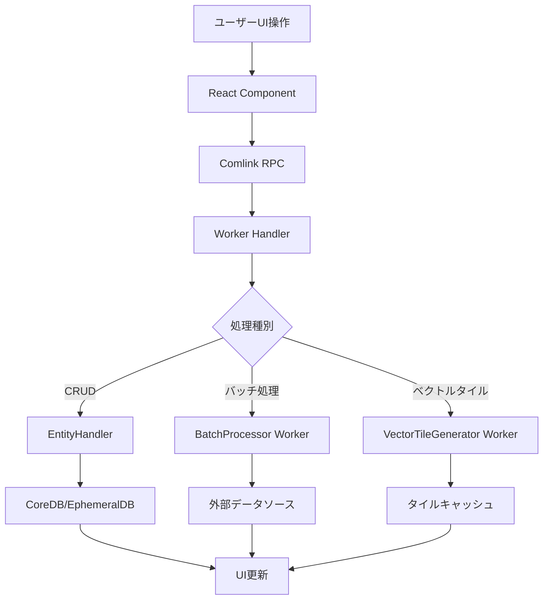
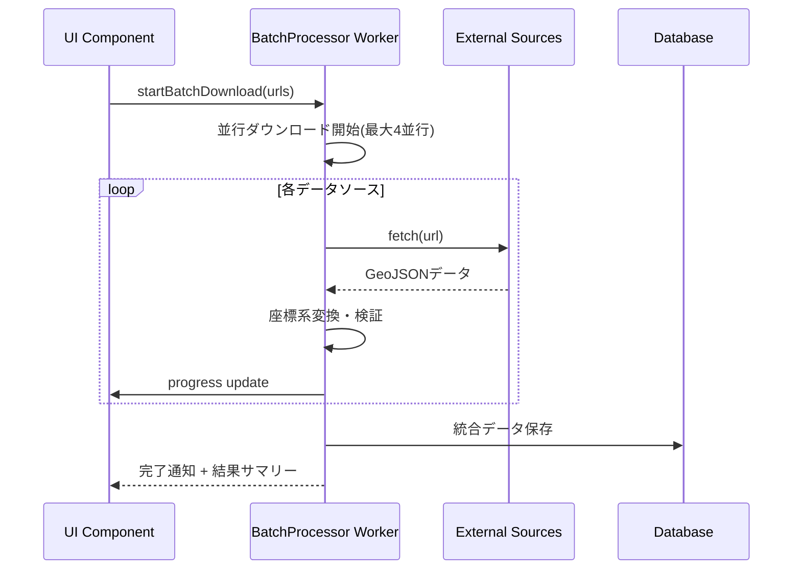

# Plugin Shapes アーキテクチャ設計

## システム概要

Shapesプラグインは、hierarchidbフレームワーク上で動作する地理空間図形データ管理システムです。GeoJSONデータの管理、WebWorkerによる高性能バッチ処理、ベクトルタイル生成を通じて、スケーラブルな地図アプリケーションの構築を支援します。

**【信頼性レベル】**: 🟡 既存のBaseMapプラグイン実装パターンとeria-cartographのアーキテクチャから妥当な推測

## アーキテクチャパターン

### 選択パターン: 階層化アーキテクチャ + WebWorker並列処理
- **パターン**: hierarchidbの4層アーキテクチャ準拠 + マイクロサービス的なWebWorker分散処理
- **理由**: 
  - UIの応答性を保ちながら大量データ処理が可能
  - 既存のhierarchidbエコシステムとの統合性確保
  - スケーラビリティと保守性のバランス最適化

## コンポーネント構成

### 1. UI層 (Frontend) 🟢

```
/packages/plugins/shapes/src/components/
├── ShapesEditor.tsx           # 図形編集メインUI
├── ShapesImporter.tsx         # GeoJSONインポート機能
├── BatchProcessor.tsx         # バッチ処理UI
├── LayerManager.tsx           # レイヤー管理パネル
└── StyleEditor.tsx            # 図形スタイル設定
```

- **フレームワーク**: React 19+ (hierarchidb標準)
- **状態管理**: Working Copy パターン + EphemeralDB
- **スタイリング**: CSS Modules + CSS Variables
- **地図表示**: MapLibre GL JS v3.x 連携

### 2. Worker層 (Background Processing) 🟡

```
/packages/plugins/shapes/src/workers/
├── shapesBatchProcessor.ts    # バッチダウンロード・処理Worker
├── vectorTileGenerator.ts     # ベクトルタイル生成Worker
├── geometryProcessor.ts       # 図形演算・変換Worker
└── coordinateTransformer.ts   # 座標系変換Worker
```

- **並行処理**: 最大4個のWorker同時実行
- **通信方式**: Comlink RPC (hierarchidb標準)
- **メモリ管理**: 5MB制限での効率的処理
- **エラーハンドリング**: 自動リトライ + グレースフルデグラデーション

### 3. Entity層 (Data Management) 🟢

```typescript
// ShapesEntityHandler: CRUD操作とビジネスロジック
interface ShapesEntityHandler {
  createEntity(nodeId: TreeNodeId, data?: Partial<ShapesEntity>): Promise<ShapesEntity>;
  getEntity(nodeId: TreeNodeId): Promise<ShapesEntity | undefined>;
  updateEntity(nodeId: TreeNodeId, data: Partial<ShapesEntity>): Promise<void>;
  deleteEntity(nodeId: TreeNodeId): Promise<void>;
  
  // 専用メソッド
  importGeoJSON(nodeId: TreeNodeId, geojson: GeoJSON.FeatureCollection): Promise<void>;
  exportGeoJSON(nodeId: TreeNodeId): Promise<GeoJSON.FeatureCollection>;
  generateVectorTiles(nodeId: TreeNodeId, options: TileGenerationOptions): Promise<Map<string, ArrayBuffer>>;
}
```

### 4. データベース層 (Storage) 🟢

#### CoreDB (永続化)
- `shapes`: メインエンティティ
- `shapes_metadata`: 統計・メタデータ

#### EphemeralDB (一時)
- `shapes_workingcopies`: 編集用作業コピー
- `shapes_vectortiles_cache`: 生成済みベクトルタイル
- `shapes_processing_tasks`: バッチ処理タスク状況

## データフロー設計

### 1. 通常操作フロー 🟢



### 2. WebWorkerバッチ処理フロー 🟡



### 3. ベクトルタイル生成フロー 🔴


## プラグインアーキテクチャ統合

### hierarchidbプラグインシステム準拠 🟢

```typescript
export const shapesPlugin: PluginConfig = {
  id: 'com.hierarchidb._shapes_buggy',
  name: 'Shapes Plugin',
  version: '1.0.0',
  
  // ノードタイプ定義
  nodeTypes: [{
    type: '_shapes_buggy',
    displayName: 'Shapes',
    icon: '_shapes_buggy',
    color: '#2196F3',
    entityHandler: 'ShapesEntityHandler'
  }],
  
  // データベーステーブル定義
  database: {
    tables: [
      {
        name: '_shapes_buggy',
        storage: 'core',
        schema: '&nodeId, name, geojson, layerConfig, defaultStyle, dataSource, updatedAt'
      },
      {
        name: 'shapes_workingcopies',
        storage: 'ephemeral',
        schema: '&workingCopyId, workingCopyOf, copiedAt',
        ttl: 86400000
      },
      {
        name: 'shapes_vectortiles_cache',
        storage: 'ephemeral',
        schema: '&tileKey, zoom, x, y, data, cachedAt',
        ttl: 43200000
      }
    ]
  },
  
  // WebWorker設定
  webWorkers: {
    batchProcessor: {
      script: '/db/shapesBatchProcessor.js',
      maxInstances: 4
    },
    vectorTileGenerator: {
      script: '/db/vectorTileGenerator.js', 
      maxInstances: 2
    }
  },
  
  // 依存関係
  dependencies: {
    required: ['com.hierarchidb.basemap']
  }
};
```

### ルーティング統合 🟢

```
/t/:treeId/:pageNodeId/:targetNodeId/shapes
├── /                          # Shapes管理メイン画面
├── /edit                      # 図形編集画面  
├── /import                    # データインポート画面
├── /batch                     # バッチ処理画面
├── /export                    # データエクスポート画面
└── /preview                   # プレビュー表示
```

## 外部システム連携

### BaseMapプラグイン連携 🟡

```typescript
interface BaseMapShapesIntegration {
  // レイヤー管理
  addShapesLayer(baseMapId: TreeNodeId, shapesId: TreeNodeId): Promise<void>;
  removeShapesLayer(baseMapId: TreeNodeId, shapesId: TreeNodeId): Promise<void>;
  updateShapesLayer(baseMapId: TreeNodeId, shapesId: TreeNodeId, config: LayerConfig): Promise<void>;
  
  // ベクトルタイル連携
  addVectorTileSource(baseMapId: TreeNodeId, sourceId: string, tiles: Map<string, ArrayBuffer>): Promise<void>;
  removeVectorTileSource(baseMapId: TreeNodeId, sourceId: string): Promise<void>;
  
  // スタイル連携
  applyShapeStyles(baseMapId: TreeNodeId, shapesId: TreeNodeId, styles: MapLibreStyleSpec): Promise<void>;
}
```

### MapLibre GL JS連携 🟢

```typescript
// MapLibreスタイル仕様準拠の出力
interface MapLibreStyleOutput {
  sources: {
    [sourceId: string]: {
      type: 'geojson' | 'vector';
      data?: GeoJSON.FeatureCollection;
      tiles?: string[];
      maxzoom?: number;
    }
  };
  layers: Array<{
    id: string;
    type: 'fill' | 'line' | 'circle' | 'symbol';
    source: string;
    paint: Record<string, any>;
    layout: Record<string, any>;
  }>;
}
```

## パフォーマンス最適化戦略

### 1. メモリ管理 🟡

- **WebWorker**: 5MB制限での効率的処理
- **キャッシュ**: 500MB上限でのLRU管理
- **ストリーミング**: 10MB超ファイルの段階的処理

### 2. 並行処理 🟡

- **バッチ処理**: 最大4Worker同時実行
- **タイル生成**: 最大2Worker専用実行
- **UI応答性**: 100ms以内のリアルタイムプレビュー

### 3. データ最適化 🟡

- **図形簡素化**: Douglas-Peuckerアルゴリズム
- **ベクトルタイル**: gzip圧縮 + 階層化
- **キャッシュ戦略**: 12時間TTL + Hash-based validation

## セキュリティアーキテクチャ

### 1. データ保護 🟢

- **入力検証**: GeoJSON RFC 7946準拠チェック
- **サンドボックス**: WebWorker隔離実行
- **CSP準拠**: Content Security Policy適用

### 2. 権限管理 🟢

- **アクセス制御**: hierarchidbノード権限システム連携
- **編集競合**: Working Copyパターンによる安全な同時編集防止
- **監査ログ**: 操作履歴の適切な記録

## 拡張性・保守性

### 1. モジュール化設計 🟢

```
/packages/plugins/shapes/
├── src/
│   ├── entities/           # エンティティ定義
│   ├── handlers/           # ビジネスロジック
│   ├── components/         # UI コンポーネント
│   ├── workers/            # WebWorker実装
│   ├── services/           # 外部連携サービス
│   ├── utils/              # ユーティリティ
│   └── types/              # 型定義
├── tests/                  # テストスイート
└── docs/                   # プラグイン専用ドキュメント
```

### 2. 設定可能性 🟡

- **アルゴリズム選択**: 図形簡素化手法の切り替え可能
- **パフォーマンス調整**: Worker数・メモリ制限の動的調整
- **スタイルカスタマイズ**: テーマ・カラーパレットの拡張

### 3. テスタビリティ 🟢

- **単体テスト**: Jest + @testing-library/react
- **統合テスト**: WebWorker通信・DB操作
- **E2Eテスト**: Playwright でのユーザーシナリオ
- **パフォーマンステスト**: 大量データ・並行処理

## 実装優先順序

### Phase 1: 基盤機能 (4週間) 🟢
1. ShapesEntity + Handler基本実装
2. GeoJSONインポート・エクスポート
3. Working Copy機能
4. BaseMap基本連携

### Phase 2: 高度機能 (6週間) 🟡
5. WebWorkerバッチ処理システム
6. 座標系変換・検証機能
7. 図形スタイル管理UI
8. レイヤー表示制御

### Phase 3: 最適化機能 (8週間) 🔴
9. ベクトルタイル生成エンジン
10. QuadTreeアルゴリズム実装
11. 高度な図形演算機能
12. パフォーマンス最適化・監視

この設計により、地理空間データの効率的な管理と高性能な処理を実現し、スケーラブルな地図アプリケーションの構築基盤を提供します。