# Plugin Shapes データフロー図

## 概要

本ドキュメントでは、Shapesプラグインにおける各種データフローを詳細に図解します。特にWebWorkerによるバッチ処理とベクトルタイル生成の複雑なフローに焦点を当てます。

**【信頼性レベル】**: 🟡 hierarchidbアーキテクチャパターンとeria-cartographの処理フローから妥当な推測

## 1. メインユーザーインタラクションフロー

### 基本CRUD操作フロー 🟢

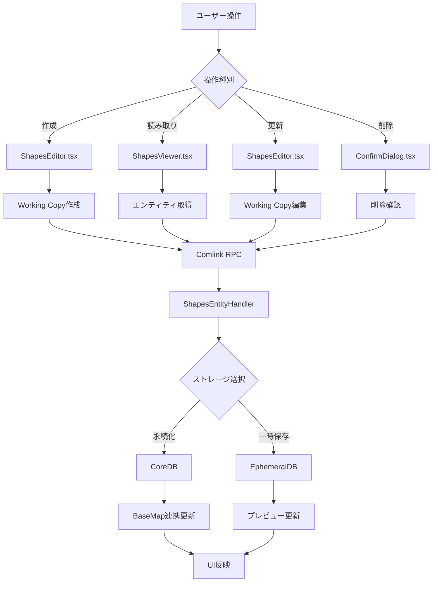

### GeoJSONインポートフロー 🟡

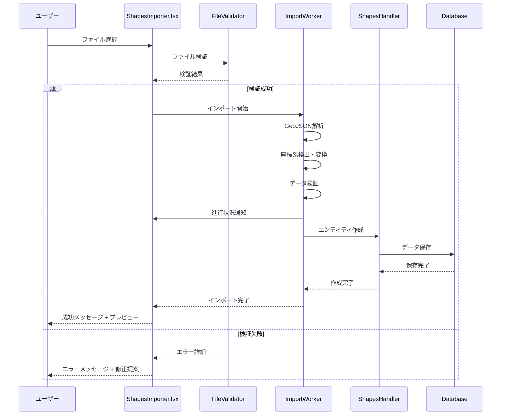

## 2. WebWorkerバッチ処理フロー

### 並行ダウンロード処理 🟡

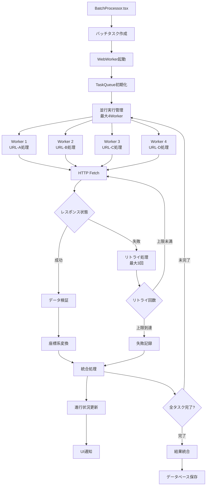

### バッチ処理メッセージフロー 🟡

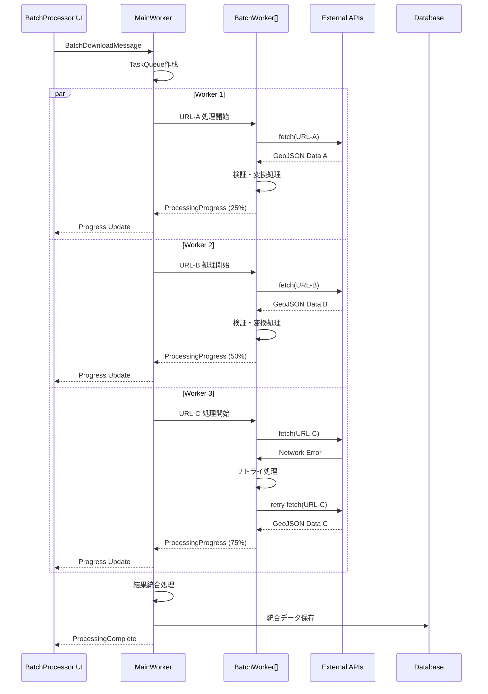

## 3. ベクトルタイル生成フロー

### QuadTreeアルゴリズム処理 🔴

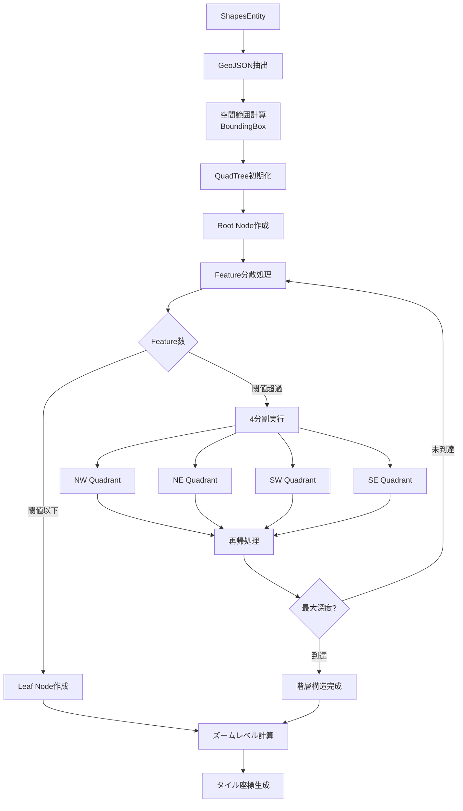

### ズームレベル別タイル生成 🟡

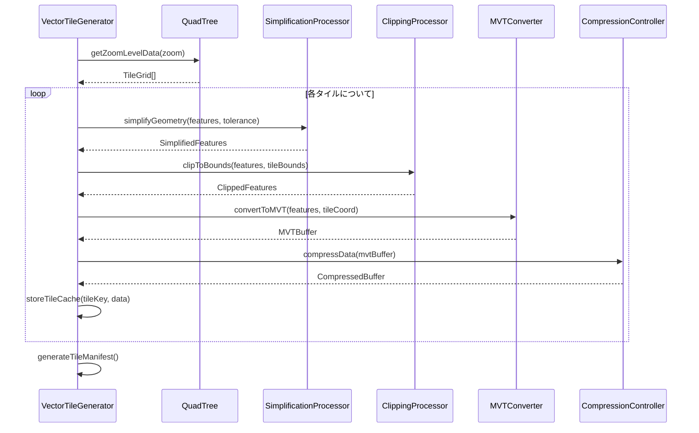

## 4. 座標系変換フロー

### 自動座標系検出・変換 🟡

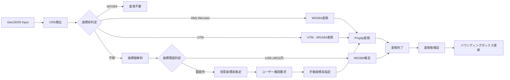

## 5. BaseMap連携データフロー

### レイヤー統合フロー 🟡

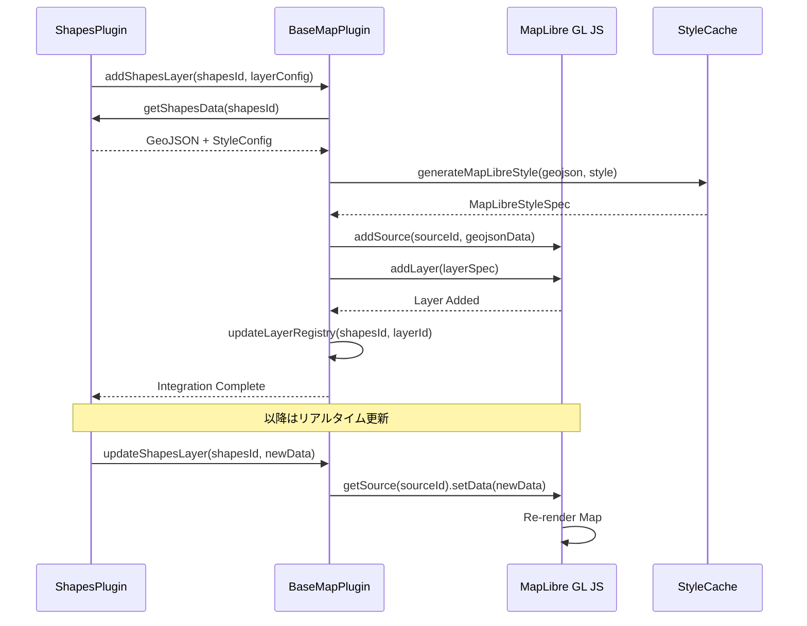

### ベクトルタイル統合フロー 🔴

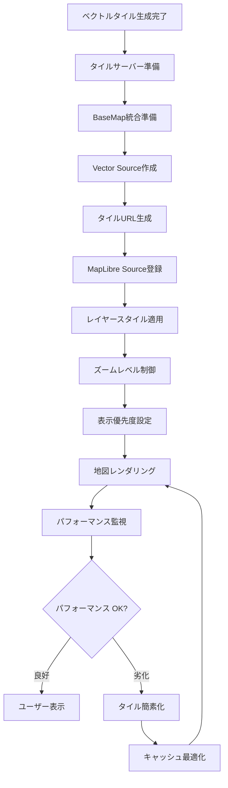

## 6. エラーハンドリングフロー

### 多層エラー処理 🟡

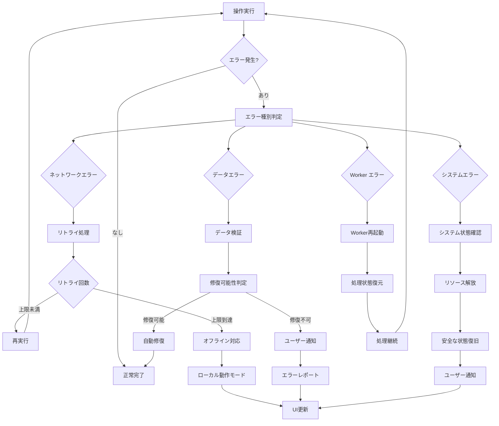

### Working Copy競合解決 🟢

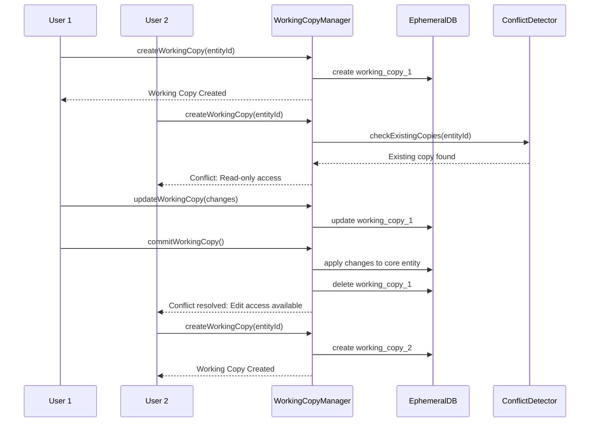

## 7. キャッシュ・最適化フロー

### 多層キャッシュ戦略 🟡

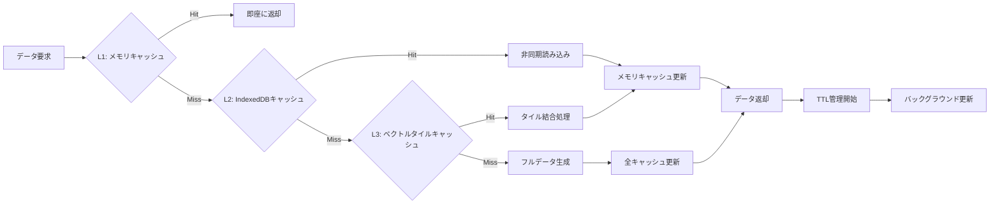

この詳細なデータフロー設計により、複雑な地理空間データ処理を効率的かつ安全に実行し、優れたユーザー体験を提供します。