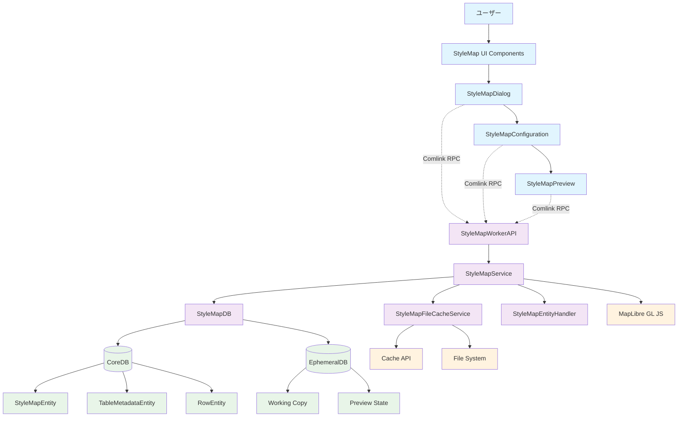
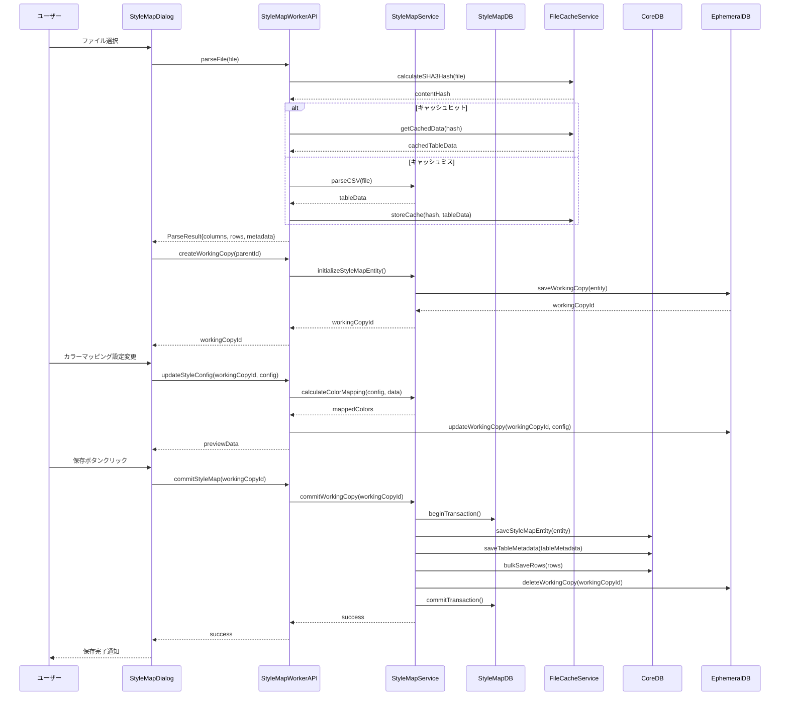
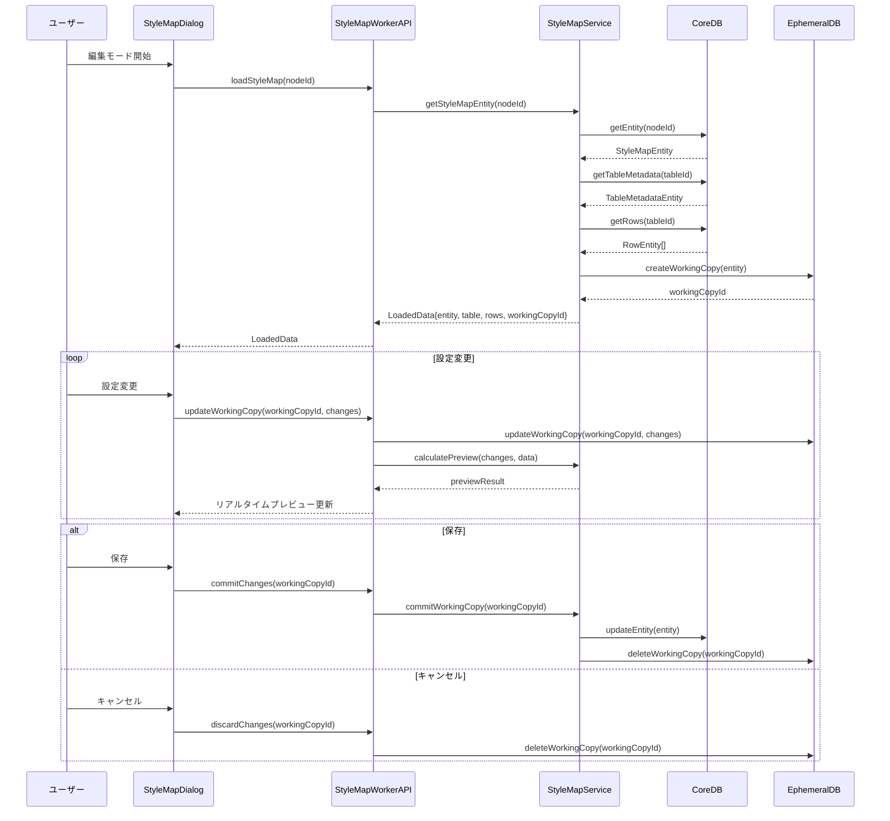
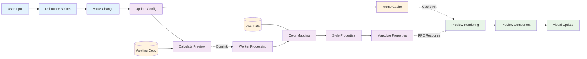
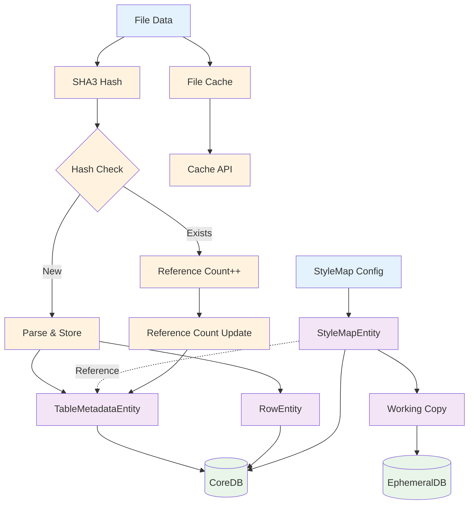
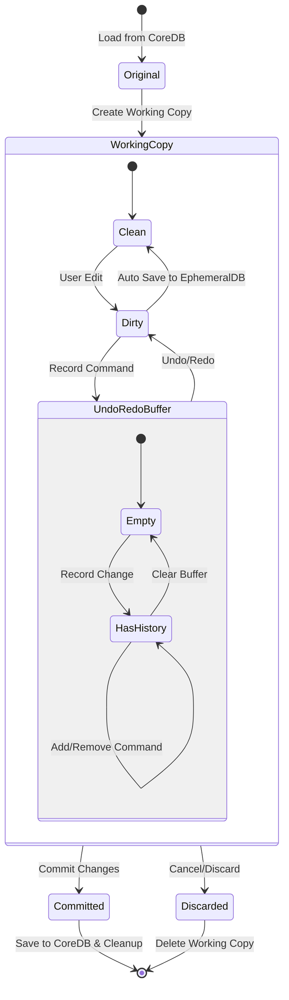
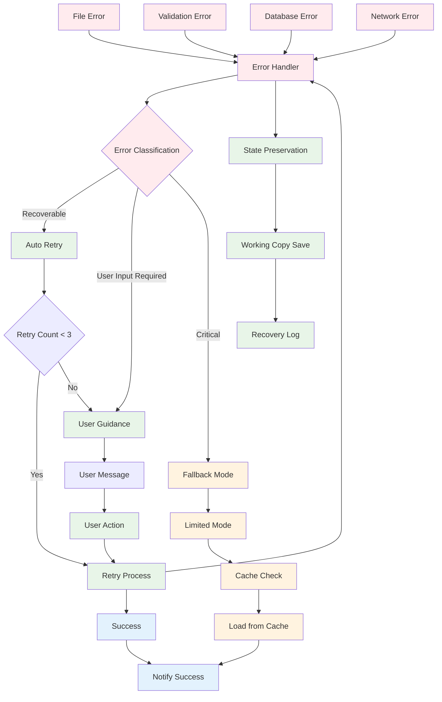
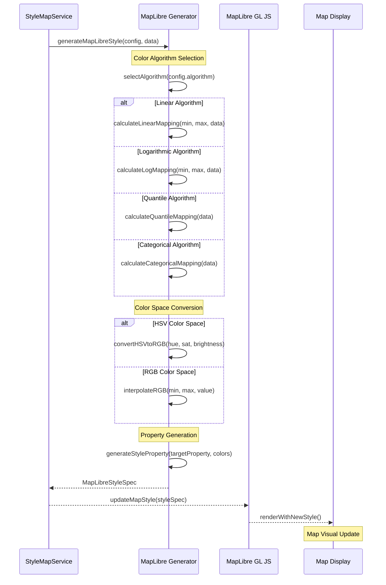
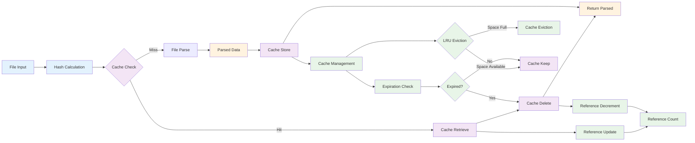
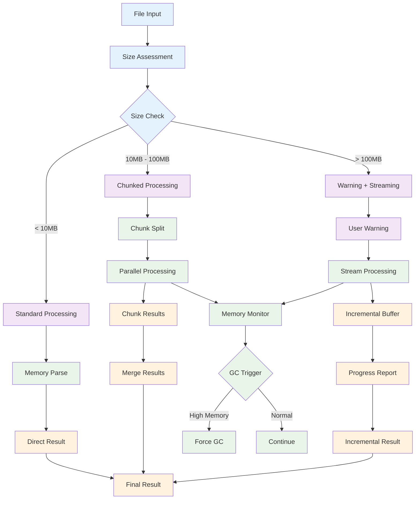

# plugin-stylemap データフロー図

## システム全体データフロー

### 🟢 hierarchidb 4層アーキテクチャでのデータフロー

## 機能別データフロー

### 🟢 1. StyleMap作成フロー

### 🟢 2. StyleMap編集フロー

### 🟢 3. リアルタイムプレビューフロー

## データ永続化フロー

### 🟢 4. データベース操作フロー

### 🟢 5. Working Copy & Undo/Redo フロー

## エラーハンドリングフロー

### 🟡 6. エラー処理・回復フロー

## 外部システム連携フロー

### 🟢 7. MapLibre GL JS 連携フロー

### 🟡 8. ファイルキャッシュフロー

## パフォーマンス最適化フロー

### 🟡 9. 大容量データ処理フロー

この詳細なデータフロー図により、plugin-stylemap の全体的なデータの流れ、各コンポーネント間の相互作用、エラーハンドリング、パフォーマンス最適化戦略が明確に理解できます。eria-cartograph の実装パターンを基にした信頼性の高い設計となっています。