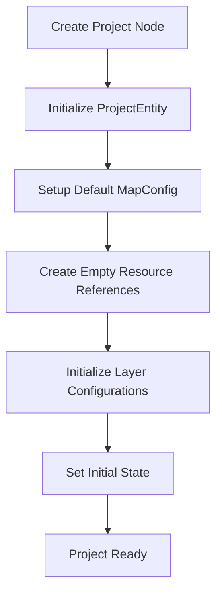
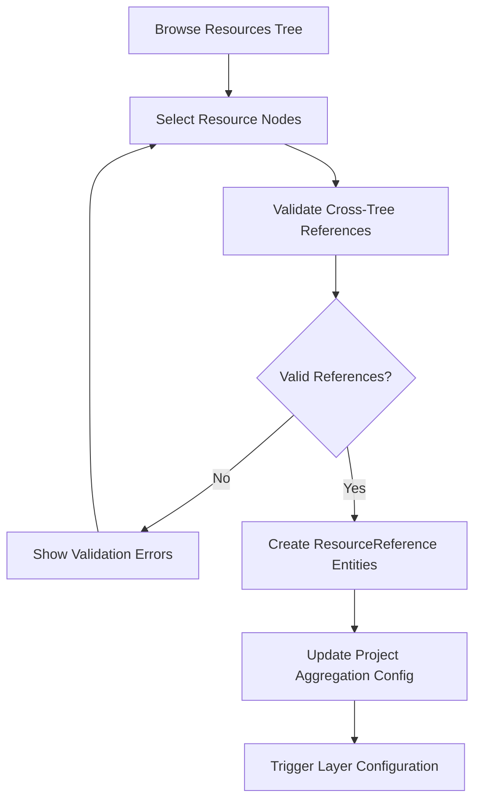
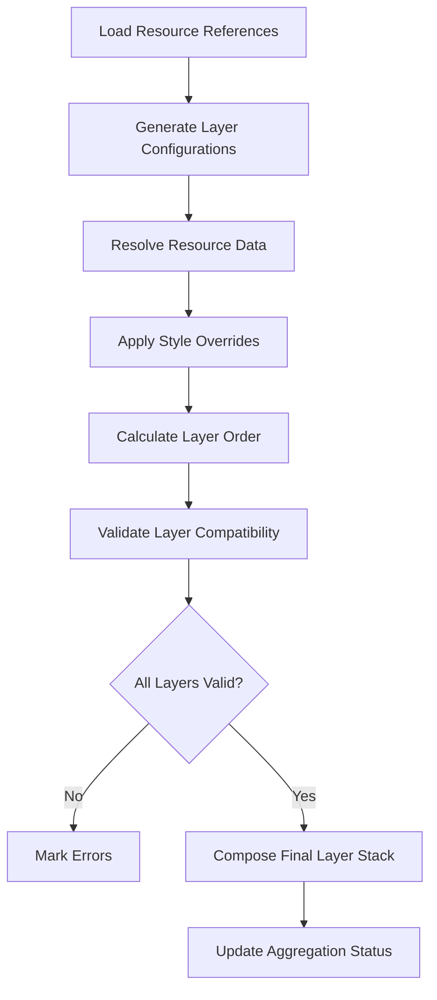
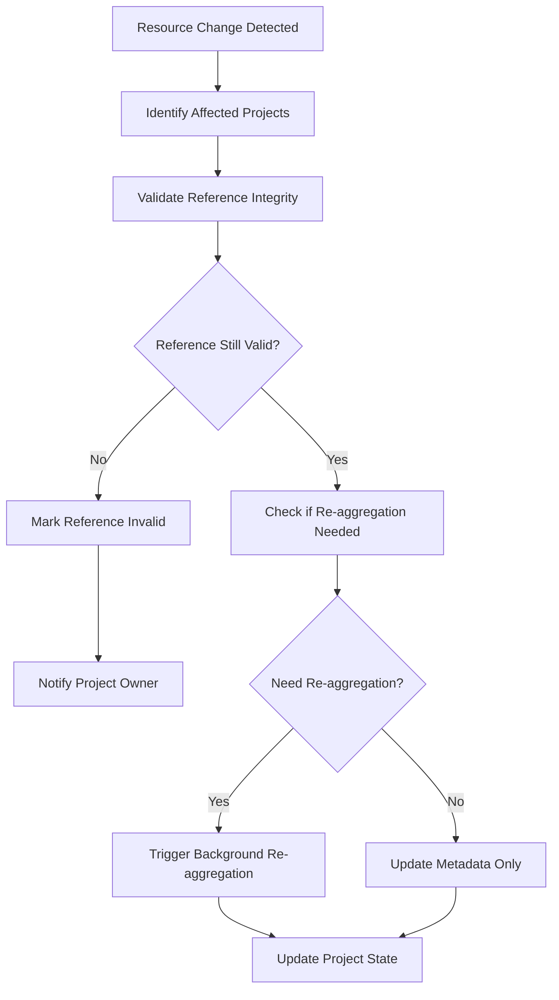

# Project Plugin Lifecycle Management

This document describes the resource aggregation lifecycle and state management for the Project Plugin, including cross-tree reference handling, dependency tracking, and performance optimization strategies.

## Overview

The Project Plugin manages complex lifecycles involving:
- **Cross-tree references**: Links between Projects tree nodes and Resources tree nodes
- **Resource aggregation**: Dynamic composition of multiple resource types
- **State synchronization**: Maintaining consistency across distributed resources
- **Change propagation**: Automatic updates when referenced resources change

## Resource Aggregation Lifecycle

### 1. Project Creation Phase



**Implementation:**

```typescript
// Project creation lifecycle
export class ProjectLifecycleManager {
  async createProject(nodeId: NodeId, initialData: Partial<ProjectEntity>): Promise<ProjectEntity> {
    // Phase 1: Create base project entity
    const projectEntity = await this.entityHandler.createEntity(nodeId, {
      name: initialData.name || 'New Project',
      description: initialData.description || '',
      mapConfig: this.getDefaultMapConfig(),
      renderConfig: this.getDefaultRenderConfig(),
      aggregationConfig: {
        lastAggregated: 0,
        resourceCount: 0,
        layerCount: 0,
        hasErrors: false
      }
    });

    // Phase 2: Initialize supporting entities
    await this.initializeProjectSupport(projectEntity.nodeId);

    // Phase 3: Setup change listeners
    this.setupChangeListeners(projectEntity.nodeId);

    return projectEntity;
  }

  private async initializeProjectSupport(projectNodeId: NodeId): Promise<void> {
    // Create default export configuration
    await this.createDefaultExportConfig(projectNodeId);
    
    // Initialize cache structures
    this.initializeProjectCache(projectNodeId);
    
    // Setup validation rules
    this.setupValidationRules(projectNodeId);
  }
}
```

### 2. Resource Selection Phase



**Cross-Tree Reference Management:**

```typescript
export class CrossTreeReferenceManager {
  async addResourceReference(
    projectNodeId: NodeId,
    resourceNodeId: NodeId,
    referenceType: ResourceReferenceType
  ): Promise<ResourceReference> {
    // Step 1: Validate reference target
    const validation = await this.validateResourceReference(resourceNodeId, referenceType);
    if (!validation.isValid) {
      throw new Error(`Invalid resource reference: ${validation.errorMessage}`);
    }

    // Step 2: Check for circular dependencies
    await this.checkCircularDependencies(projectNodeId, resourceNodeId);

    // Step 3: Create reference entity
    const reference: ResourceReference = {
      id: this.generateEntityId(),
      projectNodeId,
      resourceNodeId,
      resourceTreeId: validation.resourceTreeId!,
      referenceType,
      displayName: validation.displayName!,
      isActive: true,
      loadPriority: this.calculateLoadPriority(referenceType),
      aggregationConfig: this.getDefaultAggregationConfig(referenceType),
      validationStatus: {
        isValid: true,
        lastValidated: Date.now()
      },
      createdAt: Date.now(),
      updatedAt: Date.now(),
      version: 1
    };

    await this.resourceReferenceHandler.createEntity(reference);

    // Step 4: Setup change tracking
    this.trackResourceChanges(resourceNodeId, projectNodeId);

    // Step 5: Update project aggregation metadata
    await this.updateProjectAggregationConfig(projectNodeId);

    return reference;
  }

  private async validateResourceReference(
    resourceNodeId: NodeId,
    expectedType: ResourceReferenceType
  ): Promise<ReferenceValidation> {
    try {
      const resourceNode = await this.treeQueryAPI.getNode(resourceNodeId);
      if (!resourceNode) {
        return { isValid: false, errorMessage: 'Resource node not found' };
      }

      if (resourceNode.nodeType !== expectedType) {
        return {
          isValid: false,
          errorMessage: `Expected ${expectedType}, found ${resourceNode.nodeType}`
        };
      }

      const resourceTreeId = await this.getNodeTreeId(resourceNodeId);
      
      return {
        isValid: true,
        resourceTreeId,
        displayName: resourceNode.name
      };
    } catch (error) {
      return {
        isValid: false,
        errorMessage: `Validation failed: ${error instanceof Error ? error.message : 'Unknown error'}`
      };
    }
  }
}
```

### 3. Layer Composition Phase



**Layer Composition Lifecycle:**

```typescript
export class LayerCompositionLifecycle {
  async composeProjectLayers(projectNodeId: NodeId): Promise<CompositionResult> {
    const compositionId = this.generateCompositionId();
    
    try {
      // Step 1: Load project configuration
      const project = await this.loadProjectEntity(projectNodeId);
      const resourceRefs = await this.loadResourceReferences(projectNodeId);
      const layerConfigs = await this.loadLayerConfigurations(projectNodeId);

      // Step 2: Validate all resources
      const validationResults = await this.validateAllResources(resourceRefs);
      if (validationResults.hasErrors) {
        return this.handleValidationErrors(compositionId, validationResults);
      }

      // Step 3: Load resource data in parallel
      const resourceData = await this.loadResourceDataParallel(resourceRefs);

      // Step 4: Compose layers with dependency resolution
      const layers = await this.composeLayers(resourceData, layerConfigs);

      // Step 5: Optimize layer stack
      const optimizedLayers = await this.optimizeLayerStack(layers);

      // Step 6: Update project aggregation status
      await this.updateAggregationStatus(projectNodeId, {
        lastAggregated: Date.now(),
        resourceCount: resourceRefs.length,
        layerCount: optimizedLayers.length,
        hasErrors: false
      });

      return {
        compositionId,
        success: true,
        layers: optimizedLayers,
        metadata: this.generateCompositionMetadata(resourceRefs, optimizedLayers)
      };

    } catch (error) {
      await this.handleCompositionError(projectNodeId, compositionId, error);
      throw error;
    }
  }

  private async loadResourceDataParallel(
    resourceRefs: ResourceReference[]
  ): Promise<Map<EntityId, any>> {
    const resourceData = new Map<EntityId, any>();
    
    // Group by resource type for optimized loading
    const refsByType = this.groupReferencesByType(resourceRefs);
    
    // Load each type in parallel
    const loadPromises = Object.entries(refsByType).map(async ([type, refs]) => {
      const loader = this.getResourceLoader(type as ResourceReferenceType);
      const typeData = await loader.loadMultiple(refs.map(ref => ref.resourceNodeId));
      
      refs.forEach((ref, index) => {
        resourceData.set(ref.id, typeData[index]);
      });
    });

    await Promise.all(loadPromises);
    return resourceData;
  }
}
```

### 4. Change Propagation Phase



**Change Propagation System:**

```typescript
export class ChangeTrackingService {
  private changeListeners = new Map<NodeId, Set<NodeId>>();
  private pendingUpdates = new Map<NodeId, UpdateInfo>();

  setupResourceChangeTracking(resourceNodeId: NodeId, projectNodeId: NodeId): void {
    if (!this.changeListeners.has(resourceNodeId)) {
      this.changeListeners.set(resourceNodeId, new Set());
      this.subscribeToResourceChanges(resourceNodeId);
    }
    
    this.changeListeners.get(resourceNodeId)!.add(projectNodeId);
  }

  private subscribeToResourceChanges(resourceNodeId: NodeId): void {
    this.treeSubscriptionAPI.subscribeToNode(resourceNodeId, {
      onNodeUpdate: (node) => this.handleResourceUpdate(node),
      onNodeDelete: (nodeId) => this.handleResourceDeletion(nodeId),
      onEntityUpdate: (entityId, entity) => this.handleResourceEntityUpdate(entityId, entity)
    });
  }

  private async handleResourceUpdate(updatedNode: TreeNode): Promise<void> {
    const affectedProjects = this.changeListeners.get(updatedNode.id) || new Set();
    
    for (const projectNodeId of affectedProjects) {
      await this.queueProjectUpdate(projectNodeId, {
        type: 'resource_update',
        resourceNodeId: updatedNode.id,
        timestamp: Date.now(),
        requiresReaggregation: this.determineReaggregationNeed(updatedNode)
      });
    }

    // Process updates in batch for performance
    this.processPendingUpdates();
  }

  private async queueProjectUpdate(projectNodeId: NodeId, updateInfo: UpdateInfo): Promise<void> {
    const existing = this.pendingUpdates.get(projectNodeId);
    
    if (existing) {
      // Merge update information
      this.pendingUpdates.set(projectNodeId, this.mergeUpdateInfo(existing, updateInfo));
    } else {
      this.pendingUpdates.set(projectNodeId, updateInfo);
    }
  }

  private async processPendingUpdates(): Promise<void> {
    if (this.pendingUpdates.size === 0) return;

    const updates = Array.from(this.pendingUpdates.entries());
    this.pendingUpdates.clear();

    // Process updates in parallel but with rate limiting
    const batchSize = 5;
    for (let i = 0; i < updates.length; i += batchSize) {
      const batch = updates.slice(i, i + batchSize);
      await Promise.all(batch.map(([projectNodeId, updateInfo]) => 
        this.processProjectUpdate(projectNodeId, updateInfo)
      ));
    }
  }

  private async processProjectUpdate(projectNodeId: NodeId, updateInfo: UpdateInfo): Promise<void> {
    try {
      // Update resource reference validation status
      await this.validateProjectReferences(projectNodeId);

      if (updateInfo.requiresReaggregation) {
        // Trigger background re-aggregation
        await this.triggerBackgroundReaggregation(projectNodeId);
      } else {
        // Update metadata only
        await this.updateProjectMetadata(projectNodeId, updateInfo);
      }

      // Notify UI of changes
      this.notifyProjectChange(projectNodeId, updateInfo);

    } catch (error) {
      console.error(`Failed to process project update for ${projectNodeId}:`, error);
      // Store error for user notification
      await this.recordUpdateError(projectNodeId, error);
    }
  }
}
```

## State Management

### Project State Machine

```typescript
export enum ProjectState {
  INITIALIZING = 'initializing',
  READY = 'ready',
  AGGREGATING = 'aggregating',
  ERROR = 'error',
  UPDATING = 'updating'
}

export class ProjectStateMachine {
  private state = ProjectState.INITIALIZING;
  private stateHistory: StateTransition[] = [];

  async transition(newState: ProjectState, context?: any): Promise<void> {
    const previousState = this.state;
    
    if (!this.isValidTransition(previousState, newState)) {
      throw new Error(`Invalid state transition: ${previousState} -> ${newState}`);
    }

    this.state = newState;
    this.stateHistory.push({
      fromState: previousState,
      toState: newState,
      timestamp: Date.now(),
      context
    });

    await this.onStateChange(previousState, newState, context);
  }

  private isValidTransition(from: ProjectState, to: ProjectState): boolean {
    const validTransitions: Record<ProjectState, ProjectState[]> = {
      [ProjectState.INITIALIZING]: [ProjectState.READY, ProjectState.ERROR],
      [ProjectState.READY]: [ProjectState.AGGREGATING, ProjectState.UPDATING, ProjectState.ERROR],
      [ProjectState.AGGREGATING]: [ProjectState.READY, ProjectState.ERROR],
      [ProjectState.UPDATING]: [ProjectState.READY, ProjectState.ERROR],
      [ProjectState.ERROR]: [ProjectState.READY, ProjectState.INITIALIZING]
    };

    return validTransitions[from]?.includes(to) || false;
  }

  private async onStateChange(
    from: ProjectState,
    to: ProjectState,
    context?: any
  ): Promise<void> {
    switch (to) {
      case ProjectState.AGGREGATING:
        await this.handleAggregationStart(context);
        break;
      case ProjectState.READY:
        await this.handleProjectReady(context);
        break;
      case ProjectState.ERROR:
        await this.handleProjectError(context);
        break;
    }
  }
}
```

### Cache Management

```typescript
export class ProjectCacheManager {
  private resourceCache = new Map<string, CachedResource>();
  private layerCache = new Map<string, CachedLayer>();
  private aggregationCache = new Map<NodeId, CachedAggregation>();

  async getCachedResource(
    resourceNodeId: NodeId,
    resourceType: ResourceReferenceType
  ): Promise<CachedResource | null> {
    const cacheKey = `${resourceNodeId}:${resourceType}`;
    const cached = this.resourceCache.get(cacheKey);

    if (cached && !this.isCacheExpired(cached)) {
      return cached;
    }

    return null;
  }

  async setCachedResource(
    resourceNodeId: NodeId,
    resourceType: ResourceReferenceType,
    data: any,
    metadata: CacheMetadata
  ): Promise<void> {
    const cacheKey = `${resourceNodeId}:${resourceType}`;
    const cachedResource: CachedResource = {
      data,
      metadata,
      cachedAt: Date.now(),
      expiresAt: Date.now() + metadata.ttl,
      accessCount: 0,
      lastAccessed: Date.now()
    };

    this.resourceCache.set(cacheKey, cachedResource);

    // Cleanup old cache entries
    this.cleanupExpiredEntries();
  }

  invalidateProjectCache(projectNodeId: NodeId): void {
    // Invalidate aggregation cache
    this.aggregationCache.delete(projectNodeId);

    // Invalidate related layer cache entries
    const layerKeys = Array.from(this.layerCache.keys())
      .filter(key => key.includes(projectNodeId));
    layerKeys.forEach(key => this.layerCache.delete(key));
  }

  invalidateResourceCache(resourceNodeId: NodeId): void {
    // Find and invalidate all cache entries for this resource
    const resourceKeys = Array.from(this.resourceCache.keys())
      .filter(key => key.startsWith(resourceNodeId));
    resourceKeys.forEach(key => this.resourceCache.delete(key));

    // Invalidate affected aggregations
    this.invalidateAffectedAggregations(resourceNodeId);
  }

  private cleanupExpiredEntries(): void {
    const now = Date.now();
    
    // Clean resource cache
    for (const [key, resource] of this.resourceCache.entries()) {
      if (resource.expiresAt < now) {
        this.resourceCache.delete(key);
      }
    }

    // Clean layer cache
    for (const [key, layer] of this.layerCache.entries()) {
      if (layer.expiresAt < now) {
        this.layerCache.delete(key);
      }
    }
  }
}
```

## Performance Optimization

### Lazy Loading Strategy

```typescript
export class LazyLoadingManager {
  async loadProjectData(projectNodeId: NodeId): Promise<ProjectData> {
    // Load only essential data initially
    const projectEntity = await this.loadProjectEntity(projectNodeId);
    
    return {
      project: projectEntity,
      // Lazy loading functions for optional data
      getResourceReferences: () => this.loadResourceReferences(projectNodeId),
      getLayerConfigurations: () => this.loadLayerConfigurations(projectNodeId),
      getExportConfigurations: () => this.loadExportConfigurations(projectNodeId),
      
      // Preload commonly accessed data
      preloadCommonData: () => this.preloadCommonProjectData(projectNodeId)
    };
  }

  private async preloadCommonProjectData(projectNodeId: NodeId): Promise<void> {
    // Preload data that's likely to be needed soon
    const promises = [
      this.loadResourceReferences(projectNodeId),
      this.loadBasicLayerConfigurations(projectNodeId)
    ];

    // Don't await - let these load in background
    Promise.all(promises).catch(error => {
      console.warn('Preload failed:', error);
    });
  }
}
```

### Background Processing

```typescript
export class BackgroundProcessor {
  private worker: Worker;
  private processingQueue = new Map<string, ProcessingTask>();

  constructor() {
    this.worker = new Worker(new URL('./aggregation-worker.ts', import.meta.url));
    this.setupWorkerHandlers();
  }

  async queueAggregation(projectNodeId: NodeId): Promise<string> {
    const taskId = this.generateTaskId();
    const task: ProcessingTask = {
      id: taskId,
      type: 'aggregation',
      projectNodeId,
      status: 'queued',
      queuedAt: Date.now()
    };

    this.processingQueue.set(taskId, task);
    
    // Send to worker
    this.worker.postMessage({
      type: 'aggregate',
      taskId,
      projectNodeId
    });

    return taskId;
  }

  private setupWorkerHandlers(): void {
    this.worker.onmessage = (event) => {
      const { taskId, type, result, error } = event.data;
      const task = this.processingQueue.get(taskId);
      
      if (!task) return;

      switch (type) {
        case 'progress':
          this.handleProgress(taskId, result.progress);
          break;
        case 'complete':
          this.handleCompletion(taskId, result);
          break;
        case 'error':
          this.handleError(taskId, error);
          break;
      }
    };
  }
}
```

## Error Handling and Recovery

### Error Recovery Strategies

```typescript
export class ErrorRecoveryManager {
  async handleReferenceError(
    projectNodeId: NodeId,
    resourceReference: ResourceReference,
    error: Error
  ): Promise<RecoveryAction> {
    const errorType = this.classifyError(error);
    
    switch (errorType) {
      case 'resource_not_found':
        return this.handleMissingResource(projectNodeId, resourceReference);
      
      case 'permission_denied':
        return this.handlePermissionError(projectNodeId, resourceReference);
      
      case 'data_corruption':
        return this.handleDataCorruption(projectNodeId, resourceReference);
      
      case 'network_error':
        return this.handleNetworkError(projectNodeId, resourceReference);
      
      default:
        return this.handleUnknownError(projectNodeId, resourceReference, error);
    }
  }

  private async handleMissingResource(
    projectNodeId: NodeId,
    resourceReference: ResourceReference
  ): Promise<RecoveryAction> {
    // Mark reference as invalid
    await this.markReferenceInvalid(resourceReference.id, 'Resource not found');
    
    // Suggest similar resources
    const suggestions = await this.findSimilarResources(resourceReference);
    
    return {
      type: 'suggest_replacement',
      message: `Referenced resource "${resourceReference.displayName}" was not found`,
      suggestions,
      autoRecover: false
    };
  }

  private async handleDataCorruption(
    projectNodeId: NodeId,
    resourceReference: ResourceReference
  ): Promise<RecoveryAction> {
    // Try to reload the resource data
    try {
      await this.reloadResourceData(resourceReference.resourceNodeId);
      
      return {
        type: 'auto_recovered',
        message: 'Resource data reloaded successfully',
        autoRecover: true
      };
    } catch (reloadError) {
      return {
        type: 'manual_intervention',
        message: 'Resource data is corrupted and could not be recovered',
        autoRecover: false
      };
    }
  }
}
```

This comprehensive lifecycle management system ensures robust operation of the Project Plugin across all phases of resource aggregation and composition.