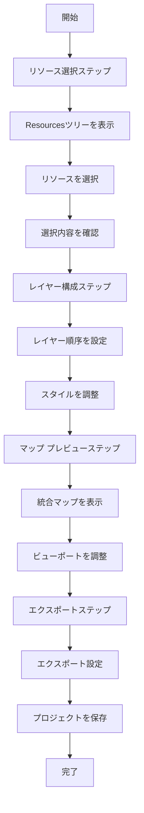

# Project Plugin UI Architecture

This document describes the user interface architecture for the Project Plugin, including React components, user workflows, and integration with HierarchiDB's UI system.

## Overview

The Project Plugin UI provides comprehensive resource aggregation and map composition capabilities through a multi-step interface that allows users to:
- Select resources from the Resources tree through an interactive tree view
- Configure layer composition and styling
- Preview integrated map visualizations
- Export and share project configurations

## Component Architecture

### Top-Level Components

```typescript
interface ProjectUIArchitecture {
  // Main dialog component
  ProjectDialog: React.FC<ProjectDialogProps>;
  
  // Step-based workflow components
  ResourceSelectionStep: React.FC<ResourceSelectionStepProps>;
  LayerCompositionStep: React.FC<LayerCompositionStepProps>;
  MapPreviewStep: React.FC<MapPreviewStepProps>;
  ExportStep: React.FC<ExportStepProps>;
  
  // Resource management components
  ResourceTreeView: React.FC<ResourceTreeViewProps>;
  ResourceReferenceList: React.FC<ResourceReferenceListProps>;
  LayerConfigurationPanel: React.FC<LayerConfigurationPanelProps>;
  
  // Map visualization components
  IntegratedMapView: React.FC<IntegratedMapViewProps>;
  LayerControlPanel: React.FC<LayerControlPanelProps>;
  MapStyleControls: React.FC<MapStyleControlsProps>;
}
```

### Component Hierarchy

```
ProjectDialog
├── ProjectDialogHeader
├── ProjectStepperNavigation
└── ProjectDialogContent
    ├── ResourceSelectionStep
    │   ├── ResourceTreeView
    │   │   ├── TreeNodeItem
    │   │   └── NodeSelectionCheckbox
    │   └── SelectedResourcesSummary
    ├── LayerCompositionStep
    │   ├── LayerConfigurationPanel
    │   │   ├── LayerOrderControl
    │   │   ├── LayerVisibilityControl
    │   │   └── LayerStyleOverrides
    │   └── LayerPreviewList
    ├── MapPreviewStep
    │   ├── IntegratedMapView
    │   │   ├── MapLibreGLContainer
    │   │   └── MapControlOverlays
    │   └── LayerControlPanel
    │       ├── LayerToggleList
    │       └── MapViewportControls
    └── ExportStep
        ├── ExportConfigurationForm
        ├── ExportPreview
        └── SharingOptionsPanel
```

## Core Components

### ProjectDialog

Main dialog component that orchestrates the multi-step project creation workflow.

```typescript
interface ProjectDialogProps {
  nodeId: NodeId;
  isOpen: boolean;
  onClose: () => void;
  onSave: (projectData: ProjectEntity) => Promise<void>;
  initialData?: Partial<ProjectEntity>;
}

export const ProjectDialog: React.FC<ProjectDialogProps> = ({
  nodeId,
  isOpen,
  onClose,
  onSave,
  initialData
}) => {
  const [currentStep, setCurrentStep] = useState<ProjectStep>('resource-selection');
  const [projectData, setProjectData] = useState<ProjectFormData>(() => 
    initializeProjectData(nodeId, initialData)
  );
  
  const steps: ProjectStep[] = [
    'resource-selection',
    'layer-composition', 
    'map-preview',
    'export-configuration'
  ];
  
  return (
    <Dialog
      open={isOpen}
      onClose={onClose}
      maxWidth="xl"
      fullWidth
      PaperProps={{ sx: { height: '90vh' } }}
    >
      <ProjectDialogHeader
        title="プロジェクト設定"
        currentStep={currentStep}
        totalSteps={steps.length}
        onClose={onClose}
      />
      
      <ProjectStepperNavigation
        steps={steps}
        currentStep={currentStep}
        onStepChange={setCurrentStep}
        canNavigateToStep={canNavigateToStep}
      />
      
      <DialogContent>
        <ProjectDialogContent
          currentStep={currentStep}
          projectData={projectData}
          onProjectDataChange={setProjectData}
          onNextStep={() => handleStepNavigation('next')}
          onPreviousStep={() => handleStepNavigation('previous')}
          onSave={onSave}
        />
      </DialogContent>
    </Dialog>
  );
};

type ProjectStep = 
  | 'resource-selection'
  | 'layer-composition'
  | 'map-preview'
  | 'export-configuration';
```

### ResourceSelectionStep

First step component for selecting resources from the Resources tree.

```typescript
interface ResourceSelectionStepProps {
  projectData: ProjectFormData;
  onProjectDataChange: (data: ProjectFormData) => void;
  onNext: () => void;
}

export const ResourceSelectionStep: React.FC<ResourceSelectionStepProps> = ({
  projectData,
  onProjectDataChange,
  onNext
}) => {
  const [resourcesTree, setResourcesTree] = useState<TreeStructure | null>(null);
  const [selectedResources, setSelectedResources] = useState<ResourceSelection[]>([]);
  const [filterOptions, setFilterOptions] = useState<ResourceFilterOptions>({});
  
  // Load Resources tree structure
  useEffect(() => {
    loadResourcesTreeStructure().then(setResourcesTree);
  }, []);
  
  return (
    <Box sx={{ display: 'flex', height: '100%', gap: 2 }}>
      {/* Left Panel: Resource Tree */}
      <Box sx={{ flex: 1, minWidth: 0 }}>
        <ResourceSelectionHeader
          filterOptions={filterOptions}
          onFilterChange={setFilterOptions}
          selectedCount={selectedResources.length}
        />
        
        <ResourceTreeView
          treeData={resourcesTree}
          selectedResources={selectedResources}
          onSelectionChange={handleResourceSelection}
          filterOptions={filterOptions}
          expandedNodes={expandedNodes}
          onNodeExpand={handleNodeExpand}
        />
      </Box>
      
      {/* Right Panel: Selection Summary */}
      <Box sx={{ width: 320, flexShrink: 0 }}>
        <SelectedResourcesSummary
          selectedResources={selectedResources}
          onRemoveResource={handleRemoveResource}
          onReorderResources={handleReorderResources}
          onResourceConfigChange={handleResourceConfigChange}
        />
        
        <Box sx={{ mt: 2 }}>
          <Button
            variant="contained"
            fullWidth
            onClick={onNext}
            disabled={selectedResources.length === 0}
          >
            次へ：レイヤー構成
          </Button>
        </Box>
      </Box>
    </Box>
  );
};
```

### ResourceTreeView

Interactive tree view for browsing and selecting resources from the Resources tree.

```typescript
interface ResourceTreeViewProps {
  treeData: TreeStructure | null;
  selectedResources: ResourceSelection[];
  onSelectionChange: (resources: ResourceSelection[]) => void;
  filterOptions: ResourceFilterOptions;
  expandedNodes: Set<NodeId>;
  onNodeExpand: (nodeId: NodeId, expanded: boolean) => void;
}

export const ResourceTreeView: React.FC<ResourceTreeViewProps> = ({
  treeData,
  selectedResources,
  onSelectionChange,
  filterOptions,
  expandedNodes,
  onNodeExpand
}) => {
  const filteredTreeData = useMemo(() => 
    applyResourceFilters(treeData, filterOptions), 
    [treeData, filterOptions]
  );
  
  if (!filteredTreeData) {
    return <ResourceTreeSkeleton />;
  }
  
  return (
    <TreeView
      defaultCollapseIcon={<ExpandMoreIcon />}
      defaultExpandIcon={<ChevronRightIcon />}
      expanded={Array.from(expandedNodes)}
      onNodeToggle={handleNodeToggle}
      sx={{ flexGrow: 1, overflowY: 'auto' }}
    >
      {renderTreeNodes(filteredTreeData.rootNodes)}
    </TreeView>
  );
  
  function renderTreeNodes(nodes: TreeNode[]): React.ReactNode {
    return nodes.map(node => (
      <TreeItem
        key={node.id}
        nodeId={node.id}
        label={
          <ResourceTreeNodeLabel
            node={node}
            isSelected={isResourceSelected(node.id)}
            onSelectionChange={handleNodeSelection}
            isSelectable={isNodeSelectable(node)}
          />
        }
      >
        {node.children && renderTreeNodes(node.children)}
      </TreeItem>
    ));
  }
};
```

### LayerCompositionStep

Second step component for configuring layer composition and styling.

```typescript
interface LayerCompositionStepProps {
  projectData: ProjectFormData;
  onProjectDataChange: (data: ProjectFormData) => void;
  onNext: () => void;
  onPrevious: () => void;
}

export const LayerCompositionStep: React.FC<LayerCompositionStepProps> = ({
  projectData,
  onProjectDataChange,
  onNext,
  onPrevious
}) => {
  const [layerConfigs, setLayerConfigs] = useState<LayerConfiguration[]>([]);
  const [selectedLayerId, setSelectedLayerId] = useState<string | null>(null);
  
  return (
    <Box sx={{ display: 'flex', height: '100%', gap: 2 }}>
      {/* Left Panel: Layer List */}
      <Box sx={{ width: 350, flexShrink: 0 }}>
        <LayerCompositionHeader
          layerCount={layerConfigs.length}
          onAddLayer={handleAddLayer}
          onImportConfiguration={handleImportConfiguration}
        />
        
        <LayerOrderList
          layers={layerConfigs}
          selectedLayerId={selectedLayerId}
          onLayerSelect={setSelectedLayerId}
          onLayerReorder={handleLayerReorder}
          onLayerToggle={handleLayerToggle}
          onLayerDelete={handleLayerDelete}
        />
      </Box>
      
      {/* Right Panel: Layer Configuration */}
      <Box sx={{ flex: 1, minWidth: 0 }}>
        {selectedLayerId ? (
          <LayerConfigurationPanel
            layerId={selectedLayerId}
            configuration={getLayerConfiguration(selectedLayerId)}
            onConfigurationChange={handleLayerConfigChange}
            availableResources={projectData.selectedResources}
          />
        ) : (
          <LayerConfigurationPlaceholder
            onSelectLayer={setSelectedLayerId}
            availableLayers={layerConfigs}
          />
        )}
      </Box>
      
      {/* Navigation Controls */}
      <Box sx={{ position: 'absolute', bottom: 16, right: 16, display: 'flex', gap: 1 }}>
        <Button onClick={onPrevious}>
          戻る
        </Button>
        <Button
          variant="contained"
          onClick={onNext}
          disabled={layerConfigs.length === 0}
        >
          次へ：プレビュー
        </Button>
      </Box>
    </Box>
  );
};
```

### IntegratedMapView

Map preview component using MapLibreGL.js for integrated visualization.

```typescript
interface IntegratedMapViewProps {
  projectData: ProjectFormData;
  layerConfigurations: LayerConfiguration[];
  onMapLoad: (map: MapLibreMap) => void;
  onViewportChange: (viewport: MapViewport) => void;
}

export const IntegratedMapView: React.FC<IntegratedMapViewProps> = ({
  projectData,
  layerConfigurations,
  onMapLoad,
  onViewportChange
}) => {
  const mapContainer = useRef<HTMLDivElement>(null);
  const map = useRef<MapLibreMap | null>(null);
  
  // Initialize map
  useEffect(() => {
    if (!mapContainer.current) return;
    
    map.current = new MapLibreMap({
      container: mapContainer.current,
      style: getBasemapStyle(projectData.basemapSelection),
      center: projectData.mapConfig.center,
      zoom: projectData.mapConfig.zoom,
      bearing: projectData.mapConfig.bearing,
      pitch: projectData.mapConfig.pitch
    });
    
    map.current.on('load', () => {
      onMapLoad(map.current!);
      loadProjectLayers();
    });
    
    map.current.on('moveend', () => {
      onViewportChange(getCurrentViewport());
    });
    
    return () => {
      map.current?.remove();
    };
  }, []);
  
  // Update layers when configuration changes
  useEffect(() => {
    if (map.current?.isStyleLoaded()) {
      updateMapLayers();
    }
  }, [layerConfigurations]);
  
  return (
    <Box sx={{ position: 'relative', width: '100%', height: '100%' }}>
      <div
        ref={mapContainer}
        style={{ width: '100%', height: '100%' }}
      />
      
      {/* Map Controls Overlay */}
      <MapControlOverlays
        map={map.current}
        layerConfigurations={layerConfigurations}
        onLayerToggle={handleLayerToggle}
        onStyleChange={handleStyleChange}
      />
      
      {/* Loading Overlay */}
      {isLoadingLayers && (
        <MapLoadingOverlay
          message="レイヤーを読み込み中..."
          progress={loadingProgress}
        />
      )}
    </Box>
  );
  
  async function loadProjectLayers() {
    setIsLoadingLayers(true);
    
    try {
      for (const config of layerConfigurations) {
        await addMapLayer(map.current!, config);
        setLoadingProgress(prev => prev + (100 / layerConfigurations.length));
      }
    } catch (error) {
      console.error('Failed to load project layers:', error);
    } finally {
      setIsLoadingLayers(false);
      setLoadingProgress(0);
    }
  }
};
```

## User Workflows

### Project Creation Workflow



### Resource Selection Workflow

1. **Tree Navigation**: Browse Resources tree hierarchy
2. **Filter Application**: Apply resource type and metadata filters
3. **Multi-Selection**: Select resources using checkboxes
4. **Dependency Validation**: Verify resource compatibility
5. **Selection Summary**: Review and organize selected resources

### Layer Composition Workflow

1. **Layer Creation**: Generate layers from selected resources
2. **Order Management**: Arrange layer rendering order
3. **Style Configuration**: Override resource styles
4. **Visibility Control**: Set layer visibility rules
5. **Preview Generation**: Generate layer preview

## State Management

### ProjectFormData Structure

```typescript
interface ProjectFormData {
  // Basic project information
  name: string;
  description: string;
  
  // Resource selection
  selectedResources: ResourceSelection[];
  resourceFilters: ResourceFilterOptions;
  
  // Layer composition
  layerConfigurations: LayerConfiguration[];
  layerOrder: string[];
  
  // Map configuration
  mapConfig: MapConfiguration;
  viewportConfig: ViewportConfiguration;
  
  // Export settings
  exportConfiguration: ExportConfiguration;
  sharingSettings: SharingSettings;
  
  // UI state
  currentStep: ProjectStep;
  validationErrors: ValidationError[];
  isDirty: boolean;
}
```

### Component State Synchronization

```typescript
// Context for sharing state across components
export const ProjectFormContext = createContext<{
  projectData: ProjectFormData;
  updateProjectData: (updates: Partial<ProjectFormData>) => void;
  validation: ValidationState;
  isLoading: boolean;
}>();

// Hook for accessing project form state
export const useProjectForm = () => {
  const context = useContext(ProjectFormContext);
  if (!context) {
    throw new Error('useProjectForm must be used within ProjectFormProvider');
  }
  return context;
};
```

## Responsive Design

### Breakpoint Strategy

```typescript
const breakpoints = {
  mobile: '(max-width: 767px)',
  tablet: '(min-width: 768px) and (max-width: 1023px)', 
  desktop: '(min-width: 1024px)'
};

// Component responsive behavior
const useResponsiveLayout = () => {
  const isMobile = useMediaQuery(breakpoints.mobile);
  const isTablet = useMediaQuery(breakpoints.tablet);
  
  return {
    dialogMaxWidth: isMobile ? 'sm' : 'xl',
    showSidePanels: !isMobile,
    stackVertically: isMobile,
    compactControls: isMobile || isTablet
  };
};
```

### Mobile Optimizations

- **Vertical Layout**: Stack panels vertically on mobile
- **Touch-Friendly Controls**: Larger touch targets and gestures
- **Simplified Navigation**: Reduced complexity for small screens
- **Progressive Enhancement**: Core functionality available on all devices

## Performance Optimizations

### Component Optimization

```typescript
// Memoized tree node rendering
const TreeNodeItem = React.memo<TreeNodeItemProps>(({ node, onSelect, isSelected }) => {
  return (
    <div className={`tree-node ${isSelected ? 'selected' : ''}`}>
      <Checkbox checked={isSelected} onChange={onSelect} />
      <span>{node.name}</span>
    </div>
  );
});

// Virtualized list for large resource collections
const VirtualizedResourceList = ({ resources, height }: { resources: Resource[], height: number }) => {
  return (
    <FixedSizeList
      height={height}
      itemCount={resources.length}
      itemSize={48}
      itemData={resources}
    >
      {ResourceListItem}
    </FixedSizeList>
  );
};
```

### Map Rendering Optimization

```typescript
// Lazy layer loading
const useLayerLoading = (layerConfigs: LayerConfiguration[]) => {
  const [loadedLayers, setLoadedLayers] = useState<Set<string>>(new Set());
  
  const loadLayer = useCallback(async (layerId: string) => {
    if (loadedLayers.has(layerId)) return;
    
    // Load layer data on demand
    await loadLayerData(layerId);
    setLoadedLayers(prev => new Set(prev).add(layerId));
  }, [loadedLayers]);
  
  return { loadedLayers, loadLayer };
};
```

## Integration Points

### HierarchiDB Integration

```typescript
// Plugin dialog integration
export const ProjectDialogWrapper: React.FC<DialogWrapperProps> = ({ nodeId }) => {
  const { isOpen, onClose } = usePluginDialog();
  const { saveEntity } = useEntityHandler<ProjectEntity>();
  
  return (
    <ProjectDialog
      nodeId={nodeId}
      isOpen={isOpen}
      onClose={onClose}
      onSave={saveEntity}
    />
  );
};

// Tree node panel integration
export const ProjectPanelWrapper: React.FC<PanelWrapperProps> = ({ nodeId }) => {
  const { entity } = useEntityData<ProjectEntity>(nodeId);
  
  return (
    <ProjectPanel
      projectEntity={entity}
      onEdit={() => openProjectDialog(nodeId)}
      onExport={() => openExportDialog(nodeId)}
    />
  );
};
```

---

This UI architecture provides a comprehensive foundation for implementing the Project Plugin's user interface within HierarchiDB's React-based frontend system.