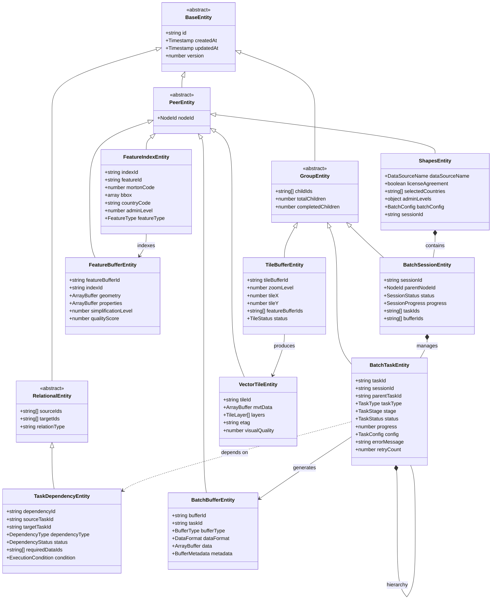
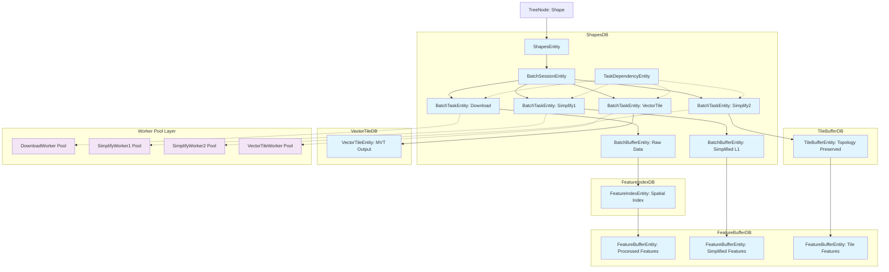

# Shape Plugin Data Model and Worker Architecture

This document describes the comprehensive data model for the Shape Plugin, including all entity types used for database storage, their relationships, and the Worker pool architecture that processes them.

## Overview

The Shape Plugin implements a high-performance geospatial data processing system with:
- **4-stage processing pipeline**: Download → Simplify1 → Simplify2 → VectorTiles
- **Worker pool architecture**: Parallel processing with Web Workers
- **6-category entity system**: HierarchiDB-compliant data storage across 5 specialized databases
- **Spatial indexing**: Morton codes for efficient geographic queries

## Database Architecture

### Database Structure

The Shape Plugin uses 5 specialized databases for optimal performance:

```typescript
interface ShapesDatabaseStructure {
  // 1. ShapesDB - Main configuration and task management
  shapesDB: {
    shapes: ShapesEntity[];        // Main configuration entity
    batchSessions: BatchSession[]; // Batch processing sessions
    batchTasks: BatchTask[];       // Individual processing tasks (GroupEntity)
    taskDependencies: TaskDependency[]; // Task dependencies and data flow (RelationalEntity)
    batchBuffers: BatchBuffer[];   // Raw data buffers
  };
  
  // 2. FeatureIndexDB - Spatial indexing
  featureIndexDB: {
    featureIndices: FeatureIndex[];  // Feature spatial indices
  };
  
  // 3. FeatureBufferDB - Processed feature data
  featureBufferDB: {
    featureBuffers: FeatureBuffer[]; // Feature binary data
  };
  
  // 4. TileBufferDB - Intermediate tile data
  tileBufferDB: {
    tileBuffers: TileBuffer[];       // Tile-level intermediate data
  };
  
  // 5. VectorTileDB - Final output data
  vectorTileDB: {
    vectorTiles: VectorTile[];       // MVT format vector tiles
  };
}
```

### Indexing Strategy

```typescript
const indexConfiguration = {
  // Primary indices for core entities
  shapes: '&nodeId, createdAt, updatedAt',
  batchSessions: '&sessionId, parentNodeId, status, createdAt',
  batchTasks: '&taskId, sessionId, parentTaskId, status, stage, priority',
  taskDependencies: '&dependencyId, [sourceTaskId+targetTaskId], dependencyType, status',
  
  // Spatial indices for geographic queries
  featureIndices: '&indexId, mortonCode, [countryCode+adminLevel]',
  vectorTiles: '&tileId, [zoomLevel+tileX+tileY], lastRequested',
  
  // Performance indices
  batchBuffers: '&bufferId, taskId, createdAt, expiresAt',
  featureBuffers: '&featureBufferId, sourceBufferId, lastOptimized',
  tileBuffers: '&tileBufferId, [zoomLevel+tileX+tileY], status'
};
```

## Entity Type Definitions

### Core Entities (ShapesDB)

#### ShapesEntity (Peer Entity)
Main configuration entity with 1:1 correspondence to TreeNode.

```typescript
export interface ShapesEntity extends PeerEntity {
  // Base PeerEntity properties
  nodeId: TreeNodeId;
  createdAt: Timestamp;
  updatedAt: Timestamp;
  version: number;
  
  // Data source configuration
  dataSourceName: DataSourceName;
  licenseAgreement: boolean;
  
  // Country and administrative level selection
  selectedCountries?: string[];
  adminLevels?: Record<string, boolean>;
  
  // Download state management
  checkboxState?: boolean[][] | string;
  
  // Batch processing configuration
  batchConfig?: BatchConfig;
  clearCacheBeforeStart?: boolean;
  
  // Relational references
  sourceDataIds?: string[];  // References to SourceDataEntity
  sessionId?: string;        // Reference to current BatchSessionEntity
}

// Working Copy with single-session constraint
export type ShapesWorkingCopy = ShapesEntity & WorkingCopyProperties & {
  changes: Partial<ShapesEntity>;
  isDirty: boolean;
  
  // Simplified due to single-session constraint
  exclusiveSessionId: string;  // The one and only active session for this node
};
```

#### BatchSessionEntity (Group Entity)
Manages batch processing sessions with multiple related tasks. **Constraint: Each TreeNode can have at most one active session.**

```typescript
export interface BatchSessionEntity extends GroupEntity {
  // Base GroupEntity properties
  sessionId: string;         // Primary key
  parentNodeId: TreeNodeId;  // Parent shape node (EXCLUSIVE - only one session per node)
  createdAt: Timestamp;
  updatedAt: Timestamp;
  status: SessionStatus;
  
  // Session configuration
  batchConfig: BatchConfig;
  totalTasks: number;
  completedTasks: number;
  failedTasks: number;
  
  // Progress tracking
  startedAt?: Timestamp;
  completedAt?: Timestamp;
  progress: SessionProgress;
  
  // Child entity references
  taskIds: string[];         // References to BatchTaskEntity
  bufferIds: string[];       // References to BatchBufferEntity
  
  // Session exclusivity (simplified due to single-session constraint)
  isExclusive: true;         // Always true - no concurrent sessions allowed
}

type SessionStatus = 'pending' | 'running' | 'completed' | 'failed' | 'cancelled';

interface SessionProgress {
  downloadProgress: number;    // 0-100
  simplify1Progress: number;   // 0-100
  simplify2Progress: number;   // 0-100
  vectorTileProgress: number;  // 0-100
  overallProgress: number;     // 0-100
  estimatedTimeRemaining?: number;
}
```

#### BatchTaskEntity (Group Entity)
Individual processing tasks that manage child tasks in a hierarchical structure.

```typescript
export interface BatchTaskEntity extends GroupEntity {
  // Base GroupEntity properties
  taskId: string;            // Primary key: "nodeId-taskType-details"
  sessionId: string;         // Parent session reference
  nodeId: TreeNodeId;        // Associated shape node
  createdAt: Timestamp;
  updatedAt: Timestamp;
  status: TaskStatus;
  
  // GroupEntity specific - child task management
  parentTaskId?: string;     // Parent task in hierarchy
  childTaskIds: string[];    // Direct child tasks
  totalChildTasks: number;   // Total number of child tasks
  completedChildTasks: number; // Number of completed child tasks
  
  // Task configuration
  taskType: TaskType;
  stage: TaskStage;
  priority: number;
  progress: number;          // 0-100 (calculated from children)
  
  // Processing state
  errorMessage?: string;
  retryCount: number;
  maxRetries: number;
  
  // Timing information
  startedAt?: Timestamp;
  completedAt?: Timestamp;
  
  // Task-specific configuration
  config: TaskConfig;
}

#### TaskDependencyEntity (Relational Entity)
Manages complex dependencies and data flow between tasks.

```typescript
export interface TaskDependencyEntity extends RelationalEntity {
  // Base RelationalEntity properties
  dependencyId: string;      // Primary key
  sourceTaskId: string;      // Source task
  targetTaskId: string;      // Target task
  createdAt: Timestamp;
  updatedAt: Timestamp;
  
  // Dependency configuration
  dependencyType: DependencyType;
  condition?: ExecutionCondition;
  requiredDataIds: string[]; // Required data for dependency
  
  // State management
  status: DependencyStatus;
  evaluatedAt?: Timestamp;
  
  // Data flow tracking
  dataFlowType: DataFlowType;
  transformationRules?: TransformationRule[];
}

type DependencyType = 'sequential' | 'data' | 'conditional' | 'parallel';
type DependencyStatus = 'pending' | 'satisfied' | 'failed' | 'skipped';
type DataFlowType = 'direct' | 'transformed' | 'aggregated' | 'filtered';

interface ExecutionCondition {
  type: 'always' | 'success' | 'failure' | 'custom';
  expression?: string;       // Custom condition expression
  parameters?: Record<string, any>;
}

interface TransformationRule {
  inputFormat: DataFormat;
  outputFormat: DataFormat;
  transformation: string;    // Transformation function name
  parameters?: Record<string, any>;
}

type TaskType = 'download' | 'simplify1' | 'simplify2' | 'vectorTile';
type TaskStage = 'queued' | 'assigned' | 'running' | 'completed' | 'failed';
type TaskStatus = 'pending' | 'queued' | 'running' | 'completed' | 'failed' | 'cancelled';

// Task-specific configurations
interface DownloadTaskConfig {
  dataSource: DataSourceName;
  country: string;
  adminLevel: number;
  url: string;
  timeout: number;
  retryDelay: number;
}

interface SimplifyTaskConfig {
  algorithm: 'douglas-peucker' | 'topojson';
  tolerance: number;
  preserveTopology: boolean;
  minimumArea?: number;
  maxVertices?: number;
}

interface VectorTileTaskConfig {
  zoomLevel: number;
  tileCoordinates: { x: number; y: number; z: number };
  format: 'mvt';
  compression: 'gzip' | 'none';
}
```

#### BatchBufferEntity (Peer Entity)
Raw data buffers for intermediate processing results.

```typescript
export interface BatchBufferEntity extends PeerEntity {
  // Base PeerEntity properties
  bufferId: string;          // Primary key
  sessionId: string;         // Parent session reference
  taskId: string;            // Source task reference
  
  // Buffer metadata
  bufferType: BufferType;
  dataFormat: DataFormat;
  compressionType: CompressionType;
  
  // Size and performance metrics
  originalSize: number;
  compressedSize: number;
  featureCount: number;
  
  // Temporal properties
  createdAt: Timestamp;
  lastAccessed: Timestamp;
  expiresAt?: Timestamp;
  
  // Data storage
  data: ArrayBuffer;         // Binary data
  metadata: BufferMetadata;  // Processing metadata
}

type BufferType = 'raw' | 'simplified' | 'indexed' | 'tiled';
type DataFormat = 'geojson' | 'geobuf' | 'topojson' | 'mvt';
type CompressionType = 'none' | 'gzip' | 'brotli';

interface BufferMetadata {
  bbox: [number, number, number, number];  // Bounding box
  crs: string;                             // Coordinate reference system
  properties: Record<string, any>;         // Custom properties
  processingTime: number;                  // Generation time in ms
  checksum: string;                        // Data integrity hash
}
```

### Spatial Indexing Entities (FeatureIndexDB)

#### FeatureIndexEntity (Peer Entity)
Spatial indexing for efficient geographic queries.

```typescript
export interface FeatureIndexEntity extends PeerEntity {
  // Base PeerEntity properties
  indexId: string;           // Primary key
  featureId: string;         // Referenced feature
  bufferId: string;          // Source buffer reference
  
  // Spatial indexing
  mortonCode: number;        // Morton-encoded spatial position
  bbox: [number, number, number, number];  // Feature bounding box
  centroid: [number, number]; // Feature center point
  
  // Feature properties
  adminLevel: number;
  countryCode: string;
  adminName: string;
  featureType: FeatureType;
  
  // Geometric properties
  area: number;              // Feature area
  perimeter: number;         // Feature perimeter
  complexity: number;        // Geometric complexity score
  
  // Index metadata
  createdAt: Timestamp;
  lastQueried: Timestamp;
  queryCount: number;
}

type FeatureType = 'country' | 'admin1' | 'admin2' | 'admin3' | 'custom';
```

### Feature Storage Entities (FeatureBufferDB)

#### FeatureBufferEntity (Peer Entity)
Optimized storage for processed geographic features.

```typescript
export interface FeatureBufferEntity extends PeerEntity {
  // Base PeerEntity properties
  featureBufferId: string;   // Primary key
  sourceBufferId: string;    // Source buffer reference
  indexId: string;           // Spatial index reference
  
  // Feature identification
  featureId: string;
  originalFeatureId?: string; // Before processing
  
  // Geographic data
  geometry: ArrayBuffer;     // Encoded geometry (Geobuf)
  properties: ArrayBuffer;   // Encoded properties
  
  // Processing metadata
  simplificationLevel: number;
  originalComplexity: number;
  currentComplexity: number;
  qualityScore: number;      // Processing quality metric
  
  // Storage optimization
  compressionRatio: number;
  createdAt: Timestamp;
  lastOptimized: Timestamp;
}
```

### Tile Data Entities (TileBufferDB)

#### TileBufferEntity (Group Entity)
Intermediate tile-level data for vector tile generation.

```typescript
export interface TileBufferEntity extends GroupEntity {
  // Base GroupEntity properties
  tileBufferId: string;      // Primary key
  sessionId: string;         // Parent session reference
  
  // Tile coordinates
  zoomLevel: number;
  tileX: number;
  tileY: number;
  
  // Tile data
  features: string[];        // Feature IDs in this tile
  clipBounds: [number, number, number, number];
  
  // Processing state
  status: TileStatus;
  featureCount: number;
  totalSize: number;
  
  // Child entity references
  featureBufferIds: string[]; // Contained features
  
  // Optimization metadata
  createdAt: Timestamp;
  lastGenerated: Timestamp;
  generationTime: number;
}

type TileStatus = 'pending' | 'processing' | 'completed' | 'error';
```

### Vector Tile Entities (VectorTileDB)

#### VectorTileEntity (Peer Entity)
Final MVT format vector tiles for client consumption.

```typescript
export interface VectorTileEntity extends PeerEntity {
  // Base PeerEntity properties
  tileId: string;            // Primary key: "z/x/y"
  sourceBufferId: string;    // Source tile buffer reference
  
  // Tile coordinates
  zoomLevel: number;
  tileX: number;
  tileY: number;
  
  // Tile data
  mvtData: ArrayBuffer;      // Mapbox Vector Tile data
  
  // Metadata
  layers: TileLayer[];
  totalFeatures: number;
  compressedSize: number;
  uncompressedSize: number;
  
  // Caching and performance
  etag: string;              // HTTP ETag for caching
  createdAt: Timestamp;
  lastRequested: Timestamp;
  requestCount: number;
  
  // Quality metrics
  visualQuality: number;     // Visual quality score
  performanceScore: number;  // Rendering performance score
}

interface TileLayer {
  name: string;
  featureCount: number;
  version: number;
  extent: number;
  keys: string[];            // Property keys
  values: any[];             // Property values
}
```

## Worker Pool Architecture

### WorkerPool Implementation

The Shape Plugin uses a specialized Worker pool system for parallel processing:

```typescript
/**
 * WorkerPool - Generic Web Worker pool management class
 * 
 * Features:
 * - Round-robin load balancing across workers
 * - Type-safe communication using Comlink
 * - Error handling and automatic recovery
 * - Test environment mock support
 */
export class WorkerPool<T extends object> {
  private readonly workers: Comlink.Remote<T>[];  // Comlink-wrapped Workers
  private readonly rawWorkers: Worker[];           // Raw Worker references (for cleanup)
  private idx = 0;                                 // Round-robin index

  constructor(
    private readonly workerPath: string,
    private readonly poolSize: number,
    private readonly isTestEnvironment: boolean = false
  ) {
    this.workers = [];
    this.rawWorkers = [];
    this.initializePool();
  }

  private initializePool(): void {
    if (this.isTestEnvironment) {
      // Mock implementation for testing
      this.workers.push(...Array(this.poolSize).fill(this.createMockWorker()));
      return;
    }

    for (let i = 0; i < this.poolSize; i++) {
      const worker = new Worker(this.workerPath);
      this.rawWorkers.push(worker);
      
      // Error handling
      const errorHandler = (event: ErrorEvent) => {
        console.error(`WorkerPool: Error in ${this.workerPath}:`, {
          message: event.message,
          filename: event.filename,
          line: event.lineno,
          column: event.colno,
          workerId: i
        });
        this.restartWorker(i);
      };

      worker.onerror = errorHandler;
      worker.onmessageerror = errorHandler;

      // Wrap with Comlink for type-safe communication
      const workerProxy = Comlink.wrap<T>(worker);
      this.workers.push(workerProxy);
    }
  }

  async execute<K extends keyof T>(
    method: K,
    ...args: T[K] extends (...args: any[]) => any ? Parameters<T[K]> : never
  ): Promise<T[K] extends (...args: any[]) => any ? ReturnType<T[K]> : never> {
    const worker = this.getNextWorker();
    
    try {
      const result = await (worker[method] as any)(...args);
      return result;
    } catch (error) {
      console.error(`WorkerPool: ${String(method)} failed:`, error);
      throw error;
    }
  }

  private getNextWorker(): Comlink.Remote<T> {
    const worker = this.workers[this.idx];
    this.idx = (this.idx + 1) % this.workers.length;
    return worker;
  }

  async destroy(): Promise<void> {
    await Promise.all(this.workers.map(worker => worker[Comlink.releaseProxy]()));
    this.rawWorkers.forEach(worker => worker.terminate());
    this.workers.length = 0;
    this.rawWorkers.length = 0;
  }
}
```

### Worker Pool Manager

Centralized management of all Worker pools:

```typescript
export class WorkerPoolManager {
  private downloadPool: WorkerPool<DownloadWorkerAPI>;
  private simplify1Pool: WorkerPool<SimplifyWorker1API>;
  private simplify2Pool: WorkerPool<SimplifyWorker2API>;
  private vectorTilePool: WorkerPool<VectorTileWorkerAPI>;

  constructor(config: WorkerPoolConfig = DEFAULT_WORKER_CONFIG) {
    this.initializePools(config);
  }

  private initializePools(config: WorkerPoolConfig): void {
    this.downloadPool = new WorkerPool(
      '/workers/download-worker.js',
      config.downloadWorkers
    );
    
    this.simplify1Pool = new WorkerPool(
      '/workers/simplify1-worker.js',
      config.simplify1Workers
    );
    
    this.simplify2Pool = new WorkerPool(
      '/workers/simplify2-worker.js',
      config.simplify2Workers
    );
    
    this.vectorTilePool = new WorkerPool(
      '/workers/vector-tile-worker.js',
      config.vectorTileWorkers
    );
  }

  async executeDownloadTask(task: DownloadTask): Promise<DownloadResult> {
    return this.downloadPool.execute('processDownload', task);
  }

  async executeSimplify1Task(task: Simplify1Task): Promise<Simplify1Result> {
    return this.simplify1Pool.execute('processSimplification', task);
  }

  async executeSimplify2Task(task: Simplify2Task): Promise<Simplify2Result> {
    return this.simplify2Pool.execute('processTileSimplification', task);
  }

  async executeVectorTileTask(task: VectorTileTask): Promise<VectorTileResult> {
    return this.vectorTilePool.execute('generateVectorTile', task);
  }
}

const DEFAULT_WORKER_CONFIG: WorkerPoolConfig = {
  downloadWorkers: 2,      // Network I/O constrained
  simplify1Workers: 4,     // CPU-intensive
  simplify2Workers: 4,     // CPU-intensive
  vectorTileWorkers: 2     // Moderate CPU + I/O
};
```

### Individual Worker Implementations

#### DownloadWorker

Handles data source downloads and initial processing:

```typescript
/**
 * DownloadWorker - Geographic data download and preprocessing
 * 
 * Responsibilities:
 * - Download from multiple data sources (GADM, Natural Earth, OSM, GeoBoundaries)
 * - Data validation and format conversion
 * - Compression and caching
 * - Initial spatial indexing
 */
export class DownloadWorker implements DownloadWorkerAPI {
  private db: ShapesDB;
  private featureIndexDB: FeatureIndexDB;
  private featureBufferDB: FeatureBufferDB;

  async processDownload(task: DownloadTask): Promise<DownloadResult> {
    const { taskId, nodeId, config } = task;
    
    try {
      // 1. Download raw data
      const rawData = await this.downloadFromSource(config);
      
      // 2. Validate and parse data
      const geoJson = await this.validateAndParseData(rawData, config.expectedFormat);
      
      // 3. Generate spatial indices
      const spatialIndices = await this.generateSpatialIndices(geoJson);
      
      // 4. Store in feature buffers
      const bufferIds = await this.storeFeatureBuffers(geoJson, spatialIndices);
      
      // 5. Create batch buffer record
      const bufferId = await this.createBatchBuffer(taskId, rawData, bufferIds);
      
      return {
        taskId,
        status: 'completed',
        outputBufferId: bufferId,
        featureCount: geoJson.features.length,
        downloadTime: Date.now() - task.startedAt!,
        spatialIndices
      };
      
    } catch (error) {
      console.error(`DownloadWorker error for ${taskId}:`, error);
      throw new DownloadError(`Download failed: ${error.message}`, config.url);
    }
  }

  private async downloadFromSource(config: DownloadTaskConfig): Promise<ArrayBuffer> {
    // Implementation of actual download logic
    // Handles different data sources, retries, timeouts
  }

  private async generateSpatialIndices(geoJson: GeoJSONFeatureCollection): Promise<FeatureIndex[]> {
    // Generate Morton codes and spatial indices for efficient querying
  }
}
```

#### SimplifyWorker1

Performs feature-level simplification:

```typescript
/**
 * SimplifyWorker1 - Feature-level simplification
 * 
 * Responsibilities:
 * - Individual feature simplification using Douglas-Peucker algorithm
 * - Topology preservation options (prevent self-intersection)
 * - Morton code recalculation for simplified geometries
 * - Area and complexity-based filtering
 */
export class SimplifyWorker1 implements SimplifyWorker1API {
  private featureIndexDB: FeatureIndexDB;
  private featureBufferDB: FeatureBufferDB;

  async processSimplification(task: Simplify1Task): Promise<Simplify1Result> {
    const { taskId, inputBufferId, config } = task;
    
    try {
      // 1. Load features from input buffer
      const features = await this.loadFeaturesFromBuffer(inputBufferId);
      
      // 2. Apply Douglas-Peucker simplification
      const simplifiedFeatures = await this.applyDouglasePeuckerSimplification(
        features, 
        config
      );
      
      // 3. Filter by area and complexity thresholds
      const filteredFeatures = this.filterByThresholds(simplifiedFeatures, config);
      
      // 4. Recalculate spatial indices
      const updatedIndices = await this.recalculateSpatialIndices(filteredFeatures);
      
      // 5. Store simplified features
      const outputBufferId = await this.storeSimplifiedFeatures(
        filteredFeatures, 
        updatedIndices
      );
      
      return {
        taskId,
        status: 'completed',
        outputBufferId,
        originalFeatureCount: features.length,
        simplifiedFeatureCount: filteredFeatures.length,
        reductionRatio: 1 - (filteredFeatures.length / features.length),
        processingTime: Date.now() - task.startedAt!
      };
      
    } catch (error) {
      console.error(`SimplifyWorker1 error for ${taskId}:`, error);
      throw new ProcessingError(`Simplification failed: ${error.message}`, taskId, 'simplify1');
    }
  }

  private async applyDouglasePeuckerSimplification(
    features: GeoJSONFeature[],
    config: SimplifyTaskConfig
  ): Promise<GeoJSONFeature[]> {
    // Implementation of Douglas-Peucker algorithm
    // Preserves important vertices while reducing overall complexity
  }
}
```

#### SimplifyWorker2

Performs tile-level TopoJSON simplification:

```typescript
/**
 * SimplifyWorker2 - Tile-level TopoJSON simplification
 * 
 * Responsibilities:
 * - Group features by tile grid
 * - TopoJSON-based topology-preserving simplification
 * - Shared boundary resolution
 * - Quantization and coordinate precision optimization
 */
export class SimplifyWorker2 implements SimplifyWorker2API {
  private featureIndexDB: FeatureIndexDB;
  private featureBufferDB: FeatureBufferDB;
  private tileBufferDB: TileBufferDB;

  async processTileSimplification(task: Simplify2Task): Promise<Simplify2Result> {
    const { taskId, inputBufferId, config } = task;
    
    try {
      // 1. Load simplified features from previous stage
      const features = await this.loadFeaturesFromBuffer(inputBufferId);
      
      // 2. Group features by tile grid
      const tileGroups = this.groupFeaturesByTileGrid(features, config.zoomLevel);
      
      // 3. Process each tile group with TopoJSON
      const processedTiles = await Promise.all(
        tileGroups.map(group => this.processTopoJSONTile(group, config))
      );
      
      // 4. Store tile buffers
      const tileBufferIds = await this.storeTileBuffers(processedTiles);
      
      return {
        taskId,
        status: 'completed',
        tileBufferIds,
        tilesGenerated: processedTiles.length,
        processingTime: Date.now() - task.startedAt!
      };
      
    } catch (error) {
      console.error(`SimplifyWorker2 error for ${taskId}:`, error);
      throw new ProcessingError(`Tile simplification failed: ${error.message}`, taskId, 'simplify2');
    }
  }

  private async processTopoJSONTile(
    tileFeatures: GeoJSONFeature[],
    config: SimplifyTaskConfig
  ): Promise<TileBuffer> {
    // Implementation of TopoJSON-based simplification
    // Preserves shared boundaries between adjacent features
  }
}
```

#### VectorTileWorker

Generates final MVT output:

```typescript
/**
 * VectorTileWorker - MVT (Mapbox Vector Tile) generation
 * 
 * Responsibilities:
 * - Convert tile buffers to MVT format
 * - Layer organization and optimization
 * - Compression and caching metadata
 * - Quality scoring and performance metrics
 */
export class VectorTileWorker implements VectorTileWorkerAPI {
  async generateVectorTile(task: VectorTileTask): Promise<VectorTileResult> {
    const { taskId, tileBufferId, config } = task;
    
    try {
      // 1. Load tile buffer data
      const tileBuffer = await this.loadTileBuffer(tileBufferId);
      
      // 2. Clip geometries to tile boundaries
      const clippedFeatures = this.clipFeaturesToTile(tileBuffer, config);
      
      // 3. Generate MVT data
      const mvtData = await this.generateMVTData(clippedFeatures, config);
      
      // 4. Apply compression if enabled
      const compressedData = config.compression ? 
        await this.compressData(mvtData) : mvtData;
      
      // 5. Generate metadata and quality metrics
      const metadata = this.generateTileMetadata(compressedData, clippedFeatures);
      
      // 6. Store vector tile
      const tileId = `${config.zoomLevel}/${config.tileX}/${config.tileY}`;
      await this.storeVectorTile(tileId, compressedData, metadata);
      
      return {
        taskId,
        status: 'completed',
        tileId,
        mvtSize: compressedData.byteLength,
        featureCount: clippedFeatures.length,
        processingTime: Date.now() - task.startedAt!
      };
      
    } catch (error) {
      console.error(`VectorTileWorker error for ${taskId}:`, error);
      throw new ProcessingError(`Vector tile generation failed: ${error.message}`, taskId, 'vectorTile');
    }
  }

  private async generateMVTData(
    features: GeoJSONFeature[],
    config: VectorTileTaskConfig
  ): Promise<ArrayBuffer> {
    // Implementation of MVT generation
    // Follows Mapbox Vector Tile specification
  }
}
```

## Entity Relationships and Data Structure Diagrams

### Entity Relationship Diagram (ERD)

```mermaid
erDiagram
    TreeNode ||--|| ShapesEntity : "1:1 configuration"
    ShapesEntity ||--o{ BatchSessionEntity : "1:N sessions"
    BatchSessionEntity ||--o{ BatchTaskEntity : "1:N tasks"
    
    %% Task Hierarchy (GroupEntity pattern)
    BatchTaskEntity ||--o{ BatchTaskEntity : "1:N parent-child"
    
    %% Task Dependencies (RelationalEntity pattern)
    BatchTaskEntity ||--o{ TaskDependencyEntity : "1:N source"
    BatchTaskEntity ||--o{ TaskDependencyEntity : "1:N target"
    
    %% Task Data Flow
    BatchTaskEntity ||--o{ BatchBufferEntity : "1:N generates"
    BatchBufferEntity ||--o{ FeatureIndexEntity : "1:N indices"
    FeatureIndexEntity ||--|| FeatureBufferEntity : "1:1 buffer"
    
    %% Tile Processing
    FeatureBufferEntity }o--|| TileBufferEntity : "N:1 tile"
    TileBufferEntity ||--|| VectorTileEntity : "1:1 output"
    
    %% Entity Attributes
    ShapesEntity {
        NodeId nodeId PK
        string dataSourceName
        string[] selectedCountries
        object batchConfig
        boolean licenseAgreement
    }
    
    BatchSessionEntity {
        string sessionId PK
        NodeId nodeId FK
        string status
        object progress
        number totalTasks
        number completedTasks
    }
    
    BatchTaskEntity {
        string taskId PK
        string sessionId FK
        string parentTaskId FK
        string[] childTaskIds
        string taskType
        string stage
        string status
        number progress
        object config
    }
    
    TaskDependencyEntity {
        string dependencyId PK
        string sourceTaskId FK
        string targetTaskId FK
        string dependencyType
        string status
        string[] requiredDataIds
    }
    
    BatchBufferEntity {
        string bufferId PK
        string taskId FK
        string bufferType
        string dataFormat
        ArrayBuffer data
        object metadata
    }
    
    FeatureIndexEntity {
        string indexId PK
        string featureId
        string bufferId FK
        number mortonCode
        array bbox
        string countryCode
        number adminLevel
    }
    
    FeatureBufferEntity {
        string featureBufferId PK
        string indexId FK
        ArrayBuffer geometry
        ArrayBuffer properties
        number simplificationLevel
        number qualityScore
    }
    
    TileBufferEntity {
        string tileBufferId PK
        string sessionId FK
        number zoomLevel
        number tileX
        number tileY
        string[] featureBufferIds
        string status
    }
    
    VectorTileEntity {
        string tileId PK
        string sourceBufferId FK
        number zoomLevel
        number tileX
        number tileY
        ArrayBuffer mvtData
        object[] layers
        string etag
    }
```



### Class Diagram - Entity Type Hierarchy



### Data Flow Architecture Diagram



## Single-Session Constraint and Design Simplifications

### Core Constraint: One Working Copy Per TreeNode

**HierarchiDB Constraint**: Each TreeNode can have at most one Working Copy at any given time.

**Shape Plugin Implication**: Only one batch processing session can be active per Shape node.

```typescript
// Constraint enforcement
interface SessionExclusivity {
  // ✅ Allowed: Single active session
  activeSession: BatchSessionEntity | null;
  
  // ❌ Forbidden: Multiple concurrent sessions
  // concurrentSessions: BatchSessionEntity[]; // Not allowed
}
```

### Design Simplifications Due to Single-Session Constraint

#### 1. **Eliminated Complexity**

**No Concurrent Session Management**:
```typescript
// ❌ Complex multi-session management (not needed)
interface MultiSessionManager {
  sessionConflicts: ConflictRecord[];
  sessionPriority: PriorityQueue<BatchSessionEntity>;
  conflictResolution: ConflictResolutionStrategy;
  lockManagement: DistributedLockService;
}

// ✅ Simple exclusive session management (sufficient)
interface ExclusiveSessionManager {
  checkActiveSession: (nodeId: TreeNodeId) => Promise<boolean>;
  createSession: (nodeId: TreeNodeId, config: BatchConfig) => Promise<string>;
  endSession: (nodeId: TreeNodeId) => Promise<void>;
}
```

#### 2. **Simplified Working Copy Management**

```typescript
class WorkingCopyManager {
  // Simple exclusive access
  async createWorkingCopy(nodeId: TreeNodeId): Promise<ShapesWorkingCopy> {
    const existingSession = await this.getActiveSession(nodeId);
    if (existingSession) {
      throw new Error(`Node ${nodeId} already has active session: ${existingSession.sessionId}`);
    }
    
    // Create exclusive working copy
    return this.createExclusiveWorkingCopy(nodeId);
  }
  
  // No complex conflict resolution needed
  async commitWorkingCopy(workingCopy: ShapesWorkingCopy): Promise<void> {
    // Direct commit - no merge conflicts possible
    await this.directCommit(workingCopy);
    await this.releaseExclusiveLock(workingCopy.nodeId);
  }
}
```

#### 3. **Simplified Error Handling**

```typescript
// Error scenarios are straightforward
enum SessionError {
  NODE_ALREADY_PROCESSING = 'Node already has active processing session',
  SESSION_NOT_FOUND = 'No active session found for node',
  INVALID_SESSION_STATE = 'Session in invalid state for operation'
}

// Simple error recovery
class SessionErrorHandler {
  async handleSessionError(error: SessionError, nodeId: TreeNodeId): Promise<void> {
    switch (error) {
      case SessionError.NODE_ALREADY_PROCESSING:
        // Wait for current session or prompt user to cancel
        await this.handleExistingSession(nodeId);
        break;
      
      case SessionError.SESSION_NOT_FOUND:
        // Simply create new session
        await this.createNewSession(nodeId);
        break;
        
      case SessionError.INVALID_SESSION_STATE:
        // Reset session state
        await this.resetSessionState(nodeId);
        break;
    }
  }
}
```

### Implementation Benefits

1. **Reduced Complexity**: No concurrent session coordination
2. **Simplified Testing**: Linear session lifecycle testing
3. **Better Performance**: No lock contention or conflict resolution overhead
4. **Clearer UX**: User sees clear "processing in progress" state
5. **Easier Debugging**: Single execution path per node

## Entity Classification Rationale

### Why BatchTaskEntity is GroupEntity

**GroupEntity Pattern for Task Hierarchy**:
```typescript
// Parent download task manages multiple country-specific child tasks
const downloadParentTask: BatchTaskEntity = {
  taskId: 'node123-download-parent',
  taskType: 'download',
  childTaskIds: [
    'node123-download-JP-level1',
    'node123-download-JP-level2', 
    'node123-download-US-level1'
  ],
  totalChildTasks: 3,
  completedChildTasks: 1,
  progress: 33 // Calculated from child completion
};
```

**Benefits of GroupEntity Classification**:
1. **Hierarchical Progress Tracking**: Parent task progress automatically calculated from children
2. **Resource Management**: Can manage and monitor child task lifecycle
3. **Atomic Operations**: Can cancel/retry entire task hierarchies
4. **Clear Ownership**: Parent task owns and manages child tasks

### Why TaskDependencyEntity is RelationalEntity

**RelationalEntity Pattern for Complex Dependencies**:
```typescript
// Sequential dependency: Simplify1 tasks depend on Download completion
const sequentialDependency: TaskDependencyEntity = {
  dependencyId: 'dep-seq-001',
  sourceTaskId: 'node123-download-JP-level1',
  targetTaskId: 'node123-simplify1-JP-level1',
  dependencyType: 'sequential',
  status: 'satisfied'
};

// Data dependency: VectorTile task needs multiple Simplify2 outputs
const dataDependency: TaskDependencyEntity = {
  dependencyId: 'dep-data-002',
  sourceTaskId: 'node123-simplify2-tile-z8-x128-y85',
  targetTaskId: 'node123-vectortile-z8-x128-y85',
  dependencyType: 'data',
  requiredDataIds: ['buffer-simplified-tile-001', 'index-spatial-002'],
  status: 'pending'
};
```

**Benefits of RelationalEntity Classification**:
1. **N:N Relationships**: One task can depend on multiple sources; one source can feed multiple targets
2. **Complex Conditions**: Support conditional dependencies and custom execution logic
3. **Data Flow Tracking**: Explicit tracking of data dependencies between tasks
4. **Flexible Scheduling**: Enable sophisticated task scheduling based on dependency graphs

### Processing Flow with Entity Classification

The Worker pool architecture processes data through a 4-stage pipeline:

1. **Download Stage**: `DownloadWorker` fetches and validates raw geographic data
   - **GroupEntity**: `BatchTaskEntity` manages country/level-specific child downloads
   - **RelationalEntity**: `TaskDependencyEntity` tracks data dependencies

2. **Simplify1 Stage**: `SimplifyWorker1` applies feature-level simplification
   - **GroupEntity**: Parent simplify1 task manages feature-batch child tasks
   - **RelationalEntity**: Dependencies on download task completion

3. **Simplify2 Stage**: `SimplifyWorker2` performs tile-level topology preservation
   - **GroupEntity**: Parent simplify2 task manages tile-grid child tasks
   - **RelationalEntity**: Dependencies on simplify1 outputs and spatial adjacency

4. **VectorTile Stage**: `VectorTileWorker` generates final MVT output
   - **GroupEntity**: Parent vectortile task manages zoom-level child tasks
   - **RelationalEntity**: Dependencies on simplify2 tile outputs

Each stage creates appropriate entities in the corresponding databases, with full traceability through the processing pipeline.

## Performance Considerations

### Worker Pool Sizing

```typescript
const optimalPoolSizes = {
  download: Math.min(2, navigator.hardwareConcurrency),      // Network I/O bound
  simplify1: Math.max(2, navigator.hardwareConcurrency - 1), // CPU intensive
  simplify2: Math.max(2, navigator.hardwareConcurrency - 1), // CPU intensive  
  vectorTile: Math.min(2, navigator.hardwareConcurrency)     // Moderate CPU + I/O
};
```

### Memory Management

- **Streaming processing**: Large datasets processed in chunks
- **Buffer management**: Automatic cleanup of expired intermediate data
- **Cache strategy**: LRU eviction for tile data
- **Compression**: Geobuf/Brotli for storage optimization

### Spatial Indexing

- **Morton codes**: Z-order curve for efficient spatial queries
- **R-tree indices**: Bounding box intersection queries
- **Tile-based partitioning**: Geographic data organized by zoom level

This comprehensive data model and Worker architecture ensures efficient processing, storage, and retrieval of geographic data while maintaining consistency with HierarchiDB's architectural patterns.