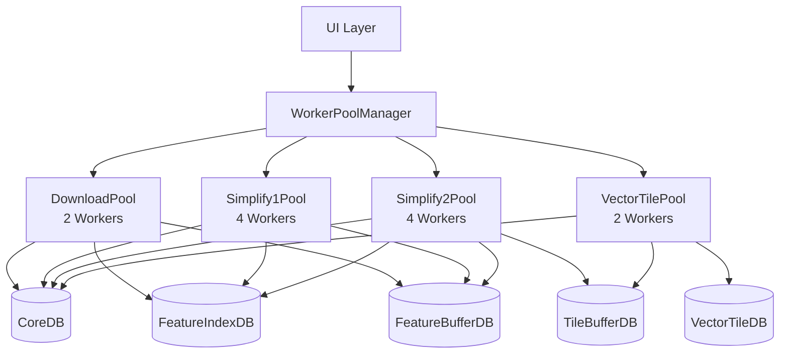
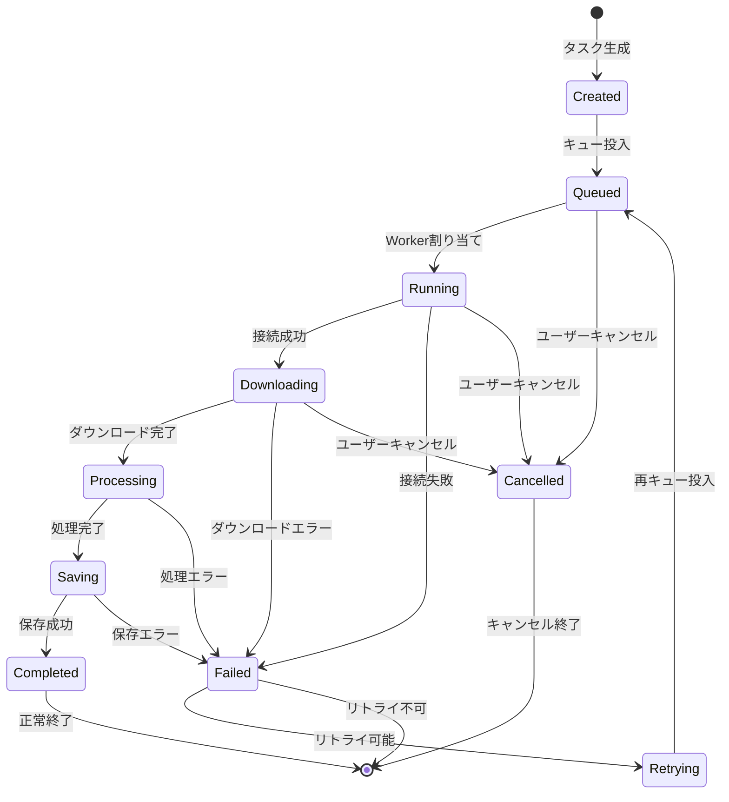

# Shape Plugin Worker処理とタスクライフサイクル詳細仕様

## 1. 概要

Shape pluginは、大規模な地理空間データ処理を効率的に実行するため、Web Worker プールベースのパイプライン処理を実装しています。本ドキュメントでは、Worker処理の詳細設計とデータベース上でのタスクライフサイクル管理について解説します。

## 2. Worker Pool アーキテクチャ

### 2.1 全体構成



### 2.2 WorkerPool 実装詳細

#### 2.2.1 基本設計

```typescript
/**
 * WorkerPool - 汎用的なWeb Workerプール管理クラス
 * 
 * ## 主要機能
 * - ラウンドロビン方式によるWorker負荷分散
 * - Comlinkを使用したWorkerとの型安全な通信
 * - エラーハンドリングとログ出力
 * - テスト環境でのモック対応
 * - メモリリーク防止のための適切なクリーンアップ
 */
export class WorkerPool<T extends object> {
  private readonly workers: Comlink.Remote<T>[];  // Comlinkラップ済みWorker
  private readonly rawWorkers: Worker[];           // 生のWorker参照（クリーンアップ用）
  private idx = 0;                                 // ラウンドロビン用インデックス
  
  async run<K extends keyof T>(
    method: K,
    ...args: T[K] extends (...args: infer A) => unknown ? A : never
  ): Promise<T[K] extends (...args: unknown[]) => infer R ? R : never> {
    const worker = this.workers[this.idx];
    this.idx = (this.idx + 1) % this.workers.length;
    
    try {
      const methodFn = worker[method] as any;
      return await methodFn(...args);
    } catch (error) {
      console.error(`WorkerPool: ${String(method)} failed:`, error);
      throw error;
    }
  }
}
```

#### 2.2.2 プールサイズ設定

```typescript
const defaultPoolSizes = {
  download: 2,      // ネットワークI/O制約
  simplify1: 4,     // CPU集約的（フィーチャー処理）
  simplify2: 4,     // CPU集約的（タイル処理）
  vectorTile: 2     // 中程度のCPU + I/O
};
```

## 3. ダウンロードタスクのライフサイクル

### 3.1 タスクのデータベース表現

#### 3.1.1 エンティティ構造

```typescript
interface DownloadTask extends BatchTask {
  // === 識別子 ===
  taskId: string;        // 例: "node123-download-JP-2-task001"
  sessionId: string;     // 例: "session-2024-01-15-abc123"
  nodeId: NodeId;        // TreeNode ID
  
  // === タスク種別 ===
  taskType: 'download';  // 固定値
  stage: TaskStage;      // 現在のステージ
  
  // === ダウンロード固有情報 ===
  dataSource: 'GeoBoundaries';  // データソース
  countryCode: 'JP';            // 国コード
  adminLevel: 2;                // 行政レベル
  url: string;                   // 実際のダウンロードURL
  
  // === 進捗管理 ===
  progress: {
    bytesDownloaded: number;     // ダウンロード済みバイト
    totalBytes: number;          // 総バイト数
    percentage: number;          // パーセンテージ
    currentPhase: DownloadPhase; // 現在のフェーズ
  };
  
  // === タイムスタンプ ===
  createdAt: number;     // タスク作成時刻
  queuedAt: number;      // キュー投入時刻  
  startedAt?: number;    // 実行開始時刻
  completedAt?: number;  // 完了時刻
  
  // === 結果情報 ===
  result?: {
    bufferId: string;           // 生成されたBatchBufferのID
    featureCount: number;       // 抽出されたフィーチャー数
    originalSize: number;       // 元データサイズ
    compressedSize: number;     // 圧縮後サイズ
    extractedFeatureIds?: number[]; // 抽出されたフィーチャーID配列
  };
  
  // === エラー情報 ===
  error?: {
    code: string;
    message: string;
    retryable: boolean;
    retryCount: number;
  };
}
```

#### 3.1.2 ステージ定義

```typescript
type TaskStage = 
  | 'pending'    // 待機中
  | 'queued'     // キュー投入済み
  | 'running'    // 実行中
  | 'completed'  // 完了
  | 'failed'     // 失敗
  | 'cancelled'  // キャンセル
  | 'retrying';  // リトライ中

type DownloadPhase = 
  | 'connecting'     // 接続中
  | 'downloading'    // ダウンロード中
  | 'decompressing'  // 解凍中
  | 'parsing'        // パース中
  | 'extracting'     // フィーチャー抽出中
  | 'encoding';      // Geobuf変換中
```

### 3.2 ライフサイクルフロー

#### 3.2.1 状態遷移図



#### 3.2.2 各フェーズの詳細処理

```typescript
class DownloadTaskLifecycle {
  
  // === フェーズ1: タスク作成 ===
  async createTask(config: DownloadConfig): Promise<DownloadTask> {
    const task: DownloadTask = {
      taskId: generateTaskId(config),
      sessionId: config.sessionId,
      nodeId: config.nodeId,
      taskType: 'download',
      stage: 'pending',
      
      // ダウンロード設定
      dataSource: config.dataSource,
      countryCode: config.countryCode,
      adminLevel: config.adminLevel,
      url: buildDownloadUrl(config),
      
      // 初期進捗
      progress: {
        bytesDownloaded: 0,
        totalBytes: 0,
        percentage: 0,
        currentPhase: 'connecting'
      },
      
      // タイムスタンプ
      createdAt: Date.now(),
      queuedAt: 0
    };
    
    // CoreDBに保存
    await coreDB.batchTasks.add(task);
    
    // EphemeralDBにキュー情報を追加
    await ephemeralDB.downloadQueue.add({
      queueId: task.taskId,
      nodeId: task.nodeId,
      priority: calculatePriority(config),
      status: 'waiting',
      createdAt: Date.now()
    });
    
    return task;
  }
  
  // === フェーズ2: キュー投入 ===
  async queueTask(taskId: string): Promise<void> {
    // タスク状態を更新
    await coreDB.batchTasks.update(taskId, {
      stage: 'queued',
      queuedAt: Date.now()
    });
    
    // キューステータスを更新
    await ephemeralDB.downloadQueue.update(taskId, {
      status: 'queued'
    });
  }
  
  // === フェーズ3: 実行開始 ===
  async startExecution(taskId: string, workerId: string): Promise<void> {
    const task = await coreDB.batchTasks.get(taskId);
    
    // タスク状態を実行中に更新
    await coreDB.batchTasks.update(taskId, {
      stage: 'running',
      startedAt: Date.now(),
      'progress.currentPhase': 'connecting'
    });
    
    // Worker割り当て情報を記録
    await ephemeralDB.workerAssignments.add({
      taskId,
      workerId,
      assignedAt: Date.now()
    });
  }
  
  // === フェーズ4: ダウンロード進捗更新 ===
  async updateProgress(
    taskId: string, 
    progress: ProgressUpdate
  ): Promise<void> {
    await coreDB.batchTasks.update(taskId, {
      'progress.bytesDownloaded': progress.bytesDownloaded,
      'progress.totalBytes': progress.totalBytes,
      'progress.percentage': progress.percentage,
      'progress.currentPhase': progress.phase
    });
    
    // 進捗イベントを発火（UIに通知）
    await publishProgressEvent(taskId, progress);
  }
  
  // === フェーズ5: データ処理 ===
  async processDownloadedData(
    taskId: string,
    data: ArrayBuffer
  ): Promise<ProcessingResult> {
    // フェーズを処理中に更新
    await coreDB.batchTasks.update(taskId, {
      'progress.currentPhase': 'parsing'
    });
    
    // GeoJSONをパース
    const geoJson = await parseGeoData(data);
    
    // フィーチャーを抽出
    await coreDB.batchTasks.update(taskId, {
      'progress.currentPhase': 'extracting'
    });
    const features = await extractFeatures(geoJson);
    
    // Geobufにエンコード
    await coreDB.batchTasks.update(taskId, {
      'progress.currentPhase': 'encoding'
    });
    const geobuf = await encodeToGeobuf(features);
    
    return { geobuf, features, stats };
  }
  
  // === フェーズ6: データ保存 ===
  async saveResults(
    taskId: string,
    result: ProcessingResult
  ): Promise<void> {
    const task = await coreDB.batchTasks.get(taskId);
    
    // BatchBufferを作成
    const buffer: BatchBuffer = {
      nodeId: task.nodeId,
      taskId: task.taskId,
      bufferType: 'raw',
      buffer: result.geobuf,
      encoding: 'geobuf',
      originalSize: result.stats.originalSize,
      compressedSize: result.geobuf.byteLength,
      featureCount: result.features.length,
      createdAt: Date.now()
    };
    
    await coreDB.batchBuffers.add(buffer);
    
    // フィーチャーインデックスを作成
    for (const feature of result.features) {
      const index: FeatureIndex = {
        nodeId: task.nodeId,
        featureId: feature.id,
        mortonCode: calculateMortonCode(feature.bbox),
        bbox: feature.bbox,
        centroid: feature.centroid,
        adminLevel: task.adminLevel,
        countryCode: task.countryCode,
        name: feature.properties.name,
        createdAt: Date.now(),
        updatedAt: Date.now()
      };
      
      await coreDB.featureIndices.add(index);
    }
    
    // タスクを完了状態に更新
    await coreDB.batchTasks.update(taskId, {
      stage: 'completed',
      completedAt: Date.now(),
      result: {
        bufferId: buffer.bufferId,
        featureCount: result.features.length,
        originalSize: result.stats.originalSize,
        compressedSize: buffer.compressedSize,
        extractedFeatureIds: result.features.map(f => f.id)
      }
    });
  }
}
```

### 3.3 エラー処理とリトライ

#### 3.3.1 エラー処理フロー

```typescript
async handleError(taskId: string, error: Error): Promise<void> {
  const task = await coreDB.batchTasks.get(taskId);
  const retryCount = task.error?.retryCount || 0;
  
  // エラーが再試行可能か判定
  const retryable = isRetryableError(error) && retryCount < 3;
  
  if (retryable) {
    // リトライ状態に更新
    await coreDB.batchTasks.update(taskId, {
      stage: 'retrying',
      error: {
        code: error.code,
        message: error.message,
        retryable: true,
        retryCount: retryCount + 1
      }
    });
    
    // 指数バックオフで再キュー
    const delay = Math.pow(2, retryCount) * 1000;
    setTimeout(() => this.queueTask(taskId), delay);
    
  } else {
    // 失敗状態に更新
    await coreDB.batchTasks.update(taskId, {
      stage: 'failed',
      completedAt: Date.now(),
      error: {
        code: error.code,
        message: error.message,
        retryable: false,
        retryCount
      }
    });
    
    // エラーログを記録
    await ephemeralDB.errorLogs.add({
      logId: generateLogId(),
      nodeId: task.nodeId,
      sessionId: task.sessionId,
      taskId: task.taskId,
      timestamp: Date.now(),
      error: error.stack
    });
  }
}
```

#### 3.3.2 リトライ可能なエラー判定

```typescript
function isRetryableError(error: Error): boolean {
  const retryableCodes = [
    'NETWORK_ERROR',
    'TIMEOUT',
    'CORS_ERROR',
    'RATE_LIMIT',
    'TEMPORARY_FAILURE'
  ];
  
  return retryableCodes.includes(error.code) ||
         error.message.includes('timeout') ||
         error.message.includes('network');
}
```

### 3.4 キャンセル処理

```typescript
async cancelTask(taskId: string): Promise<void> {
  const task = await coreDB.batchTasks.get(taskId);
  
  // 実行中の場合はWorkerに通知
  if (task.stage === 'running') {
    await notifyWorkerCancel(taskId);
  }
  
  // タスクをキャンセル状態に更新
  await coreDB.batchTasks.update(taskId, {
    stage: 'cancelled',
    completedAt: Date.now()
  });
  
  // 関連リソースをクリーンアップ
  await cleanupTaskResources(taskId);
}
```

## 4. データベースクエリパターン

### 4.1 よく使用されるクエリ

```typescript
// 実行待ちタスクの取得
const pendingTasks = await coreDB.batchTasks
  .where('stage').equals('queued')
  .sortBy('queuedAt');

// セッション内の進捗集計
const sessionProgress = await coreDB.batchTasks
  .where('sessionId').equals(sessionId)
  .toArray()
  .then(tasks => ({
    total: tasks.length,
    completed: tasks.filter(t => t.stage === 'completed').length,
    failed: tasks.filter(t => t.stage === 'failed').length,
    running: tasks.filter(t => t.stage === 'running').length
  }));

// 失敗タスクのリトライ候補取得
const retryableTasks = await coreDB.batchTasks
  .where(['stage', 'error.retryable'])
  .equals(['failed', true])
  .filter(task => task.error.retryCount < 3)
  .toArray();

// タスク別の平均処理時間計算
const avgProcessingTime = await coreDB.batchTasks
  .where('stage').equals('completed')
  .toArray()
  .then(tasks => {
    const times = tasks.map(t => 
      (t.completedAt - t.startedAt) || 0
    );
    return times.reduce((a, b) => a + b, 0) / times.length;
  });
```

### 4.2 インデックス最適化

```typescript
// Dexieスキーマでのインデックス定義
const schema = {
  batchTasks: '&taskId, sessionId, nodeId, taskType, stage, ' +
              '[sessionId+stage], [nodeId+taskType], ' +
              '[stage+error.retryable], queuedAt, startedAt'
};
```

## 5. パフォーマンス考慮事項

### 5.1 メモリ管理

```typescript
class MemoryManager {
  // Worker プールごとのメモリ上限
  private readonly memoryLimits = {
    download: 512 * 1024 * 1024,     // 512MB
    simplify1: 256 * 1024 * 1024,    // 256MB
    simplify2: 256 * 1024 * 1024,    // 256MB
    vectorTile: 128 * 1024 * 1024    // 128MB
  };
  
  async checkMemoryUsage(poolType: string): Promise<boolean> {
    if ('memory' in performance) {
      const usage = (performance as any).memory.usedJSHeapSize;
      return usage < this.memoryLimits[poolType];
    }
    return true;
  }
}
```

### 5.2 バッチサイズ最適化

```typescript
const optimalBatchSizes = {
  download: 10,       // 同時ダウンロード数
  features: 1000,     // フィーチャー処理バッチ
  tiles: 100,         // タイル生成バッチ
  indexing: 5000      // インデックス作成バッチ
};
```

## 6. モニタリングとデバッグ

### 6.1 パフォーマンスメトリクス

```typescript
interface TaskMetrics {
  taskId: string;
  type: string;
  startTime: number;
  endTime: number;
  duration: number;
  bytesProcessed: number;
  featuresProcessed: number;
  memoryUsed: number;
  errors: number;
  retries: number;
}

class MetricsCollector {
  async collectTaskMetrics(taskId: string): Promise<TaskMetrics> {
    const task = await coreDB.batchTasks.get(taskId);
    
    return {
      taskId,
      type: task.taskType,
      startTime: task.startedAt || 0,
      endTime: task.completedAt || Date.now(),
      duration: (task.completedAt || Date.now()) - (task.startedAt || 0),
      bytesProcessed: task.result?.originalSize || 0,
      featuresProcessed: task.result?.featureCount || 0,
      memoryUsed: await this.getMemoryUsage(),
      errors: task.error ? 1 : 0,
      retries: task.error?.retryCount || 0
    };
  }
}
```

### 6.2 デバッグログ

```typescript
class TaskDebugger {
  async logTaskState(taskId: string): Promise<void> {
    const task = await coreDB.batchTasks.get(taskId);
    const buffer = await coreDB.batchBuffers.get({ taskId });
    const indices = await coreDB.featureIndices
      .where('sourceTaskId').equals(taskId)
      .count();
    
    console.group(`Task ${taskId} Debug Info`);
    console.log('Stage:', task.stage);
    console.log('Progress:', task.progress);
    console.log('Buffer size:', buffer?.compressedSize || 0);
    console.log('Feature indices:', indices);
    console.log('Error:', task.error);
    console.groupEnd();
  }
}
```

## 7. まとめ

Shape pluginのWorker処理システムは、以下の特徴を持ちます：

1. **スケーラビリティ**: Worker プールによる並列処理で大規模データに対応
2. **信頼性**: 完全なライフサイクル管理とエラーリカバリー
3. **永続性**: IndexedDBによる中断・再開可能な処理
4. **監視可能性**: 詳細な進捗追跡とメトリクス収集
5. **型安全性**: TypeScriptとComlinkによる型安全な通信

このアーキテクチャにより、ブラウザ環境でも大規模な地理空間データの処理を効率的かつ安定的に実行できます。