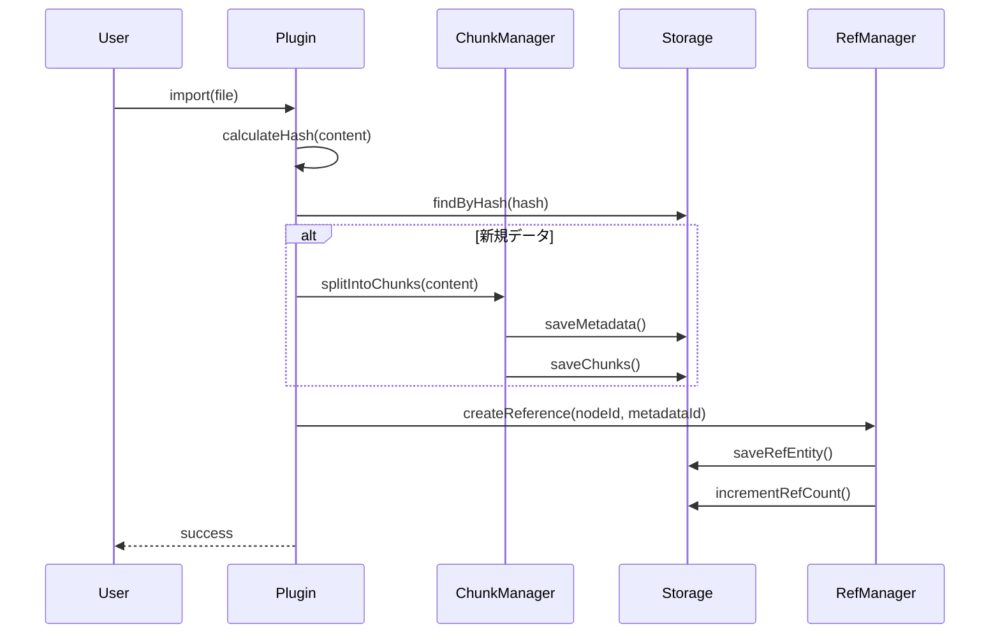
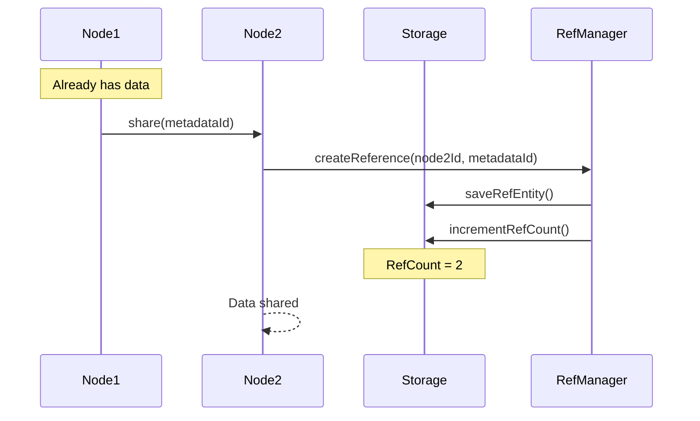
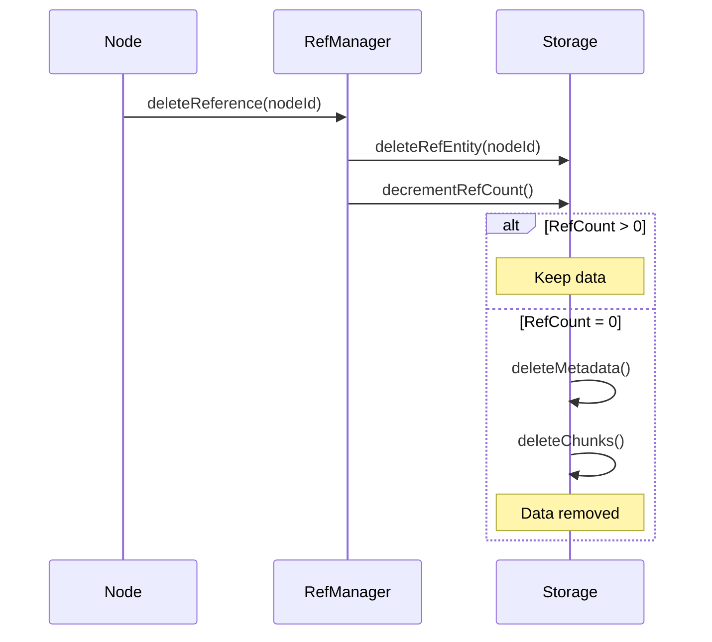

# Spreadsheet Plugin アーキテクチャ

## 概要

Spreadsheet Pluginは、HierarchiDBにおける汎用的な表データ処理基盤です。大容量ファイルの効率的な処理と、複数ノード間でのデータ共有を実現します。

## 設計原則

### 1. 3x2 エンティティライフサイクル管理

```
                 Persistent                    Ephemeral
    ┌──────────────────────────────┬──────────────────────────────┐
    │                              │                              │
Peer│  SpreadsheetRefEntity        │  SpreadsheetWorkingCopy      │
    │  StyleMapEntity              │  SpreadsheetViewState        │
    │                              │                              │
    ├──────────────────────────────┼──────────────────────────────┤
    │                              │                              │
Group│  (将来の拡張用)              │  SpreadsheetSession          │
    │                              │  (複数ユーザー編集)           │
    │                              │                              │
    ├──────────────────────────────┼──────────────────────────────┤
    │                              │                              │
Rel │  SpreadsheetMetadata         │  FilterCache                 │
    │  SpreadsheetChunks           │  ColumnIndex                 │
    │                              │                              │
    └──────────────────────────────┴──────────────────────────────┘
```

### 2. 重要な設計原則

#### RelationalEntityはnodeIdを持たない
```typescript
// ✅ 正しい
interface SpreadsheetMetadata extends PersistentRelationalEntity {
  id: SpreadsheetMetadataId;  // UUID
  contentHash: string;
  // nodeIdは含まない！
}

// ❌ 間違い
interface SpreadsheetMetadata extends PersistentRelationalEntity {
  id: SpreadsheetMetadataId;
  nodeId: NodeId;  // RelationalEntityが直接持つのはNG
}
```

#### PeerEntityが紐付けを担当
```typescript
interface SpreadsheetRefEntity extends PersistentPeerEntity {
  nodeId: NodeId;                    // ノードへの紐付け
  metadataId: SpreadsheetMetadataId; // RelationalEntityへの参照
}
```

## コンポーネント構成

### Core Components

```
SpreadsheetPlugin/
├── UI Layer
│   ├── SpreadsheetDialog        # UI コンポーネント
│   └── StyleMapDialog           # 拡張UI
│
├── Plugin Layer
│   ├── SpreadsheetPlugin        # メインプラグインクラス
│   ├── FileLoader              # ファイル読み込み
│   ├── ExportManager           # エクスポート処理
│   └── FilterEngine            # フィルタリング（キャッシュ利用）
│
├── Worker API Layer
│   ├── SpreadsheetWorkerAPI    # Worker呼び出し
│   └── ChunkManager            # チャンク処理
│
└── Worker Layer (別パッケージ)
    ├── RelationalEntityHandler  # リファレンスカウント自動管理
    ├── SpreadsheetMetadata     # PersistentRelationalEntity
    ├── SpreadsheetRefEntity    # PersistentPeerEntity
    └── SpreadsheetChunks       # データ本体
```

## データフロー

### インポート処理



### データ共有



### 削除処理



## パフォーマンス最適化

### 1. チャンク化戦略

- **チャンクサイズ**: 100,000行/チャンク
- **圧縮**: pako (gzip) で約70%サイズ削減
- **並列処理**: Web Workersで並列圧縮（将来実装）

### 2. インデックス戦略

```typescript
// カラムインデックス構造
interface ColumnIndex {
  metadataId: SpreadsheetMetadataId;
  column: string;
  uniqueValues: string[];  // 最大10,000件
  valueToRows: Map<string, number[]>;  // 値→行番号
}
```

- 頻繁にフィルタするカラムのみインデックス化
- ユニーク値が10,000件を超える場合はサンプリング

### 3. キャッシュ戦略

```typescript
// フィルタキャッシュ
interface FilterCache {
  metadataId: SpreadsheetMetadataId;
  filterHash: string;
  matchedRows: number[];
  expiresAt: number;  // 1時間後
}
```

- フィルタ結果を1時間キャッシュ
- ノードあたり最大10件のキャッシュ
- LRU方式で古いキャッシュを削除

## セキュリティ考慮事項

### 1. データ分離
- 各ノードは自身のSpreadsheetRefEntityのみアクセス可能
- メタデータIDを知っていても直接アクセスは不可

### 2. サイズ制限
- 最大ファイルサイズ: 500MB（設定可能）
- 最大行数: 理論上無制限（メモリ依存）
- 最大カラム数: 1,000

### 3. バリデーション
- ファイル形式の検証
- エンコーディングの自動検出
- 不正なデータの除去

## 拡張ポイント

### 1. カスタムローダー
```typescript
interface CustomLoader {
  canHandle(source: any): boolean;
  load(source: any): Promise<LoadResult>;
}
```

### 2. カスタムフィルタ
```typescript
interface CustomFilter {
  name: string;
  operator: string;
  evaluate(value: any, param: any): boolean;
}
```

### 3. カスタムエクスポート
```typescript
interface CustomExporter {
  format: string;
  export(data: any[], options: any): Blob;
}
```

## エラーハンドリング

### エラーコード体系
```typescript
enum SpreadsheetErrorCode {
  // Import errors (1xxx)
  FILE_TOO_LARGE = 1001,
  INVALID_FORMAT = 1002,
  ENCODING_ERROR = 1003,
  
  // Storage errors (2xxx)
  METADATA_NOT_FOUND = 2001,
  CHUNK_NOT_FOUND = 2002,
  REFERENCE_NOT_FOUND = 2003,
  
  // Processing errors (3xxx)
  FILTER_ERROR = 3001,
  INDEX_BUILD_ERROR = 3002,
  EXPORT_ERROR = 3003,
}
```

### リトライ戦略
- ネットワークエラー: 3回リトライ（指数バックオフ）
- ストレージエラー: 即座に失敗
- 処理エラー: 1回リトライ

## 監視とログ

### パフォーマンスメトリクス
```typescript
interface PerformanceMetrics {
  importTime: number;
  chunkingTime: number;
  compressionRatio: number;
  filterTime: number;
  cacheHitRate: number;
}
```

### ログレベル
- ERROR: エラー発生時
- WARN: パフォーマンス低下時
- INFO: 主要操作の実行時
- DEBUG: 詳細なデバッグ情報

## 今後の拡張予定

### Phase 1（現在）
- ✅ 基本的なインポート/エクスポート
- ✅ チャンク化と圧縮
- ✅ フィルタリング
- ✅ リファレンスカウント

### Phase 2（計画中）
- ⏳ リアルタイム共同編集
- ⏳ 差分更新
- ⏳ Web Worker並列処理
- ⏳ ストリーミングエクスポート

### Phase 3（将来）
- ⏳ 外部データソース連携
- ⏳ SQLクエリサポート
- ⏳ 機械学習統合
- ⏳ 分散ストレージ対応