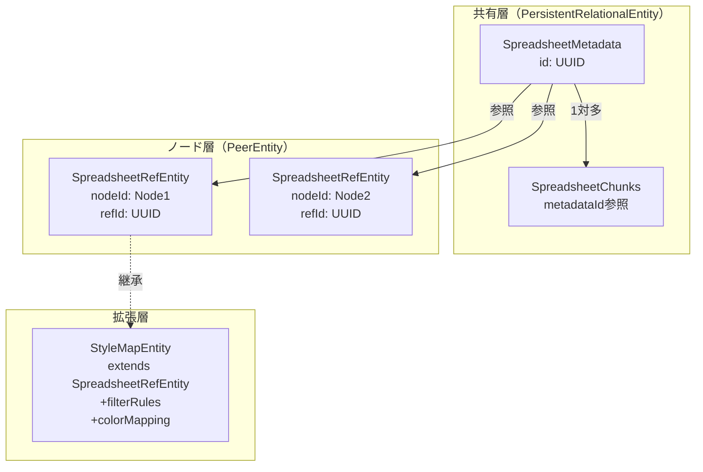

# Spreadsheet Plugin データベース構造設計

## エンティティ階層

```
PersistentRelationalEntity (永続的・共有可能)
  └─ SpreadsheetMetadata
  
PeerEntity (ノードに紐づく)
  └─ SpreadsheetRefEntity
      └─ StyleMapEntity (拡張)
```

## 1. SpreadsheetMetadata（共有データ）

```typescript
import { PersistentRelationalEntity } from '@hierarchidb/core';

// ID型定義
type SpreadsheetMetadataId = string & { readonly __brand: 'SpreadsheetMetadataId' };

interface SpreadsheetMetadata extends PersistentRelationalEntity {
  // 識別子
  id: SpreadsheetMetadataId;  // UUID (プライマリキー)
  
  // コンテンツ識別
  contentHash: string;         // SHA-256ハッシュ（重複検出用）
  
  // メタデータ
  columns: string[];           // カラム名リスト
  rowCount: number;            // 総行数
  fileSize: number;            // 元ファイルサイズ
  delimiter: string;           // 区切り文字
  hasHeader: boolean;          // ヘッダー行の有無
  encoding: string;            // 文字エンコーディング
  
  // リファレンスカウント
  referenceCount: number;      // 参照数
  referencingNodeIds: NodeId[]; // 参照しているノードID一覧
  
  // タイムスタンプ
  createdAt: number;
  updatedAt: number;
  lastAccessedAt: number;
}
```

### データベーステーブル定義
```typescript
// Dexie schema
spreadsheet_metadata: '&id, contentHash, updatedAt, lastAccessedAt'
```

## 2. SpreadsheetChunks（データ本体）

```typescript
interface SpreadsheetChunk {
  id: string;                      // チャンクID
  metadataId: SpreadsheetMetadataId; // メタデータへの参照
  chunkIndex: number;              // チャンク番号
  compressedData: Uint8Array;     // 圧縮データ
  rowStart: number;                // 開始行
  rowEnd: number;                  // 終了行
  firstRowPreview?: string;        // デバッグ用プレビュー
}
```

### データベーステーブル定義
```typescript
// Dexie schema
spreadsheet_chunks: 'id, [metadataId+chunkIndex], metadataId'
```

## 3. SpreadsheetRefEntity（ノード参照）

```typescript
import { PeerEntity } from '@hierarchidb/core';

interface SpreadsheetRefEntity extends PeerEntity {
  // 識別子
  nodeId: NodeId;                    // ノードID（プライマリキー）
  refId: SpreadsheetMetadataId;      // SpreadsheetMetadataへの参照
  
  // 基本設定
  name: string;                      // 表示名
  description?: string;              // 説明
  
  // タイムスタンプ
  createdAt: number;
  updatedAt: number;
  version: number;
}
```

### データベーステーブル定義
```typescript
// Dexie schema
spreadsheet_refs: '&nodeId, refId, updatedAt'
```

## 4. StyleMapEntity（拡張エンティティ）

```typescript
interface StyleMapEntity extends SpreadsheetRefEntity {
  // SpreadsheetRefEntityから継承
  // nodeId: NodeId
  // refId: SpreadsheetMetadataId
  
  // フィルタ設定（永続化）
  filterRules: FilterRule[];         // 行フィルタルール
  
  // カラム選択（永続化）
  keyColumn: string;                 // キーカラム
  valueColumns: string[];            // 値カラム
  selectedColumns?: string[];        // 表示用カラム
  
  // 色設定（永続化）
  colorScheme: 'categorical' | 'gradient' | 'custom';
  colorMapping: Record<string, string>;  // 値→色マッピング
  opacity?: number;
  
  // スタイル設定
  styleConfig?: {
    layerType: 'fill' | 'line' | 'circle';
    strokeWidth?: number;
    strokeColor?: string;
  };
  
  // キャッシュ（オプション）
  generatedStyle?: string;           // 生成済みスタイル（JSON）
  generatedAt?: number;              // 生成日時
}
```

### データベーステーブル定義
```typescript
// Dexie schema
stylemap_entities: '&nodeId, refId, updatedAt'
```

## 5. フィルタキャッシュ（一時データ）

```typescript
interface FilterCache {
  id: string;                        // キャッシュID
  metadataId: SpreadsheetMetadataId; // メタデータID
  filterHash: string;                // フィルタルールのハッシュ
  rules: FilterRule[];               // フィルタルール
  matchedRows: number[];             // マッチした行番号
  resultCount: number;               // 結果件数
  createdAt: number;
  lastUsed: number;
  expiresAt: number;
}
```

### データベーステーブル定義
```typescript
// Dexie schema (EphemeralDB)
filter_cache: 'id, [metadataId+filterHash], metadataId, expiresAt'
```

## 6. カラムインデックス（最適化用）

```typescript
interface ColumnIndex {
  id: string;                        // インデックスID
  metadataId: SpreadsheetMetadataId; // メタデータID
  column: string;                    // カラム名
  uniqueValues: string[];            // ユニーク値（最大10000件）
  valueToRows: Record<string, number[]>; // 値→行番号
  dataType: 'string' | 'number' | 'boolean' | 'mixed';
  stats?: {
    min?: number;
    max?: number;
    mean?: number;
    nullCount: number;
  };
  createdAt: number;
}
```

### データベーステーブル定義
```typescript
// Dexie schema
column_indexes: 'id, [metadataId+column], metadataId'
```

## データフロー図



## リファレンスカウント管理

```typescript
class ReferenceManager {
  /**
   * 新しい参照を追加
   */
  async addReference(
    nodeId: NodeId,
    metadataId: SpreadsheetMetadataId
  ): Promise<void> {
    const metadata = await this.getMetadata(metadataId);
    
    // SpreadsheetRefEntity作成
    await this.createRefEntity({
      nodeId,
      refId: metadataId,
      name: `Reference to ${metadata.id}`,
      createdAt: Date.now(),
      updatedAt: Date.now(),
      version: 1
    });
    
    // メタデータのリファレンスカウント更新
    await this.updateMetadata(metadataId, {
      referenceCount: metadata.referenceCount + 1,
      referencingNodeIds: [...metadata.referencingNodeIds, nodeId],
      lastAccessedAt: Date.now()
    });
  }
  
  /**
   * 参照を削除
   */
  async removeReference(
    nodeId: NodeId,
    metadataId: SpreadsheetMetadataId
  ): Promise<boolean> {
    const metadata = await this.getMetadata(metadataId);
    
    // SpreadsheetRefEntity削除
    await this.deleteRefEntity(nodeId);
    
    // リファレンスカウント更新
    const newCount = metadata.referenceCount - 1;
    const newNodeIds = metadata.referencingNodeIds.filter(id => id !== nodeId);
    
    if (newCount === 0) {
      // 参照がゼロになったらデータ削除
      await this.deleteMetadataAndChunks(metadataId);
      return true; // データ削除済み
    } else {
      // カウント更新のみ
      await this.updateMetadata(metadataId, {
        referenceCount: newCount,
        referencingNodeIds: newNodeIds,
        lastAccessedAt: Date.now()
      });
      return false; // データは保持
    }
  }
}
```

## 使用例

### 1. CSVインポート時
```typescript
// 新しいSpreadsheetMetadataを作成
const metadataId = generateUUID() as SpreadsheetMetadataId;
const metadata: SpreadsheetMetadata = {
  id: metadataId,
  contentHash: await hashContent(csvData),
  columns: headers,
  rowCount: rows.length,
  fileSize: file.size,
  delimiter: '\t',
  hasHeader: true,
  encoding: 'utf-8',
  referenceCount: 0,
  referencingNodeIds: [],
  createdAt: Date.now(),
  updatedAt: Date.now(),
  lastAccessedAt: Date.now()
};

// SpreadsheetRefEntityを作成
const refEntity: SpreadsheetRefEntity = {
  nodeId: nodeId,
  refId: metadataId,
  name: 'Sales Data 2024',
  description: 'Monthly sales data',
  createdAt: Date.now(),
  updatedAt: Date.now(),
  version: 1
};
```

### 2. StyleMap作成時
```typescript
// 既存のSpreadsheetを参照
const styleMapEntity: StyleMapEntity = {
  // SpreadsheetRefEntityの基本プロパティ
  nodeId: styleMapNodeId,
  refId: spreadsheetMetadataId,
  name: 'Regional Sales Map',
  description: 'Color-coded by sales volume',
  
  // StyleMap固有のプロパティ（永続化）
  filterRules: [
    { column: 'year', operator: 'equals', value: 2024 }
  ],
  keyColumn: 'region',
  valueColumns: ['sales_amount'],
  colorScheme: 'gradient',
  colorMapping: {
    'Tokyo': '#ff0000',
    'Osaka': '#00ff00',
    // ...
  },
  
  createdAt: Date.now(),
  updatedAt: Date.now(),
  version: 1
};
```

## メリット

1. **データの共有**: 同じCSVデータを複数のノードで共有
2. **自動削除**: リファレンスカウントがゼロで自動削除
3. **設定の永続化**: フィルタやカラム選択を保存
4. **拡張性**: StyleMapEntity以外の拡張も容易
5. **型安全性**: ブランド型による厳密な型チェック