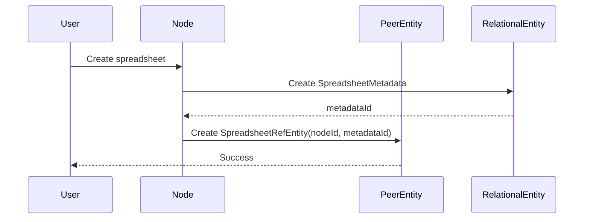
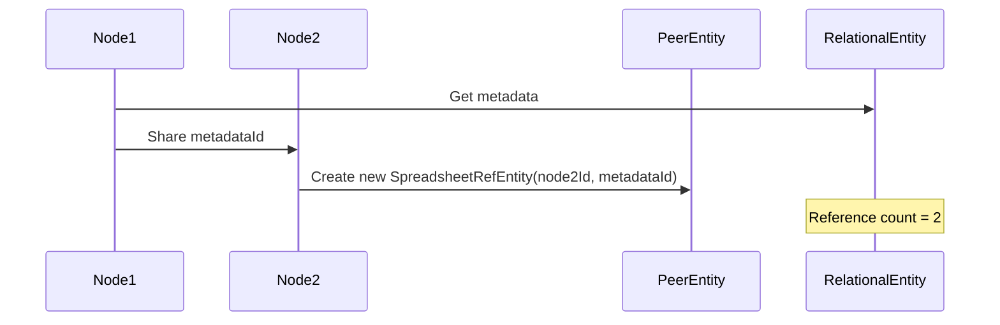
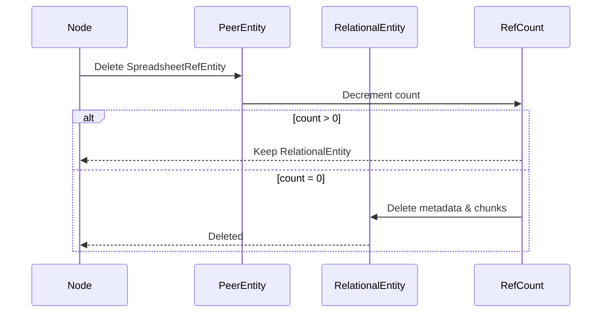

# 3x2 エンティティライフサイクル管理（自然な参照カウント）

## エンティティマトリックス（3x2）

### 永続性による分類（横軸）
1. **Persistent（永続的）** - ノード削除後も保持
2. **Ephemeral（一時的）** - ノード削除で消去

### 関連性による分類（縦軸）
1. **Peer（1対1）** - 単一ノードに紐づく
2. **Group（1対多）** - 複数ノードで共有
3. **Relational（多対多）** - 中間テーブル経由で関連

## 自然な参照カウント管理

**重要な設計変更**: refCountプロパティは不要。PeerEntityの数が自然に参照カウントとなる。

## Spreadsheet Pluginのエンティティ分類

```
                 Persistent                    Ephemeral
    ┌──────────────────────────────┬──────────────────────────────┐
    │                              │                              │
Peer│  SpreadsheetRefEntity        │  SpreadsheetWorkingCopy      │
    │  StyleMapEntity              │  SpreadsheetViewState        │
    │                              │                              │
    ├──────────────────────────────┼──────────────────────────────┤
    │                              │                              │
Group│  (将来の拡張用)              │  SpreadsheetSession          │
    │                              │  (複数ユーザー編集)           │
    │                              │                              │
    ├──────────────────────────────┼──────────────────────────────┤
    │                              │                              │
Rel │  SpreadsheetMetadata         │  FilterCache                 │
    │  SpreadsheetChunks           │  ColumnIndex                 │
    │                              │                              │
    └──────────────────────────────┴──────────────────────────────┘
```

## 正しいRelationalEntityの実装

### ❌ 間違った実装（直接nodeIdを持つ）
```typescript
// これは間違い！
interface SpreadsheetMetadata extends PersistentRelationalEntity {
  id: SpreadsheetMetadataId;
  nodeId: NodeId;  // ❌ RelationalEntityが直接nodeIdを持ってはいけない
  contentHash: string;
  // ...
}
```

### ✅ 正しい実装（PeerEntity経由で紐付け）
```typescript
// 1. RelationalEntity（データ本体）
interface SpreadsheetMetadata extends PersistentRelationalEntity {
  id: SpreadsheetMetadataId;  // UUID
  contentHash: string;
  columns: string[];
  rowCount: number;
  fileSize: number;
  // nodeIdは持たない！
}

// 2. PeerEntity（ノードとの紐付け）
interface SpreadsheetRefEntity extends PersistentPeerEntity {
  nodeId: NodeId;                    // ノードへの紐付け
  metadataId: SpreadsheetMetadataId; // RelationalEntityへの参照
  // refCountフィールドは不要 - PeerEntityの数が参照カウント
  createdAt: number;
  updatedAt: number;
  version: number;
}

// 3. 拡張PeerEntity
interface StyleMapEntity extends PersistentPeerEntity {
  nodeId: NodeId;                        // ノードへの紐付け
  spreadsheetMetadataId: SpreadsheetMetadataId; // RelationalEntityへの参照
  
  // StyleMap固有の設定
  keyColumn: string;
  colorRules: StyleMapColorRule[];
  defaultStyle: StyleMapStyle;
  description?: string;
  
  // refCountフィールドは不要 - PeerEntityの数が参照カウント
  createdAt: number;
  updatedAt: number;
  version: number;
}
```

## 自然な参照カウント管理（LifecycleManager一元管理）

### Worker LifecycleManagerによる自動管理

```typescript
class NodeLifecycleManager {
  /**
   * ノード削除時の自然な参照カウント管理
   */
  async handleNodeDeletion(nodeId: NodeId, nodeType: TreeNodeType): Promise<void> {
    // beforeDelete hook実行
    await this.executeLifecycleHook('beforeDelete', nodeType, nodeId);

    // 自然な参照カウント管理（PeerEntityが削除される前）
    await this.handleNaturalReferenceCount(nodeId, nodeType);

    // ノード削除
    await this.deleteNodeCore(nodeId);

    // afterDelete hook実行
    await this.executeLifecycleHook('afterDelete', nodeType, nodeId);
  }

  /**
   * 自然な参照カウント処理
   * PeerEntityの数をカウントして0になったらRelationalEntityを削除
   */
  private async handleNaturalReferenceCount(nodeId: NodeId, nodeType: TreeNodeType): Promise<void> {
    const config = this.registry.getNodeTypeConfig(nodeType);
    const entityHints = config?.metadata?.entityHints as EntityReferenceHints | undefined;
    
    if (!entityHints?.relRefField) {
      return; // RelationalEntityを持たない場合はスキップ
    }

    const handler = this.registry.getHandler(nodeType);
    if (isReferenceCountingHandler(handler)) {
      // PeerEntity削除前にRelationalEntityの参照管理を実行
      await handler.decrementReferenceCount(nodeId);
    }
  }
}
```

### プラグイン側実装（自然な参照カウント）

```typescript
class SpreadsheetEntityHandler extends BaseReferenceCountingHandler {
  // EntityReferenceHintsの設定
  protected getNodeRefField(): string { return 'nodeId'; }
  protected getRelRefField(): string { return 'metadataId'; }

  // 自然な参照カウント実装
  protected async getPeerEntity(nodeId: NodeId): Promise<SpreadsheetRefEntity | null> {
    return await this.getSpreadsheetRef(nodeId);
  }

  protected async deletePeerEntity(nodeId: NodeId): Promise<void> {
    await this.deleteSpreadsheetRef(nodeId);
  }

  protected async countPeerEntitiesByRelRef(relRef: SpreadsheetMetadataId): Promise<number> {
    // 同じmetadataIdを参照するSpreadsheetRefEntityの数をカウント
    return await this.countSpreadsheetRefsByMetadata(relRef);
  }

  protected async deleteRelationalEntity(relRef: SpreadsheetMetadataId): Promise<void> {
    await this.deleteSpreadsheetMetadata(relRef);
    await this.deleteSpreadsheetChunks(relRef);
  }

  /**
   * 削除処理の簡素化
   */
  async deleteEntity(nodeId: NodeId): Promise<void> {
    // PeerEntity削除のみ
    // 自然な参照カウント管理はLifecycleManagerが自動実行
    await this.deleteSpreadsheetRef(nodeId);
  }
}
```

## Shapesプラグインの確認ポイント

Shapesプラグインも同様の構造にすべき：

### ❌ 問題のある実装
```typescript
// shapes/TableMetadataEntity.ts
interface TableMetadataEntity extends RelationalEntity {
  id: string;
  nodeId: NodeId;  // ❌ RelationalEntityが直接nodeIdを持っている
  contentHash: string;
  // ...
}
```

### ✅ 修正後の実装
```typescript
// 1. RelationalEntity（共有データ）
interface ShapeMetadata extends PersistentRelationalEntity {
  id: ShapeMetadataId;  // UUID
  shapeType: string;
  geometry: GeoJSON;
  properties: Record<string, any>;
  // nodeIdは持たない
}

// 2. PeerEntity（ノード紐付け）
interface ShapeRefEntity extends PersistentPeerEntity {
  nodeId: NodeId;
  shapeMetadataId: ShapeMetadataId;
  name: string;
  visible: boolean;
}

// 3. 拡張（スタイル設定など）
interface StyledShapeEntity extends ShapeRefEntity {
  // ShapeRefEntityを継承
  fillColor: string;
  strokeColor: string;
  opacity: number;
}
```

## データベーステーブル構造

### CoreDB（永続データ）
```typescript
// RelationalEntity用テーブル
spreadsheet_metadata: '&id, contentHash, createdAt'
spreadsheet_chunks: 'id, metadataId, [metadataId+chunkIndex]'
reference_counts: '&metadataId, count, updatedAt'

// PeerEntity用テーブル
spreadsheet_refs: '&nodeId, metadataId, updatedAt'
stylemap_entities: '&nodeId, metadataId, updatedAt'
```

### EphemeralDB（一時データ）
```typescript
// Ephemeral RelationalEntity
filter_cache: 'id, metadataId, filterHash, expiresAt'
column_indexes: 'id, [metadataId+column]'

// Ephemeral PeerEntity
spreadsheet_working_copies: '&nodeId, data, isDirty'
spreadsheet_view_states: '&nodeId, scrollPosition, zoom'
```

## ライフサイクルの例

### 1. 作成時


### 2. 共有時


### 3. 削除時


## プラグイン独立データベース管理

### プラグインの独立性原則

HierarchiDBでは、**プラグインが独立したDexieデータベースを管理**します：

```typescript
// プラグイン専用データベース
export class SpreadsheetDB extends Dexie {
  spreadsheetMetadata!: Table<SpreadsheetMetadata, SpreadsheetMetadataId>;
  spreadsheetRefs!: Table<SpreadsheetRefEntity, NodeId>;
  spreadsheetChunks!: Table<SpreadsheetChunk, string>;

  constructor(name: string = 'hierarchidb-spreadsheet') {
    super(name);
    // プラグイン固有のスキーマ定義
  }
}

// StyleMapも独立データベース
export class StyleMapDB extends Dexie {
  styleMapEntities!: Table<StyleMapEntity, NodeId>;
  
  constructor(name: string = 'hierarchidb-stylemap') {
    super(name);
    // StyleMap固有のスキーマ定義
  }
}
```

### 利点

1. **完全な独立性**: CoreDBに依存しない
2. **自由なスキーマ設計**: プラグイン固有の最適化
3. **独立したライフサイクル**: プラグインの追加・削除が容易
4. **パフォーマンス**: 専用インデックスとクエリ最適化

## まとめ

### 重要な原則

1. **RelationalEntityは直接nodeIdを持たない**
   - データの独立性を保つ
   - 複数ノードでの共有を可能にする

2. **PeerEntity/GroupEntityが仲介役**
   - ノードとRelationalEntityの紐付け
   - ノード固有の設定を保持

3. **自然な参照カウント管理**
   - PeerEntityの数がそのまま参照カウント
   - refCountプロパティは不要

4. **プラグイン独立データベース**
   - 各プラグインが専用Dexieデータベースを管理
   - CoreDBからの完全分離

5. **拡張はPeerEntityで行う**
   - StyleMapEntity extends PersistentPeerEntity
   - SpreadsheetRefEntityとは独立した設計

この設計により、データの共有と独立性を両立させ、効率的なライフサイクル管理とプラグインの独立性を実現します。