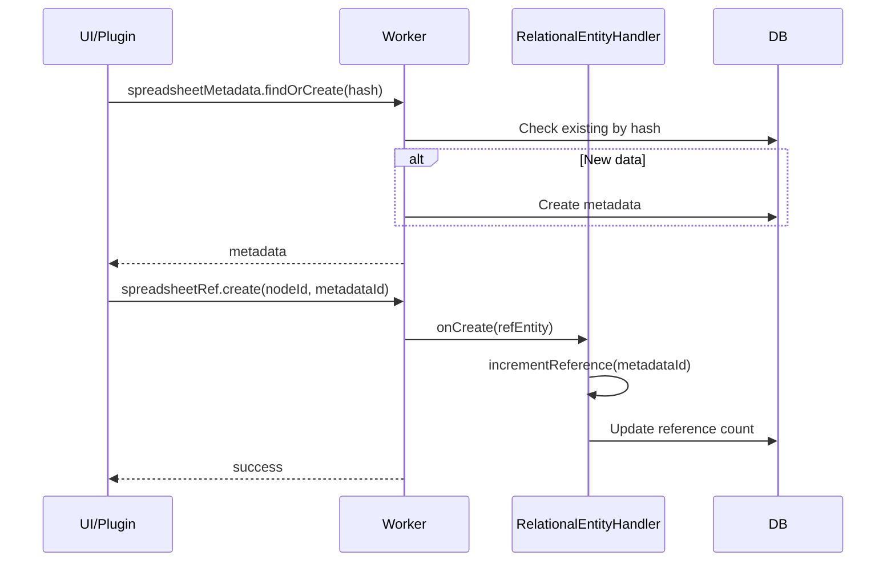
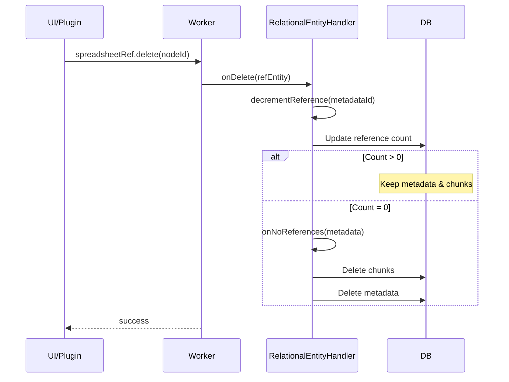

# Spreadsheet Plugin - Worker統合仕様

## 概要

Spreadsheet PluginはWorker側のRelationalEntityHandlerと連携して、リファレンスカウント管理を自動化します。プラグイン側では管理ロジックを持たず、Worker APIを通じて操作します。

## アーキテクチャ

```
┌─────────────────────────────────────┐
│         UI Layer (React)            │
├─────────────────────────────────────┤
│     SpreadsheetPlugin (UI側)        │
│  - データのインポート/エクスポート     │
│  - フィルタリング・表示              │
│  - Worker APIの呼び出し             │
├─────────────────────────────────────┤
│        Comlink RPC                  │
├─────────────────────────────────────┤
│      Worker Layer                   │
│  ┌─────────────────────────────┐   │
│  │ RelationalEntityHandler     │   │
│  │ - リファレンスカウント管理    │   │
│  │ - 自動削除                  │   │
│  └─────────────────────────────┘   │
│  ┌─────────────────────────────┐   │
│  │ SpreadsheetEntityHandler    │   │
│  │ - Metadata管理              │   │
│  │ - Chunks管理                │   │
│  └─────────────────────────────┘   │
└─────────────────────────────────────┘
```

## Worker側のエンティティハンドラー

### SpreadsheetMetadataHandler (RelationalEntityHandler)

```typescript
// packages/worker/src/handlers/SpreadsheetMetadataHandler.ts

import { RelationalEntityHandler } from './RelationalEntityHandler';

export class SpreadsheetMetadataHandler extends RelationalEntityHandler<SpreadsheetMetadata> {
  entityType = 'spreadsheetMetadata';
  tableName = 'spreadsheet_metadata';
  
  // リファレンスカウント管理は親クラスが自動的に行う
  
  async findByContentHash(contentHash: string): Promise<SpreadsheetMetadata | null> {
    return this.table
      .where('contentHash')
      .equals(contentHash)
      .first();
  }
  
  protected async onNoReferences(entity: SpreadsheetMetadata): Promise<void> {
    // カウントが0になったときの処理
    console.log(`Deleting spreadsheet metadata: ${entity.id}`);
    
    // 関連するチャンクも削除
    await this.db.spreadsheet_chunks
      .where('metadataId')
      .equals(entity.id)
      .delete();
    
    // メタデータ自体を削除
    await super.onNoReferences(entity);
  }
}
```

### SpreadsheetRefHandler (PeerEntityHandler)

```typescript
// packages/worker/src/handlers/SpreadsheetRefHandler.ts

import { PeerEntityHandler } from './PeerEntityHandler';

export class SpreadsheetRefHandler extends PeerEntityHandler<SpreadsheetRefEntity> {
  entityType = 'spreadsheetRef';
  tableName = 'spreadsheet_refs';
  
  async onCreate(entity: SpreadsheetRefEntity): Promise<void> {
    // RefEntity作成時にリファレンスカウントを増やす
    await this.incrementReference(entity.metadataId);
  }
  
  async onDelete(entity: SpreadsheetRefEntity): Promise<void> {
    // RefEntity削除時にリファレンスカウントを減らす
    await this.decrementReference(entity.metadataId);
  }
  
  private async incrementReference(metadataId: SpreadsheetMetadataId): Promise<void> {
    const handler = this.registry.getHandler('spreadsheetMetadata') as SpreadsheetMetadataHandler;
    await handler.addReference(metadataId, this.nodeId);
  }
  
  private async decrementReference(metadataId: SpreadsheetMetadataId): Promise<void> {
    const handler = this.registry.getHandler('spreadsheetMetadata') as SpreadsheetMetadataHandler;
    await handler.removeReference(metadataId, this.nodeId);
  }
}
```

## プラグイン側の実装

### SpreadsheetPlugin (UI側)

```typescript
// packages/plugins/spreadsheet/src/SpreadsheetPlugin.ts

export class SpreadsheetPlugin {
  constructor(private workerAPI: WorkerAPI) {}
  
  async import(nodeId: NodeId, file: File): Promise<void> {
    // 1. ファイルを解析
    const { data, headers, contentHash } = await this.parseFile(file);
    
    // 2. Worker側でMetadataを作成または取得
    const metadata = await this.workerAPI.call('spreadsheetMetadata.findOrCreate', {
      contentHash,
      data: {
        name: file.name,
        columns: headers,
        rowCount: data.length,
        // ... その他のメタデータ
      }
    });
    
    // 3. チャンクを作成して保存
    const chunks = this.createChunks(metadata.id, data);
    await this.workerAPI.call('spreadsheetChunks.bulkCreate', chunks);
    
    // 4. RefEntityを作成（Worker側で自動的にカウント管理）
    await this.workerAPI.call('spreadsheetRef.create', {
      nodeId,
      metadataId: metadata.id,
      createdAt: Date.now(),
      updatedAt: Date.now(),
      version: 1
    });
  }
  
  async delete(nodeId: NodeId): Promise<void> {
    // Worker側で自動的に：
    // 1. RefEntityを削除
    // 2. リファレンスカウントを減らす
    // 3. カウント0ならMetadataとChunksも削除
    await this.workerAPI.call('spreadsheetRef.delete', nodeId);
  }
  
  async filter(nodeId: NodeId, rules: FilterRule[]): Promise<QueryResult> {
    // RefEntityを取得
    const ref = await this.workerAPI.call('spreadsheetRef.get', nodeId);
    if (!ref) throw new Error('Reference not found');
    
    // フィルタ実行（キャッシュ利用）
    return this.filterEngine.execute(ref.metadataId, rules);
  }
}
```

## Worker API定義

```typescript
// packages/api/src/SpreadsheetAPI.ts

export interface SpreadsheetAPI {
  // Metadata操作
  'spreadsheetMetadata.findOrCreate': (params: {
    contentHash: string;
    data: Omit<SpreadsheetMetadata, 'id'>;
  }) => Promise<SpreadsheetMetadata>;
  
  'spreadsheetMetadata.get': (id: SpreadsheetMetadataId) => Promise<SpreadsheetMetadata | null>;
  
  // Chunks操作
  'spreadsheetChunks.bulkCreate': (chunks: SpreadsheetChunk[]) => Promise<void>;
  
  'spreadsheetChunks.getByMetadata': (metadataId: SpreadsheetMetadataId) => Promise<SpreadsheetChunk[]>;
  
  // RefEntity操作（自動カウント管理）
  'spreadsheetRef.create': (entity: SpreadsheetRefEntity) => Promise<void>;
  
  'spreadsheetRef.get': (nodeId: NodeId) => Promise<SpreadsheetRefEntity | null>;
  
  'spreadsheetRef.delete': (nodeId: NodeId) => Promise<void>;
  
  // 共有状態確認
  'spreadsheet.isShared': (metadataId: SpreadsheetMetadataId) => Promise<boolean>;
}
```

## リファレンスカウント管理フロー

### インポート時



### 削除時



## 実装のポイント

### 1. プラグイン側の簡潔性
- リファレンスカウント管理ロジックを持たない
- Worker APIの呼び出しのみ
- UIとデータ表示に集中

### 2. Worker側の責務
- リファレンスカウントの自動管理
- データの整合性保証
- カスケード削除の処理

### 3. エラーハンドリング
```typescript
// Worker側でトランザクション管理
async createReference(nodeId: NodeId, metadataId: SpreadsheetMetadataId) {
  await this.db.transaction('rw', 
    this.db.spreadsheet_refs,
    this.db.reference_counts,
    async () => {
      // すべての操作が成功するか、すべてロールバック
      await this.createRefEntity(nodeId, metadataId);
      await this.incrementCount(metadataId);
    }
  );
}
```

## テスト戦略

### Worker側のテスト
```typescript
describe('SpreadsheetMetadataHandler', () => {
  it('should delete data when last reference removed', async () => {
    // Setup
    const handler = new SpreadsheetMetadataHandler(db);
    const metadata = await handler.create(testData);
    
    // Add two references
    await handler.addReference(metadata.id, 'node1' as NodeId);
    await handler.addReference(metadata.id, 'node2' as NodeId);
    
    // Remove first reference (data should remain)
    await handler.removeReference(metadata.id, 'node1' as NodeId);
    expect(await handler.get(metadata.id)).toBeDefined();
    
    // Remove second reference (data should be deleted)
    await handler.removeReference(metadata.id, 'node2' as NodeId);
    expect(await handler.get(metadata.id)).toBeNull();
  });
});
```

### プラグイン側のテスト
```typescript
describe('SpreadsheetPlugin', () => {
  it('should share data between nodes', async () => {
    const plugin = new SpreadsheetPlugin(mockWorkerAPI);
    
    // Import same data to two nodes
    await plugin.import('node1' as NodeId, testFile);
    await plugin.import('node2' as NodeId, testFile);
    
    // Verify shared
    const isShared = await mockWorkerAPI.call('spreadsheet.isShared', metadataId);
    expect(isShared).toBe(true);
  });
});
```

## まとめ

- **プラグイン側**: データ処理とUIに専念
- **Worker側**: リファレンスカウント管理を自動化
- **明確な責務分離**: 保守性と拡張性の向上