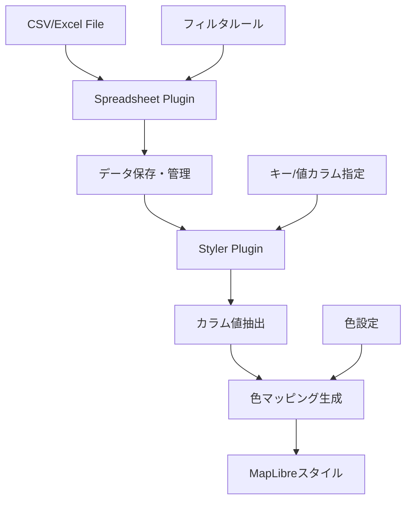

# Styler Plugin Documentation

## 概要

Styler PluginはSpreadsheet Pluginを拡張し、表データから地図スタイル（MapLibre Style Specification）を生成する専門プラグインです。CSVやExcelデータの特定カラムの値に基づいて、地図要素の色やスタイルを動的に生成します。

## 位置付け

```
┌──────────────────────────────────┐
│     Styler Plugin              │ ← 地図スタイル生成に特化
├──────────────────────────────────┤
│     Spreadsheet Plugin           │ ← 汎用表データ処理基盤
├──────────────────────────────────┤
│     HierarchiDB Core             │
└──────────────────────────────────┘
```

## 主要機能

### 1. Spreadsheet Pluginから継承する機能
- **データインポート**: CSV, Excel, URL, クリップボード
- **フィルタリング**: 行の条件抽出
- **カラム抽出**: 特定列の値取得
- **データ管理**: チャンク化、圧縮、リファレンスカウント

### 2. Styler固有の機能
- **色マッピング生成**: カラム値から色への自動マッピング
- **MapLibreスタイル生成**: 地図表示用のスタイル仕様生成
- **グラデーション生成**: 数値データからのグラデーション
- **カテゴリ別色分け**: カテゴリデータの自動色分け

## アーキテクチャ

```
┌─────────────────────────────────────┐
│        User Interface               │
│  ┌─────────────────────────────┐   │
│  │  Styler Dialog (UI保持)    │   │
│  │  - Step1: データ選択         │   │
│  │  - Step2: カラムマッピング   │   │
│  │  - Step3: 色設定            │   │
│  │  - Step4: プレビュー        │   │
│  └─────────────────────────────┘   │
├─────────────────────────────────────┤
│       Styler Plugin               │
│  ┌─────────────────────────────┐   │
│  │  ColorMappingEngine          │   │
│  │  - 自動色生成                │   │
│  │  - カスタムマッピング        │   │
│  ├─────────────────────────────┤   │
│  │  StyleGenerator              │   │
│  │  - MapLibreスタイル生成      │   │
│  │  - レイヤー定義             │   │
│  └─────────────────────────────┘   │
├─────────────────────────────────────┤
│      Spreadsheet Plugin             │
│  ┌─────────────────────────────┐   │
│  │  データ処理・管理機能         │   │
│  │  - インポート/エクスポート   │   │
│  │  - フィルタ/抽出            │   │
│  │  - ストレージ管理           │   │
│  └─────────────────────────────┘   │
└─────────────────────────────────────┘
```

## データフロー


```mermaid
graph TD
    A[CSV/Excel File] --> B[Spreadsheet Plugin]
    B --> C[データ保存・管理]
    C --> D[Styler Plugin]
    D --> E[カラム値抽出]
    E --> F[色マッピング生成]
    F --> G[MapLibreスタイル]
    
    H[フィルタルール] --> B
    I[キー/値カラム指定] --> D
    J[色設定] --> F
```

## 実装構造

### 1. Stylerエンティティ（簡略化）
```typescript
interface StylerEntity {
  nodeId: NodeId;
  
  // Spreadsheetへの参照
  spreadsheetNodeId: NodeId;  // Spreadsheetデータへの参照
  
  // マッピング設定
  keyColumn: string;           // キーとなるカラム名
  valueColumns: string[];      // 値となるカラム名
  
  // 色設定
  colorMapping: Record<string, string>; // 値→色のマッピング
  colorScheme: 'categorical' | 'gradient' | 'custom';
  
  // フィルタ（オプション）
  filterRules?: FilterRule[];  // Spreadsheetのフィルタを利用
  
  // 生成されたスタイル（キャッシュ）
  generatedStyle?: MapLibreStyle;
  
  createdAt: number;
  updatedAt: number;
}
```

### 2. Styler API
```typescript
class StylerPlugin {
  private spreadsheet: SpreadsheetPlugin;
  
  constructor() {
    this.spreadsheet = new SpreadsheetPlugin();
  }
  
  // データ準備（Spreadsheet Pluginに委譲）
  async prepareData(nodeId: NodeId, importOptions: ImportOptions) {
    const spreadsheetNodeId = `${nodeId}_data` as NodeId;
    return this.spreadsheet.import(spreadsheetNodeId, importOptions);
  }
  
  // 色マッピング生成
  async generateColorMapping(
    nodeId: NodeId,
    keyColumn: string,
    options: ColorMappingOptions
  ): Promise<Record<string, string>> {
    const entity = await this.getEntity(nodeId);
    
    // Spreadsheetから値を抽出
    const values = await this.spreadsheet.extractColumns(
      entity.spreadsheetNodeId,
      {
        columns: [keyColumn],
        unique: true
      }
    );
    
    // 色を生成
    return this.createColorMap(values, options);
  }
  
  // MapLibreスタイル生成
  async generateStyle(nodeId: NodeId): Promise<MapLibreStyle> {
    const entity = await this.getEntity(nodeId);
    
    // フィルタ適用してデータ取得
    const data = await this.spreadsheet.filter(
      entity.spreadsheetNodeId,
      entity.filterRules || []
    );
    
    // スタイル生成
    return this.createMapLibreStyle(data, entity.colorMapping);
  }
}
```

## 使用例

### 基本的な使用フロー

```typescript
import { StylerPlugin } from '@hierarchidb/plugin-styler-plugin';
import { SpreadsheetPlugin } from '@hierarchidb/plugin-spreadsheet-plugin';

const styler = new StylerPlugin();

// 1. CSVデータをインポート（Spreadsheetの機能を利用）
const metadata = await styler.prepareData(nodeId, {
  source: 'file',
  file: csvFile,
  hasHeaders: true
});

// 2. Stylerエンティティを作成
const entity = await styler.createEntity(nodeId, {
  spreadsheetNodeId: metadata.nodeId,
  keyColumn: 'prefecture',
  valueColumns: ['population'],
  colorScheme: 'gradient'
});

// 3. 色マッピングを生成
const colorMap = await styler.generateColorMapping(nodeId, 'prefecture', {
  scheme: 'gradient',
  startColor: '#ffffe0',
  endColor: '#ff0000',
  steps: 10
});

// 4. MapLibreスタイルを生成
const style = await styler.generateStyle(nodeId);

// 5. 地図に適用
map.setStyle(style);
```

### フィルタを適用した場合

```typescript
// 特定条件でフィルタリング
const entity = await styler.updateEntity(nodeId, {
  filterRules: [
    { column: 'year', operator: 'equals', value: 2023 },
    { column: 'population', operator: 'greater_than', value: 1000000 }
  ]
});

// フィルタ適用後のスタイルを生成
const filteredStyle = await styler.generateStyle(nodeId);
```

## データベース構造

### Stylerエンティティテーブル
```typescript
styler_entities: {
  nodeId: NodeId (PK)
  spreadsheetNodeId: NodeId  // Spreadsheetデータへの参照
  keyColumn: string
  valueColumns: string[]
  colorMapping: string        // JSON
  colorScheme: string
  filterRules?: string        // JSON
  generatedStyle?: string     // JSON (キャッシュ)
  createdAt: number
  updatedAt: number
}
```

### 関連性
- Stylerは独自のデータを持たず、Spreadsheet Pluginのデータを参照
- フィルタルールもSpreadsheet Pluginの機能を利用
- 色マッピングとスタイル生成のみがStyler固有の処理

## 利点

### 1. 責務の分離
- **Spreadsheet Plugin**: 汎用的な表データ処理
- **Styler Plugin**: 地図スタイル生成に特化

### 2. データの再利用
- 同じCSVデータを複数のStylerで共有可能
- リファレンスカウントによる効率的な管理

### 3. 拡張性
- 他のプラグイン（Shapes等）も同様にSpreadsheetを利用可能
- 共通の表データ処理基盤

## 移行パス

### 既存のStylerからの移行
1. 既存のCSVデータをSpreadsheet Pluginにインポート
2. Stylerエンティティを簡略化された構造に変換
3. 色マッピングロジックを保持
4. UI コンポーネントはそのまま利用

### コード例
```typescript
// 旧実装
const oldStyler = await getOldStylerEntity(nodeId);

// 新実装への移行
// 1. データをSpreadsheetに移行
const spreadsheetNodeId = await spreadsheet.import(
  `${nodeId}_data` as NodeId,
  {
    source: 'clipboard',
    clipboardData: oldStyler.csvData,
    hasHeaders: true
  }
);

// 2. 新しいStylerエンティティ作成
const newEntity = await styler.createEntity(nodeId, {
  spreadsheetNodeId,
  keyColumn: oldStyler.selectedKeyColumn,
  valueColumns: oldStyler.selectedValueColumns,
  colorMapping: oldStyler.colorConfiguration,
  filterRules: oldStyler.filterRules
});
```

## 今後の拡張

### 可能な拡張機能
1. **複数データソースの結合**: 複数のSpreadsheetデータを結合
2. **リアルタイム更新**: Spreadsheetデータの変更を自動反映
3. **高度な色設定**: AI による自動配色提案
4. **テンプレート機能**: よく使う設定をテンプレート化

## まとめ

Styler PluginはSpreadsheet Pluginの上に構築された専門プラグインとして：

1. **データ管理はSpreadsheetに委譲** - 重複実装を避ける
2. **スタイル生成に集中** - 本来の責務に特化
3. **UIは保持** - ユーザー体験は変わらない
4. **シンプルな実装** - 保守性の向上

この設計により、オーバーエンジニアリングを解消し、メンテナンス性の高いコードベースを実現します。