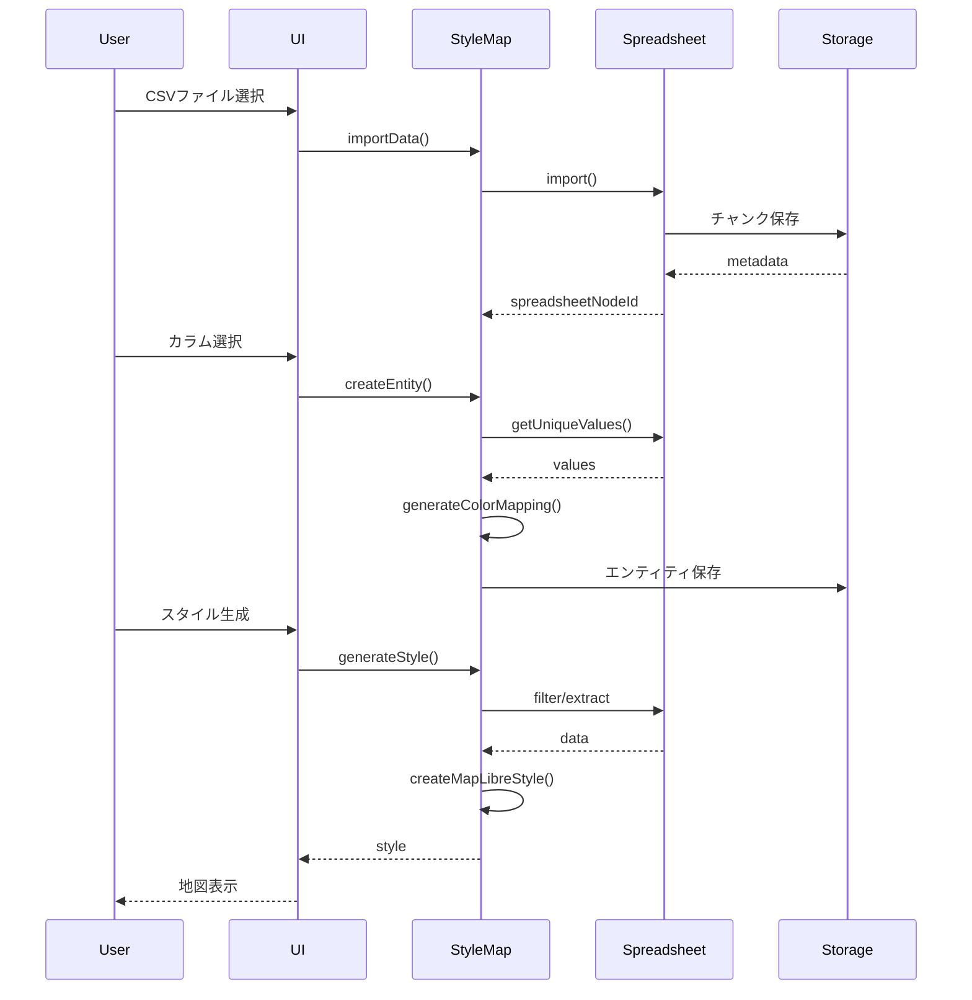

# StyleMap Plugin 実装仕様書

## 1. 概要

StyleMap PluginはSpreadsheet Pluginを基盤として、表データから地図スタイルを生成する専門プラグインです。

## 2. 依存関係

```typescript
dependencies:
  - @hierarchidb/core
  - @hierarchidb/plugin-spreadsheet  // 基盤プラグイン
  - maplibre-gl                      // スタイル仕様
```

## 3. ディレクトリ構造

```
packages/plugins/stylemap/
├── src/
│   ├── openstreetmap-type.ts                    // エントリーポイント
│   ├── StyleMapPlugin.ts           // メインプラグインクラス
│   ├── entities/
│   │   └── StyleMapEntity.ts       // エンティティ定義
│   ├── services/
│   │   ├── ColorMappingEngine.ts   // 色マッピング生成
│   │   └── StyleGenerator.ts       // MapLibreスタイル生成
│   ├── ui/                         // UIコンポーネント（保持）
│   │   ├── StyleMapDialog.tsx
│   │   └── steps/
│   │       ├── Step1DataSource.tsx
│   │       ├── Step2ColumnMapping.tsx
│   │       ├── Step3ColorSettings.tsx
│   │       └── Step4Preview.tsx
│   └── types/
│       └── openstreetmap-type.ts                // 型定義
├── package.json
└── tsconfig.json
```

## 4. コアコンポーネント

### 4.1 StyleMapEntity（簡略化版）

```typescript
// entities/StyleMapEntity.ts
import type { NodeId } from '@hierarchidb/core';
import type { FilterRule } from '@hierarchidb/plugin-spreadsheet';

export interface StyleMapEntity {
  // 識別子
  nodeId: NodeId;
  
  // Spreadsheetデータへの参照
  spreadsheetNodeId: NodeId;
  
  // マッピング設定
  keyColumn: string;
  valueColumns: string[];
  
  // 色設定
  colorScheme: ColorScheme;
  colorMapping: Record<string, string>;
  
  // オプション設定
  filterRules?: FilterRule[];
  opacity?: number;
  
  // メタデータ
  name: string;
  description?: string;
  createdAt: number;
  updatedAt: number;
  version: number;
}

export type ColorScheme = 
  | 'categorical'  // カテゴリ別
  | 'gradient'     // グラデーション
  | 'custom';      // カスタム

export interface ColorSchemeConfig {
  type: ColorScheme;
  colors?: string[];
  startColor?: string;
  endColor?: string;
  steps?: number;
}
```

### 4.2 StyleMapPlugin

```typescript
// StyleMapPlugin.ts
import { SpreadsheetPlugin } from '@hierarchidb/plugin-spreadsheet';
import { ColorMappingEngine } from './services/ColorMappingEngine';
import { StyleGenerator } from './services/StyleGenerator';

export class StyleMapPlugin {
  private spreadsheet: SpreadsheetPlugin;
  private colorEngine: ColorMappingEngine;
  private styleGenerator: StyleGenerator;
  private entities: Map<NodeId, StyleMapEntity>;
  
  constructor() {
    this.spreadsheet = new SpreadsheetPlugin({
      dbName: 'StyleMapDB',
      autoIndex: true
    });
    this.colorEngine = new ColorMappingEngine();
    this.styleGenerator = new StyleGenerator();
    this.entities = new Map();
  }
  
  /**
   * StyleMapエンティティを作成
   */
  async createEntity(
    nodeId: NodeId,
    config: {
      name: string;
      description?: string;
      spreadsheetNodeId: NodeId;
      keyColumn: string;
      valueColumns: string[];
      colorScheme: ColorSchemeConfig;
      filterRules?: FilterRule[];
    }
  ): Promise<StyleMapEntity> {
    // バリデーション
    const metadata = await this.spreadsheet.getMetadata(config.spreadsheetNodeId);
    if (!metadata) {
      throw new Error('Spreadsheet data not found');
    }
    
    if (!metadata.columns.includes(config.keyColumn)) {
      throw new Error(`Column "${config.keyColumn}" not found`);
    }
    
    // 色マッピング生成
    const uniqueValues = await this.spreadsheet.getUniqueValues(
      config.spreadsheetNodeId,
      config.keyColumn,
      1000
    );
    
    const colorMapping = this.colorEngine.generateMapping(
      uniqueValues,
      config.colorScheme
    );
    
    // エンティティ作成
    const entity: StyleMapEntity = {
      nodeId,
      spreadsheetNodeId: config.spreadsheetNodeId,
      keyColumn: config.keyColumn,
      valueColumns: config.valueColumns,
      colorScheme: config.colorScheme.type,
      colorMapping,
      filterRules: config.filterRules,
      name: config.name,
      description: config.description,
      createdAt: Date.now(),
      updatedAt: Date.now(),
      version: 1
    };
    
    this.entities.set(nodeId, entity);
    await this.saveEntity(entity);
    
    return entity;
  }
  
  /**
   * データをインポート（Spreadsheetに委譲）
   */
  async importData(
    nodeId: NodeId,
    importOptions: ImportOptions
  ): Promise<{ spreadsheetNodeId: NodeId; metadata: any }> {
    const spreadsheetNodeId = `${nodeId}_data` as NodeId;
    const metadata = await this.spreadsheet.import(
      spreadsheetNodeId,
      importOptions
    );
    
    return { spreadsheetNodeId, metadata };
  }
  
  /**
   * MapLibreスタイルを生成
   */
  async generateStyle(nodeId: NodeId): Promise<MapLibreStyle> {
    const entity = await this.getEntity(nodeId);
    
    // フィルタ適用してデータ取得
    let data: any[];
    if (entity.filterRules && entity.filterRules.length > 0) {
      const result = await this.spreadsheet.filter(
        entity.spreadsheetNodeId,
        entity.filterRules
      );
      data = result.rows;
    } else {
      // キー列の値を取得
      data = await this.spreadsheet.extractColumns(
        entity.spreadsheetNodeId,
        { columns: [entity.keyColumn, ...entity.valueColumns] }
      );
    }
    
    // スタイル生成
    return this.styleGenerator.generate({
      data,
      keyColumn: entity.keyColumn,
      colorMapping: entity.colorMapping,
      opacity: entity.opacity || 1.0
    });
  }
  
  /**
   * エンティティを更新
   */
  async updateEntity(
    nodeId: NodeId,
    updates: Partial<StyleMapEntity>
  ): Promise<StyleMapEntity> {
    const entity = await this.getEntity(nodeId);
    
    // 色設定が変更された場合は再生成
    if (updates.colorScheme || updates.keyColumn) {
      const uniqueValues = await this.spreadsheet.getUniqueValues(
        entity.spreadsheetNodeId,
        updates.keyColumn || entity.keyColumn
      );
      
      updates.colorMapping = this.colorEngine.generateMapping(
        uniqueValues,
        { type: updates.colorScheme || entity.colorScheme }
      );
    }
    
    const updated = {
      ...entity,
      ...updates,
      updatedAt: Date.now(),
      version: entity.version + 1
    };
    
    this.entities.set(nodeId, updated);
    await this.saveEntity(updated);
    
    return updated;
  }
  
  /**
   * エンティティを削除
   */
  async deleteEntity(nodeId: NodeId): Promise<void> {
    const entity = await this.getEntity(nodeId);
    
    // Spreadsheetデータも削除
    await this.spreadsheet.delete(entity.spreadsheetNodeId);
    
    // エンティティ削除
    this.entities.delete(nodeId);
    await this.removeEntity(nodeId);
  }
  
  // ... その他のメソッド
}
```

### 4.3 ColorMappingEngine

```typescript
// services/ColorMappingEngine.ts
export class ColorMappingEngine {
  /**
   * 値から色へのマッピングを生成
   */
  generateMapping(
    values: string[],
    config: ColorSchemeConfig
  ): Record<string, string> {
    switch (config.type) {
      case 'categorical':
        return this.generateCategorical(values, config);
      
      case 'gradient':
        return this.generateGradient(values, config);
      
      case 'custom':
        return config.customMapping || {};
      
      default:
        return this.generateDefault(values);
    }
  }
  
  /**
   * カテゴリカラー生成
   */
  private generateCategorical(
    values: string[],
    config: ColorSchemeConfig
  ): Record<string, string> {
    const colors = config.colors || this.getDefaultPalette();
    const mapping: Record<string, string> = {};
    
    values.forEach((value, index) => {
      mapping[value] = colors[index % colors.length];
    });
    
    return mapping;
  }
  
  /**
   * グラデーション生成
   */
  private generateGradient(
    values: string[],
    config: ColorSchemeConfig
  ): Record<string, string> {
    const startColor = config.startColor || '#ffffff';
    const endColor = config.endColor || '#000000';
    const steps = config.steps || values.length;
    
    const mapping: Record<string, string> = {};
    const sortedValues = [...values].sort();
    
    sortedValues.forEach((value, index) => {
      const ratio = index / (sortedValues.length - 1);
      mapping[value] = this.interpolateColor(startColor, endColor, ratio);
    });
    
    return mapping;
  }
  
  /**
   * 色の補間
   */
  private interpolateColor(start: string, end: string, ratio: number): string {
    // HSL色空間での補間
    const startHSL = this.hexToHSL(start);
    const endHSL = this.hexToHSL(end);
    
    const h = startHSL.h + (endHSL.h - startHSL.h) * ratio;
    const s = startHSL.s + (endHSL.s - startHSL.s) * ratio;
    const l = startHSL.l + (endHSL.l - startHSL.l) * ratio;
    
    return this.hslToHex({ h, s, l });
  }
  
  /**
   * デフォルトパレット
   */
  private getDefaultPalette(): string[] {
    return [
      '#e41a1c', '#377eb8', '#4daf4a', '#984ea3',
      '#ff7f00', '#ffff33', '#a65628', '#f781bf',
      '#999999', '#66c2a5', '#fc8d62', '#8da0cb'
    ];
  }
  
  // ... 色変換ユーティリティ
}
```

### 4.4 StyleGenerator

```typescript
// services/StyleGenerator.ts
export class StyleGenerator {
  /**
   * MapLibreスタイルを生成
   */
  generate(config: {
    data: any[];
    keyColumn: string;
    colorMapping: Record<string, string>;
    opacity?: number;
  }): MapLibreStyle {
    const { data, keyColumn, colorMapping, opacity = 1.0 } = config;
    
    // データ駆動型のスタイル生成
    const paintStyle = {
      'fill-color': [
        'match',
        ['get', keyColumn],
        ...this.buildMatchExpression(colorMapping),
        '#808080' // デフォルト色
      ],
      'fill-opacity': opacity
    };
    
    return {
      version: 8,
      sources: {
        'stylemap-source': {
          type: 'vector',
          tiles: ['...'] // タイルソースURL
        }
      },
      layers: [
        {
          id: 'stylemap-layer',
          type: 'fill',
          source: 'stylemap-source',
          'source-layer': 'default',
          paint: paintStyle
        }
      ]
    };
  }
  
  /**
   * match式を構築
   */
  private buildMatchExpression(
    colorMapping: Record<string, string>
  ): any[] {
    const expression: any[] = [];
    
    for (const [value, color] of Object.entries(colorMapping)) {
      expression.push(value, color);
    }
    
    return expression;
  }
  
  /**
   * フィルタ式を構築
   */
  buildFilterExpression(rules: FilterRule[]): any[] {
    if (rules.length === 0) return [];
    
    const filters = rules.map(rule => {
      switch (rule.operator) {
        case 'equals':
          return ['==', ['get', rule.column], rule.value];
        case 'not_equals':
          return ['!=', ['get', rule.column], rule.value];
        case 'greater_than':
          return ['>', ['get', rule.column], rule.value];
        case 'less_than':
          return ['<', ['get', rule.column], rule.value];
        default:
          return null;
      }
    }).filter(Boolean);
    
    return filters.length > 1 ? ['all', ...filters] : filters[0];
  }
}
```

## 5. データフロー



## 6. 設計の確認ポイント

### ✅ 達成される要件
1. **UIコンポーネントは保持** - 既存のUIをそのまま利用
2. **バックエンドを簡略化** - Spreadsheetに委譲
3. **データ重複を排除** - リファレンスカウント管理
4. **メンテナンス性向上** - 責務の明確な分離

### ✅ 利点
- コードの重複がない
- 各プラグインの責務が明確
- テストが容易
- 拡張性が高い

### ⚠️ 注意点
- Spreadsheet Pluginへの依存
- データ移行が必要
- 初期セットアップがやや複雑

---

**設計確認のお願い**

この設計で以下の点を達成できます：

1. **StyleMapの簡略化**: データ管理をSpreadsheetに委譲
2. **UIの保持**: 既存のUIコンポーネントは変更不要
3. **拡張性**: 他のプラグインも同様のパターンで実装可能

この設計で進めてよろしいでしょうか？