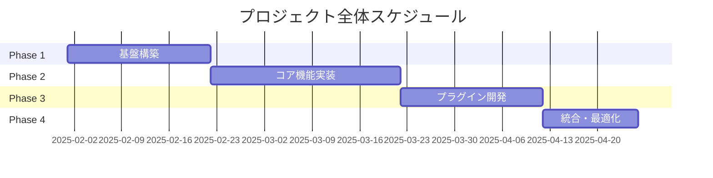
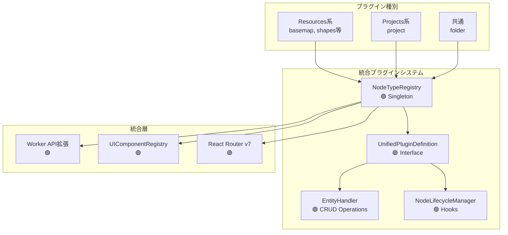

# プラグインアーキテクチャ 実装タスク全体概要

## プロジェクト概要

- **要件名**: プラグインアーキテクチャ実装
- **総期間**: 2025-02-01 〜 2025-04-30（3ヶ月）
- **総工数**: 480時間（60人日）
- **総タスク数**: 60タスク
- **推定作業時間**: 8時間/タスク × 60タスク = 480時間
- **クリティカルパス**: Phase 1 → Phase 2 → Phase 3 → Phase 4（逐次実行）

## フェーズ構成

| フェーズ | 期間 | 主要成果物 | タスク数 | 工数 | ファイル |
|---------|------|-----------|---------|------|---------|
| Phase 1: 基盤構築 | 3週間 | NodeTypeRegistry・基本インターフェース | 15タスク | 120h | [phase1.md](plugin-architecture-phase1.md) |
| Phase 2: コア機能実装 | 4週間 | EntityHandler・ライフサイクル管理 | 20タスク | 160h | [phase2.md](plugin-architecture-phase2.md) |
| Phase 3: プラグイン開発 | 3週間 | 基本プラグイン実装 | 15タスク | 120h | [phase3.md](plugin-architecture-phase3.md) |
| Phase 4: 統合・最適化 | 2週間 | テスト・ドキュメント | 10タスク | 80h | [phase4.md](plugin-architecture-phase4.md) |

## 既存タスク番号の管理

**既存ファイル確認結果**:
- 確認したファイル: `docs/tasks/worker-implementation-tasks.md`
- 使用済みタスク番号: なし
- 次回開始番号: TASK-0001

## 依存関係

## アーキテクチャ概要

## 進捗管理

### 全体進捗
- [ ] Phase 1: 基盤構築 (0/15)
- [ ] Phase 2: コア機能実装 (0/20)
- [ ] Phase 3: プラグイン開発 (0/15)
- [ ] Phase 4: 統合・最適化 (0/10)

### マイルストーン
- [ ] M1: NodeTypeRegistry完成（Phase 1完了時）🟢
- [ ] M2: ライフサイクル管理完成（Phase 2完了時）🟢
- [ ] M3: 基本プラグイン動作（Phase 3完了時）🟢
- [ ] M4: 本番環境準備完了（Phase 4完了時）🟢

## 実装優先度（要件定義書より）

1. **Phase 1（必須）**: REQ-001〜007, REQ-401〜404
2. **Phase 2（重要）**: REQ-101〜105, REQ-201〜203
3. **Phase 3（推奨）**: NFR-001〜302, EDGE-001〜003
4. **Phase 4（将来）**: REQ-301〜302, EDGE-101〜201

## リスク管理

| リスク | 影響度 | 発生確率 | 対策 |
|--------|--------|----------|------|
| TypeScript型定義の複雑化 | 高 | 中 | 段階的な型定義の洗練、レビューの徹底 🟢 |
| プラグイン間の依存関係 | 中 | 低 | プライオリティ管理、循環依存チェック 🟢 |
| パフォーマンス劣化 | 低 | 低 | ビルド時統合により実行時オーバーヘッドなし 🟢 |
| 既存システムへの影響 | 中 | 低 | 段階的な統合、後方互換性の維持 🟡 |

## 品質基準

- **テストカバレッジ**: 80%以上 🟢
- **TypeScript strict**: 完全準拠 🟢
- **ビルドエラー**: 0件 🟢
- **実行時エラー処理**: 警告は継続、エラーはロールバック 🟢
- **ドキュメント**: API仕様書、実装例完備 🟢

## 技術スタック

### コア技術
- **TypeScript 5.0+**: 型安全性の保証 🟢
- **Node.js 18+**: LTS版使用 🟢
- **pnpm**: パッケージ管理 🟢
- **Vitest**: テストフレームワーク 🟢

### プラグイン関連
- **Dexie.js**: IndexedDBラッパー 🟢
- **React 19**: UIコンポーネント 🟢
- **React Router v7**: ルーティング 🟢
- **MapLibreGL JS**: 地図表示 🟢

## チーム体制

- **アーキテクト**: 1名（全体設計・レビュー）
- **バックエンド開発**: 2名（Worker API、EntityHandler）
- **フロントエンド開発**: 2名（UI Components、React Router）
- **QAエンジニア**: 1名（テスト設計・実行）

## 次のアクション

1. Phase 1タスクファイルの確認
2. 開発環境のセットアップ
3. NodeTypeRegistry実装開始
4. 週次進捗レビューの設定

## サブタスクテンプレート

### TDDタスクの場合

各タスクは以下のTDDプロセスで実装:

1. **Red Phase（失敗テスト）**
   - `tdd-requirements.md` - 詳細要件定義
   - `tdd-testcases.md` - テストケース作成  
   - `tdd-red.md` - テスト実装（失敗）

2. **Green Phase（最小実装）**
   - `tdd-green.md` - 最小限の実装でテストを通す

3. **Refactor Phase（改善）**
   - `tdd-refactor.md` - コードの改善・最適化
   - `tdd-verify-complete.md` - 品質確認・完了検証

### DIRECTタスクの場合

各タスクは以下のDIRECTプロセスで実装:

1. **Setup Phase（直接実装）**
   - `direct-setup.md` - 環境構築・設定ファイル作成
   
2. **Verify Phase（検証）**
   - `direct-verify.md` - 動作確認・品質チェック

## エラーハンドリング要件 🟢

### 全フェーズ共通
- **警告レベル**: `console.warn`で出力し処理継続
- **エラーレベル**: 操作全体をロールバック
- **null/undefined**: 例外を投げる
- **エラーメッセージ**: 最小限の内容で十分
- **ビルドエラー**: 標準エラー出力
- **実行時エラー**: `console.error`出力

## 変更履歴

- 2025-01-28: 初版作成（要件定義書・設計文書に基づく）
- 2025-01-28: クリティカルパス・サブタスクテンプレート追加