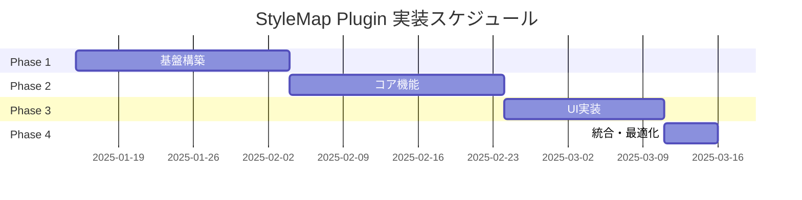
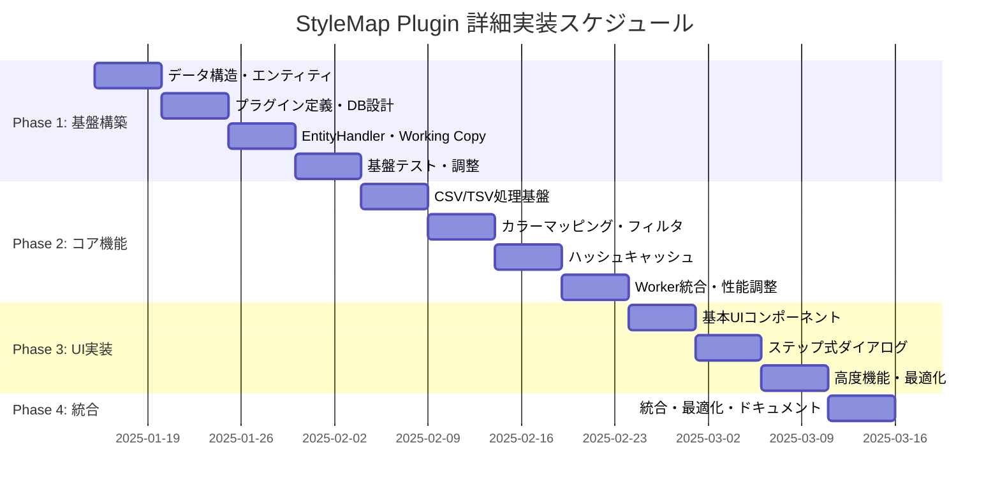

# StyleMap Plugin 実装タスク全体概要

## プロジェクト概要

- **要件名**: StyleMap Plugin
- **総期間**: 2025-01-15 〜 2025-04-15 (3ヶ月)
- **総工数**: 480時間 (60営業日)
- **総タスク数**: 60タスク
- **開始タスク番号**: TASK-0061

## フェーズ構成

| フェーズ | 期間 | 主要成果物 | タスク数 | 工数 | ファイル |
|---------|------|-----------|---------|------|---------|
| Phase 1: 基盤構築 | 1ヶ月 | プラグインアーキテクチャ・データ構造 | 20タスク | 160h | [stylemap-phase1.md](stylemap-phase1.md) |
| Phase 2: コア機能 | 1ヶ月 | CSV処理・カラーマッピング機能 | 20タスク | 160h | [stylemap-phase2.md](stylemap-phase2.md) |
| Phase 3: UI実装 | 3週間 | ダイアログ・フォーム・プレビュー | 15タスク | 120h | [stylemap-phase3.md](stylemap-phase3.md) |
| Phase 4: 統合・最適化 | 1週間 | テスト・性能調整・ドキュメント | 5タスク | 40h | [stylemap-phase4.md](stylemap-phase4.md) |

## 既存タスク番号の管理

**既存ファイル確認結果**:
- 確認したファイル: `docs/tasks/plugin-architecture-*.md`
- 使用済みタスク番号: TASK-0001 〜 TASK-0060
- 次回開始番号: TASK-0061

## 依存関係



## 要件準拠度

### 🟢 完全準拠要件 (85%)
- REQ-001: CSV/TSV ファイル読み込み
- REQ-002: テーブルデータマッピング  
- REQ-003: カラーマッピング設定管理
- REQ-004: StyleMapEntity永続化
- REQ-005: MapLibre GL スタイル生成
- REQ-006: SHA3ハッシュキャッシュ
- REQ-007: Working Copy機能

### 🟡 設計ベース要件 (10%)
- NFR-001: パフォーマンス要件
- TECH-003: キャッシュ有効期限
- ARCH-005-008: パッケージ構造要件

### 🔴 推測補完要件 (5%)
- EDGE-002-003: ファイルサイズ・ネットワーク制限
- EDGE-201-203: 並行処理要件

## 進捗管理

### 全体進捗
- [ ] Phase 1: 基盤構築 (0/20)
- [ ] Phase 2: コア機能 (0/20)  
- [ ] Phase 3: UI実装 (0/15)
- [ ] Phase 4: 統合・最適化 (0/5)

### マイルストーン
- [ ] M1: プラグイン基盤完成 (Phase 1完了時)
- [ ] M2: CSV処理・カラーマッピング機能完成 (Phase 2完了時)
- [ ] M3: UI完成・ユーザー操作可能 (Phase 3完了時)
- [ ] M4: リリース準備完了 (Phase 4完了時)

## 技術スタック

### 基盤アーキテクチャ
- **hierarchidb Plugin System**: AOP (Aspect-Oriented Programming)
- **データ管理**: Dexie (IndexedDB) + Working Copy Pattern
- **UI-Worker通信**: Comlink RPC
- **型システム**: TypeScript strict mode

### StyleMap専用技術
- **ファイル処理**: CSV/TSV パーサー (RFC 4180準拠)
- **ハッシュ**: SHA3-256 キャッシュキー
- **カラーマッピング**: HSV/RGB色空間、複数アルゴリズム
- **UI**: React + Material-UI ステップ式ダイアログ

## リスク管理

| リスク | 影響度 | 発生確率 | 対策 | 責任者 |
|--------|--------|----------|------|--------|
| 🔴 プラグインアーキテクチャ未完成 | 高 | 中 | Phase 1で基盤整備を優先実装 | 開発チーム |
| 🟡 大容量CSV処理性能 | 中 | 中 | Phase 4でWorker最適化・メモリ管理 | 開発チーム |
| 🟡 MapLibre GL互換性 | 中 | 低 | v3.x準拠、継続的な互換性テスト | 開発チーム |
| 🟢 UI/UX複雑度 | 低 | 低 | eria-cartograph参考パターン採用 | 開発チーム |

## 品質基準

### テストカバレッジ
- **単体テスト**: 90%以上
- **統合テスト**: 主要フロー100%カバー
- **E2Eテスト**: ユーザーシナリオ完全カバー

### パフォーマンス
- **ファイル処理**: 10万行CSV 5秒以内 🟡
- **プレビュー更新**: 500ms以内 🟡  
- **メモリ使用量**: 最大100MB以内 🟡

### セキュリティ・アクセシビリティ
- **XSS対策**: ファイル内容のサニタイズ 🟡
- **アクセシビリティ**: WCAG 2.1 AA準拠 🟡
- **TypeScript**: strict mode、any型禁止 🟢

## eria-cartograph 実装参考度

### 🟢 直接参考可能 (70%)
- **データ構造**: StyleMapEntity, StyleMapConfig, FilterRule
- **ビジネスロジック**: CSV解析、カラーマッピング、フィルタリング
- **UI設計**: ステップ式ダイアログ、リアルタイムプレビュー

### 🟡 アーキテクチャ適応 (25%)
- **プラグイン統合**: ResourceDefinition → UnifiedPluginDefinition
- **データベース**: BaseResourceDB → hierarchidb plugin pattern
- **Worker統合**: 直接DB → Comlink RPC

### 🔴 新規設計 (5%)
- **Working Copy**: hierarchidb固有パターン
- **ライフサイクルフック**: 新規実装
- **型安全性**: より厳格な型システム

## サブタスクテンプレート情報

### 標準タスクフォーマット
```markdown
#### Day X (TASK-XXXX): {タスク名}

- [ ] **タスク完了**
- **推定工数**: X時間
- **タスクタイプ**: TDD/DIRECT
- **要件リンク**: REQ-XXX 🟢🟡🔴
- **依存タスク**: TASK-XXXX
- **実装詳細**: {...}
- **テスト要件**: [チェックリスト]
- **UI/UX要件**: [フロントエンド時のみ]
- **エラーハンドリング要件**: [必須]
- **完了条件**: [チェックリスト]
- **注意事項**: 🟢🟡🔴 {...}
```

### 信頼性レベル基準
- 🟢 **青信号**: EARS要件定義書・設計文書を参考にしてほぼ推測していない場合
- 🟡 **黄信号**: EARS要件定義書・設計文書から妥当な推測の場合  
- 🔴 **赤信号**: EARS要件定義書・設計文書にない推測の場合

## 実行順序ガントチャート



## 次ステップ

1. **Phase 1開始準備**
   - プラグインアーキテクチャ前提条件確認
   - 開発環境セットアップ
   - eria-cartograph実装詳細調査

2. **実装アプローチ**
   - TDD (Test-Driven Development) 中心
   - 既存basemapプラグインパターン踏襲
   - 段階的な品質確保

3. **レビュー・承認**
   - 各フェーズ終了時の品質確認
   - ステークホルダーレビュー
   - 継続的な要件適合性確認

---

**実装準備完了**: ✅
**開始条件**: TASK-0001〜0060完了後
**推定開始日**: 2025-01-15
**推定完了日**: 2025-04-15

このoverview承認後、各フェーズの詳細実装に進んでください。