# HierarchiDB 技術アーキテクチャ仕様書

## はじめに

この技術仕様書では、HierarchiDBの内部アーキテクチャと実装詳細について、システムアーキテクト・開発者向けに包括的に説明します。本ドキュメントは以下のような方を対象としています：

**読むべき人**: システムアーキテクト、上級開発者、技術リーダー、システム全体の設計判断を行う方、パフォーマンス最適化を担当する方、BaseMap・StyleMap・Shape・Spreadsheet・Projectプラグインの深い技術理解が必要な開発者

**前提知識**: Web Worker、Comlink、TypeScript高度な型システム、Dexie.js/IndexedDB、React アーキテクチャパターン、RPC通信、データベース設計、パフォーマンス最適化

**読むタイミング**: システム全体の技術的理解が必要な際、アーキテクチャ設計の意思決定を行う際、技術的な問題解決やパフォーマンス分析を行う際に参照してください。本書は実装詳細レベルでの技術的判断に必要な情報を提供します。

本仕様書は、UML図とシーケンス図を用いてシステムの動作メカニズムを詳細に解説し、技術的な設計判断の根拠となる情報を提供します。

## 概要

本ドキュメントでは、HierarchiDBの内部アーキテクチャと動作メカニズムを、UML図を用いて詳細に説明します。

## 1. システム全体アーキテクチャ

### 1.1 システム構成図

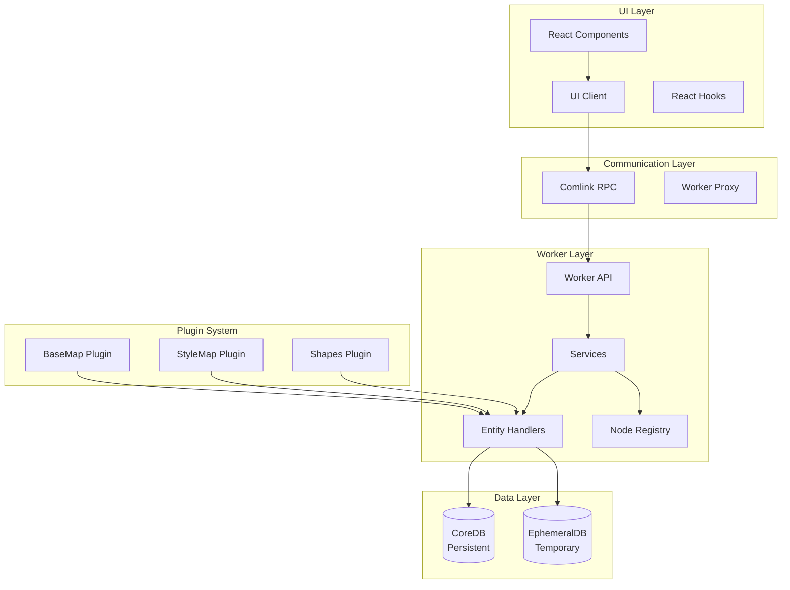

### 1.2 レイヤー責務

| レイヤー | 責務 | 主要コンポーネント |
|---------|------|-------------------|
| UI Layer | ユーザーインターフェース、状態管理 | React, MUI, Context |
| Communication | UI-Worker間通信 | Comlink, Proxy |
| Worker Layer | ビジネスロジック、データ操作 | Services, Handlers |
| Data Layer | データ永続化 | IndexedDB, Dexie |
| Plugin System | 機能拡張 | Node Types, Handlers |

## 2. クラス図

### 2.1 EntityHandler階層構造

```mermaid
classDiagram
    class BaseEntityHandler {
        <<abstract>>
        #db: Dexie
        #tableName: string
        #workingCopyTableName: string
        +createEntity(nodeId: NodeId, data?: Partial~T~): Promise~T~
        +getEntity(nodeId: NodeId): Promise~T | undefined~
        +updateEntity(nodeId: NodeId, data: Partial~T~): Promise~void~
        +deleteEntity(nodeId: NodeId): Promise~void~
        +createWorkingCopy(nodeId: NodeId): Promise~TWorkingCopy~
        +commitWorkingCopy(nodeId: NodeId, workingCopy: TWorkingCopy): Promise~void~
        +discardWorkingCopy(nodeId: NodeId): Promise~void~
        #generateNodeId(): string
        #now(): number
        #log(message: string, data?: any): void
    }

    class PeerEntityHandler {
        <<abstract>>
        +ensureEntityExists(nodeId: NodeId): Promise~TEntity~
        +syncWithNode(nodeId: NodeId, nodeData?: Partial~any~): Promise~void~
        +onNodeCreated(nodeId: NodeId, nodeData: any): Promise~void~
        +onNodeUpdated(nodeId: NodeId, nodeData: any, oldNodeData?: any): Promise~void~
        +onNodeDeleted(nodeId: NodeId): Promise~void~
        #getDefaultEntityData(): Partial~TEntity~
        #extractEntityUpdatesFromNode(nodeData: Partial~any~): Partial~TEntity~
        #validateUniqueEntity(nodeId: NodeId): Promise~void~
    }

    class GroupEntityHandler {
        <<abstract>>
        +createBatch(nodeId: NodeId, items: Partial~TEntity~[]): Promise~TEntity[]~
        +getByParentNode(nodeId: NodeId): Promise~TEntity[]~
        +updateBatchByNode(nodeId: NodeId, updates: Partial~TEntity~[]): Promise~void~
        +deleteByParentNode(nodeId: NodeId): Promise~void~
        +reorderEntities(nodeId: NodeId, orderedIds: EntityId[]): Promise~void~
        +getCountByParentNode(nodeId: NodeId): Promise~number~
        +getByParentNodePaginated(nodeId: NodeId, offset: number, limit: number): Promise~Object~
        #getNextIndex(nodeId: NodeId): Promise~number~
        #validateGroupEntity(entity: Partial~TEntity~): void
    }

    class RelationalEntityHandler {
        <<abstract>>
        +addReference(entityId: EntityId, nodeId: NodeId): Promise~TEntity~
        +removeReference(entityId: EntityId, nodeId: NodeId): Promise~boolean~
        +getEntityById(entityId: EntityId): Promise~TEntity | undefined~
        +getReferencedEntities(nodeId: NodeId): Promise~TEntity[]~
        +removeAllReferences(nodeId: NodeId): Promise~EntityId[]~
        +updateEntityContent(entityId: EntityId, updates: Partial~TEntity~): Promise~void~
        +cleanupOrphanedEntities(): Promise~number~
        +getReferenceStats(): Promise~Object~
        #createSharedEntity(entityId: EntityId, nodeId: NodeId, data?: Partial~TEntity~): Promise~TEntity~
        #validateRelationalEntity(entity: Partial~TEntity~): void
    }

    class BaseMapEntityHandler {
        +changeMapStyle(nodeId: NodeId, style: MapStyle): Promise~void~
        +setBounds(nodeId: NodeId, bounds: Bounds): Promise~void~
        +clearTileCache(nodeId: NodeId): Promise~void~
        +findNearbyMaps(center: [number, number], radius: number): Promise~BaseMapEntity[]~
        #getDefaultEntityData(): Partial~BaseMapEntity~
        #deriveEntityDataFromNode(nodeData: any): Partial~BaseMapEntity~
    }

    class StyleMapEntityHandler {
        -tableMetadataManager: TableMetadataManager
        +createOrReuseTableMetadata(nodeId: NodeId, filename: string, fileContent: string, columns: string[], tableRows: any[][]): Promise~string~
        +getTableMetadata(nodeId: NodeId): Promise~TableMetadataEntity | undefined~
        +cleanupOrphanedTableMetadata(): Promise~number~
        #getDefaultEntityData(): Partial~StyleMapEntity~
    }

    BaseEntityHandler <|-- PeerEntityHandler
    BaseEntityHandler <|-- GroupEntityHandler
    BaseEntityHandler <|-- RelationalEntityHandler
    PeerEntityHandler <|-- BaseMapEntityHandler
    PeerEntityHandler <|-- StyleMapEntityHandler
```

### 2.2 エンティティ型システム

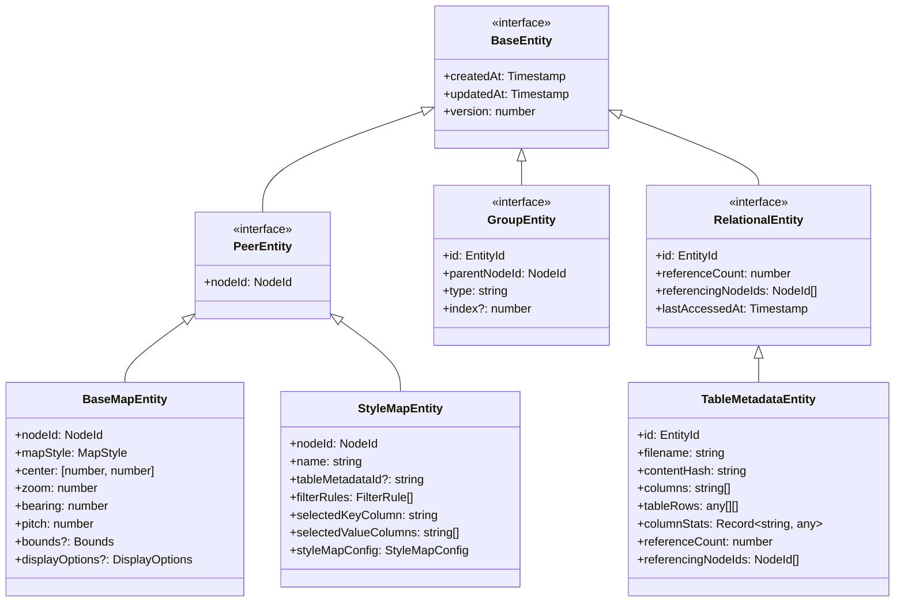

### 2.3 データベース構造

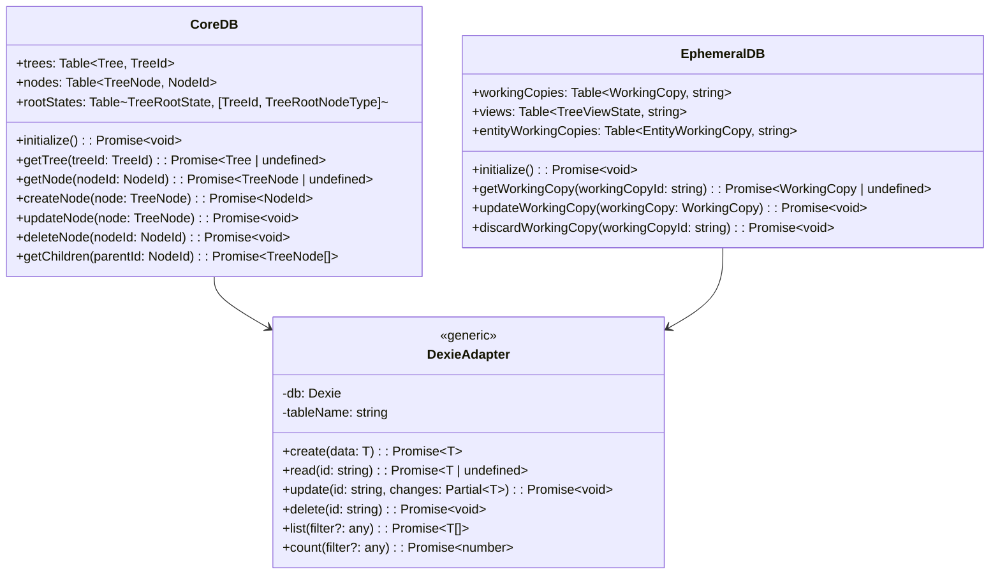

## 3. シーケンス図

### 3.1 ノード作成シーケンス

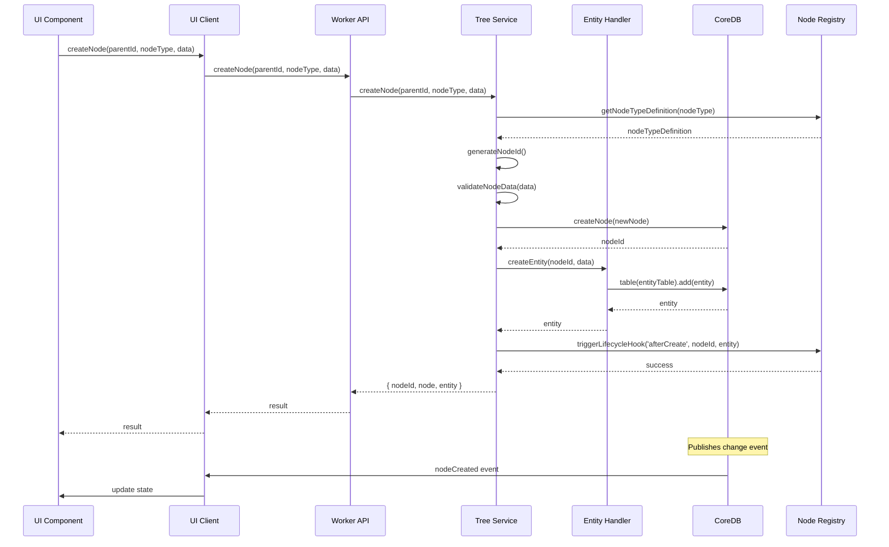

### 3.2 エンティティワーキングコピーシーケンス

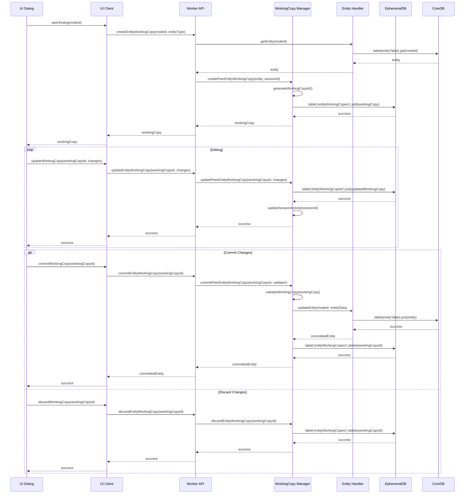

### 3.3 RelationalEntity参照管理シーケンス

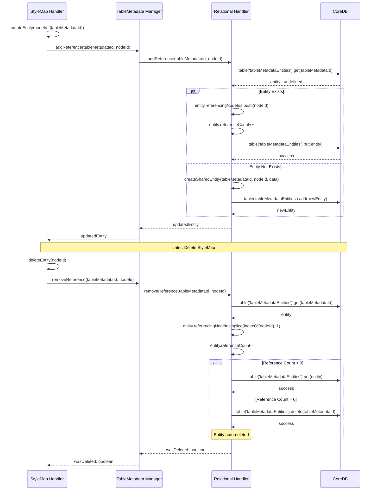

## 4. コミュニケーション図

### 4.1 プラグインシステム相互作用

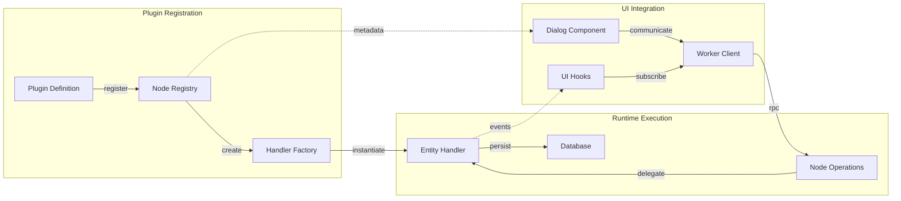

### 4.2 データフロー

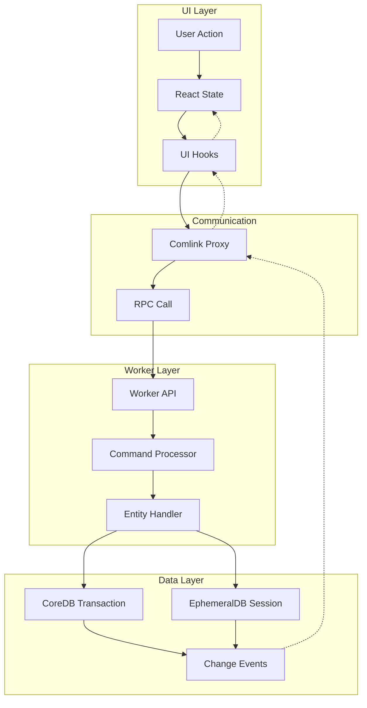

## 5. 状態遷移図

### 5.1 エンティティワーキングコピーの状態遷移

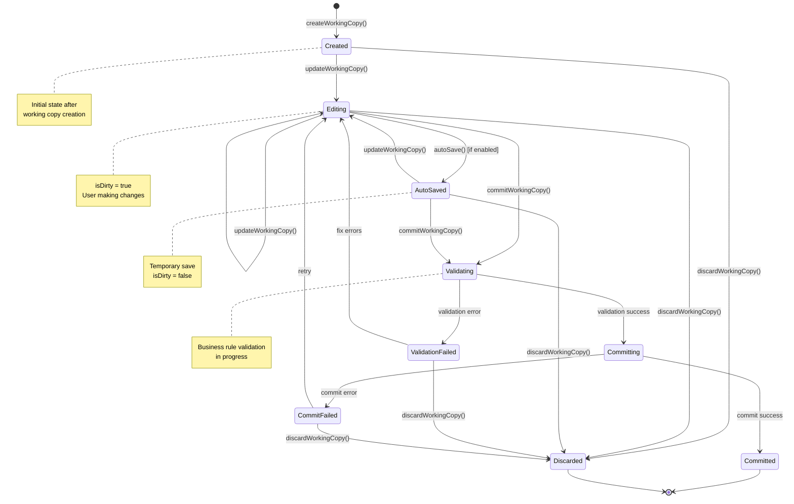

### 5.2 RelationalEntity参照カウントの状態遷移

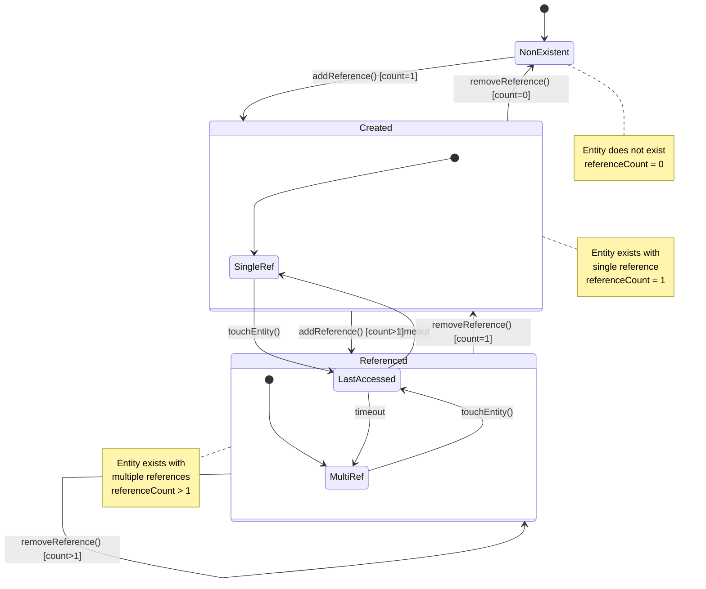

### 5.3 セッション状態遷移

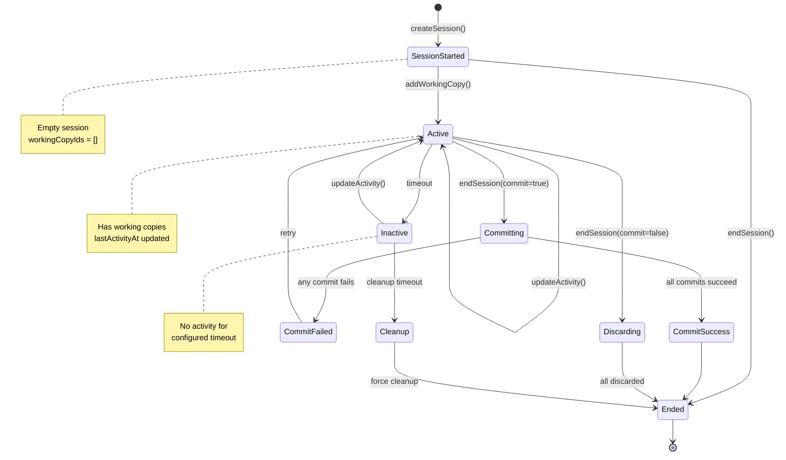

## 6. アクティビティ図

### 6.1 プラグイン登録プロセス

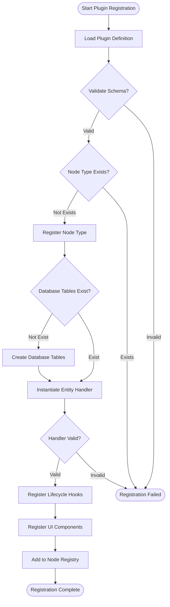

### 6.2 複雑なエンティティ操作フロー

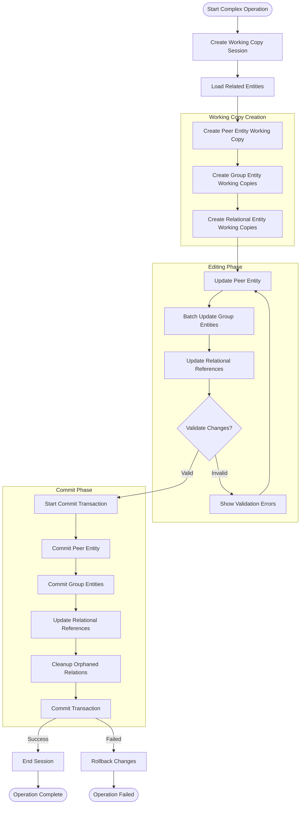

## 7. パッケージ図

### 7.1 全体パッケージ構成

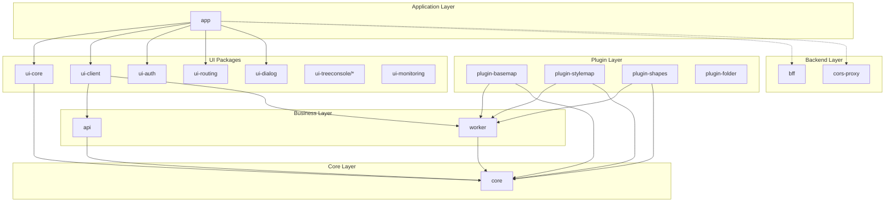

### 7.2 依存関係詳細

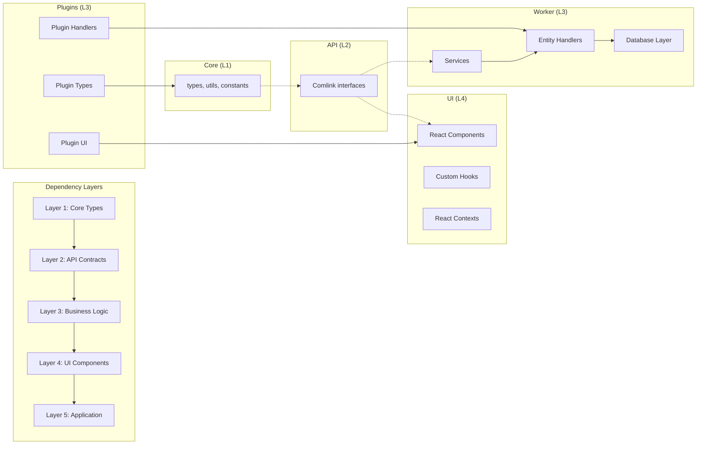

## 8. 配置図

### 8.1 ランタイム配置

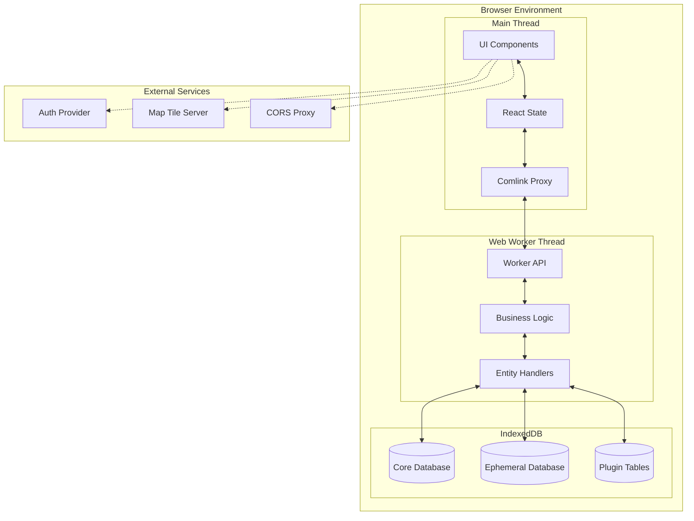

### 8.2 開発時配置

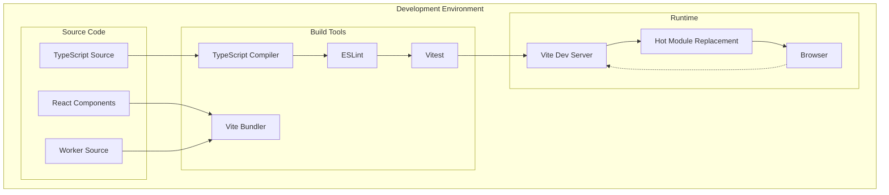

## まとめ

本技術仕様書では、HierarchiDBの内部アーキテクチャを以下の観点から詳細に説明しました：

### 📊 提供した図表
1. **システム構成図** - 全体アーキテクチャの理解
2. **クラス図** - EntityHandler階層とエンティティ型システム
3. **シーケンス図** - 主要な操作フローの理解
4. **コミュニケーション図** - コンポーネント間の相互作用
5. **状態遷移図** - エンティティとセッションの状態管理
6. **アクティビティ図** - 複雑なビジネスプロセス
7. **パッケージ図** - コードベースの構造と依存関係
8. **配置図** - ランタイムと開発時の配置

### 🎯 アーキテクチャの特徴
- **4層分離**: UI、通信、ビジネスロジック、データの明確な分離
- **3分類エンティティシステム**: Peer/Group/Relationalの特性に応じた最適化
- **型安全性**: Branded Typeによる実行時エラーの防止
- **プラグインシステム**: 標準化された拡張機能
- **ワーキングコピー**: 安全な編集機能とセッション管理

この技術仕様書により、開発者はHierarchiDBの内部動作を深く理解し、効率的な開発とメンテナンスが可能になります。