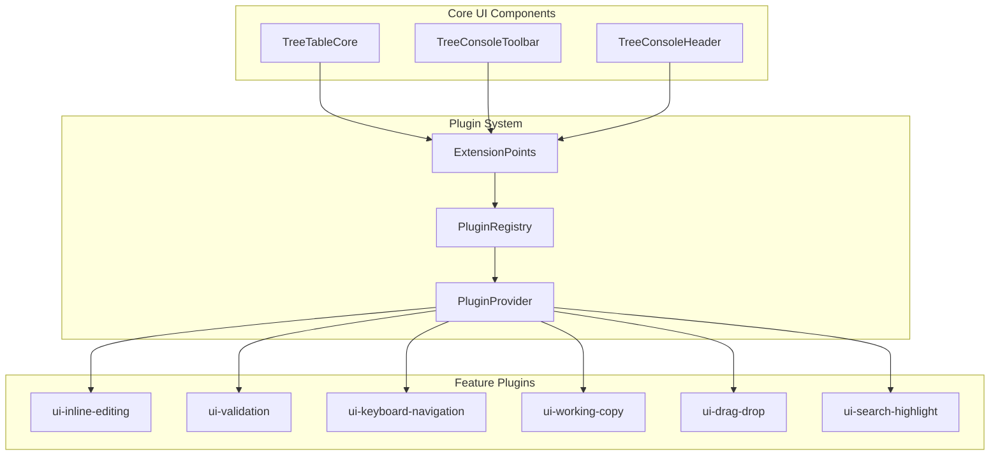

# UI Plugin Architecture

## はじめに

このUIプラグインアーキテクチャ仕様では、HierarchiDBのUI層における拡張可能なプラグインシステムの設計について詳細に説明します。本ドキュメントは以下のような方を対象としています：

**読むべき人**: フロントエンド開発者、UIアーキテクト、プラグイン開発者、コンポーネント設計者、BaseMap・StyleMap・Shape・Spreadsheet・ProjectプラグインなどのUI実装を担当する開発者

**前提知識**: React、コンポーネント設計、依存性注入、プラグインパターン、TypeScript、UI/UX設計、モジュラーアーキテクチャ

**読むタイミング**: UI層の新機能実装前、既存UIコンポーネントの拡張時、プラグインシステムの理解が必要な際に参照してください。特にSpreadsheetプラグインのような新しいUIコンポーネントを開発する際は、本アーキテクチャに従うことで既存システムとの整合性を保ちながら実装できます。

本アーキテクチャは、非破壊的拡張により既存機能を保護しながら、新機能の段階的導入を可能にする設計思想に基づいています。

## 概要

HierarchiDBのUI層において、既存コンポーネントを変更することなく新機能を追加するためのプラグインアーキテクチャです。このアーキテクチャにより、機能の段階的導入、独立したテスト、再利用性の向上を実現します。

## 設計原則

### 1. 非破壊的拡張 (Non-Breaking Extension)
- 既存コンポーネントのAPIを変更しない
- 新機能はオプショナルなpropsとして追加
- デフォルト動作は既存のまま保持

### 2. 疎結合 (Loose Coupling)
- プラグイン間の依存関係を最小化
- インターフェースベースの設計
- 依存性注入パターンの活用

### 3. 段階的導入 (Gradual Adoption)
- 機能フラグによる制御
- パッケージ単位での独立デプロイ
- 実験的機能の安全な導入

## アーキテクチャ概要



## Extension Points (拡張ポイント)

### 1. Hook Extension Points
既存コンポーネントに最小限のフックを追加して、プラグインが機能を注入できるポイントを提供します。

#### TreeTableCore Extension Points
```typescript
// packages/ui/treeconsole/treetable/src/types.ts
export interface TreeTableCoreProps {
  // 既存のprops...
  controller: TreeTableController | null;
  viewHeight: number;
  viewWidth: number;
  
  // 🔌 Extension Points
  plugins?: TreeTablePlugin[];
  extensionProps?: Record<string, any>;
  
  // Feature flags for plugins
  enableInlineEditing?: boolean;
  enableAdvancedKeyboardNav?: boolean;
  enableDragDropEnhancements?: boolean;
  enableSearchHighlight?: boolean;
  enableWorkingCopyIntegration?: boolean;
}

export interface TreeTablePlugin {
  name: string;
  version: string;
  hooks: TreeTableHooks;
  components?: TreeTableComponentOverrides;
}

export interface TreeTableHooks {
  // Cell rendering extensions
  onBeforeCellRender?: (cell: CellContext) => CellContext;
  onAfterCellRender?: (element: ReactElement, cell: CellContext) => ReactElement;
  
  // Row interaction extensions
  onRowClick?: (node: TreeNode, event: MouseEvent) => boolean; // return true to prevent default
  onRowDoubleClick?: (node: TreeNode, event: MouseEvent) => boolean;
  onRowContextMenu?: (node: TreeNode, event: MouseEvent) => boolean;
  onKeyDown?: (event: KeyboardEvent) => boolean;
  
  // State change extensions
  onEditingStateChange?: (editingNodeId: string | null) => void;
  onSelectionChange?: (selectedIds: string[]) => void;
  onExpansionChange?: (expandedIds: string[]) => void;
  
  // Data manipulation extensions
  onBeforeNodeUpdate?: (nodeId: string, newData: Partial<TreeNode>) => Promise<boolean>;
  onAfterNodeUpdate?: (nodeId: string, newData: Partial<TreeNode>) => Promise<void>;
}

export interface TreeTableComponentOverrides {
  CellEditor?: React.ComponentType<CellEditorProps>;
  RowDecorator?: React.ComponentType<RowDecoratorProps>;
  ColumnHeader?: React.ComponentType<ColumnHeaderProps>;
  LoadingIndicator?: React.ComponentType<LoadingIndicatorProps>;
}
```

#### TreeTableCore実装での拡張ポイント活用
```typescript
// packages/ui/treeconsole/treetable/src/components/TreeTableCore.tsx
export function TreeTableCore({
  controller,
  plugins = [],
  enableInlineEditing = false,
  enableAdvancedKeyboardNav = false,
  ...props
}: TreeTableCoreProps) {
  
  // 🔌 Plugin Registry
  const pluginRegistry = usePluginRegistry(plugins);
  
  // 🔌 Extension Point: onKeyDown
  const handleKeyDown = useCallback((event: KeyboardEvent) => {
    // Allow plugins to handle key events first
    for (const plugin of pluginRegistry.getPlugins()) {
      if (plugin.hooks.onKeyDown?.(event)) {
        return; // Plugin handled the event
      }
    }
    
    // Default key handling
    handleDefaultKeyDown(event);
  }, [pluginRegistry]);
  
  // 🔌 Extension Point: Cell Rendering
  const renderCell = useCallback((cell: Cell) => {
    let cellContext = { ...cell };
    let element = <DefaultCellRenderer cell={cellContext} />;
    
    // Apply plugin transformations
    for (const plugin of pluginRegistry.getPlugins()) {
      if (plugin.hooks.onBeforeCellRender) {
        cellContext = plugin.hooks.onBeforeCellRender(cellContext);
      }
    }
    
    // Render with transformed context
    element = <DefaultCellRenderer cell={cellContext} />;
    
    // Apply post-render transformations
    for (const plugin of pluginRegistry.getPlugins()) {
      if (plugin.hooks.onAfterCellRender) {
        element = plugin.hooks.onAfterCellRender(element, cellContext);
      }
    }
    
    return element;
  }, [pluginRegistry]);
  
  // 🔌 Extension Point: Feature-specific hooks
  const editingPlugin = useMemo(() => {
    if (!enableInlineEditing) return null;
    return pluginRegistry.getPlugin('inline-editing');
  }, [enableInlineEditing, pluginRegistry]);
  
  // Rest of the component implementation...
}
```

### 2. Provider-based Extension Points
プラグインが状態やサービスを提供するためのコンテキストベースの拡張ポイント。

```typescript
// packages/ui/treeconsole/base/src/providers/TreeConsoleProvider.tsx
export function TreeConsoleProvider({ 
  children, 
  plugins = [],
  ...props 
}: TreeConsoleProviderProps) {
  return (
    <PluginProvider plugins={plugins}>
      <TreeDataProvider {...props}>
        <ValidationProvider>
          <KeyboardNavigationProvider>
            <WorkingCopyProvider>
              {children}
            </WorkingCopyProvider>
          </KeyboardNavigationProvider>
        </ValidationProvider>
      </TreeDataProvider>
    </PluginProvider>
  );
}
```

### 3. Composition-based Extension Points
コンポーネントの合成による機能拡張。

```typescript
// packages/ui/treeconsole/treetable/src/components/TreeTableWithPlugins.tsx
export function TreeTableWithPlugins({
  plugins = [],
  ...props
}: TreeTableWithPluginsProps) {
  const enhancedProps = usePluginEnhancement(props, plugins);
  
  return (
    <TreeTableCore {...enhancedProps}>
      {plugins.map(plugin => (
        plugin.components?.RowDecorator && (
          <plugin.components.RowDecorator key={plugin.name} />
        )
      ))}
    </TreeTableCore>
  );
}
```

## Plugin Implementation Examples

### 1. Inline Editing Plugin

#### Package Structure
```
packages/ui-inline-editing/
├── src/
│   ├── plugin.ts                    # Plugin定義
│   ├── hooks/
│   │   ├── useInlineEditing.ts      # Core editing logic
│   │   └── useEditingValidation.ts  # Validation integration
│   ├── components/
│   │   ├── InlineEditField.tsx      # Editable cell component
│   │   └── EditingIndicator.tsx     # Visual feedback
│   ├── providers/
│   │   └── EditingProvider.tsx      # Editing context
│   └── openstreetmap-type.ts
```

#### Plugin Definition
```typescript
// packages/ui-inline-editing/src/plugin.ts
import { TreeTablePlugin } from '@hierarchidb/ui-treeconsole-treetable';
import { InlineEditField } from './components/InlineEditField';
import { useInlineEditing } from './hooks/useInlineEditing';

export const inlineEditingPlugin: TreeTablePlugin = {
  name: 'inline-editing',
  version: '1.0.0',
  
  hooks: {
    onAfterCellRender: (element, cellContext) => {
      if (cellContext.column.id === 'name' && cellContext.row.getCanEdit?.()) {
        return <InlineEditField originalElement={element} cellContext={cellContext} />;
      }
      return element;
    },
    
    onKeyDown: (event) => {
      if (event.key === 'F2' || (event.key === 'Enter' && event.altKey)) {
        // Start editing selected cell
        return true; // Prevent default
      }
      return false;
    },
    
    onRowDoubleClick: (node, event) => {
      // Start editing on double click
      return true; // Prevent default navigation
    },
  },
  
  components: {
    CellEditor: InlineEditField,
  },
};
```

#### Hook Implementation
```typescript
// packages/ui-inline-editing/src/hooks/useInlineEditing.ts
export function useInlineEditing({
  controller,
  workingCopyService,
  validator,
}: UseInlineEditingProps) {
  const [editingState, setEditingState] = useState<EditingState>({
    editingNodeId: null,
    editingValue: '',
    originalValue: '',
    workingCopyId: null,
    validationErrors: [],
    isLoading: false,
  });
  
  const startEdit = useCallback(async (nodeId: string) => {
    setEditingState(prev => ({ ...prev, isLoading: true }));
    
    try {
      // Get current data through Working Copy pattern
      const currentData = await controller?.getCurrentNodeData?.(nodeId);
      if (!currentData) throw new Error('Node not found');
      
      // Create working copy for optimistic locking
      const workingCopy = await workingCopyService?.createWorkingCopy(nodeId, currentData);
      
      setEditingState({
        editingNodeId: nodeId,
        editingValue: currentData.name,
        originalValue: currentData.name,
        workingCopyId: workingCopy?.id || null,
        validationErrors: [],
        isLoading: false,
      });
    } catch (error) {
      setEditingState(prev => ({ ...prev, isLoading: false }));
      throw error;
    }
  }, [controller, workingCopyService]);
  
  const finishEdit = useCallback(async (newValue: string) => {
    if (!editingState.editingNodeId || !editingState.workingCopyId) return false;
    
    try {
      // Validate new value
      const validationResult = await validator?.validate(
        newValue, 
        editingState.editingNodeId
      );
      
      if (!validationResult?.isValid) {
        setEditingState(prev => ({ 
          ...prev, 
          validationErrors: validationResult?.errors || [] 
        }));
        return false;
      }
      
      // Update working copy and commit
      await workingCopyService?.updateWorkingCopy(
        editingState.workingCopyId,
        { name: newValue }
      );
      await workingCopyService?.commitWorkingCopy(editingState.workingCopyId);
      
      // Clear editing state
      setEditingState({
        editingNodeId: null,
        editingValue: '',
        originalValue: '',
        workingCopyId: null,
        validationErrors: [],
        isLoading: false,
      });
      
      return true;
    } catch (error) {
      console.error('Failed to save edit:', error);
      return false;
    }
  }, [editingState, validator, workingCopyService]);
  
  const cancelEdit = useCallback(async () => {
    if (editingState.workingCopyId) {
      await workingCopyService?.discardWorkingCopy(editingState.workingCopyId);
    }
    
    setEditingState({
      editingNodeId: null,
      editingValue: '',
      originalValue: '',
      workingCopyId: null,
      validationErrors: [],
      isLoading: false,
    });
  }, [editingState.workingCopyId, workingCopyService]);
  
  return {
    editingState,
    startEdit,
    finishEdit,
    cancelEdit,
    setEditingValue: (value: string) => 
      setEditingState(prev => ({ ...prev, editingValue: value })),
  };
}
```

### 2. Keyboard Navigation Plugin

```typescript
// packages/ui-keyboard-navigation/src/plugin.ts
export const keyboardNavigationPlugin: TreeTablePlugin = {
  name: 'keyboard-navigation',
  version: '1.0.0',
  
  hooks: {
    onKeyDown: (event) => {
      switch (event.key) {
        case 'ArrowUp':
        case 'ArrowDown':
          // Handle row navigation
          return handleRowNavigation(event);
        case 'Tab':
          // Handle cell navigation
          return handleCellNavigation(event);
        case 'Enter':
          // Handle cell activation
          return handleCellActivation(event);
        case 'Escape':
          // Handle escape actions
          return handleEscape(event);
        default:
          return false;
      }
    },
  },
};
```

### 3. Validation Plugin

```typescript
// packages/ui-validation/src/plugin.ts
export const validationPlugin: TreeTablePlugin = {
  name: 'validation',
  version: '1.0.0',
  
  hooks: {
    onBeforeNodeUpdate: async (nodeId, newData) => {
      const validationResult = await validateNodeData(nodeId, newData);
      return validationResult.isValid;
    },
    
    onAfterCellRender: (element, cellContext) => {
      const validationErrors = getValidationErrors(cellContext.row.original.id);
      if (validationErrors.length > 0) {
        return (
          <ValidationWrapper errors={validationErrors}>
            {element}
          </ValidationWrapper>
        );
      }
      return element;
    },
  },
};
```

## Plugin Registry System

### Plugin Registry Implementation
```typescript
// packages/ui/treeconsole/base/src/plugin/PluginRegistry.ts
export class PluginRegistry {
  private plugins: Map<string, TreeTablePlugin> = new Map();
  
  register(plugin: TreeTablePlugin): void {
    if (this.plugins.has(plugin.name)) {
      console.warn(`Plugin ${plugin.name} is already registered`);
      return;
    }
    
    this.plugins.set(plugin.name, plugin);
  }
  
  unregister(pluginName: string): void {
    this.plugins.delete(pluginName);
  }
  
  getPlugin(name: string): TreeTablePlugin | undefined {
    return this.plugins.get(name);
  }
  
  getPlugins(): TreeTablePlugin[] {
    return Array.from(this.plugins.values());
  }
  
  executeHook<T extends keyof TreeTableHooks>(
    hookName: T,
    ...args: Parameters<NonNullable<TreeTableHooks[T]>>
  ): any[] {
    const results: any[] = [];
    
    for (const plugin of this.plugins.values()) {
      const hook = plugin.hooks[hookName];
      if (hook) {
        try {
          const result = (hook as any)(...args);
          results.push(result);
        } catch (error) {
          console.error(`Error executing hook ${hookName} in plugin ${plugin.name}:`, error);
        }
      }
    }
    
    return results;
  }
}
```

### Plugin Provider
```typescript
// packages/ui/treeconsole/base/src/plugin/PluginProvider.tsx
const PluginContext = createContext<PluginRegistry | null>(null);

export function PluginProvider({ 
  children, 
  plugins = [] 
}: PluginProviderProps) {
  const registry = useMemo(() => {
    const reg = new PluginRegistry();
    plugins.forEach(plugin => reg.register(plugin));
    return reg;
  }, [plugins]);
  
  return (
    <PluginContext.Provider value={registry}>
      {children}
    </PluginContext.Provider>
  );
}

export function usePluginRegistry(): PluginRegistry {
  const registry = useContext(PluginContext);
  if (!registry) {
    throw new Error('usePluginRegistry must be used within PluginProvider');
  }
  return registry;
}
```

## Usage Examples

### Basic Plugin Integration
```typescript
// In application code
import { TreeTableCore } from '@hierarchidb/ui-treeconsole-treetable';
import { inlineEditingPlugin } from '@hierarchidb/ui-inline-editing';
import { validationPlugin } from '@hierarchidb/ui-validation';
import { keyboardNavigationPlugin } from '@hierarchidb/ui-keyboard-navigation';

function MyTreeTable({ controller }: MyTreeTableProps) {
  const plugins = useMemo(() => [
    inlineEditingPlugin,
    validationPlugin,
    keyboardNavigationPlugin,
  ], []);
  
  return (
    <PluginProvider plugins={plugins}>
      <TreeTableCore
        controller={controller}
        enableInlineEditing={true}
        enableAdvancedKeyboardNav={true}
        viewHeight={600}
        viewWidth={800}
      />
    </PluginProvider>
  );
}
```

### Conditional Plugin Loading
```typescript
function AdvancedTreeTable({ 
  controller, 
  enableAdvancedFeatures = false 
}: AdvancedTreeTableProps) {
  const plugins = useMemo(() => {
    const basePlugins = [validationPlugin];
    
    if (enableAdvancedFeatures) {
      basePlugins.push(
        inlineEditingPlugin,
        keyboardNavigationPlugin,
        workingCopyPlugin
      );
    }
    
    return basePlugins;
  }, [enableAdvancedFeatures]);
  
  return (
    <PluginProvider plugins={plugins}>
      <TreeTableCore
        controller={controller}
        enableInlineEditing={enableAdvancedFeatures}
        enableAdvancedKeyboardNav={enableAdvancedFeatures}
        enableWorkingCopyIntegration={enableAdvancedFeatures}
        viewHeight={600}
        viewWidth={800}
      />
    </PluginProvider>
  );
}
```

### Custom Plugin Development
```typescript
// Custom plugin for specific business logic
const customBusinessLogicPlugin: TreeTablePlugin = {
  name: 'custom-business-logic',
  version: '1.0.0',
  
  hooks: {
    onBeforeNodeUpdate: async (nodeId, newData) => {
      // Custom business validation
      const isValidBusinessData = await validateBusinessRules(nodeId, newData);
      return isValidBusinessData;
    },
    
    onAfterCellRender: (element, cellContext) => {
      // Add custom business indicators
      if (cellContext.row.original.businessStatus === 'critical') {
        return (
          <CriticalIndicatorWrapper>
            {element}
          </CriticalIndicatorWrapper>
        );
      }
      return element;
    },
  },
  
  components: {
    RowDecorator: CustomBusinessRowDecorator,
  },
};
```

## Benefits

### 1. Maintainability
- 既存コードの変更リスクを最小化
- 機能ごとの独立したテストとデバッグ
- バージョン管理の簡素化

### 2. Extensibility
- 新機能の段階的導入
- カスタム要件への柔軟な対応
- サードパーティ拡張の可能性

### 3. Performance
- 未使用機能のコード分割
- 条件付きロード
- 最適化の独立実行

### 4. Developer Experience
- 明確な拡張ポイント
- 型安全性の保証
- 豊富なドキュメントとサンプル

## Migration Strategy

### Phase 1: Foundation
1. Extension Pointsの既存コンポーネントへの追加
2. Plugin Registry Systemの実装
3. 基本的なPlugin Provider の実装

### Phase 2: Core Plugins
1. Validation Plugin の実装
2. Keyboard Navigation Plugin の実装
3. Inline Editing Plugin の実装

### Phase 3: Advanced Features
1. Working Copy Plugin の実装
2. Conflict Resolution Plugin の実装
3. Custom Business Logic Plugins の実装

### Phase 4: Optimization
1. パフォーマンス最適化
2. Bundle splitting の改善
3. ドキュメントとサンプルの充実

## Best Practices

### Plugin Development
- 単一責任の原則を守る
- 依存関係を最小化する
- エラーハンドリングを適切に実装する
- パフォーマンスへの影響を考慮する

### Extension Point Design
- 既存APIの後方互換性を維持する
- 拡張ポイントを過度に細分化しない
- 明確なライフサイクルを定義する
- 型安全性を確保する

### Integration
- プラグインの読み込み順序を考慮する
- 競合する機能の調停機構を実装する
- フィーチャーフラグでの制御を活用する
- 段階的なロールアウトを計画する

このプラグインアーキテクチャにより、HierarchiDBのUI層は高い拡張性と保守性を両立できます。