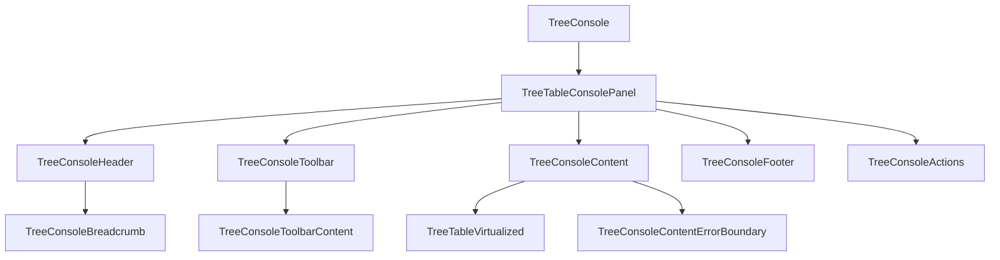
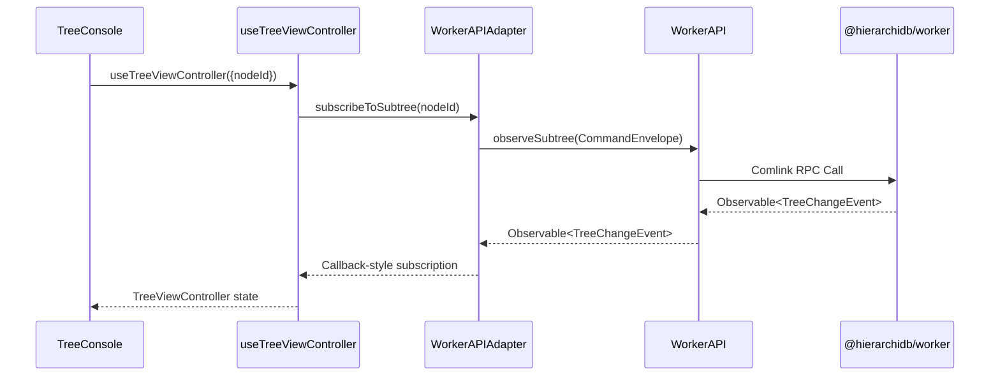
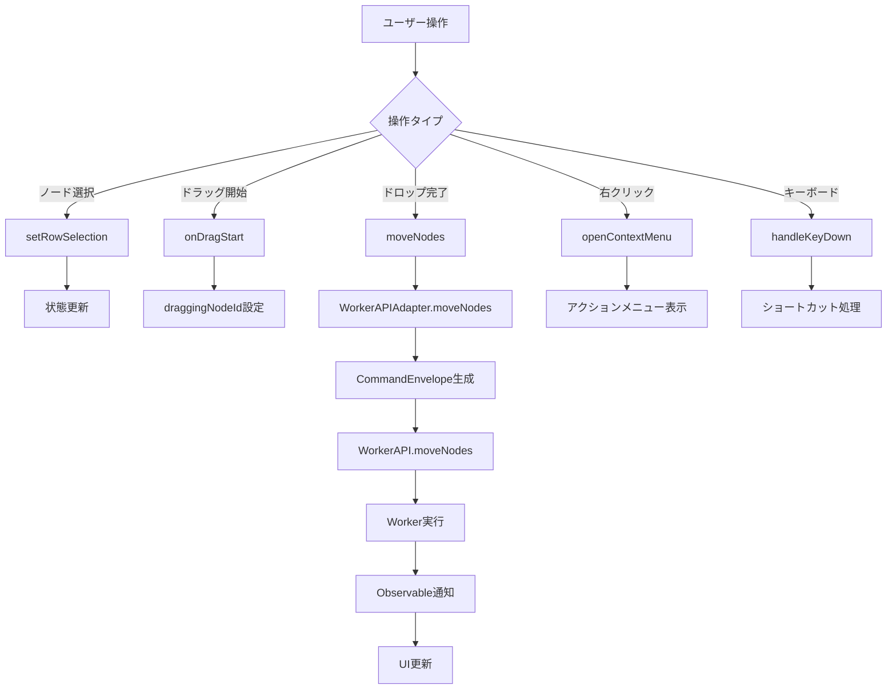
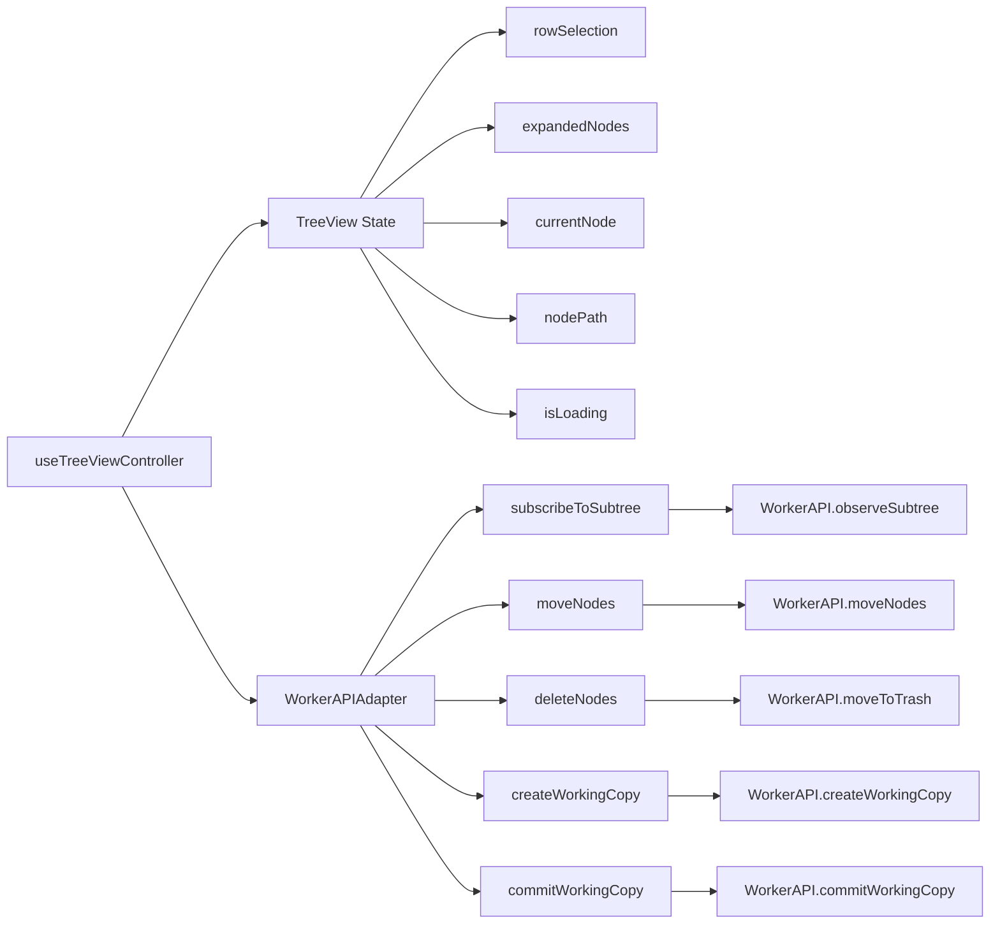
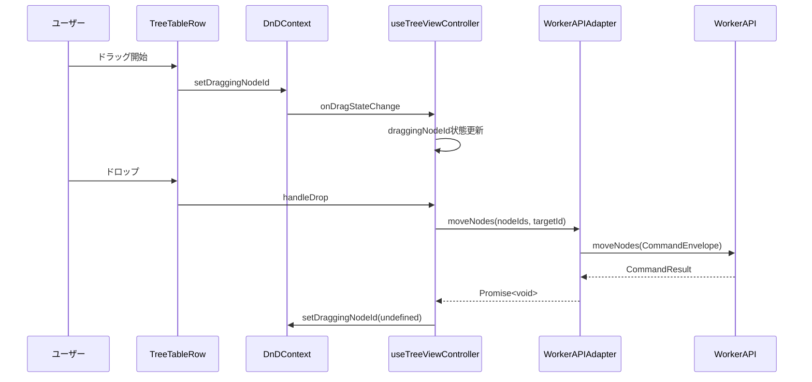
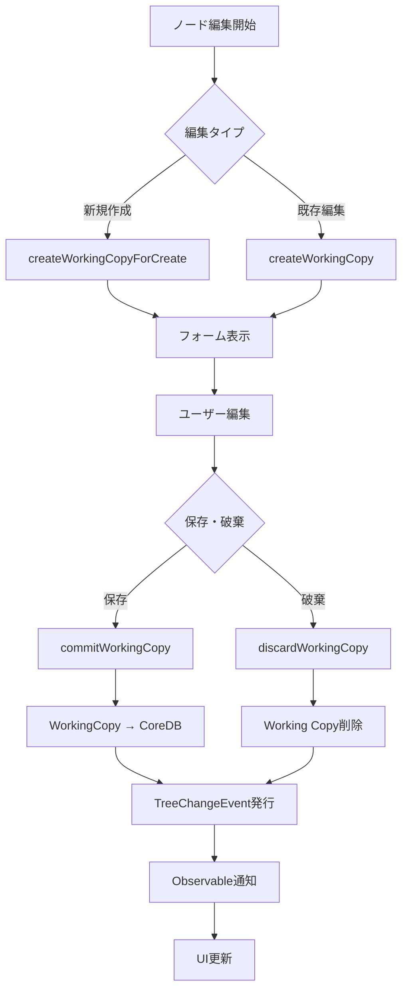
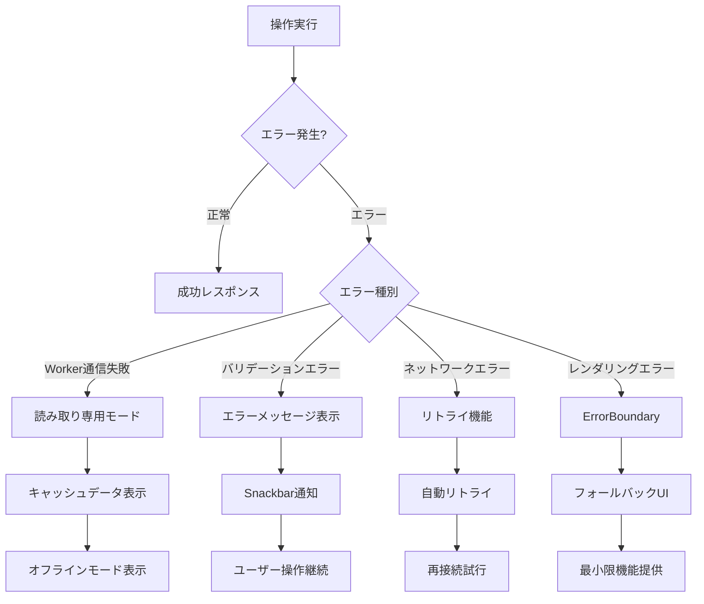
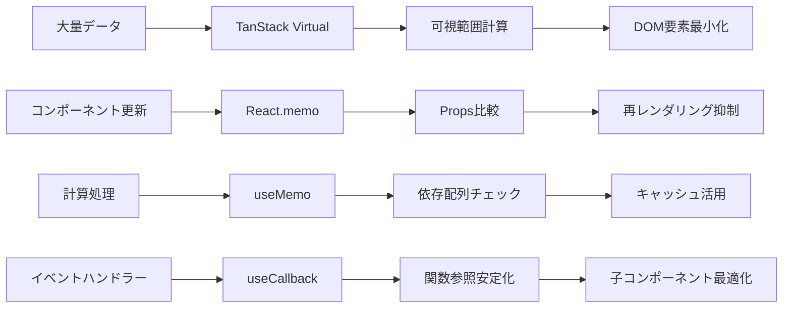

# TreeConsole Migration データフロー図

## 🟢 データフロー概要

TreeConsoleの移植において、既存のデータフロー構造を維持しながら、新しいWorkerAPIとの適合を図る。

**信頼性レベル**: 🟢 青信号 - 既存実装のデータフローを参考

## 🟢 1. コンポーネント階層フロー

既存TreeConsoleのコンポーネント構造をそのまま移植

## 🟡 2. データ取得フロー（API適合）

新しいWorkerAPIとの適合レイヤーを通じたデータ取得

**信頼性レベル**: 🟡 黄信号 - 新旧API差異の変換

## 🟢 3. ユーザー操作フロー

既存の操作フローを維持

**信頼性レベル**: 🟢 青信号 - 既存実装の操作フローを移植

## 🟡 4. 状態管理フロー

既存のuseTreeViewControllerを中心とした状態管理

**信頼性レベル**: 🟡 黄信号 - APIアダプターによる適合が必要

## 🟢 5. Drag & Drop フロー

既存のreact-dndとDnDコンテキストを活用

**信頼性レベル**: 🟢 青信号 - 既存DnD実装を移植

## 🟡 6. Working Copy パターンフロー

新しいWorkerAPIのWorking Copy機能への適合

**信頼性レベル**: 🟡 黄信号 - 新APIへの適合が必要

## 🟢 7. エラーハンドリングフロー

既存のエラーバウンダリーとエラーハンドリングを移植

**信頼性レベル**: 🟢 青信号 - REQ-104, EDGE-003に基づく既存実装

## 🟡 8. パフォーマンス最適化フロー

仮想化とメモ化による最適化

**信頼性レベル**: 🟡 黄信号 - NFR-001, NFR-002から推測

## 🟢 まとめ

このデータフローは既存TreeConsole実装を最大限活用し、WorkerAPIAdapterレイヤーで新旧APIの差異のみを吸収する設計です。ユーザー体験と既存の操作フローを維持しながら、新しいWorkerAPIの恩恵を受けることができます。