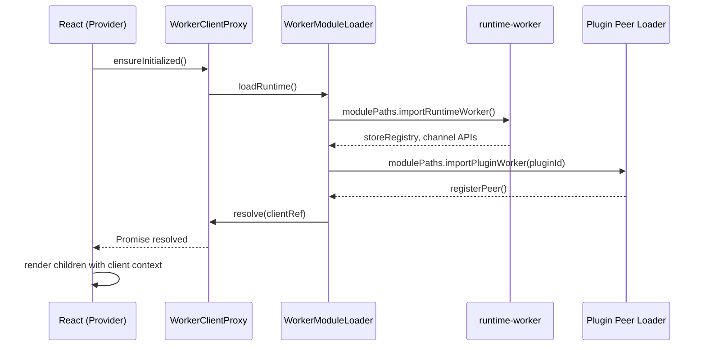
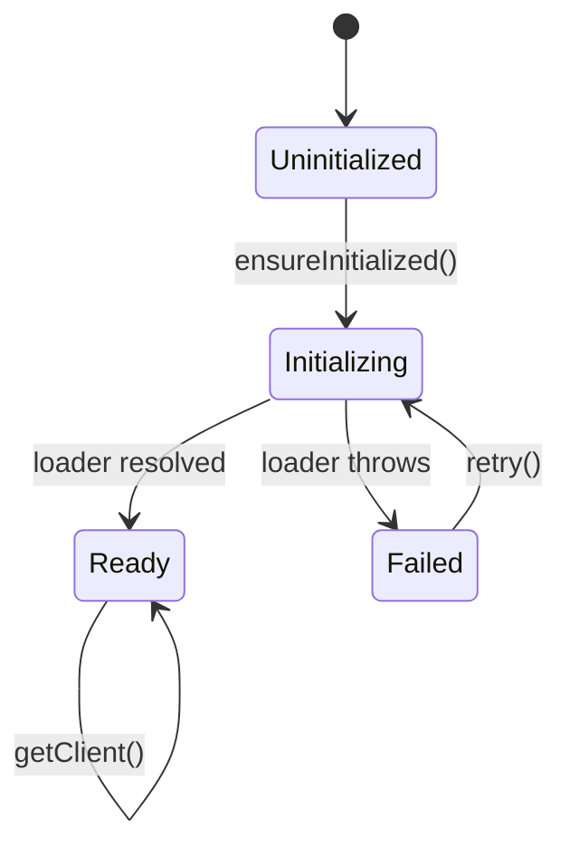
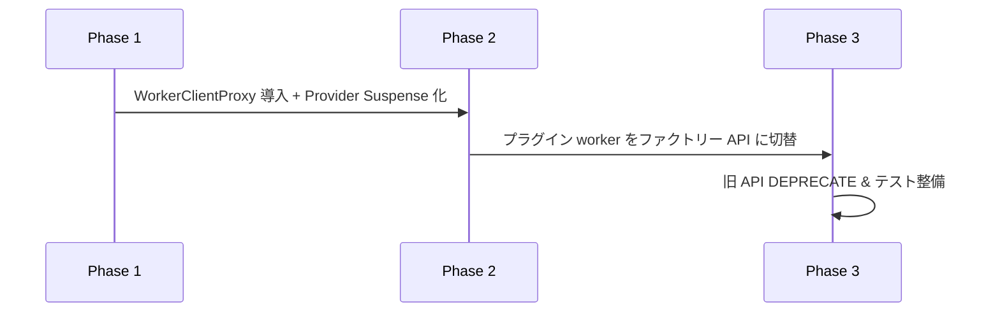
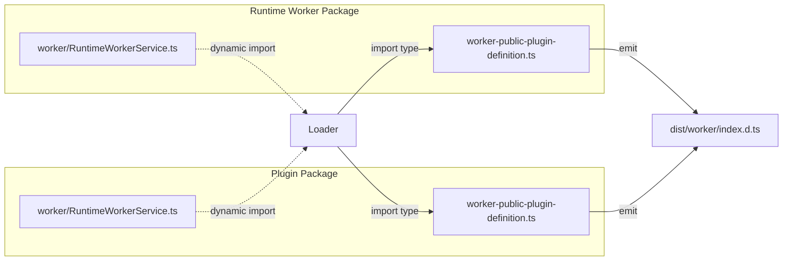
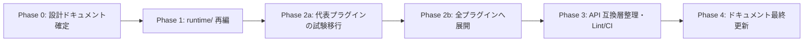

# Worker 動的 import 統一アーキテクチャ検討メモ

- **作成日**: 2025-09-24
- **作成者**: Codex CLI エージェント
- **対象スコープ**: `@hierarchidb/app`, `@hierarchidb/runtime-worker`, プラグイン各種 (`folder`, `resolver`, `styler`, `spreadsheet` など)
- **目的**: 現状 static/dynamic import が混在する Worker 読み込み経路を全面的に動的 import へ統一した場合のアーキテクチャ設計・初期化シーケンス・状態管理方針を整理する。

---

## 1. 背景と課題

- 現状は「起動時遅延ロードを狙う箇所で動的 import」を採用しつつ、同一モジュールを静的 import して再エクスポートする経路が並存しており、Vite から "dynamic import will not move module into another chunk" 警告が出力されている。
- WorkerAPIClient などは React コンポーネントから同期参照されることを前提に設計されており、完全な遅延読み込みを導入するにはコンテキスト全体の初期化フローを再構築する必要がある。
- 本設計では「*すべての Worker/クライアント取得を動的 import に統一*」した場合の構成を提示し、段階的移行ステップとリスクを洗い出す。

---

## 2. 現状アーキテクチャの概観（2025-09-30）

```mermaid
flowchart LR
    subgraph App Shell
        A[WorkerProvider.tsx]
        B[WorkerAPIClient.ts]
        C[InitInspector.tsx]
    end
    subgraph Runtime Worker Bundle
        W[storeRegistry]
        WDB[Dexie-based Entities DB]
    end
    subgraph Plugin Worker Entrypoints
        PF[modulePaths.importPluginWorker('folder')]
        PR[modulePaths.importPluginWorker('resolver')]
        PS[modulePaths.importPluginWorker('styler')]
        PSp[modulePaths.importPluginWorker('spreadsheet')]
    end

    A -->|static import| B
    C -->|dynamic import| B
    C -->|dynamic import| client.ts
    B -->|dynamic import| runtime-client
    PF -->|modulePaths| runtime-worker
    PF -->|modulePaths| folderEntitiesDB
    PR -->|modulePaths| runtime-worker
    PR -->|modulePaths| resolverEntitiesDB
    PS -->|modulePaths| runtime-worker
    PS -->|modulePaths| stylerEntitiesDB
    B -->|cached instance| W
    PF -->|register peer| W
```

- `@hierarchidb/runtime-shared-module-paths` が `importRuntimeWorker` / `importPluginWorker` を提供し、アプリ側が直接 `*/worker` サブパスへ触れずに済む構成へ移行済み。
- WorkerProvider は `WorkerModuleLoader.ensureWorkerRuntime()` を通じて `WorkerBridge` へクライアント参照を提供し、初回は React Suspense / fallback で待ち合わせる。

---

## 3. 動的 import 統一の要件

1. **Lazy & Async 初期化**: Worker API / Dexie DB は初期描画をブロックせず非同期に初期化される。
2. **参照整合性**: 既存 API (`WorkerAPIClient.getSingleton()` など) を利用する側が非同期初期化を認識しなくてもよい仕組みを提供する。
3. **Chunk 分離**: Vite が Worker 依存モジュールを別チャンクへ配置できる状態を確保する。
4. **テスト互換性**: Vitest や SSR での実行時に副作用がないようにガードし、必要に応じて Polyfill を適用する。

---

## 4. 提案アーキテクチャ概要

### 4.1 モジュール構成

```mermaid
flowchart TD
    App[Application entry (React)] --> Provider[WorkerRuntimeProvider]
    Provider --> ClientProxy[WorkerClientProxy]
    ClientProxy --> Loader[WorkerModuleLoader]
    Loader -->|modulePaths.importRuntimeWorker()| runtimeWorker[@hierarchidb/runtime-worker]
    Loader -->|modulePaths.importPluginWorker(id)| PluginRegistries
    Loader --> StateHub[WorkerStateStore]

    subgraph PluginRegistries
        folder[folder peer loader]
        resolver[resolver peer loader]
        styler[styler peer loader]
        spreadsheet[spreadsheet peer loader]
    end

    StateHub --> SuspenseBoundary[React Suspense/State]
```

- **WorkerRuntimeProvider**: React Context Provider。初期レンダリングでは非同期初期化を `Suspense` + `fallback` で待機。
- **WorkerClientProxy**: `getClient()` / `ensureInitialized()` などの非同期 API を提供し、クライアントコードは常に Promise を介してアクセスする。
- **WorkerModuleLoader**: `@hierarchidb/runtime-shared-module-paths` の `importRuntimeWorker` / `importPluginWorker` を仲介し、モジュールキャッシュとプラグイン登録の非同期処理を集約。
- **WorkerStateStore**: 状態マシン (未初期化 → 初期化中 → 利用可能 → エラー) を管理する軽量なストア。2025-09-25 時点で `app/src/worker-runtime/WorkerStateStore.ts` として実装済みで、`WorkerClientProxy` / hooks から利用。

### 4.2 初期化シーケンス



- `modulePaths` は `@hierarchidb/runtime-shared-module-paths` が提供するモジュール解決マニフェストを指す。

### 4.3 状態管理 (State Machine)



- `WorkerStateStore` はこのステートマシンを保持し、リスナー (React hook など) に状態変化を通知する。
- 既存の `WorkerInitializationChannel` イベントも `Ready` 遷移時に発火させることで後方互換性を確保。

---

## 5. API 変更案

### 5.1 WorkerClientProxy
```ts
export interface WorkerClientProxy {
  ensureInitialized(opts?: { signal?: AbortSignal }): Promise<WorkerClientRef>;
  getCachedClient(): WorkerClientRef | null;
  getState(): WorkerRuntimeState; // 'uninitialized' | 'initializing' | 'ready' | 'failed'
  subscribe(listener: (state: WorkerRuntimeState) => void): () => void;
}
```
- 既存 `WorkerAPIClient` は `WorkerClientProxy` のラッパーとして残し、同期 API を呼び出すと内部で `ensureInitialized()` を走らせる。

### 5.2 React Hook / Provider
```tsx
export const WorkerRuntimeProvider: React.FC<{ children: ReactNode }> = ({ children }) => {
  const proxy = useMemo(() => createWorkerClientProxy(), []);
  const state = useWorkerRuntimeState(proxy);
  if (state === 'failed') return <ErrorOverlay onRetry={proxy.retry} />;
  return (
    <WorkerContext.Provider value={proxy}>
      <Suspense fallback={<WorkerBootOverlay />}>
        <WorkerInitializer proxy={proxy}>{children}</WorkerInitializer>
      </Suspense>
    </WorkerContext.Provider>
  );
};
```
- `WorkerInitializer` コンポーネントが `ensureInitialized()` を `Suspense` 内で呼び出し、子孫は常に初期化済みの状態でレンダリングされる。

---

## 6. プラグイン側の対応

### 6.1 参照方式の統一
- 各プラグインの `src/worker/factory/` にファクトリー関数を集約し、`register<Plugin>WorkerStores`/`load<Plugin>EntitiesDbModule` のような API を提供する。
- 例: `packages/plugins/styler-plugin/src/worker/factory/registerStylerWorkerStores.ts`
  ```ts
  export async function registerStylerWorkerStores({ storeRegistry }: RegisterStylerWorkerStoresOptions = {}) {
    if (!storeRegistry) return;
    const { createNodePayloadPeerStore } = await import('@hierarchidb/runtime-worker');
    if (!storeRegistry.getPeer('styler')) {
      storeRegistry.registerPeer(
        'styler',
        createNodePayloadPeerStore({
          normalize: (data) => normalizeStylerPeerData(data ?? undefined),
        })
      );
    }
    // groupEntities/relations が必要な場合はここで Dexie DB を開き、registerGroup/registerRelations を呼び出す
  }
  ```
- `WorkerModuleLoader` は上記ファクトリー関数を `modulePaths.importPluginWorker('styler')` で取得し、実行時に呼び出す。

### 6.2 型定義
- `dist/worker/index.d.ts` は再エクスポートから関数エクスポートへ更新する必要がある（modulePaths からの import を前提とした公開面に揃える）。
- `PeerStore` や `EntitiesDB` を直接 import するテストは、必要に応じて `load...` ファクトリー内部で `return { StylerEntitiesDB }` のように公開する。

---

## 7. 段階的移行ステップ



1. **Phase 1**: `WorkerClientProxy` と `WorkerRuntimeProvider` を導入し、既存 `WorkerAPIClient` の内部実装を移行。しかし外部 API は変えない (既存コードは動作)。
2. **Phase 2**: プラグイン worker のエクスポートをファクトリー方式に変更。アプリ側は新 API を用いて初期化。旧再エクスポートは deprecation アナウンス後に削除。
3. **Phase 3**: 旧 API を削除し、完全に動的 import 統一。テスト/SSR/ビルド時の警告解消を確認。

---

## 8. リスクと緩和策

| リスク | 内容 | 緩和策 |
| --- | --- | --- |
| 初期化遅延による UX 低下 | Suspense Fallback が長時間表示される可能性 | Fallback UI の設計、プログレッシブ初期化、キャッシュ化 |
| 既存 API 互換性 | 同期 API 依存コードが多い | Proxy 層で同期 API をラップし、初期移行では Promise を内部で待機する |
| テスト破損 | テストでの同期呼び出しが Promise を返し意図せず失敗 | `ensureInitialized()` をテストヘルパーで await するユーティリティを提供 |
| Chunk 分割失敗 | 適切に module boundary を設計しないと再び混在警告が出る | ファクトリー関数の export だけを公開し、直接クラスを再エクスポートしない |

---

## 9. TypeScript 型情報の扱い

動的 import に統一しても、型安全性を犠牲にせずに開発体験を維持するための方針を下記に整理する。

### 9.1 型配布の原則

1. **型定義は引き続き静的に配布**する。
   - 各パッケージ (`@hierarchidb/runtime-worker` やプラグイン) の `types` エントリで公開している `dist/*.d.ts` はこれまでどおりビルド時に生成し、npm へ配布する。
   - 実装を遅延ロードするだけで、型情報はコンパイル時に解決できるよう維持する。

2. **実装取得ラッパーと型の橋渡し**
   - `loadStylerWorkerPeer` などのファクトリー関数は戻り値の型を明示し、`import type` で静的な型定義を参照する。
- 例: `type StylerWorkerModule = typeof import('@hierarchidb/styler-plugin/worker');` のように公開ファクトリを参照し、実装は `modulePaths.importPluginWorker('styler')` で取得する。

3. **API Contract の分離**
   - ランタイム側に `worker-public-plugin-definition.ts` (純粋に型のみを export) を新設し、`index.d.ts` から再エクスポートする。
   - 実装を動的 import するときは `import type { StylerWorkerFactoryModule } from '@hierarchidb/styler-plugin/worker-types';` → `const mod: StylerWorkerFactoryModule = await import(...)` のように `as` でキャストせず型安全に取得する。

4. **Caller 側ユーティリティ**
   - `WorkerClientProxy.ensureInitialized()` の戻り値型は `Promise<WorkerClientRef>` で固定し、`WorkerClientRef` は `@hierarchidb/ui-worker-client` の型を静的に参照する。呼び出し側で `await` すれば `any` を介さず利用できる。
   - `Suspense` 内で `useAsyncValue<WorkerClientRef>()` のような Hook を用意すると、JSX 内でも型推論が効く。

### 9.2 型専用パッケージ／モジュール構成案



- `worker-public-plugin-definition.ts` は実装が参照しやすいよう `export type { ... }` のみを含める。
- `tsup` / `tsc` で `.d.ts` を生成し、実装と型のエントリポイントを分けることで静的な型解決を可能にする。

### 9.3 any を避けるための実装例

```ts
// @hierarchidb/runtime-worker-worker-loader.ts
import type { StoreRegistry, WorkerClientRef } from '@hierarchidb/runtime-worker/types';
import type { WorkerPeerLoader } from '@hierarchidb/plugin-loader-styler-plugin/worker-types';

export async function loadWorkerRuntime(): Promise<WorkerClientRef> {
  const runtimeMod = await import('@hierarchidb/runtime-worker');
  const storeRegistry: StoreRegistry = runtimeMod.storeRegistry;

  const stylerPeerMod = await import('@hierarchidb/styler-plugin/worker');
  const loadStylerPeer = stylerPeerMod.loadStylerWorkerPeer as WorkerPeerLoader;
  await loadStylerPeer(storeRegistry);

  return runtimeMod.getWorkerClientRef();
}
```

- `as` による広義キャストを避けるため、ファクトリー関数の戻り値を型インターフェースで縛る。
- 実装と型のモジュールを分離していても、`import type` により TypeScript は静的に型を解決できる。

### 9.4 型生成ワークフロー

1. 各パッケージは従来どおり `tsup` / `tsc` で `dist/*.d.ts` を生成。
2. `worker-public-plugin-definition.ts` を `types` エントリから公開。
3. 依存パッケージは `import type` を使用し、実装は `await import` で取得。
4. 動的 import の戻り値に明示的な型アノテーションを付与し、`any` の発生を防止。

### 9.5 any / unknown キャストを避けづらい具体例

以下は現行コードベースでブランド型や外部ライブラリの制約により `unknown` からの Narrowing、あるいは限定的な `as any` が残っている箇所の代表例である。動的 import 統一後も、これらの扱い方針を踏襲する想定。

| パッケージ | ファイル / 型 | 目的・理由 | 現行のキャスト | 備考 |
| --- | --- | --- | --- | --- |
| `@hierarchidb/runtime-worker` | `worker/src/services/StageProcessingService.ts` 内 `loadGeojsonVt` / `loadVtPbf` | CommonJS/UMD モジュール (`geojson-vt`, `vt-pbf`) を ESM から動的 import し、`default` 有無が環境でブレる | `const candidate = mod as unknown as { default?: GeojsonVtModule } & GeojsonVtModule;` | 型定義をラップする補助型 `GeojsonVtModule` を用意し、`unknown` → intersection で Narrowing。`any` 不使用。 |
| `@hierarchidb/runtime-worker` | `worker/src/services/command/history/CommandHistoryManager.ts` | コマンド実行結果をロギング用に正規化する際、型パラメータ `TResult` を保持できない | `result: this.sanitizeResultForLogging(result) as unknown as CommandResult` | dynamic import 化とは独立した課題。`CommandResult` へ Narrowing するため `unknown` を経由。 |
| `@hierarchidb/folder-plugin` | `src/worker/folderEntitiesDB.ts` の Dexie 継承 | Dexie のコンストラクタ typing がクラス継承と相性が悪く、`Dexie` 本体を派生クラスに割り当てられない | `const DexieBase = Dexie as unknown as DexieConstructor;` | Dexie v4 固有。型安全なラッパーを自前で定義するか、Dexie が公式に generics を公開するまでこの形。 |
| `@hierarchidb/folder-plugin` | `src/worker/RuntimeWorkerService.ts` | `Dexie` インスタンスに `open` が存在するかをランタイムで判定 | `const dexieLike = db as unknown as { open?: () => Promise<unknown> };` | `Dexie` が `open` を optional で公開していないため型上は `never` になる。再型定義で吸収可。 |
| `@hierarchidb/spreadsheet-plugin` | `src/database/SpreadsheetDatabase.ts` (`crypto.randomUUID`) | ブランド型 `NodeId` に変換するため | `const entityId = crypto.randomUUID() as unknown as NodeId;` | `NodeId` は `string & { __brand: 'NodeId' }` 形式。ファクトリー関数を用意すれば置き換え可。 |
| `@hierarchidb/spreadsheet-plugin` | `src/services/SpreadsheetTabularDriver.ts` / `SpreadsheetCSVApiAdapter.ts` | tabular ドライバが File API の代替インターフェイスを受け取るため | `file as unknown as FileLike`、`... as unknown as CSVTableMetadata` | input/output を共通 DTO に変換するラッパーを用意すると `unknown` なしで済む。 |
| `@hierarchidb/resolver-plugin` | `src/handlers/ResolverEntityHandler.ts` | `crypto.randomUUID()` → `NodeId` ブランド化 | `crypto.randomUUID() as unknown as NodeId` | 上記と同様。 |
| `@hierarchidb/ui-worker-client` | シリアライズ対象 | Worker チャネル越しに送るメッセージは JSON 互換 (`unknown`) として扱い、受信側で `zod` スキーマによる Narrowing を計画 | `Envelope['payload']` は `unknown` | 動的 import 後も `z.infer` で確定させる想定。 |

> **対応方針**: いずれの箇所も `any` の常態化は避け、ブランド型変換や外部ライブラリ境界で `unknown` → 安全な Narrowing を行う。必要に応じて `zod` などのスキーマで構造を保証し、`eslint` の `no-explicit-any` を維持する。

---

## 10. テスト戦略

---

## 10. テスト戦略

- **ユニットテスト**: `WorkerClientProxy` の状態遷移、リトライロジックを `vitest` で検証。
- **統合テスト**: `app` 側で `WorkerRuntimeProvider` をマウントし、Suspense fallback → Ready への遷移を確認する UI テストを追加。
- **E2E**: Playwright で実際に worker 通信が行われるシナリオ (データ読み込み、プラグイン登録) をテスト。
- **SSR/Node テスト**: `ensureInitialized()` を呼ばない環境で worker 依存コードが評価されないことを確認。

---

## 10. オープン課題 / 今後の検討

- `WorkerAPIClient` の公開 API 互換性をどこまで維持するか (同期メソッドを残すのか、完全に非同期 API に統一するのか)。
- 初期化完了前に依存している UI (例: TreeConsole) のローディング UX 改善案。
- プラグインごとの遅延ロード順序制御 (優先順位、並列ロード戦略)。
- ビルド環境ごと (Vite / tsup / SSR) に必要な polyfill や alias 設定の再確認。

---

## 11. まとめ

- 動的 import 統一には **Provider/Proxy/Loader/StateStore** の再設計が不可欠。
- プラグイン側の API 変更も伴うため、**段階的移行計画** と既存コードへの互換層が鍵となる。
- 本ドキュメントは設計案であり、実装にあたっては Phase 別のチケット分割・影響調査が必要。

---

## 12. 作業手順と注意事項

以下は、実際にリファクタリングを進める際のフェーズ分割・手順・注意点をまとめたチェックリストである。作業前に必ず読み合わせし、必要に応じて更新すること。

### 12.1 フェーズ概要



### 12.2 Phase 0 – 準備
- [ ] 本ドキュメントと `TASKS.md` の該当タスクを最新化し、レビューを受ける
- [ ] メインブランチとの差分を把握し、並行作業とのコンフリクトリスクを共有
- [ ] ESLint/tsconfig のルール（旧パス検出など）を先行整備するかどうか検討

### 12.3 Phase 1 – `runtime/` 再編
- [x] `packages/runtime-worker` を `packages/runtime/worker` などへ移動し、`package.json` と `exports` を更新
- [x] `app/src` での import パスを仮移行し、`pnpm --filter @hierarchidb/app typecheck` を実行
- [x] `pnpm --filter @hierarchidb/runtime-worker typecheck` を実行し、移動後もグリーンであることを確認
- [x] この段階ではプラグインには手を付けない（分割の影響範囲を限定）

進捗ログ（Phase 1）
- 2025-09-25: `packages/runtime-worker/worker*` を `packages/runtime/worker` / `packages/runtime/worker-bootstrap` へ移行し、ESLint / Vitest / tsconfig / Vite / pnpm-lock を新パスへ更新
- 2025-09-26: Phase 1 の移行後点検として `pnpm --filter @hierarchidb/runtime-worker typecheck` / `pnpm --filter @hierarchidb/ui-worker-client typecheck` / `pnpm -C app typecheck` を再実行し、`docs/design/worker-dynamic-import-architecture.md` と `TASKS.md` に検証結果を反映

### 12.4 Phase 2a – 代表プラグインでの試験移行
- [ ] 1〜2 個のプラグイン（例: folder, resolver）を `ui-static` / `ui-dynamic` / `worker-factory` / `types` へ再配置
- [ ] `package.json` の `exports` と `types` フィールドを更新し、`pnpm --filter @hierarchidb/folder-plugin typecheck` などを実行
- [ ] Worker 登録ファクトリ（`worker-factory/*`）が正しく Comlink 経由で呼ばれるかを確認
- [ ] 動的 import の戻り値に型エイリアスを付与し、`any` を発生させないこと

進捗ログ（Phase 2a）
- 2025-09-25: folder / resolver プラグインの `worker/RuntimeWorkerService.ts` をファクトリー方式へ更新し、`register<Plugin>WorkerStores` をエクスポート。`WorkerModuleLoader` から `storeRegistry` を渡して呼び出す仕組みに変更し、`pnpm --filter @hierarchidb/{folder,resolver}-plugin build`・`pnpm --filter @hierarchidb/app build` が成功

### 12.5 Phase 2b – 全プラグインへ展開
- [ ] Phase 2a の手順をテンプレート化し、全プラグインで同様の再配置を行う
- [ ] `pnpm -r typecheck` / `pnpm -r lint` を実行し、警告・エラーがないかを確認
- [ ] 旧ディレクトリ構成での import を検出する ESLint ルールがある場合は、この段階で有効化

進捗ログ（Phase 2b）
- 2025-09-25: basemap / route / spreadsheet / styler プラグインを `worker-factory` 構成へ移行し、`register*WorkerStores` を標準化。`WorkerModuleLoader` 側も該当 `register` 関数を順次呼び出すよう更新
- 2025-09-25: shape プラグインを同テンプレートへ展開し、`worker/RuntimeWorkerService.ts` を薄い re-export 化。`pnpm --filter @hierarchidb/shape-plugin typecheck` は成功するが、Dexie 4.x の型互換問題で `pnpm build` の DTS バンドルが失敗（`ShapeEntitiesDB` 継承で constructor/`version` が検出されない）。要対応メモとして残す
- 2025-09-25: Dexie 4.x の型差異に `tsup.base.config.ts` の `esModuleInterop` 追記と `shapeEntitiesDB.ts` の named import 変更で対処。`pnpm --filter @hierarchidb/shape-plugin build` が成功することを確認
- 2025-09-25: `register*WorkerStores.ts` に `vite/client` 型参照を付与し、`tsconfig.base.json` に `@hierarchidb/runtime-worker` のパスエイリアスを追加。`pnpm --filter @hierarchidb/app build` は WARN のみ（動的 import 既知警告）で通過
- 2025-09-30: Phase 2b 再開にあたり `pnpm -w lint` / `pnpm -r typecheck` を実行し、ESLint の旧 `worker` パス禁止ルールと monorepo 全体の型チェックがグリーンであることを確認

### 12.6 Phase 3 – 互換層整理と CI 強化
- [ ] 旧 API を参照しているコードが残っていないかを検索し、必要に応じて互換ラッパーを削除
- [ ] `eslint --rule '@typescript-eslint/no-restricted-imports'` で旧パスを禁止する設定を追加
- [ ] CI 上で `pnpm turbo run typecheck lint test` を全体実行し、安定性を確認

### 12.7 Phase 4 – ドキュメント更新
- [ ] `docs/design/worker-dynamic-import-architecture.md` を最新状態に反映し、最終版としてレビュー
- [ ] 開発者ガイド (`docs/developer-guidelines.md` 等) に新しい構成と作業手順を追記
- [ ] `TASKS.md` の該当タスクを Done に移し、実施内容をまとめて記録

### 12.8 作業時の注意事項
- **中断可能な単位でコミット**: 各 Phase/サブタスクごとにコミットを分け、途中で中断しても戻しやすいようにする
- **テストと型チェックをセットで実行**: ディレクトリ移動後は必ず `typecheck` と `test` を両方実施。片方だけだと import 破損を見落とす恐れがある
- **ドキュメント更新を忘れない**: フォルダ構成や import パスが変わるたびに README/手順書を更新し、レビューを受ける
- **旧 API への参照検出**: Git grep や ESLint (`no-restricted-imports`) で旧パス (`packages/plugins/.../src`) が残っていないかチェックする
- **リリースノート / 影響範囲の整理**: 利用チームへ影響がある場合は、リリースノートやコミュニケーションを事前に準備

---

このチェックリストは作業中も適宜更新し、常に最新のフローを参照できるよう維持すること。
