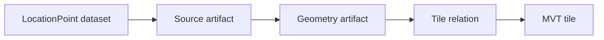

# Location MVT Pipeline Design

本書は LocationPoint SSOT から描画用 MVT を生成する正規契約を定義する。`docs/location-plugin-design.md` が UI と plugin 全体の入口であり、本書は MVT pipeline、artifact、cache、cleanup、MapLibre 連携の詳細を補足する。

## 正規判断

- LocationPoint は metadata、検索、route endpoint 参照、hover/click detail の SSOT である。
- MVT は MapLibre 描画と画像生成 runner のための派生成果物である。
- MVT は削除・再生成可能であり、MVT から LocationPoint や arbitrary metadata を復元してはならない。
- 正規 stage は `source -> geometry -> tileEmit` である。
- Location の `geometry` stage は座標変形の no-op stage ではない。zoom-band ごとの LOD 選別、Point artifact 生成、tile relation 計画を担当する。

## 責務分離

| 領域 | SSOT / 派生 | 責務 | 禁止 |
| --- | --- | --- | --- |
| `LocationPoint` | SSOT | point identity、座標、kind、country、Morton index、render classification、完全 metadata | MVT decode 結果で補正しない |
| Tabular metadata DB | SSOT adjunct | 任意 metadata の表形式 query と virtual table 表示 | MVT feature properties へ全列複製しない |
| Geometry artifact | Derived | LOD 選別済み Point collection と tile relation 入力 | 欠落 classification を推測しない |
| MVT | Derived | MapLibre 表示と画像生成 runner 用の最小 property set | metadata/query の正規 source にしない |

## LocationPoint schema contract

LocationPoint は次の render classification を正規フィールドとして持つ。

| field | 型 | 範囲 / 契約 | owner |
| --- | --- | --- | --- |
| `renderRank` | integer | finite integer, `0 <= renderRank <= 65535`。小さいほど低 zoom で優先 | source parser または明示 classification step |
| `importance` | number | finite number, `0 <= importance <= 1` | source parser または明示 classification step |
| `iconKey` | string | 空でない sprite key | source parser または明示 mapping config |
| `labelClass` | string | 空でない label class key | source parser または明示 mapping config |
| `minZoom` | number | finite number, `0 <= minZoom <= 24` | source parser または明示 mapping config |

値の欠落、不正、範囲外は契約違反である。保存境界、geometry planning 境界、tileEmit 境界のいずれでも丸め、clamp、既定 rank への補完、arbitrary `metadata` からの推測で処理継続してはならない。

render classification は LocationPoint 本体に保持する。別 artifact に分離しない理由は次の通り。

- hover/detail、viewport query、route endpoint 参照が同じ point identity を読むため、render eligibility も同じ record で検証できる。
- MVT cache identity は LocationPoint dataset hash と LOD config を比較すればよく、classification artifact の独立 version を追加しない。
- source parser や mapping config の変更は LocationPoint dataset hash を変化させ、downstream cleanup を一貫して起動できる。

## Stage contract

### source stage

入力:

- completed Location build payload
- data source id
- selected countries and location types
- parser / schema version
- render classification mapping config

出力:

- `LocationPoint` records
- Morton index
- tabular metadata rows
- source artifact summary with dataset hash

タスク粒度:

- data source × country × location type を基本単位とする。
- 1つの CSV が複数 type を含む場合は、parser が type ごとの deterministic partition key を生成する。

失敗条件:

- build payload の必須値欠落、不正型、範囲外。
- data source strategy 未登録、endpoint 欠落、network/auth 失敗、response shape 違反。
- 必須列欠落または数値変換失敗により全行が skip ではなく parser contract 違反となる data source。
- render classification 欠落、不正、範囲外。
- `pointId` が空、重複解決不能、または同一 `pointId` に異なる座標が矛盾して与えられる。

空結果:

- 正常に取得・解析できた結果が選択条件に一致せず 0 件になる場合だけ成功できる。
- 失敗を 0 件成功へ読み替えない。

### geometry stage

入力:

- source artifact summary
- LocationPoint dataset hash
- build-time LOD config
- source-layer name
- tile scheme and zoom range

出力:

- LOD 選別済み Point artifact
- tile relation plan
- geometry artifact metadata

タスク粒度:

- zoom band × tile range shard × location type を基本単位とする。
- task は対象 Point 集合、LOD threshold、tile coverage を explicit input として持つ。

処理:

1. LocationPoint dataset hash と LOD config を検証する。
2. zoom band ごとに `type`, `renderRank`, `importance`, `minZoom` で収録対象を選別する。
3. 選別済み Point artifact を保存する。
4. `z/x/y` ごとの tile relation を計画する。

失敗条件:

- dataset hash、LOD config、tile scheme、source-layer の欠落または不正。
- LocationPoint の必須 render classification 欠落、不正、範囲外。
- bbox/tile id の範囲外。
- tile relation が source artifact と同一 nodeId に所有されない。

### tileEmit stage

入力:

- geometry artifact
- tile relation
- encoder version
- source-layer `location_points`
- MVT property schema

出力:

- vector tile records
- tile summary
- read-back validation result

タスク粒度:

- `z/x/y` tile を基本単位とする。
- empty tile も tile relation によって処理対象として明示される。

処理:

1. geometry artifact から対象 Point を読む。
2. MVT feature property allowlist に射影する。
3. source-layer `location_points` で encode する。
4. encode 後の tile を read-back し、layer 名、feature id、property 型、feature count を検証する。
5. empty tile は valid empty artifact として記録する。

失敗条件:

- source-layer が `location_points` ではない。
- feature property が schema に一致しない。
- arbitrary metadata が混入している。
- corrupt tile、read-back 不一致、encoder 例外。
- 欠落 classification を tileEmit が推測しようとする入力。

absent tile と empty tile:

- absent tile は artifact が存在せず、cache miss として再生成対象である。
- empty tile は valid artifact であり、feature count 0 の read-back validation を持つ。
- corrupt tile を empty tile へ読み替えない。

## MVT source-layer and property schema

source-layer は必ず `location_points` とする。

| property | 必須 | 型 | 制約 |
| --- | --- | --- | --- |
| `pointId` | yes | string | 空でない。feature id と同一値 |
| `type` | yes | string | LocationType key |
| `name` | yes | string | 空でない。label 用 |
| `countryCode` | yes | string | uppercase ISO 3166-1 alpha-2 |
| `renderRank` | yes | integer | `0..65535` |
| `importance` | yes | number | `0..1` |
| `iconKey` | yes | string | 空でない sprite key |
| `labelClass` | yes | string | 空でない label class key |
| `minZoom` | yes | number | `0..24` |

MVT は hover/detail panel のための完全 metadata を持たない。detail は `pointId` で `LocationQueryAPI` を呼び、LocationPoint / tabular metadata から取得する。

## LOD contract

### Build-time LOD

Build-time LOD は MVT 収録対象を減らすための契約である。

入力 schema:

- `zoomBands[]`
  - `id`: 空でない string
  - `minZoom`: finite number
  - `maxZoom`: finite number, `minZoom <= maxZoom`
  - `types[]`: LocationType key
  - `maxRenderRank?`: integer
  - `minImportance?`: number

`maxRenderRank` と `minImportance` の両方を指定した場合は AND 条件とする。どちらも欠落した band は無制限を意味せず、契約違反として失敗する。

例:

| zoom band | 収録対象 |
| --- | --- |
| `z0-4` | 首都、主要空港、主要港、主要駅 |
| `z5-8` | 地方中心、空港、港、主要駅 |
| `z9-12` | 駅、港、IC、都市 |
| `z13-16` | 詳細駅、港湾施設、IC、都市詳細 |

### Style-time LOD

Style-time LOD は既に MVT に含まれる feature の表示方法を MapLibre expression で制御する。

- `icon-image`: `iconKey`
- `icon-size`: zoom × `importance` × type config
- `text-field`: `name`
- `text-size`: zoom × `labelClass`
- `visibility`: zoom、`minZoom`、UI filter
- `opacity`: selection、hover、zoom band

style-time LOD は build-time LOD で除外済みの feature を復元できない。

## Cache identity

MVT cache identity は以下をすべて含む。

- `nodeId`
- Point dataset hash
- selection hash
- LOD config hash
- render classification schema version
- encoder version
- tile scheme
- source-layer `location_points`
- `z/x/y`

欠落値、legacy key、task payload の断片、現在時刻から cache identity を再構成してはならない。

## Lineage and cascade cleanup

依存方向:

cleanup trigger:

- source selection 変更
- data source content hash 変更
- parser / render classification schema version 変更
- LOD config 変更
- source-layer 変更
- encoder version 変更

削除順:

1. 対象 nodeId の MVT tile、tile summary、read-back validation を削除する。
2. tile relation を削除する。
3. geometry artifact を削除する。
4. source artifact を削除する。
5. source selection 変更または parser 結果変更を伴う場合だけ、対象 LocationPoint と tabular metadata を更新または削除する。

cleanup は下流から上流へ実行する。一部失敗を黙殺して session を継続してはならない。失敗時は task/session を `failed` に遷移させ、stale artifact を再利用不可とする。

## MapLibre and image runner contract

- MapLibre source は vector source とし、source-layer `location_points` を参照する。
- 標準 layer id は `location-points-circle`, `location-points-icon`, `location-points-label` とする。
- hover/click は rendered feature の `pointId` を `LocationQueryAPI.getPoint` へ渡す。
- detail panel と metadata table は MVT property だけで構築しない。
- 画像生成 runner の map ready 条件:
  1. style load 完了
  2. vector source 登録完了
  3. icon sprite 登録完了
  4. visible tile の load 完了
  5. target layer の初回 render 完了

ready 条件の欠落を timeout 成功や空画像成功へ読み替えない。

## Storage migration and rollback

LocationDB v1 から v2 への migration は additive とする。

- 既存 `features` table は保持し、保存済み LocationPoint record を読み替え・削除・再保存しない。
- `vectorTiles` table を追加し、key は `tileId`、lookup は `nodeId/z/x/y` の compound index とする。
- `vectorTiles` record は `tileId`, `nodeId`, `z`, `x`, `y`, `data`, `size`, `contentType`, `timestamp` を持つ。
- `tileId` は `nodeId-z-x-y` とし、`size` は `data.byteLength` と一致しなければならない。
- absent tile は query result `null` とする。record 破損、座標範囲外、content type 不一致、size 不一致は error とし、empty tile や GeoJSON query へ読み替えない。
- tile summary、read-back validation、tile relation は tileEmit pipeline の downstream artifact として扱い、導入時も MVT から LocationPoint metadata を復元しない。
- 既存 vector tile artifact がある場合は、その内容を SSOT として採用せず再生成対象にする。

rollback:

- feature flag OFF では旧 viewport GeoJSON path を一時的に使用できる。
- flag OFF は LocationPoint と metadata を保持し、MVT 派生成果物を無視する。
- flag OFF で契約違反データを受理してはならない。
- MVT store の削除は rollback の必須条件ではない。再度 flag ON にした場合は cache identity で再利用可否を判定する。

## 旧viewport GeoJSON pathの移行とrollback

旧 viewport GeoJSON path は historical / rollback surface であり、正規描画仕様ではない。

- 新規実装 Issue は MVT path を既定 OFF の feature flag で導入する。
- MVT path が ON の場合、MapLibre 描画は vector source を使う。
- MVT path が OFF の場合、旧 query-by-viewport GeoJSONSource を使用できるが、metadata/query SSOT は同じ LocationPoint である。
- 旧 path の存在を理由に MVT property schema、read-back validation、LOD 契約を緩めない。

## Build-session integration

Location は canonical build session の `source`, `geometry`, `tileEmit` を発行する。詳細は `docs/build-session-spec.md#location-stage-contract` と `docs/build-session-worker-ui-event-spec.md#location-event-examples` を参照する。

## Implementation issue anchor map

| Issue | 参照すべき section anchor | 用途 |
| --- | --- | --- |
| #1507 | `#locationpoint-schema-contract`, `#storage-migration-and-rollback`, `#cache-identity` | LocationPoint/render classification ownership と DB migration |
| #1508 | `#stage-contract`, `#mvt-source-layer-and-property-schema`, `#lineage-and-cascade-cleanup` | source/geometry/tileEmit 実装、artifact、cleanup |
| #1509 | `#lod-contract`, `#maplibre-and-image-runner-contract`, `#旧viewport-geojson-pathの移行とrollback` | MapLibre style、hover/query、画像生成 readiness、rollback |
