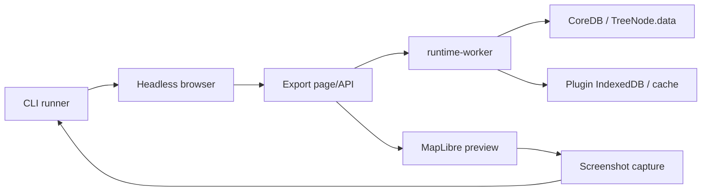

# Map Export Runner Execution Model

## 目的と対象範囲

本書は、地図画像生成 runner の初期実行モデルを定義する。対象は CLI entry point、browser runtime、runtime-worker、IndexedDB profile、MapLibre preview、screenshot capture の責務境界である。

本Issueの範囲は仕様定義に限定する。manifest parser、browser profile/cache policy、logging/error contract、export page/API の実装は後続Issueで扱う。

## 基本方針

地図画像生成 runner は CLI を入口にするが、build と render の実行本体は browser runtime に置く。CLI は job 定義の読み込み、browser 起動、export page への指示、screenshot/output の受け取りを担当し、HierarchiDB の build 処理や地図描画処理を Node.js 側に再実装しない。

## 責務境界

| Component | 責務 | 禁止事項 |
| --- | --- | --- |
| CLI runner | manifest path と runner option の受け取り、browser process/profile の準備、export page への job 投入、screenshot file の保存 | fetch/turf/tile generation/rendering engine を独自に持つこと |
| Headless browser | HierarchiDB app と同じ runtime 環境を起動し、IndexedDB、SharedWorker、MapLibre、Canvas/WebGL を提供する | Playwright Test spec を正規 runner 実装として扱うこと |
| Export page/API | job を検証済み browser command へ変換し、canonical build の開始、ready signal、capture trigger を調停する | plugin ごとの build shortcut や `draftData` fallback を追加すること |
| runtime-worker | canonical build session を開始し、shape/location/route の既存 build pipeline を実行する | input source を推測すること |
| IndexedDB profile | CoreDB、plugin DB、cache、artifact、session state を browser profile 内に保持する | 同一 profile で複数 export job を初期版から並列実行すること |
| MapLibre preview | 既存 UI と同じ MapLibre/deck/source adapter 経路で表示を確定する | Node.js canvas renderer へ置き換えること |
| Screenshot capture | browser が描画済み状態になった後に viewport 単位で画像を取得する | build 未完了や tile/source 未ready状態を成功画像として扱うこと |

## 入力境界

runner が投入する node 設定は、再現実行可能な committed payload でなければならない。canonical build start は `source='committed'` を明示し、`TreeNode.data` からだけ payload を読む。

- `draftData` は UI dialog の Working Copy 用であり、runner manifest の外部仕様に含めない。
- `TreeNode.data` が欠落、不完全、不正な場合に `draftData`、manifest default、plugin default で補完してはならない。
- shape/location/route の payload validation は各 plugin の canonical build API 境界で行う。
- 同一 payload の cache identity、auth-required、artifact reconcile、failure semantics は UI build と runner build で一致させる。
- route selection-driven build は、#1501 後の canonical payload 解決と同じく `tabularSourceId` / `selectedArrayByCountries` から正規 `routeBuildInput` を解決する。

## 実行モデル

1. CLI runner は manifest と option を読み、後続Issueで定義される typed validation を通過した job だけを browser へ渡す。
2. CLI runner は dedicated browser profile を選択し、export page を headless browser で開く。
3. Export page/API は job 内の node payload を CoreDB の committed slot へ作成または更新する。
4. Export page/API は runtime-worker の canonical build command を `inputSource='committed'` で呼び出す。
5. runtime-worker は既存の canonical build session と plugin pipeline を実行する。
6. Export page/API は build session の terminal success、必要な source/tile readiness、MapLibre の描画安定を確認する。
7. CLI runner は browser screenshot capability で画像を保存する。
8. いずれかの契約違反、build failure、render timeout、output write failure が発生した場合は、後続Issueで定義する typed error と exit code で失敗する。

## Headless browser control

初期版は Playwright Test spec ではなく、CLI runner から browser を直接制御する。Playwright は browser automation library として利用してよいが、test runner の lifecycle、retry、reporter、parallel worker を production runner contract に含めない。

理由:

- production CLI の stdout/stderr、exit code、JSON output contract を test runner の reporter と混在させない。
- browser profile、cache policy、job queue、output path を runner 側で明示的に所有する。
- UI と同じ runtime-worker / IndexedDB / MapLibre 実行環境を使いながら、batch job としての制御境界を保つ。

## 同一 profile 内の逐次実行

初期版では、同一 browser profile / IndexedDB profile 内の export job は逐次実行する。

- 同一 profile 内では CoreDB、plugin DB、build session state、MapLibre cache、browser storage が共有される。
- 複数 job の並列実行は nodeId、session state、cache cleanup、auth-required pause、MapLibre canvas capture の競合を生む。
- 並列化は profile 分離、job isolation、cache identity、output conflict policy が別Issueで確定してから導入する。

同一 manifest に複数 job がある場合、runner は deterministic order で 1 job ずつ実行する。前の job が失敗した場合に後続を継続するか停止するかは logging/error contract issue で定義する。

## Ready signal と capture boundary

screenshot は build 完了だけでは開始してはならない。Export page/API は少なくとも以下を満たした後に capture ready を返す。

- 対象 node の canonical build session が `completed` で終端している。
- 必要な layer/source/tile が MapLibre に登録済みである。
- MapLibre が対象 viewport、bbox、style、layer visibility を反映済みである。
- 未許可の browser console error、page error、runtime error が発生していない。
- canvas/WebGL context loss や tile loading timeout が発生していない。

ready signal の詳細schema、timeout、許容console warningは後続Issueで定義する。初期仕様として、ready 判定の欠落を sleep や固定待ち時間だけで成功扱いにしてはならない。

## 後続Issueとの接続

- #1530 は manifest JSON/YAML の syntax、job schema、node payload の `TreeNode.data` 境界を定義する。
- #1531 は browser profile、cache policy、profile cleanup、cache reuse/isolation の規則を定義する。
- #1532 は stdout/stderr、`--json` output、exit code、typed error source/category/code を定義する。
- #1533 は export page/API、ready signal、MapLibre screenshot capture boundary を実装する。

## Rollback

本仕様のみを導入する場合、rollback は本ファイルのrevertで完了する。実装Issueでは runner entry point を feature flag または未公開commandとして隔離し、既存 UI と canonical build 経路へ影響しないようにする。
