# Package Dependency Graph

Generated on: 2025-09-10T06:26:49.634Z

- Scope: workspace internal dependencies only
- Arrows point from depender → dependency
- Groups reflect top-level folders under `packages/` and `app/`
- Cycles detected: none

```mermaid
graph LR
  %% Node classes for highlighting
  classDef cyclic fill:#ffe5e5,stroke:#ff4d4f,stroke-width:2px;
  classDef app fill:#e6f7ff,stroke:#1890ff,stroke-width:1px;
  classDef appdep fill:#fff7e6,stroke:#fa8c16,stroke-width:1px;
  classDef plugin fill:#f6ffed,stroke:#52c41a,stroke-width:2px;
  subgraph backend
    N0["@hierarchidb/bff"]
    N1["@hierarchidb/cors-proxy"]
  end
  subgraph common
    N2["@hierarchidb/common-api"]
    N3["@hierarchidb/common-auth"]
    N4["@hierarchidb/common-type"]
  end
  subgraph feature
    N5["@hierarchidb/auth-recovery"]
    N6["@hierarchidb/batch"]
    N7["@hierarchidb/compute"]
    N8["@hierarchidb/download"]
    N9["@hierarchidb/feature-registry"]
    N10["@hierarchidb/import-export"]
    N11["@hierarchidb/map-source"]
    N12["@hierarchidb/map-adapter"]
    N13["@hierarchidb/route-resolver"]
    N14["@hierarchidb/route-searoute"]
    N15["@hierarchidb/table-metadata"]
    N16["@hierarchidb/tabular"]
    N17["@hierarchidb/tabular-store"]
    N18["@hierarchidb/tabular-xlsx"]
    N19["@hierarchidb/tag"]
  end
  subgraph node-type
    N20["@hierarchidb/base-plugin"]
    N21["@hierarchidb/basemap-plugin"]
    N22["@hierarchidb/folder-plugin"]
    N23["@hierarchidb/location-plugin"]
    N24["@hierarchidb/linker-plugin"]
    N25["@hierarchidb/resolver-plugin"]
    N26["@hierarchidb/route-plugin"]
    N27["@hierarchidb/shape-plugin"]
    N28["@hierarchidb/spreadsheet-plugin"]
    N29["@hierarchidb/styler-plugin"]
  end
  subgraph runtime-shared
    N30["@hierarchidb/runtime-shared-batch-processor"]
    N31["@hierarchidb/runtime-shared-fetch-metadata"]
  end
  subgraph runtime-ui
    N32["@hierarchidb/runtime-ui-appbar"]
    N33["@hierarchidb/runtime-ui-datasource"]
    N34["@hierarchidb/runtime-ui-landingpage"]
    N35["@hierarchidb/runtime-ui-plugin-dialog"]
    N36["@hierarchidb/runtime-ui-search-result-window"]
    N37["@hierarchidb/runtime-ui-tour"]
  end
  subgraph runtime-worker
    N38["@hierarchidb/runtime-worker"]
    N39["@hierarchidb/runtime-client"]
  end
  subgraph tools
    N40["@hierarchidb/analyze-licenses"]
    N41["@hierarchidb/tools-codemods"]
    N72["@hierarchidb/tools-build-scripts"]
    N73["@hierarchidb/tools-plugin-manifest-loader"]
    N74["@hierarchidb/tools-schemas"]
    N75["@hierarchidb/vite-plugin-hierarchidb-plugin-alias"]
  end
  subgraph ui
    N42["@hierarchidb/ui-accordion-config"]
    N43["@hierarchidb/ui-auth"]
    N44["@hierarchidb/ui-core"]
    N45["@hierarchidb/ui-country-select"]
    N46["@hierarchidb/ui-csv-extract"]
    N47["@hierarchidb/ui-data-grid"]
    N48["@hierarchidb/ui-date"]
    N49["@hierarchidb/ui-dialog"]
    N50["@hierarchidb/ui-file"]
    N51["@hierarchidb/ui-floating-window"]
    N52["@hierarchidb/ui-i18n"]
    N53["@hierarchidb/ui-import-export"]
    N54["@hierarchidb/ui-layout"]
    N55["@hierarchidb/ui-lru-splitview"]
    N56["@hierarchidb/ui-map"]
    N57["@hierarchidb/ui-monitoring"]
    N58["@hierarchidb/ui-navigation"]
    N59["@hierarchidb/ui-routing"]
    N60["@hierarchidb/ui-theme"]
    N61["@hierarchidb/ui-tour"]
    N62["@hierarchidb/ui-treeconsole-base"]
    N63["@hierarchidb/ui-treeconsole-breadcrumb"]
    N64["@hierarchidb/ui-treeconsole-footer"]
    N65["@hierarchidb/ui-treeconsole-speeddial"]
    N66["@hierarchidb/ui-treeconsole-toolbar"]
    N67["@hierarchidb/ui-treeconsole-trashbin"]
    N68["@hierarchidb/ui-treeconsole-treetable"]
    N69["@hierarchidb/ui-usermenu"]
  end
  subgraph util
    N70["@hierarchidb/util"]
  end
  subgraph app
    N71["@hierarchidb/app"]
  end
  N2 --> N4
  N3 --> N4
  N5 --> N3
  N5 --> N70
  N6 --> N7
  N7 --> N70
  N8 --> N70
  N10 --> N2
  N10 --> N4
  N10 --> N70
  N11 --> N70
  N12 --> N11
  N14 --> N8
  N15 --> N70
  N16 --> N4
  N16 --> N70
  N17 --> N15
  N17 --> N70
  N18 --> N16
  N19 --> N2
  N19 --> N4
  N19 --> N70
  N20 --> N4
  N21 --> N2
  N21 --> N4
  N21 --> N20
  N21 --> N22
  N21 --> N35
  N21 --> N44
  N21 --> N56
  N21 --> N70
  N22 --> N70
  N22 --> N19
  N22 --> N20
  N22 --> N2
  N22 --> N4
  N22 --> N35
  N22 --> N44
  N23 --> N70
  N23 --> N4
  N23 --> N2
  N23 --> N20
  N23 --> N44
  N23 --> N17
  N23 --> N35
  N23 --> N30
  N23 --> N5
  N23 --> N3
  N23 --> N27
  N23 --> N38
  N24 --> N20
  N24 --> N2
  N24 --> N4
  N24 --> N44
  N24 --> N35
  N24 --> N50
  N24 --> N56
  N24 --> N48
  N24 --> N70
  N25 --> N2
  N25 --> N4
  N25 --> N20
  N25 --> N70
  N25 --> N44
  N26 --> N5
  N26 --> N20
  N26 --> N6
  N26 --> N2
  N26 --> N4
  N26 --> N8
  N26 --> N27
  N26 --> N17
  N26 --> N44
  N26 --> N70
  N26 --> N30
  N27 --> N70
  N27 --> N5
  N27 --> N2
  N27 --> N3
  N27 --> N20
  N27 --> N17
  N27 --> N22
  N27 --> N33
  N27 --> N38
  N27 --> N31
  N27 --> N30
  N27 --> N42
  N27 --> N44
  N27 --> N45
  N27 --> N35
  N27 --> N55
  N27 --> N4
  N28 --> N2
  N28 --> N22
  N28 --> N44
  N28 --> N46
  N28 --> N15
  N28 --> N16
  N28 --> N5
  N28 --> N4
  N28 --> N70
  N29 --> N70
  N29 --> N15
  N29 --> N22
  N29 --> N44
  N29 --> N46
  N29 --> N4
  N30 --> N4
  N30 --> N8
  N30 --> N5
  N32 --> N4
  N32 --> N44
  N33 --> N31
  N35 --> N2
  N35 --> N4
  N35 --> N49
  N36 --> N4
  N36 --> N2
  N36 --> N51
  N36 --> N44
  N37 --> N61
  N38 --> N10
  N38 --> N19
  N38 --> N9
  N38 --> N16
  N38 --> N7
  N38 --> N6
  N38 --> N8
  N38 --> N11
  N38 --> N12
  N38 --> N5
  N38 --> N2
  N38 --> N4
  N38 --> N70
  N38 --> N30
  N38 --> N18
  N39 --> N4
  N39 --> N2
  N43 --> N44
  N43 --> N3
  N44 --> N70
  N44 --> N4
  N44 --> N47
  N44 --> N15
  N44 --> N17
  N46 --> N44
  N46 --> N50
  N49 --> N4
  N50 --> N44
  N50 --> N70
  N52 --> N48
  N53 --> N4
  N53 --> N2
  N54 --> N44
  N54 --> N60
  N57 --> N44
  N57 --> N70
  N58 --> N4
  N59 --> N44
  N60 --> N44
  N62 --> N4
  N62 --> N2
  N62 --> N63
  N62 --> N64
  N62 --> N65
  N62 --> N66
  N62 --> N67
  N62 --> N68
  N67 --> N63
  N68 --> N4
  N68 --> N63
  N69 --> N3
  N69 --> N44
  N69 --> N43
  N69 --> N52
  N69 --> N57
  N69 --> N60
  N71 --> N2
  N71 --> N4
  N71 --> N21
  N71 --> N22
  N71 --> N27
  N71 --> N28
  N71 --> N29
  N71 --> N25
  N71 --> N24
  N71 --> N34
  N71 --> N35
  N71 --> N37
  N71 --> N38
  N71 --> N39
  N71 --> N3
  N71 --> N43
  N71 --> N44
  N71 --> N52
  N71 --> N53
  N71 --> N54
  N71 --> N56
  N71 --> N23
  N71 --> N26
  N71 --> N58
  N71 --> N59
  N71 --> N60
  N71 --> N62
  N71 --> N63
  N71 --> N66
  N71 --> N69
  N71 --> N49
  N71 --> N75
  class N71 app;
  class N20 plugin;
  class N21 plugin;
  class N22 plugin;
  class N23 plugin;
  class N24 plugin;
  class N25 plugin;
  class N26 plugin;
  class N27 plugin;
  class N28 plugin;
  class N29 plugin;
  class N2 appdep;
  class N4 appdep;
  class N34 appdep;
  class N35 appdep;
  class N37 appdep;
  class N38 appdep;
  class N39 appdep;
  class N3 appdep;
  class N43 appdep;
  class N44 appdep;
  class N52 appdep;
  class N53 appdep;
  class N54 appdep;
  class N56 appdep;
  class N58 appdep;
  class N59 appdep;
  class N60 appdep;
  class N62 appdep;
  class N63 appdep;
  class N66 appdep;
  class N69 appdep;
  class N49 appdep;
```

## Notes
- Cyclic nodes are highlighted in red.
- The app package is highlighted in blue, its direct dependencies in orange, and *-plugin packages in green.
