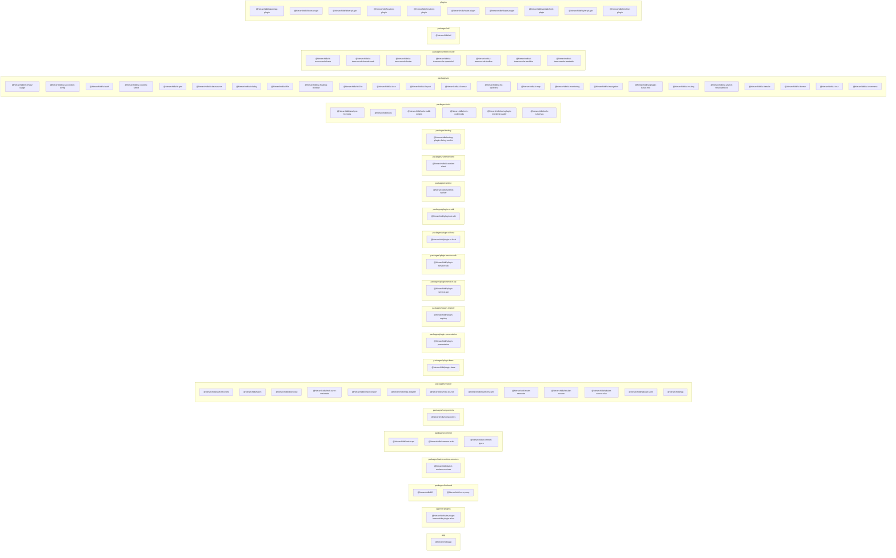

# Package Dependency Graph

Generated on: 2025-11-02T23:14:27.496Z

- Scope: workspace internal dependencies only
- Arrows point from depender → dependency
- Groups reflect top-level folders under `packages/`, `app/`, and `plugins/`
- Cycles detected: none

