# Package Dependency Graph

Generated on: 2025-10-30T16:23:35.294Z

- Scope: workspace internal dependencies only
- Arrows point from depender → dependency
- Groups reflect top-level folders under `packages/`, `app/`, and `plugins/`
- Cycles detected: none

```mermaid
graph LR
  subgraph G_app["app"]
    N0["@hierarchidb/app"]
  end
  subgraph G_app_vite_plugins["app/vite-plugins"]
    N1["@hierarchidb/vite-plugin-hierarchidb-plugin-alias"]
  end
  subgraph G_packages_backend["packages/backend"]
    N2["@hierarchidb/bff"]
    N3["@hierarchidb/cors-proxy"]
  end
  subgraph G_packages_batch_runtime_services["packages/batch-runtime-services"]
    N4["@hierarchidb/batch-runtime-services"]
  end
  subgraph G_packages_common["packages/common"]
    N5["@hierarchidb/common-api"]
    N6["@hierarchidb/common-auth"]
    N7["@hierarchidb/common-types"]
  end
  subgraph G_packages_components["packages/components"]
    N8["@hierarchidb/components"]
  end
  subgraph G_packages_feature["packages/feature"]
    N9["@hierarchidb/auth-recovery"]
    N10["@hierarchidb/batch"]
    N11["@hierarchidb/compute"]
    N12["@hierarchidb/download"]
    N13["@hierarchidb/feature-registry"]
    N14["@hierarchidb/fetch-save-metadata"]
    N15["@hierarchidb/import-export"]
    N16["@hierarchidb/map-adapter"]
    N17["@hierarchidb/map-source"]
    N18["@hierarchidb/route-resolver"]
    N19["@hierarchidb/route-searoute"]
    N20["@hierarchidb/tabular-source"]
    N21["@hierarchidb/tabular-source-xlsx"]
    N22["@hierarchidb/tabular-store"]
    N23["@hierarchidb/tag"]
  end
  subgraph G_packages_plugin_base["packages/plugin-base"]
    N24["@hierarchidb/plugin-base"]
  end
  subgraph G_packages_plugin_registry["packages/plugin-registry"]
    N25["@hierarchidb/plugin-registry"]
  end
  subgraph G_packages_plugin_runtime_services["packages/plugin-runtime-services"]
    N26["@hierarchidb/plugin-runtime-services"]
  end
  subgraph G_packages_plugin_service_api["packages/plugin-service-api"]
    N27["@hierarchidb/plugin-service-api"]
  end
  subgraph G_packages_plugin_service_sdk["packages/plugin-service-sdk"]
    N28["@hierarchidb/plugin-service-sdk"]
  end
  subgraph G_packages_plugin_ui_host["packages/plugin-ui-host"]
    N29["@hierarchidb/plugin-ui-host"]
  end
  subgraph G_packages_plugin_ui_sdk["packages/plugin-ui-sdk"]
    N30["@hierarchidb/plugin-ui-sdk"]
  end
  subgraph G_packages_runtime["packages/runtime"]
    N31["@hierarchidb/runtime-worker"]
  end
  subgraph G_packages_runtime_client["packages/runtime/client"]
    N32["@hierarchidb/runtime-client"]
  end
  subgraph G_packages_tools["packages/tools"]
    N33["@hierarchidb/analyze-licenses"]
    N34["@hierarchidb/tools"]
    N35["@hierarchidb/tools-build-scripts"]
    N36["@hierarchidb/tools-codemods"]
    N37["@hierarchidb/tools-plugin-manifest-loader"]
    N38["@hierarchidb/tools-schemas"]
  end
  subgraph G_packages_ui["packages/ui"]
    N39["@hierarchidb/memory-usage"]
    N40["@hierarchidb/ui-accordion-config"]
    N41["@hierarchidb/ui-auth"]
    N42["@hierarchidb/ui-country-select"]
    N43["@hierarchidb/ui-data-grid"]
    N44["@hierarchidb/ui-datasource"]
    N45["@hierarchidb/ui-dialog"]
    N46["@hierarchidb/ui-file"]
    N47["@hierarchidb/ui-floating-window"]
    N48["@hierarchidb/ui-i18n"]
    N49["@hierarchidb/ui-icon"]
    N50["@hierarchidb/ui-layout"]
    N51["@hierarchidb/ui-license"]
    N52["@hierarchidb/ui-lru-splitview"]
    N53["@hierarchidb/ui-map"]
    N54["@hierarchidb/ui-monitoring"]
    N55["@hierarchidb/ui-navigation"]
    N56["@hierarchidb/ui-plugin-basic-info"]
    N57["@hierarchidb/ui-routing"]
    N58["@hierarchidb/ui-search-result-window"]
    N59["@hierarchidb/ui-tabular-extract"]
    N60["@hierarchidb/ui-theme"]
    N61["@hierarchidb/ui-tour"]
    N62["@hierarchidb/ui-usermenu"]
  end
  subgraph G_packages_ui_treeconsole["packages/ui/treeconsole"]
    N63["@hierarchidb/ui-treeconsole-base"]
    N64["@hierarchidb/ui-treeconsole-breadcrumb"]
    N65["@hierarchidb/ui-treeconsole-footer"]
    N66["@hierarchidb/ui-treeconsole-speeddial"]
    N67["@hierarchidb/ui-treeconsole-toolbar"]
    N68["@hierarchidb/ui-treeconsole-trashbin"]
    N69["@hierarchidb/ui-treeconsole-treetable"]
  end
  subgraph G_packages_util["packages/util"]
    N70["@hierarchidb/util"]
  end
  subgraph G_plugins["plugins"]
    N71["@hierarchidb/basemap-plugin"]
    N72["@hierarchidb/folder-plugin"]
    N73["@hierarchidb/linker-plugin"]
    N74["@hierarchidb/location-plugin"]
    N75["@hierarchidb/resolver-plugin"]
    N76["@hierarchidb/route-plugin"]
    N77["@hierarchidb/shape-plugin"]
    N78["@hierarchidb/spreadsheet-plugin"]
    N79["@hierarchidb/styler-plugin"]
    N80["@hierarchidb/timeline-plugin"]
  end
  N0 --> N1
  N0 --> N16
  N0 --> N21
  N0 --> N25
  N0 --> N29
  N0 --> N30
  N0 --> N31
  N0 --> N32
  N0 --> N41
  N0 --> N45
  N0 --> N48
  N0 --> N49
  N0 --> N5
  N0 --> N50
  N0 --> N53
  N0 --> N55
  N0 --> N57
  N0 --> N6
  N0 --> N60
  N0 --> N61
  N0 --> N62
  N0 --> N63
  N0 --> N64
  N0 --> N67
  N0 --> N69
  N0 --> N7
  N0 --> N70
  N0 --> N71
  N0 --> N72
  N0 --> N73
  N0 --> N74
  N0 --> N75
  N0 --> N76
  N0 --> N77
  N0 --> N78
  N0 --> N79
  N0 --> N8
  N0 --> N80
  N10 --> N12
  N10 --> N5
  N10 --> N7
  N11 --> N70
  N12 --> N70
  N12 --> N9
  N15 --> N5
  N15 --> N7
  N15 --> N70
  N16 --> N17
  N16 --> N70
  N17 --> N70
  N19 --> N12
  N20 --> N7
  N20 --> N70
  N21 --> N20
  N21 --> N22
  N22 --> N70
  N23 --> N5
  N23 --> N7
  N23 --> N70
  N24 --> N32
  N24 --> N45
  N24 --> N49
  N24 --> N5
  N24 --> N7
  N26 --> N12
  N26 --> N27
  N26 --> N31
  N26 --> N7
  N27 --> N7
  N28 --> N12
  N28 --> N27
  N28 --> N5
  N28 --> N7
  N29 --> N24
  N29 --> N31
  N29 --> N32
  N29 --> N45
  N29 --> N49
  N29 --> N5
  N29 --> N56
  N29 --> N7
  N30 --> N12
  N30 --> N27
  N30 --> N28
  N30 --> N5
  N30 --> N7
  N31 --> N11
  N31 --> N12
  N31 --> N13
  N31 --> N15
  N31 --> N16
  N31 --> N17
  N31 --> N20
  N31 --> N21
  N31 --> N22
  N31 --> N23
  N31 --> N25
  N31 --> N27
  N31 --> N5
  N31 --> N7
  N31 --> N70
  N31 --> N9
  N32 --> N31
  N32 --> N5
  N32 --> N7
  N35 --> N37
  N39 --> N70
  N4 --> N12
  N4 --> N5
  N4 --> N7
  N4 --> N9
  N41 --> N6
  N43 --> N22
  N43 --> N7
  N43 --> N70
  N45 --> N7
  N46 --> N70
  N5 --> N7
  N50 --> N60
  N53 --> N43
  N53 --> N7
  N54 --> N70
  N55 --> N7
  N58 --> N47
  N58 --> N5
  N58 --> N7
  N59 --> N20
  N59 --> N22
  N59 --> N46
  N6 --> N7
  N62 --> N41
  N62 --> N48
  N62 --> N54
  N62 --> N6
  N62 --> N60
  N63 --> N48
  N63 --> N49
  N63 --> N5
  N63 --> N60
  N63 --> N64
  N63 --> N65
  N63 --> N67
  N63 --> N68
  N63 --> N69
  N63 --> N7
  N64 --> N49
  N64 --> N60
  N64 --> N7
  N68 --> N64
  N69 --> N48
  N69 --> N60
  N69 --> N64
  N69 --> N7
  N69 --> N8
  N71 --> N24
  N71 --> N26
  N71 --> N27
  N71 --> N28
  N71 --> N30
  N71 --> N31
  N71 --> N43
  N71 --> N5
  N71 --> N53
  N71 --> N7
  N71 --> N70
  N71 --> N72
  N72 --> N23
  N72 --> N24
  N72 --> N27
  N72 --> N29
  N72 --> N30
  N72 --> N31
  N72 --> N32
  N72 --> N45
  N72 --> N5
  N72 --> N56
  N72 --> N7
  N72 --> N70
  N72 --> N8
  N73 --> N24
  N73 --> N27
  N73 --> N31
  N73 --> N32
  N73 --> N5
  N73 --> N53
  N73 --> N63
  N73 --> N7
  N73 --> N70
  N74 --> N10
  N74 --> N12
  N74 --> N22
  N74 --> N24
  N74 --> N27
  N74 --> N28
  N74 --> N30
  N74 --> N31
  N74 --> N43
  N74 --> N44
  N74 --> N45
  N74 --> N5
  N74 --> N51
  N74 --> N56
  N74 --> N6
  N74 --> N7
  N74 --> N70
  N74 --> N8
  N74 --> N9
  N75 --> N24
  N75 --> N26
  N75 --> N27
  N75 --> N30
  N75 --> N31
  N75 --> N45
  N75 --> N5
  N75 --> N56
  N75 --> N7
  N75 --> N70
  N76 --> N12
  N76 --> N22
  N76 --> N24
  N76 --> N27
  N76 --> N28
  N76 --> N30
  N76 --> N31
  N76 --> N32
  N76 --> N4
  N76 --> N43
  N76 --> N45
  N76 --> N5
  N76 --> N56
  N76 --> N7
  N76 --> N70
  N76 --> N8
  N76 --> N9
  N77 --> N10
  N77 --> N12
  N77 --> N22
  N77 --> N24
  N77 --> N26
  N77 --> N27
  N77 --> N30
  N77 --> N31
  N77 --> N32
  N77 --> N40
  N77 --> N42
  N77 --> N44
  N77 --> N5
  N77 --> N51
  N77 --> N52
  N77 --> N6
  N77 --> N7
  N77 --> N70
  N77 --> N72
  N77 --> N9
  N78 --> N20
  N78 --> N22
  N78 --> N24
  N78 --> N26
  N78 --> N27
  N78 --> N30
  N78 --> N31
  N78 --> N44
  N78 --> N46
  N78 --> N5
  N78 --> N56
  N78 --> N59
  N78 --> N7
  N78 --> N70
  N78 --> N72
  N78 --> N9
  N79 --> N22
  N79 --> N24
  N79 --> N27
  N79 --> N30
  N79 --> N31
  N79 --> N56
  N79 --> N59
  N79 --> N7
  N79 --> N70
  N79 --> N72
  N79 --> N78
  N79 --> N8
  N8 --> N7
  N80 --> N24
  N80 --> N27
  N80 --> N31
  N80 --> N45
  N80 --> N5
  N80 --> N7
  N80 --> N70
  N9 --> N6
  N9 --> N70
```

