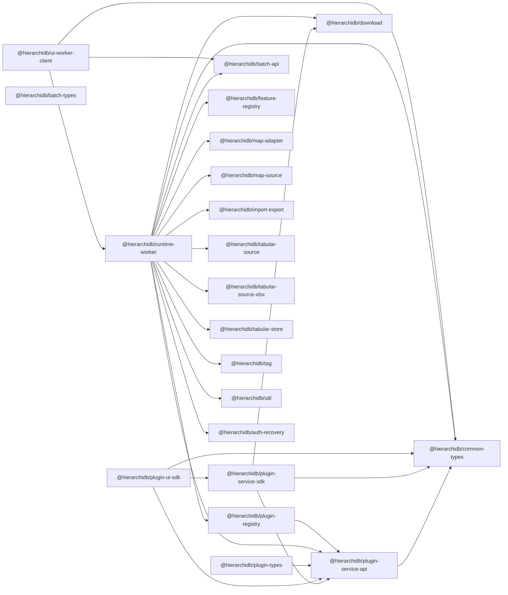

```mermaid
graph LR
  %% Core SDK layer
  PSA["@hierarchidb/plugin-service-api"]
  PSS["@hierarchidb/plugin-service-sdk"]
  PUI["@hierarchidb/plugin-ui-sdk"]
  PTS["@hierarchidb/plugin-types"]
  PR["@hierarchidb/plugin-registry"]

  %% Runtime consumers
  RW["@hierarchidb/runtime-worker"]
  RC["@hierarchidb/ui-worker-client"]

  %% Shared libraries (light nodes)
  CT["@hierarchidb/common-types"]
  BA["@hierarchidb/batch-api"]
  BT["@hierarchidb/batch-types"]
  DL["@hierarchidb/download"]
  FR["@hierarchidb/feature-registry"]
  MAP["@hierarchidb/map-adapter"]
  MS["@hierarchidb/map-source"]
  IE["@hierarchidb/import-export"]
  TS["@hierarchidb/tabular-source"]
  TSX["@hierarchidb/tabular-source-xlsx"]
  TST["@hierarchidb/tabular-store"]
  TAG["@hierarchidb/tag"]
  UTIL["@hierarchidb/util"]
  AUTH["@hierarchidb/auth-recovery"]

  %% Edges from core SDK packages
  PSA --> CT

  PSS --> PSA
  PSS --> CT
  PSS --> DL

  PUI --> PSS
  PUI --> PSA
  PUI --> CT

  PTS --> PSA

  %% Runtime dependencies
  RW --> PR
  RW --> PSA
  RW --> BA
  RW --> CT
  RW --> FR
  RW --> MAP
  RW --> MS
  RW --> IE
  RW --> DL
  RW --> TS
  RW --> TSX
  RW --> TST
  RW --> TAG
  RW --> UTIL
  RW --> AUTH

  RC --> RW
  RC --> BA
  RC --> CT

  PR --> PSA
```
