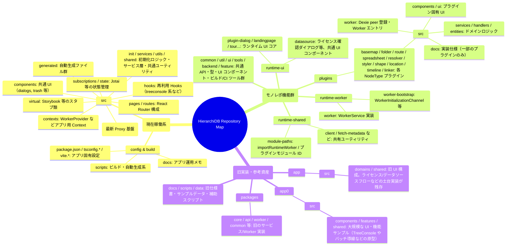
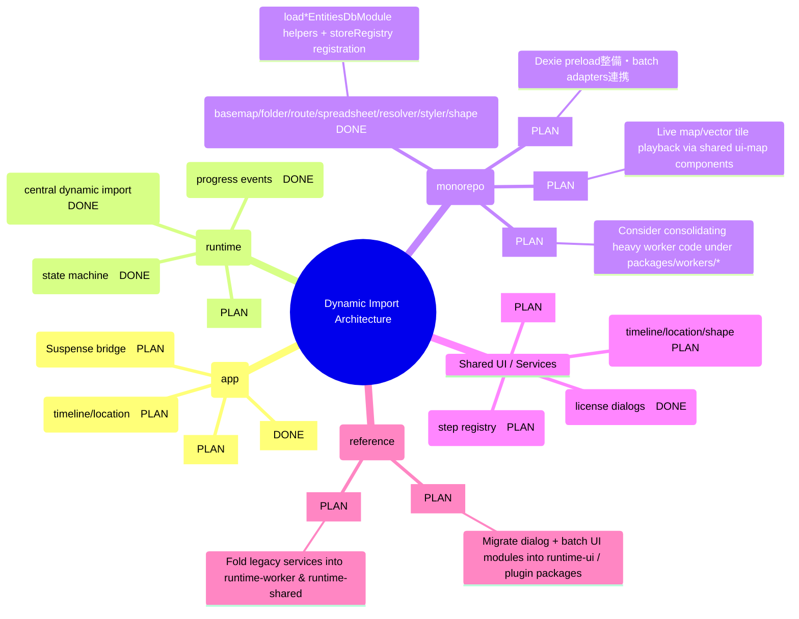

# HierarchiDB Repository Map (2025-09-25)

> NOTE: This map captures the directory landscape at a high level. Use it as the starting point for deeper, feature-specific inventories (UI library reuse, worker integration, reference asset migration, etc.).

## Target Architecture Map (Dynamic Imports & Worker Reorganization)

Note:
- `[DONE]` = already aligned with the new dynamic-import architecture, `[PLAN]` = scheduled refactor, `[TODO]` = 未整備箇所。
- Worker 周辺は `WorkerModuleLoader` と `WorkerStateStore` を中心に再構成し、各プラグインは非同期ロード用のファクトリ (`load*EntitiesDbModule`) を提供する必要があります。
- Timeline / Location のワーカーは引き続き UI-map や Dexie 連携を進め、`packages/plugins/dialog-impl-status.md` など既存メモを参照しながら実装を移行します。
