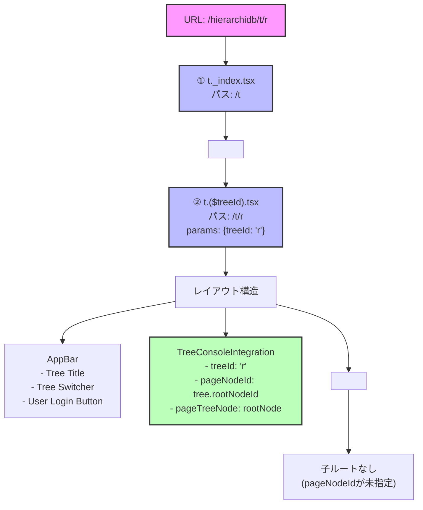
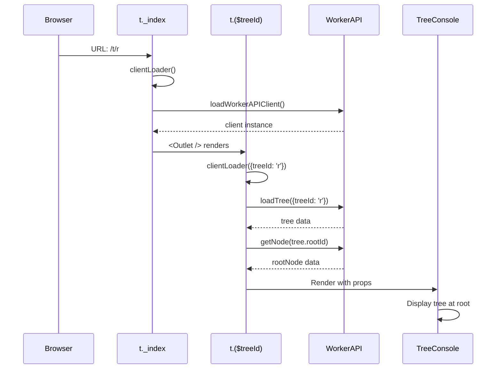

# React Router v7 ルーティング構造図

## URL: `http://localhost:4200/hierarchidb/t/r` のマッチング解析

### 1. URL構成の分解
```
http://localhost:4200/hierarchidb/t/r
                      ↑          ↑ ↑
                      |          | └─ treeId = "r"
                      |          └─── 固定パス "t"
                      └───────────── base path (VITE_APP_NAME)
```

### 2. ルートマッチング順序とOutlet構造



### 3. コンポーネント階層

```
<TLayout from="t._index.tsx">              // ① 最初のレイアウト（シンプルな Outlet のみ）
  <Outlet>
    <TLayout from="t.($treeId).tsx">       // ② メインレイアウト（AppBar + TreeConsole）
      <AppBar>
        <Typography>Tree Title</Typography>
        <ToggleButtonGroup>                 // Tree切り替えボタン
          <ToggleButton>Tree1</ToggleButton>
          <ToggleButton>Tree2</ToggleButton>
        </ToggleButtonGroup>
        <UserLoginButton />
      </AppBar>
      
      <TreeConsoleIntegration               // TreeConsoleメインコンポーネント
        treeId="r"
        pageNodeId={tree.rootNodeId}        // ルートノードを表示
        pageTreeNode={rootNode}
      />
      
      <Outlet />                            // 子ルート用（今回は空）
    </TLayout>
  </Outlet>
</TLayout>
```

### 4. データローディングフロー



### 5. 他のルートパターン

| URL | マッチするファイル | 説明 |
|-----|----------------|------|
| `/t/r` | `t._index.tsx` → `t.($treeId).tsx` | TreeID "r" のルート表示 |
| `/t/r/node123` | `t._index.tsx` → `t.($treeId).tsx` → `t.($treeId).($pageNodeId).tsx` | 特定ノード表示 |
| `/t/r/node123/node456` | `t._index.tsx` → `t.($treeId).tsx` → `t.($treeId).($pageNodeId).tsx` → `t.($treeId).($pageNodeId).($targetNodeId).tsx` | ターゲットノード表示 |
| `/t/r/trash` | `t._index.tsx` → `t.($treeId).tsx` → `t.($treeId).trash.tsx` | ゴミ箱表示 |

### 6. ルーティング設定

**Base Path設定** (`vite.config.ts`)
```typescript
const appName = env.VITE_APP_NAME || '';  // production: 'hierarchidb'
const base = appName ? `/${appName}/` : '/';
```

**React Router v7 File-Based Routing**
```
app/src/routes/
├── t._index.tsx                     // /t のレイアウト
├── t.($treeId).tsx                  // /t/:treeId のレイアウト
├── t.($treeId).($pageNodeId).tsx    // /t/:treeId/:pageNodeId
├── t.($treeId).($pageNodeId).($targetNodeId).tsx
└── t.($treeId).trash.tsx            // /t/:treeId/trash
```

### 7. 重要なポイント

1. **二重レイアウト構造**
   - `t._index.tsx` は最小限のレイアウト（Outlet のみ）
   - `t.($treeId).tsx` がメインレイアウト（AppBar + TreeConsole）

2. **パラメータ取得**
   - `($treeId)` は動的セグメント
   - `params.treeId` で値を取得（この場合 "r"）

3. **TreeConsole表示**
   - pageNodeId未指定時はルートノードを表示
   - clientLoaderでrootNodeを事前取得

4. **Outlet の役割**
   - 各レイアウトコンポーネントで子ルートを表示
   - ネストされたルーティング構造を実現