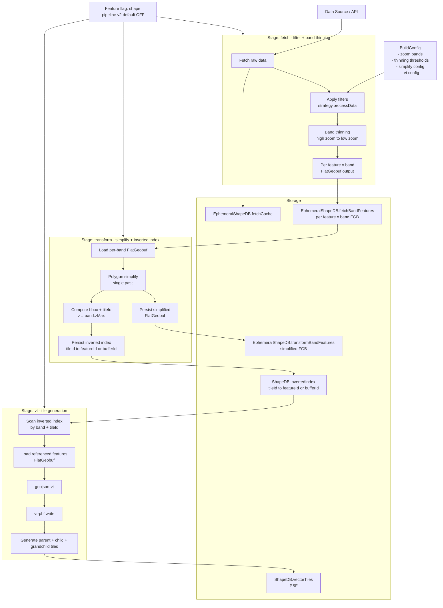

# Shape build stage data flow (Mermaid)

This diagram shows how the target shape build pipeline handles data across fetch, transform, and vt stages.

```mermaid
flowchart TD
  %% Feature flag gate
  FF[Feature flag: shape pipeline v2 default OFF]

  %% Inputs
  DS[Data Source / API]
  CFG[BuildConfig\n- zoom bands\n- thinning thresholds\n- simplify config\n- vt config]

  %% Fetch stage
  subgraph FETCH[Stage: fetch - filter + band thinning]
    F1[Fetch raw data]
    F2[Apply filters\nstrategy.processData]
    F3[Band thinning\nhigh zoom to low zoom]
    F4[Per feature x band\nFlatGeobuf output]
  end

  %% Transform stage
  subgraph TRANSFORM[Stage: transform - simplify + inverted index]
    T1[Load per-band FlatGeobuf]
    T2[Polygon simplify\nsingle pass]
    T3[Persist simplified\nFlatGeobuf]
    T4[Compute bbox + tileId\nz = band.zMax]
    T5[Persist inverted index\ntileId to featureId or bufferId]
  end

  %% VT stage
  subgraph VT[Stage: vt - tile generation]
    V1[Scan inverted index\nby band + tileId]
    V2[Load referenced features\nFlatGeobuf]
    V3[geojson-vt]
    V4[vt-pbf write]
    V5[Generate parent + child + grandchild tiles]
  end

  %% Stores
  subgraph STORES[Storage]
    S1[EphemeralShapeDB.fetchCache]
    S2[EphemeralShapeDB.fetchBandFeatures\nper feature x band FGB]
    S3[EphemeralShapeDB.transformBandFeatures\nsimplified FGB]
    S4[ShapeDB.invertedIndex\ntileId to featureId or bufferId]
    S5[ShapeDB.vectorTiles\nPBF]
  end

  DS --> F1
  CFG --> F2
  F1 --> F2 --> F3 --> F4
  F4 --> S2
  F1 --> S1

  S2 --> T1 --> T2 --> T3 --> S3
  T2 --> T4 --> T5 --> S4

  S4 --> V1 --> V2 --> V3 --> V4 --> V5 --> S5

  FF --> FETCH
  FF --> TRANSFORM
  FF --> VT
```
