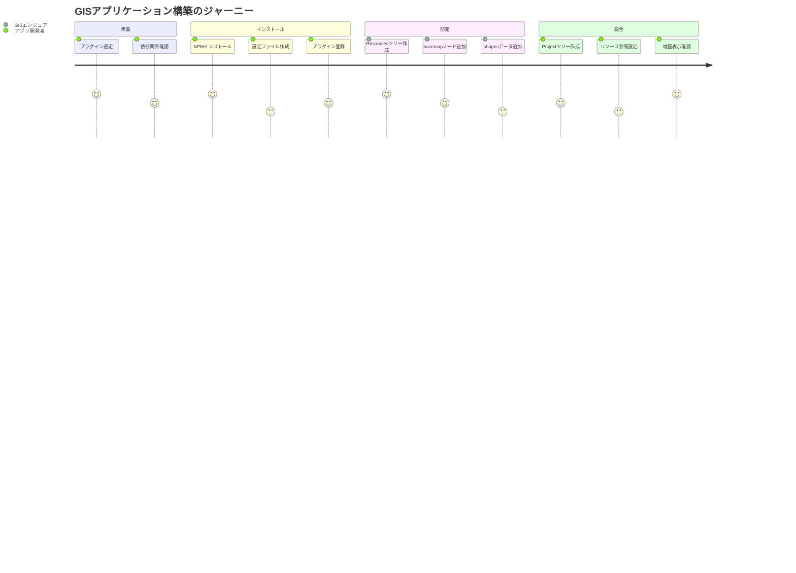

# AOP プラグインアーキテクチャ ユーザストーリー

## 概要

このドキュメントはAOP（アスペクト指向プログラミング）によるプラグインアーキテクチャの詳細なユーザストーリーを記載します。

## ユーザー種別の定義

### プライマリユーザー

- **プラグイン開発者**: 🟢 hierarchidbを拡張して特定ドメインの機能を追加する開発者
- **アプリケーション開発者**: 🟢 プラグインを組み合わせてアプリケーションを構築する開発者
- **GISエンジニア**: 🟡 地理情報システムの専門知識を持つ技術者

### セカンダリユーザー

- **オープンソース貢献者**: 🟡 プラグインエコシステムに貢献する外部開発者
- **システムインテグレーター**: 🟡 企業向けにカスタマイズを行う技術者

## ユーザストーリー

### 📚 エピック1: プラグイン開発

#### ストーリー1.1: 新規プラグインの作成

**ユーザストーリー**:
- **私は** プラグイン開発者 **として**
- **特定のビジネスドメインに特化した機能を追加したい** 状況において
- **AOPのジョインポイントを利用してベースモジュールを拡張** したい
- **そうすることで** ベースコードを変更せずに機能追加できる

**詳細説明**:
- **背景**: 🟢 ベースモジュールの保守性を保ちながら機能拡張
- **前提条件**: 🟢 TypeScriptとhierarchidbのAPIに関する知識
- **利用シーン**: 地理情報、プロジェクト管理、在庫管理などのドメイン特化機能
- **期待する体験**: テンプレートからの簡単なプラグイン作成

**関連要件**: REQ-AOP-001, REQ-AOP-002, REQ-AOP-301

**優先度**: 高

**見積もり**: 13ポイント

#### ストーリー1.2: ライフサイクルフックの実装

**ユーザストーリー**:
- **私は** プラグイン開発者 **として**
- **ノードの作成・更新・削除時に独自の処理を実行** したい
- **beforeCreate、afterUpdate などのフックを実装** したい
- **そうすることで** ノードに関連するエンティティを自動管理できる

**詳細説明**:
- **背景**: 🟢 ノードとエンティティのライフサイクル同期
- **前提条件**: 🟢 フックの実行順序とコンテキストの理解
- **利用シーン**: basemapノード作成時の地図設定初期化
- **期待する体験**: 宣言的なフック定義と自動実行

**関連要件**: REQ-AOP-101, REQ-AOP-102, REQ-AOP-103

**優先度**: 高

**見積もり**: 8ポイント

#### ストーリー1.3: API拡張の実装

**ユーザストーリー**:
- **私は** プラグイン開発者 **として**
- **既存APIに新しいメソッドを追加** したい
- **エンティティ固有の操作をAPIとして公開** したい
- **そうすることで** UIから専用機能を呼び出せる

**詳細説明**:
- **背景**: 🟢 ドメイン固有の操作をAPIレベルで提供
- **前提条件**: 🟢 Comlink経由のRPC通信の理解
- **利用シーン**: 地図レイヤーの集約APIの追加
- **期待する体験**: 型安全なAPI拡張

**関連要件**: REQ-AOP-008, REQ-AOP-009, REQ-AOP-010

**優先度**: 中

**見積もり**: 13ポイント

### 📚 エピック2: プラグイン利用

#### ストーリー2.1: プラグインのインストール

**ユーザストーリー**:
- **私は** アプリケーション開発者 **として**
- **必要なプラグインをプロジェクトに追加** したい
- **NPMパッケージとして簡単にインストール** したい
- **そうすることで** 機能を素早く統合できる

**詳細説明**:
- **背景**: 🟢 標準的なNode.jsエコシステムの活用
- **前提条件**: NPMとpackage.jsonの基本知識
- **利用シーン**: GISアプリへの地図プラグイン追加
- **期待する体験**: npm installで即座に利用可能

**関連要件**: REQ-AOP-003, REQ-AOP-004

**優先度**: 高

**見積もり**: 5ポイント

#### ストーリー2.2: プラグインの設定

**ユーザストーリー**:
- **私は** アプリケーション開発者 **として**
- **プラグインの動作を設定ファイルでカスタマイズ** したい
- **環境ごとに異なる設定を適用** したい
- **そうすることで** 柔軟な運用が可能になる

**詳細説明**:
- **背景**: 🟡 開発・ステージング・本番環境での設定分離
- **前提条件**: 設定スキーマの理解
- **利用シーン**: APIエンドポイントの環境別設定
- **期待する体験**: JSONまたはTypeScriptでの型安全な設定

**関連要件**: REQ-AOP-201, REQ-AOP-202

**優先度**: 中

**見積もり**: 5ポイント

### 📚 エピック3: 地理情報プラグイン開発

#### ストーリー3.1: basemapプラグインの実装

**ユーザストーリー**:
- **私は** GISエンジニア **として**
- **MapLibreGLJSを使った地図表示機能を追加** したい
- **basemapノードタイプを定義して地図設定を管理** したい
- **そうすることで** 地理情報の可視化基盤を提供できる

**詳細説明**:
- **背景**: 🟡 Resourcesツリーでの地理情報リソース管理
- **前提条件**: 🟡 MapLibreGLJSとGeoJSONの知識
- **利用シーン**: 基本地図レイヤーの設定と表示
- **期待する体験**: ノード作成と同時に地図初期化

**関連要件**: REQ-AOP-106, REQ-AOP-108

**優先度**: 高

**見積もり**: 21ポイント

#### ストーリー3.2: shapesプラグインの実装

**ユーザストーリー**:
- **私は** GISエンジニア **として**
- **GeoJSONデータを処理してベクトルタイルを生成** したい
- **大規模データを簡略化して効率的に表示** したい
- **そうすることで** パフォーマンスを維持できる

**詳細説明**:
- **背景**: 🟡 大規模地理データの効率的な処理
- **前提条件**: 🟡 ベクトルタイルとデータ簡略化アルゴリズム
- **利用シーン**: 行政区画や建物データの表示
- **期待する体験**: 自動的なLOD（Level of Detail）処理

**関連要件**: REQ-AOP-005, REQ-AOP-007

**優先度**: 中

**見積もり**: 34ポイント

## ユーザージャーニー

### ジャーニー1: GISアプリケーション構築

**詳細**:
1. **プラグイン選定**: 🟢 必要な地理情報プラグインを特定
2. **依存関係確認**: 🟢 プラグイン間の互換性チェック
3. **NPMインストール**: 🟢 `npm install @hierarchidb/plugin-basemap`
4. **設定ファイル作成**: 🟡 プラグイン設定のカスタマイズ
5. **プラグイン登録**: 🟢 PluginManagerへの登録
6. **Resourcesツリー作成**: 🟡 地理情報リソース用ツリー
7. **basemapノード追加**: 🟡 地図レイヤー設定
8. **shapesデータ追加**: 🟡 ベクトルデータ登録
9. **Projectツリー作成**: 🟡 プロジェクト管理用ツリー
10. **リソース参照設定**: 🟡 Resourcesからの参照設定
11. **地図表示確認**: 統合された地図の動作確認

## ペルソナ定義

### ペルソナ1: プラグイン開発者（田中さん）

- **基本情報**: 🟢 30歳、フルスタック開発者、OSS貢献経験あり
- **ゴール**: 再利用可能な高品質プラグインの開発
- **課題**: AOPパターンの学習曲線、テストの複雑性
- **行動パターン**: ドキュメント重視、テスト駆動開発
- **利用環境**: VS Code、TypeScript、Jest、GitHub Actions

### ペルソナ2: GISエンジニア（山田さん）

- **基本情報**: 🟡 35歳、GIS専門家、QGIS/ArcGIS経験豊富
- **ゴール**: Webベースの高性能GISアプリケーション構築
- **課題**: Web技術の習得、大規模データの処理
- **行動パターン**: データ品質重視、視覚的確認を好む
- **利用環境**: QGIS、PostGIS、MapLibreGL、Python

### ペルソナ3: アプリケーション開発者（鈴木さん）

- **基本情報**: 🟢 28歳、React開発者、SPA開発経験3年
- **ゴール**: プラグインを組み合わせた業務アプリ開発
- **課題**: プラグイン間の統合、パフォーマンス最適化
- **行動パターン**: 既存ソリューション活用、迅速な開発
- **利用環境**: React、TypeScript、Webpack、Chrome DevTools

## 非機能的ユーザー要求

### 開発者体験（DX）要求

- **学習容易性**: 🟢 充実したドキュメントとサンプルコード
- **開発効率**: 🟢 TypeScript型定義による開発支援
- **デバッグ**: 🟡 プラグイン専用のデバッグツール
- **テスト**: 🟢 単体・統合テストのテンプレート提供
- **CI/CD**: 🟡 GitHub Actionsテンプレートの提供

### プラグインエコシステム要求

- **発見可能性**: 🟡 プラグインレジストリでの検索
- **互換性**: 🟢 セマンティックバージョニングの遵守
- **ドキュメント**: 🟢 APIドキュメントの自動生成
- **ライセンス**: 🟢 OSSライセンスの明確化
- **コミュニティ**: 🟡 フォーラムとサポートチャネル